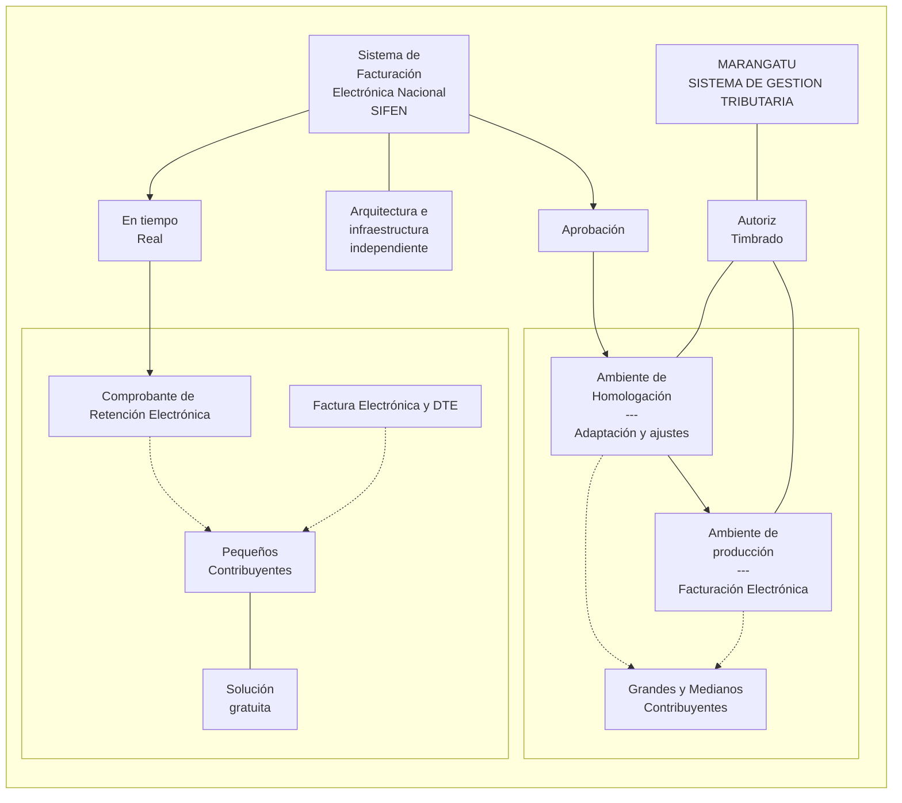
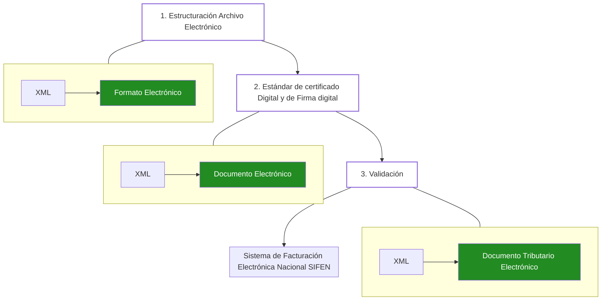
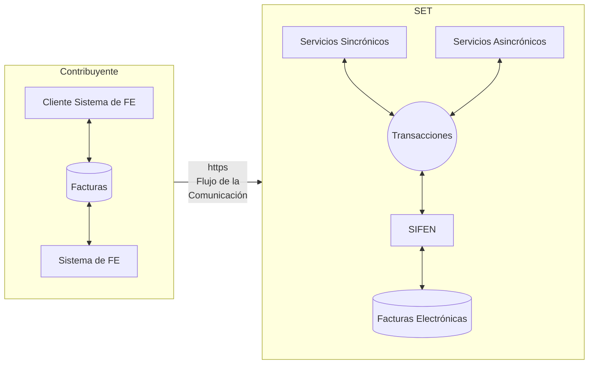
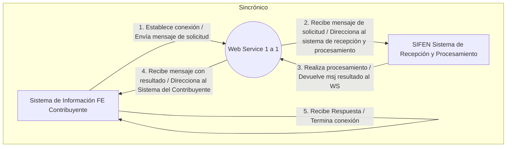
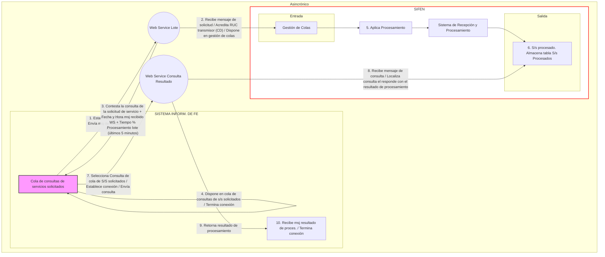
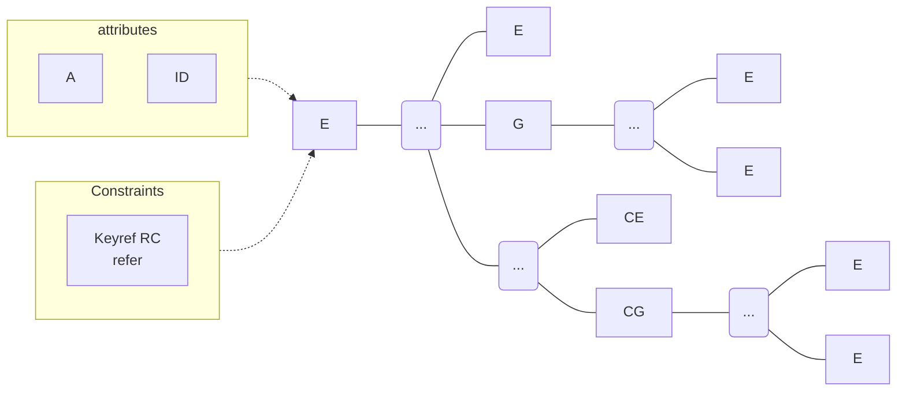

# MT 150

<table>
  <thead>
    <tr>
        <th>e-kuatia Sistema Integrado de Facturación Electrónica Nacional</th>
        <th>SET TRIBUTACIÓN — Promoviendo confianza —</th>
        <th>Ministerio de HACIENDA</th>
        <th>GOBIERNO NACIONAL Paraguay de la gente</th>
    </tr>
  </thead>
</table>

# MANUAL TÉCNICO SISTEMA INTEGRADO DE FACTURACIÓN ELECTRÓNICA NACIONAL (SIFEN)

**Versión 150**
**10/09/2019**

**El presente documento puede sufrir modificaciones hasta la implementación total del proyecto SIFEN.**

---

(Logo de la República del Paraguay)

e-kuatia
Sistema Integrado de Facturación Electrónica Nacional

**Contenido**

INDICE DE GRÁFICAS ................................................................................................................................. 7
INDICE DE TABLAS ................................................................................................................................... 8
INDICE DE SCHEMAS ............................................................................................................................... 9
Control de versiones ................................................................................................................................ 10

- Versión: 120 ........................................................................................................................................ 10
- Versión: 130 ........................................................................................................................................ 10
- Versión: 140 ........................................................................................................................................ 11
- Versión: 141 ........................................................................................................................................ 12
- Versión: 150 ........................................................................................................................................ 12

1. INTRODUCCIÓN .......................................................................................................................... 15
2. OBJETIVOS ................................................................................................................................... 16
3. ALCANCE ..................................................................................................................................... 17
4. Sistema Integrado de Facturación Electrónica Nacional SIFEN ................................................... 18
   - 4.1. Estructura y subsistemas SIFEN ............................................................................................... 18
   - 4.2. Fundamento legal .................................................................................................................... 20
   - 4.3. Validez jurídica e incidencia tributaria de los documentos tributarios electrónicos ................. 21
5. Documentos Tributarios Electrónicos .......................................................................................... 22
   - 5.1. Comprobantes de ventas electrónicos: ................................................................................... 22
   - 5.2. Documentos complementarios electrónicos: .......................................................................... 22
   - 5.3. Nota de Remisión Electrónica ................................................................................................. 22
6. Modelo Operativo ........................................................................................................................ 23
   - 6.1. Descriptores del modelo operativo de SIFEN ........................................................................... 23
     - 6.1.1. Archivo electrónico .......................................................................................................... 23
     - 6.1.2. Aprobación del DTE ........................................................................................................ 23
   - 6.2. Plazo de transmisión del DE a la SET ....................................................................................... 24
     - 6.2.1. Plazos SIFEN ................................................................................................................... 24
   - 6.3. Relación directa con los contribuyentes .................................................................................. 26
   - 6.4. Entrega del DE al receptor ....................................................................................................... 26
   - 6.5. Rechazo del DE en el modelo de aprobación posterior ........................................................... 26
   - 6.6. Verificación de la existencia del DTE por parte del receptor ................................................... 27
7. Características tecnológicas del formato ..................................................................................... 28
   - 7.1. Modelo conceptual de comunicación ...................................................................................... 28
   - 7.2. Estándar del formato XML ....................................................................................................... 30
     - 7.2.1. Estándar de codificación ................................................................................................. 30
     - 7.2.2. Declaración namespace .................................................................................................. 30

septiembre de 2019 | 1

e-kuatia
Sistema Integrado de Facturación Electrónica Nacional

7.2.2.1. Particularidad de la firma digital ................................................................................................. 31
7.2.2.2. Particularidad del envío de lote................................................................................................... 31
7.2.3. Convenciones referenciadas en tablas .......................................................................................... 32
7.2.4. Recomendaciones mejores prácticas de generación del archivo ................................................. 34
7.3. Contenedor de documento electrónico ............................................................................................... 35
7.4. Estándar de comunicación .................................................................................................................. 35
7.5. Estándar de certificado digital ............................................................................................................. 36
7.6. Estándar de firma digital ..................................................................................................................... 37
7.7. Especificaciones técnicas del estándar de certificado y firma digital ................................................. 39
7.8. Procedimiento para la validación de la firma digital:........................................................................... 40
7.9. Síntesis de definiciones tecnológicas ................................................................................................. 40
7.10. Resumen de las Direcciones Electrónicas de los Servicios Web para Ambientes de Pruebas y Producción....................................................................................................................................................... 41
7.11. Servidor para sincronización externa de horario .............................................................................. 41 8. Aspectos Tecnológicos de los Servicios Web del SIFEN ........................................................ 42
8.1. Servicio síncrono................................................................................................................................. 42
8.1.1. Flujo funcional: ........................................................................................................................... 42
8.2. Servicio asíncrono............................................................................................................................... 43
8.2.1. Secuencia del servicio asíncrono: ............................................................................................... 43
8.2.2. Tiempo promedio de procesamiento de un lote: ....................................................................... 43
8.3. Estándar de mensajes de los servicios del SIFEN ................................................................................ 44
8.4. Versión de los Schemas XML .............................................................................................................. 44
8.4.1. Identificación de la versión de los Schemas XML ....................................................................... 44
8.4.2. Liberación de versiones de los Schemas XML ............................................................................ 44
8.4.3. Paquete inicial de Schemas ........................................................................................................ 44 9. Descripción de los Servicios Web del SIFEN .......................................................................... 45
9.1. WS recepción documento electrónico – siRecepDE............................................................................ 45
9.1.1. Definición del protocolo que consume este servicio ................................................................. 45
9.1.2. Descripción del procesamiento .................................................................................................. 45
9.1.3. Protocolo de respuesta .............................................................................................................. 46
9.2. WS recepción lote DE – siRecepLoteDE.............................................................................................. 47
9.2.1. Definición del protocolo que consume este servicio ................................................................. 47
9.2.2. Descripción del procesamiento .................................................................................................. 47
9.2.3. Protocolo de respuesta .............................................................................................................. 48

septiembre de 2019 | 2

e-kuatia
Sistema Integrado de Facturación Electrónica Nacional

9.3. WS consulta resultado de lote DE – siResultLoteDE ................................................................................. 48

- 9.3.1. Definición del protocolo que consume este servicio ................................................................. 48
- 9.3.2. Descripción del procesamiento ................................................................................................. 49
- 9.3.3. Protocolo de respuesta ............................................................................................................. 49

  9.4. WS consulta DE – siConsDE ................................................................................................................... 50

- 9.4.1. Definición del protocolo que consume este servicio ................................................................. 50
- 9.4.2. Descripción del procesamiento ................................................................................................. 51
- 9.4.3. Protocolo de respuesta ............................................................................................................. 51

  9.5. WS recepción evento – siRecepEvento ................................................................................................... 52

- 9.5.1. Definición del protocolo que consume este Servicio ................................................................. 52
- 9.5.2. Descripción del procesamiento ................................................................................................. 53
- 9.5.3. Protocolo de respuesta ............................................................................................................. 53

  9.6. WS consulta RUC – siConsRUC ............................................................................................................... 53

- 9.6.1. Definición del protocolo que consume este servicio ................................................................. 54
- 9.6.2. Descripción del procesamiento ................................................................................................. 54
- 9.6.3. Protocolo de respuesta ............................................................................................................. 54

  9.7. WS consulta DE de entidades u organismos externos autorizados – siConsDEST (a futuro)............. 55

1. Formato de los Documentos Electrónicos .......................................................................................... 56

- 10.1. Estructura del código de control (CDC) de los DE ........................................................................ 56
- 10.2. Dígito verificador del CDC........................................................................................................... 57
- 10.3. Generación del código de seguridad ........................................................................................... 57
- 10.4. Datos que se deben informar en los documentos electrónicos (DE) ............................................. 58
- 10.5. Manejo del timbrado y Numeración ............................................................................................ 59

1. Gestión de eventos ........................................................................................................................... 112

- 11.1. Eventos realizados por el emisor................................................................................................ 112
  - 11.1.1. Inutilización de número de DE ........................................................................................... 112
  - 11.1.2. Cancelación........................................................................................................................ 113
  - 11.1.3. Devolución y Ajuste de precios .......................................................................................... 113
  - 11.1.4. Endoso de FE (evento futuro)............................................................................................. 114
- 11.2. Eventos registrados por el receptor .......................................................................................... 114
  - 11.2.1. Conformidad con el DTE .................................................................................................... 114
  - 11.2.2. Disconformidad con el DTE................................................................................................ 114
  - 11.2.3. Desconocimiento con el DE o DTE..................................................................................... 114
  - 11.2.4. Notificación de recepción de un DE o DTE ......................................................................... 115

septiembre de 2019 | 3

e-kuatia
Sistema Integrado de Facturación Electrónica Nacional

11.2.5. Tipología de los eventos del receptor ......................................................................................... 115
11.4. Eventos registrados por la SET (evento futuro)........................................................................... 116

- 11.4.1. Impugnación de DTE................................................................................................................ 116
  11.5. Estructura de los Eventos ............................................................................................................ 120
- 11.5.1. FORMATO DE EVENTOS EMISOR............................................................................................. 121
- 11.5.2. FORMATO DE EVENTOS RECEPTOR......................................................................................... 123
  11.6. REGLAS DE VALIDACIÓN DE GESTIÓN DE EVENTOS .................................................................... 133
- 11.6.1. REGLAS DE VALIDACIÓN PARA CANCELACIÓN ........................................................................ 134
- 11.6.2. REGLAS DE VALIDACIÓN PARA INUTILIZACIÓN ....................................................................... 135
- 11.6.3. REGLAS DE VALIDACIÓN PARA NOTIFICACIÓN – RECEPCIÓN DE/DTE .................................... 136
- 11.6.4. REGLAS DE VALIDACIÓN PARA EL EVENTO CONFORMIDAD ................................................... 137
- 11.6.5. REGLAS DE VALIDACIÓN PARA EL EVENTO DISCONFORMIDAD .............................................. 138
- 11.6.6. REGLAS DE VALIDACIÓN PARA EL EVENTO DESCONOCIMIENTO DE/DTE............................... 139
- 11.6.7. REGLAS DE VALIDACIÓN PARA EL EVENTO POR ACTUALIZACIÓN DE DATOS: DATOS DEL TRANSPORTE ........................................................................................................................................... 141

1. Validaciones........................................................................................................ 145
   12.1. Estructura de los códigos de validación ...................................................................................... 146

- 12.1.1. Códigos de respuestas de las validaciones de los Servicios Web ............................................ 147
- 12.1.2. Códigos de respuestas de las validaciones de los DE .............................................................. 148
- 12.1.3. Códigos de respuestas de las validaciones de los eventos...................................................... 150
  12.2. Codificación de respuestas de los Servicios WEB del SIFEN ........................................................ 150
- 12.2.1. Validaciones del certificado de transmisión. Protocolo TLS.................................................... 150
- 12.2.2. Validación de la estructura XML de los WS ............................................................................. 151
- 12.2.3. Validación de forma del área de datos del Request................................................................ 152
- 12.2.4. Validación del certificado de firma.......................................................................................... 152
- 12.2.5. Validación de la firma digital ................................................................................................... 153
- 12.2.6. Validaciones genéricas a los mensajes de entrada de los WS................................................. 153
- 12.2.7. Validaciones genéricas a los mensajes de control de llamada de los WS ............................... 154
  12.3. Validaciones de cada Web Service .............................................................................................. 154
- 12.3.1. WS recepción documento electrónico – siRecepDE................................................................ 154
  - 12.3.1.1. Mensaje de entrada del WS ................................................................................................ 154
  - 12.3.1.2. Información de control de la llamada al WS ....................................................................... 154
  - 12.3.1.3. Área de datos del WS .......................................................................................................... 154
- 12.3.2. WS recepción lote DE – siRecepLoteDE................................................................................... 155

septiembre de 2019 | 4

e-kuatia
Sistema Integrado de Facturación Electrónica Nacional

12.3.2.1. Mensaje de entrada del WS ................................................................................................................. 155
12.3.2.2. Información de control de la llamada al WS ........................................................................................ 155
12.3.2.3. Área de datos del WS .......................................................................................................................... 155
12.3.3. WS consulta resultado de lote DE – siResultLoteDE .......................................................................... 155
12.3.3.1. Mensaje de entrada del WS ................................................................................................................. 155
12.3.3.2. Información de control de la llamada al WS ........................................................................................ 156
12.3.3.3. Área de datos del WS .......................................................................................................................... 156
12.3.4. WS consulta de DE – siConsDE .......................................................................................................... 156
12.3.4.1. Mensaje de entrada del WS ................................................................................................................. 156
12.3.4.2. Información de control de la llamada al WS ........................................................................................ 157
12.3.4.3. Área de datos del WS .......................................................................................................................... 157
12.3.5. WS consulta de RUC – siConsRUC ..................................................................................................... 157
12.3.5.1. Mensaje de entrada del WS ................................................................................................................. 157
12.3.5.2. Información de control de la llamada al WS ........................................................................................ 157
12.3.5.3. Área de datos del WS .......................................................................................................................... 157
12.3.6. WS recepción de evento – siRecepEvento ......................................................................................... 158
12.3.6.1. Mensaje de entrada del WS ................................................................................................................. 158
12.3.6.2. Información de control de la llamada al WS ........................................................................................ 158
12.3.6.3. Área de datos del WS .......................................................................................................................... 158
12.4. Validaciones del formato......................................................................................................................... 159 13. Gráfica (KUDE) ........................................................................................................................................ 193
13.1. Definición y alcance del KuDE: .......................................................................................................... 193
13.2. Características y funcionalidades ....................................................................................................... 193
13.3. Denominación de los KuDE................................................................................................................ 193
13.4. Estructura del KuDE ........................................................................................................................... 194
13.4.1. Campos del encabezado del KuDE ................................................................................................. 195
13.4.2. Campos que describen los ítems de la operación del KuDE............................................................ 196
13.4.3. Campos que describen los subtotales y totales de la transacción documentada y liquidación de IVA 196
13.4.4. Campos de información propia de la consulta en SIFEN de la SET ................................................. 196
13.4.5. Información adicional de interés para el emisor............................................................................. 197
13.5. KuDE .................................................................................................................................................. 197
13.6. KuDE (cinta de papel) ........................................................................................................................ 203
13.7. Cinta papel resumen del KuDE .......................................................................................................... 204

septiembre de 2019 5

e-kuatia
Sistema Integrado de Facturación Electrónica Nacional

13.8. Código bidimensional (QR) .......................................................................................................... 205
13.8.1. Delineamientos del QR Code ................................................................................................... 205
13.8.2. Conformación del Código QR .................................................................................................. 205
13.8.3. Metodología para la generación del Código QR ...................................................................... 206
13.8.4. Ejemplo de generación del Código QR .................................................................................... 207
13.8.5. Mensajes desplegados en consulta del QR ............................................................................. 209 14. Operación de Contingencia (Futuro) .......................................................................................... 210 15. CODIFICACIONES ..................................................................................................................... 210 16. GLOSARIO TÉCNICO ................................................................................................................ 214

septiembre de 2019 6

e-kuatia
Sistema Integrado de Facturación Electrónica Nacional

# INDICE DE GRÁFICAS

Gráfica Nº 01 Sistema Integrado de Facturación Electrónica Nacional (SIFEN) ............. 18
Gráfica Nº 02 Subsistema de Validación de Uso ............................................................. 19
Gráfica Nº 03 Subsistema Electrónico Solución Gratuita E-kuatia’i .................................. 20
Gráfica Nº 04: Secuencia de acciones tecnológicas SIFEN ............................................. 23
Gráfica Nº 05: Flujo de comunicación .............................................................................. 28
Gráfica Nº 06: WS Sincrónico .......................................................................................... 29
Gráfica Nº 07: WS Asincrónico ........................................................................................ 29
Gráfica Nº 08: Relación elementos XML .......................................................................... 32
Gráfica Nº 09 – KuDE FE Formato 1 (Papel Carta o similar) ......................................... 198
Gráfica Nº 10 – KuDE NCE Formato 1 (Papel Carta o similar) ...................................... 199
Gráfica Nº 11 – KuDE NDE Formato 1 (Papel Carta o similar) ...................................... 200
Gráfica Nº 12 – KuDE AFE Formato 1 (Papel Carta o similar) ....................................... 201
Gráfica Nº 13 – KuDE NRE Formato 1 (Papel Carta o similar) ...................................... 202
Gráfica Nº 14 – KuDE FE Formato 2 (cinta de papel) .................................................... 203
Gráfica Nº 15 – Cinta papel resumen del KuDE ............................................................. 204

septiembre de 2019 | 7

e-kuatia
Sistema Integrado de Facturación Electrónica Nacional

# INDICE DE TABLAS

Tabla A – Convenciones Utilizadas en la Tablas de Definición de los Formatos XML ..... 32
Tabla B – Tipos de Datos en los Archivos XML ............................................................... 33
Tabla C: Tamaños de campos ......................................................................................... 34
Tabla D: Formatos numéricos.......................................................................................... 34
Tabla E: Estándares de tecnología utilizados .................................................................. 40
Tabla F – Resultados de Procesamiento del WS Consulta Resultado de Lote ................ 49
Tabla G – Resultados de Procesamiento del WS Consulta DE........................................ 51
Tabla H – Resultados de Procesamiento del WS Consulta RUC ..................................... 54
Tabla I – Grupos de campos del Archivo XML ................................................................. 58
Tabla J: Resumen de los eventos de SIFEN según los actores ..................................... 117
Tabla K: Correcciones de los eventos del Receptor en el SIFEN................................... 119
TABLA 1 – TIPO DE REGIMEN..................................................................................... 210
TABLA 2.1 – DEPARTAMENTOS, DISTRITOS Y CIUDADES ...................................... 210
TABLA 3 – ACTIVIDADES ECONÓMICAS.................................................................... 211
TABLA 4 – CODIFICACION DE PAISES ....................................................................... 211
TABLA 5 – CODIFICACION DE UNIDADES DE MEDIDA............................................. 211
TABLA 6 – CODIGOS DE AFECTACION ...................................................................... 212
TABLA 7 – CATEGORIAS DEL ISC .............................................................................. 212
TABLA 8 – TASAS DEL ISC .......................................................................................... 212
TABLA 10 – CONDICIONES DE NEGOCIACION - INCOTERMS ................................. 213
TABLA 11 – REGÍMENES ADUANEROS...................................................................... 213

septiembre de 2019 8

e-kuatia
Sistema Integrado de Facturación Electrónica Nacional

# INDICE DE SCHEMAS

- Schema XML 1: xmldsig-core-schema- v150.xsd (Estándar de la Firma Digital).............. 38
- Schema XML 2: siRecepDE_v150.xsd (WS Recepción DE) ............................................ 45
- Schema XML 3: resRecepDE_v150.xsd (Respuesta del “WS Recepción DE”)................ 46
- Schema XML 4: ProtProcesDE_v150.xsd (Protocolo de Procesamiento de DE) ............. 46
- Schema XML 5: SiRecepLoteDE_v150.xsd (WS Recepción DE Lote)............................. 47
- Schema XML 5A: ProtProcesLoteDE_v150.xsd (Protocolo de procesamiento del Lote).. 47
- Schema XML 6: resRecepLoteDE_v150.xsd (Respuesta del WS Recepción Lote) ......... 48
- Schema XML 7: SiResultLoteDE_v150.xsd (WS Consulta Resultado de Lote)................ 48
- Schema XML 8: resResultLoteDE_v150.xsd (Respuesta del WS Consulta Resultado Lote)49
- Schema XML 9: siConsDE_v150.xsd (WS Consulta DE)................................................. 50
- Schema XML 10: resConsDE_v150.xsd (Respuesta del WS Consulta DE)..................... 51
- Schema XML 11: ContenedorDE_v150.xsd (Contenedor de DE) .................................... 51
- Schema XML 12: ContenedorEvento_v150.xsd (Contenedor de Evento) ........................ 52
- Schema XML 13: siRecepEvento_v150.xsd (WS Recepción Evento).............................. 52
- Schema XML 14: resRecepEvento_v150.xsd (Respuesta del WS Recepción Evento).... 53
- Schema XML 15: siConsRUC_v150.xsd (WS Consulta RUC) ......................................... 54
- Schema XML 16: resConsRUC_v150.xsd (Respuesta del WS Consulta RUC) ............... 54
- Schema XML 17: ContenedorRUC_v150.xsd (Contenedor de RUC) ............................... 55
- Schema XML 18: DE_v150.xsd (Documento Electrónico) ............................................... 61
- Schema XML 19: Evento_v150.xsd (Formato de evento)................................... 120

septiembre de 2019 9

e-kuatia
Sistema Integrado de Facturación Electrónica Nacional

**Control de versiones**
**Versión: 120**
Fecha de modificación: 03/05/2018

<table>
  <tbody>
    <tr>
        <td>Ubicación - capítulo [thead]</td>
        <td>Descripción de las modificaciones [thead]</td>
    </tr>
    <tr>
        <td colspan="2">Por la cual se crea el Manual Técnico que establece los requisitos y condiciones tecnológicos para constituirse como Facturador Electrónico del Sistema Integrado de Facturación Electrónica Nacional (SIFEN)</td>
    </tr>
  </tbody>
</table>

**Versión: 130**
Fecha de modificación: 29/06/2018

<table>
  <tbody>
    <tr>
        <td>Ubicación - capítulo [thead]</td>
        <td>Descripción de las modificaciones [thead]</td>
    </tr>
    <tr>
        <td>6 Modelo operativo</td>
        <td>Eliminación de Ambiente de habilitación y/o pruebas.<br/>Creación y Reestructuración del apartado 6.2.1 Plazo de transmisión del DE a la SET.<br/>Cambios en Rechazo del DE en el modelo de validación posterior</td>
    </tr>
    <tr>
        <td>6.2.1. Plazos SIFEN</td>
        <td>Se crea esta sección, se introducen cambios en la tabla de plazos</td>
    </tr>
    <tr>
        <td>7. Características tecnológicas del formato</td>
        <td>Se agrega las etiquetas &lt;rDE&gt; &lt;dVerfor&gt; en 7.2.2.1 Particularidad de la Firma digital y 7.2.2.2 Particularidad de envío de lote</td>
    </tr>
    <tr>
        <td></td>
        <td>Cambios en el 7.4. Estándar de comunicación, se modificó Request de ejemplo utilizando SOAP</td>
    </tr>
    <tr>
        <td>8.3. Estándar de mensajes de los servicios del SIFEN y 8.4 Información de control y área de datos de los mensajes</td>
        <td>Se elimina la versión</td>
    </tr>
    <tr>
        <td>9 Descripción de los servicios web del SIFEN</td>
        <td>Desde el Schema XML 2 al Schema XML 14 (Se eliminó versión)</td>
    </tr>
    <tr>
        <td>10.3. Generación del código de seguridad</td>
        <td>Se agregó esta sección</td>
    </tr>
    <tr>
        <td>TABLA DE FORMATO DE CAMPOS DE UN DOCUMENTO ELECTRÓNICO</td>
        <td>El antiguo grupo A se divide en grupo AA y A.<br/>Se eliminó el grupo Campos que identifican a los terceros autorizados.<br/>Reestructuración en el grupo E<br/>Se agregaron campos en el grupo D3. Datos que identifican al receptor del Documento Electrónico DE (D200-D299)</td>
    </tr>
    <tr>
        <td>11 Gestión de eventos</td>
        <td>Modificaciones en 11.1.3 Anulación o Ajuste y 11.2.1 Disconformidad con el DTE</td>
    </tr>
    <tr>
        <td></td>
        <td>Se agrega 11.1.4 Endoso de FE</td>
    </tr>
    <tr>
        <td>13.7 Código bidimensional (QR)</td>
        <td>Cambios en 13.7.2. Conformación del Código QR se agregaron.<br/>Se agregan las siguientes secciones: 13.7.3 Metodología para la generación del código QR, 13.7.4 Ejemplo de datos de generación del código QR, 13.7.5 Ejemplo URL de la imagen del QR y 13.7.6 Mensajes desplegados en consulta del QR</td>
    </tr>
  </tbody>
</table>

septiembre de 2019 | 10

e-kuatia
Sistema Integrado de Facturación Electrónica Nacional

**Versión: 140**
Fecha de modificación: 23/08/2018

<table>
  <tbody>
    <tr>
        <td>Ubicación - capítulo [thead]</td>
        <td>Descripción de las modificaciones [thead]</td>
    </tr>
    <tr>
        <td colspan="2">Se detallan los cambios de la versión actual y la anterior en el control de versiones.</td>
    </tr>
    <tr>
        <td>6.2.1. Plazos SIFEN</td>
        <td>Se introducen cambios en la tabla de plazos</td>
    </tr>
    <tr>
        <td>6.5 Rechazo del DE en el modelo de validación posterior</td>
        <td>Se aclara el procedimiento</td>
    </tr>
    <tr>
        <td>7.2.3 Tabla A Tipos de Datos y en todas las secciones en donde se utilizan fechas.</td>
        <td>* Del tipo de dato Fecha (F) se elimina la zona horaria.<br/>* En el tipo de dato Numérico (N) no se mantiene una longitud invariante.</td>
    </tr>
    <tr>
        <td>7.5 Estándar de certificado digital</td>
        <td>Se agrega un ejemplo de uso del dato RUC</td>
    </tr>
    <tr>
        <td>8.2.2 Tiempo promedio de procesamiento de un lote</td>
        <td>Aclaraciones en tiempos de procesamiento</td>
    </tr>
    <tr>
        <td>8.4.5. Paquete de Schemas para el ambiente de pruebas</td>
        <td>Se elimina esta sección, debido a que ya no se utiliza el ambiente (prueba o producción)</td>
    </tr>
    <tr>
        <td>9. DESCRIPCIÓN DE LOS SERVICIOS WEB DEL SIFEN</td>
        <td>* Se eliminó el ambiente y la versión del formato de los Web Services.<br/>* Se modifica la versión de los Schemas de 100 a 140.<br/>* El proceso síncrono ahora devuelve un número de transacción.<br/>El proceso asíncrono en su respuesta contiene un *número de lote* (denominado Número del protocolo de autorización anteriormente)<br/>* Se agrega el Web service de consulta de RUC siConsRUC y el Web service consulta DE destinadas siConsDEST</td>
    </tr>
    <tr>
        <td>10.1. Estructura del código de control (CDC) de los DE</td>
        <td>Se modifica la estructura del CDC, ahora se diferencian el RUC del emisor y su Dígito verificador.</td>
    </tr>
    <tr>
        <td>TABLA DE FORMATO DE CAMPOS DE UN DOCUMENTO ELECTRONICO (DE)</td>
        <td>Se introdujeron varios cambios en los grupos, no entramos a detallarlos en esta sección para contribuir a la legibilidad, sin embargo, esos cambios se reflejan en esta versión del Manual Técnico mediante los siguientes colores.<br/>Amarillo = modificaciones<br/>Verde = adición de campos</td>
    </tr>
    <tr>
        <td>11 Gestión de eventos</td>
        <td>Se agrega una tabla resumen de tipo de evento según el actor.<br/>Se agrega las estructuras correspondientes a los eventos de Cancelación e Inutilización.<br/>Se agregan las validaciones a realizarse sobre los eventos de Cancelación e Inutilización</td>
    </tr>
    <tr>
        <td>13.7 Código bidimensional (QR)</td>
        <td>Se elimina el ambiente de generación</td>
    </tr>
  </tbody>
</table>

septiembre de 2019 | 11

e-kuatia
Sistema Integrado de Facturación Electrónica Nacional

**Versión: 141**
Fecha de modificación: 21/09/2018

<table>
  <thead>
    <tr>
        <th>6.2.1 Plazos SIFEN</th>
        <th>Se introducen cambios en la tabla de plazos</th>
        <th></th>
    </tr>
    <tr>
        <th>7.2 Estándar del formato XML</th>
        <th>7.2.2 Declaración namespace, se cambia la url del namespace</th>
        <th></th>
    </tr>
    <tr>
        <th rowspan="2"></th>
        <th>7.2.2.1 Particularidad de la firma digital, cambio del ejemplo</th>
        <th></th>
    </tr>
    <tr>
        <th></th>
        <th>7.2.2.2 Particularidad del envío de lote, cambio del ejemplo</th>
        <th></th>
    </tr>
    <tr>
        <th></th>
        <th>7.2.3 Convenciones referenciadas en tablas, mejor especificación del tipo de dato fecha y se agregó el tipo de dato Binario</th>
        <th></th>
    </tr>
    <tr>
        <th>7.4 Estándar de comunicación</th>
        <th>Se modificaron el Request y el Response de ejemplo</th>
        <th></th>
    </tr>
    <tr>
        <th>7.6 Estándar de firma digital</th>
        <th>Modificaciones en el Schema XML 1.</th>
        <th></th>
    </tr>
    <tr>
        <th>7.10 Resumen de las Direcciones Electrónicas de los Servicios Web para Ambientes de Pruebas y Producción</th>
        <th>Se agregó la tabla resumen con las urls.</th>
        <th></th>
    </tr>
    <tr>
        <th>8 ASPECTOS TECNOLÓGICOS DE LOS SERVICIOS WEB DEL SIFEN</th>
        <th>Se elimina la sección 8.4 Información de control y área de datos de los mensajes</th>
        <th></th>
    </tr>
    <tr>
        <th>9 DESCRIPCIÓN de los Servicios Web del SIFEN</th>
        <th>* Modificaciones en los siguientes schemas: Schema XML 4, Schema XML 5, Schema XML 6, Schema XML 7, Schema XML 8, Schema XML 16, Schema XML 17<br/>* Se agregó el Schema XML 5A</th>
        <th></th>
    </tr>
    <tr>
        <th>TABLA DE FORMATO DE CAMPOS DE UN DOCUMENTO ELECTRONICO (DE)</th>
        <th>Se introdujeron varios cambios en los grupos, no entramos a detallarlos en esta sección para contribuir a la legibilidad, sin embargo, esos cambios se reflejan en esta versión del Manual Técnico mediante los siguientes colores.<br/>Amarillo = modificaciones<br/>Verde = adición de campos</th>
        <th></th>
    </tr>
    <tr>
        <th>11 Gestión de eventos</th>
        <th>Modificaciones en las validaciones a realizarse sobre los eventos de Cancelación e Inutilización</th>
        <th></th>
    </tr>
    <tr>
        <th>13.8 Código bidimensional (QR)</th>
        <th>Se modifica el Código de Seguridad (CSC) a 32 dígitos alfanuméricos.</th>
        <th></th>
    </tr>
  </thead>
  <tbody>
    <tr>
        <td>Ubicación - capítulo</td>
        <td>Descripción de las modificaciones</td>
        <td></td>
    </tr>
  </tbody>
</table>

**Versión: 150**
Fecha de modificación: 10/09/2019

<table>
  <thead>
    <tr>
        <th colspan="2">Se realizó la actualización de la numeración de los capítulos, estilos y formatos para mejor organización de los índices.</th>
    </tr>
    <tr>
        <th>4.1. Estructura y subsistemas SIFEN</th>
        <th>Actualización de la gráfica Nº 2</th>
    </tr>
    <tr>
        <th>4.2. Fundamento Legal</th>
        <th>Se agregó la resolución general reglamentaria</th>
    </tr>
    <tr>
        <th>6.2.1 Plazos SIFEN</th>
        <th>Se introducen plazos para eventos en la tabla</th>
    </tr>
  </thead>
  <tbody>
    <tr>
        <td>Ubicación - capítulo</td>
        <td>Descripción de las modificaciones</td>
    </tr>
  </tbody>
</table>

septiembre de 2019 | 12

e-kuatia
Sistema Integrado de Facturación Electrónica Nacional

<table>
  <tbody>
    <tr>
        <td>7.10 Resumen de las Direcciones Electrónicas de los Servicios Web para Ambientes de Pruebas y Producción</td>
        <td>Se actualizan las URLs para los ambientes de Producción y Test</td>
        <td colspan="4"></td>
    </tr>
    <tr>
        <td>7.4. Estándar de comunicación</td>
        <td>Se corrige el campo donde se incluye el mensaje XML a cualquiera de los Servicios Web del SIFEN. El campo actualizado es soap:Body</td>
        <td colspan="4"></td>
    </tr>
    <tr>
        <td>9 DESCRIPCIÓN de los Servicios Web del SIFEN</td>
        <td>* Modificaciones en los siguientes schemas: Schema XML 4, Schema XML 6, Schema XML 8, Schema XML 14, Schema XML 17</td>
        <td colspan="4"></td>
    </tr>
    <tr>
        <td>TABLA DE FORMATO DE CAMPOS DE UN DOCUMENTO ELECTRONICO (DE)</td>
        <td>Se introdujeron varios cambios, ya que desde esta versión del sistema se puede recibir y gestionar los siguientes DEs: Autofactura electrónica y Nota de Remisión electrónica. Los cambios se reflejan en esta versión del Manual Técnico mediante los siguientes colores.<br/>Amarillo = modificaciones<br/>Verde = adición de campos<br/>Rojo = eliminación<br/>Además, se eliminaron las citas que se hacían hacia los tipos de documentos: Factura electrónica de exportación, Factura electrónica de importación y Comprobante de retención electrónico.<br/>Se eliminó la estructura relacionada a ISC</td>
        <td colspan="4"></td>
    </tr>
    <tr>
        <td>10.5 Manejo del timbrado y Numeración</td>
        <td>Explicación del uso de serie</td>
        <td colspan="4"></td>
    </tr>
    <tr>
        <td>11 Gestión de eventos</td>
        <td>El evento de anulación ahora se denomina Devolución y Ajuste de precios</td>
        <td colspan="4"></td>
    </tr>
    <tr>
        <td rowspan="5"></td>
        <td>Se introdujeron eventos que realizarán los receptores: Conformidad y Disconformidad con el DTE, Desconocimiento con el DE o DTE y Notificación de recepción de un DE o DTE</td>
        <td colspan="4"></td>
    </tr>
    <tr>
        <td rowspan="5"></td>
        <td>Cambios en la Tabla J: Resumen de los eventos de SIFEN según los actores</td>
        <td colspan="3"></td>
    </tr>
    <tr>
        <td rowspan="5"></td>
        <td>Se agrega la Tabla K: Correcciones de los eventos del Receptor en el SIFEN</td>
        <td colspan="2"></td>
    </tr>
    <tr>
        <td rowspan="5"></td>
        <td>Se agregan las estructuras que se utilizarán para los servicios de eventos del receptor</td>
        <td></td>
    </tr>
    <tr>
        <td rowspan="5"></td>
        <td>Se agregan los esquemas para los nuevos eventos automáticos y para el evento de actualización de datos del transporte</td>
        <td></td>
    </tr>
    <tr>
        <td>12.2.2. Validación de la estructura XML de los WS</td>
        <td>La versión del DE se informa en el campo de versión dentro del grupo rDE</td>
        <td></td>
    </tr>
    <tr>
        <td></td>
        <td>Se elimina el ejemplo del elemento soap12:Header</td>
        <td colspan="2"></td>
    </tr>
    <tr>
        <td>12.2.3 Validación de forma del área de datos del Request</td>
        <td>Se eliminan los mensajes con código desde 0100 hasta el 0107</td>
        <td colspan="3"></td>
    </tr>
    <tr>
        <td>12.2.4 Validación del certificado de firma</td>
        <td>Se eliminan los mensajes con código desde el 0123 hasta el 0126</td>
        <td colspan="4"></td>
    </tr>
    <tr>
        <td>12.2.5 Validación de la firma</td>
        <td>La validación con código 0141 se encarga de controlar los casos que se contemplaban en las validaciones con código 0123 al 0126</td>
        <td colspan="4"></td>
    </tr>
    <tr>
        <td>12.4 Validaciones del formato</td>
        <td>Se introdujeron cambios en las validaciones sobre el formato, puesto que se han agregado los siguientes DE: Autofactura electrónica y Notificación de recepción electrónica.<br/>Se eliminaron las validaciones correspondientes al ISC, así como las validaciones que se estimaban se realizarían en el futuro.</td>
        <td colspan="4"></td>
    </tr>
    <tr>
        <td>13. Gráfica KuDE</td>
        <td>Actualización de las URLs de consulta en los distintos ambientes</td>
        <td colspan="4"></td>
    </tr>
    <tr>
        <td></td>
        <td>Se agregan ejemplos de cada uno de los KuDEs</td>
        <td colspan="4"></td>
    </tr>
  </tbody>
</table>

septiembre de 2019 | 13

e-kuatia
Sistema Integrado de Facturación Electrónica Nacional

<table>
  <tbody>
    <tr>
        <td>13.8.3. Metodología para la generación del Código QR</td>
        <td>Modificaciones en los datos del cuadro de ejemplo</td>
        <td></td>
    </tr>
    <tr>
        <td>13.8.4. Ejemplo datos QR</td>
        <td>Se modifica para especificar por pasos la generación de código QR.</td>
        <td></td>
    </tr>
    <tr>
        <td>13.8.5. Ejemplo del QR con el Código Secreto del Contribuyente</td>
        <td>Se elimina como 13.8.5 y se inserta como un paso más en el punto 13.8.4.</td>
        <td></td>
    </tr>
    <tr>
        <td>13.8.6. Ejemplo URL de la imagen del QR</td>
        <td>Se elimina como 13.8.6 y se inserta como un paso más en el punto 13.8.4</td>
        <td></td>
    </tr>
    <tr>
        <td>13.8.7 Mensajes desplegados en consulta del QR</td>
        <td>Se actualiza la numeración a 13.8.5</td>
        <td></td>
    </tr>
    <tr>
        <td>14. Operación de Contingencia</td>
        <td>Se elimina el contenido de esta sección, ya que sigue en etapa de definición</td>
        <td></td>
    </tr>
    <tr>
        <td>15. Codificaciones</td>
        <td rowspan="2">Se elimina tabla de Ciudades (Tabla 2.2) y se reemplaza por el link que lleva al archivo de Departamentos, Distritos y Ciudades (Tabla 2.1)</td>
        <td></td>
    </tr>
    <tr>
        <td></td>
        <td>Se agrega el link para la tabla de Regímenes Aduaneros (Tabla 11)</td>
        <td></td>
    </tr>
  </tbody>
</table>

**<u>Observación</u>:** en esta versión del Manual técnico están resaltados la mayor parte de los cambios que se introdujeron siguiendo el siguiente patrón:

Amarillo = modificaciones

Verde = adición de contenido

Rojo = eliminación de contenido

No se respetó este esquema de control de versiones a color en la eliminación de contenido relacionado a ISC, y a los tipos de documentos: Factura electrónica de exportación, Factura electrónica de importación y Comprobante de retenciones electrónico.

septiembre de 2019 | 14

e-kuatia
Sistema Integrado de Facturación Electrónica Nacional

# 1. INTRODUCCIÓN

El presente Manual Técnico (MT) tiene como propósito constituirse en el documento maestro que establece el conjunto de requisitos, condiciones y procedimientos tecnológicos que deben cumplir los contribuyentes de IVA que se adhieran de manera voluntaria, o aquellos que hayan sido seleccionados por parte de la SET para ser facturadores electrónicos, en el Sistema Integrado de Facturación Electrónica Nacional (SIFEN).

En tal sentido, el MT es una guía tecnológica en la cual los contribuyentes, potenciales facturadores electrónicos, pueden encontrar los objetivos y alcance pretendidos en los capítulos 2 y 3; identificar en el capítulo 4, en las secciones 4.1 a 4.3, la estructura y subsistemas de SIFEN, el fundamento legal que lo soporta, la validez jurídica de los Documentos Tributarios Electrónicos (DTE) que se verán alcanzados con la operación electrónica.

En el capítulo 5 se detallan los documentos tributarios electrónicos previstos para la versión actual del MT. En el capítulo 6 se describe el Modelo Operativo.

En el capítulo 7, uno de los más determinantes del MT, se establecen las características tecnológicas del formato, abarcando el modelo conceptual de comunicación, los estándares del formato XML, de comunicación, del certificado y firma digital y las especificaciones técnicas respectivas.

Seguidamente, en los capítulos 8 y 9, se describen los Servicios Web previstos para SIFEN. El formato de los Documentos Electrónicos, la gestión de eventos y las validaciones, son abordados en los capítulos 10, 11 y 12 respectivamente.

Los capítulos 13 al 17 abarcan lo concerniente a la representación gráfica (KuDE), la operación de contingencia, la conservación de los DTE, las codificaciones utilizadas por SIFEN y glosario técnico.

Finalmente, es importante mencionar que este documento forma parte integral de la Resolución (futura) para la etapa de Voluntariedad, que establece el marco jurídico procedimental y reglamenta a su vez el Decreto No 7.795/2017, mediante el cual se crea el SIFEN; constituyéndose en el pilar que regula y orienta la operación del Sistema Integrado de Facturación Electrónica Nacional (SIFEN) del Paraguay.

septiembre de 2019 | 15

e-kuatia
Sistema Integrado de Facturación Electrónica Nacional

# 2. OBJETIVOS

Definir los requisitos y condiciones, así como los procedimientos tecnológicos y operacionales para realizar los ajustes informáticos, la parametrización y adaptación de los sistemas de facturación, que deben cumplir los contribuyentes de IVA, sean estos voluntarios y/o elegidos por la SET, para constituirse como facturadores electrónicos.

Establecer el paso a paso a seguir para realizar la solicitud de autorización y timbrado, y en consecuencia obtener la habilitación correspondiente.

Determinar las condiciones de estructuración del formato electrónico que deben observar los emisores al momento de enviar y transmitir los Documentos Electrónicos a los receptores y a la SET respectivamente, a este último actor, mediante el consumo de los servicios web dispuestos (estándar, tipos y descripción); así como, aquellas referentes a la validación y/o rechazo por parte de la SET.

Precisar las condiciones, acciones y procedimientos que deban observar los contribuyentes facturadores electrónicos para gestionar la contingencia que se presenta en el proceso de facturación electrónica, con el objeto de generar y entregar la representación gráfica (KuDE) a los receptores y para el uso de las codificaciones requeridas en el SIFEN.

Definir las condiciones, acciones y procedimientos que deban observar los contribuyentes facturadores electrónicos para gestionar los eventos que se sucedan sobre los documentos electrónicos previamente validados por la SET; así como, las condiciones y requisitos para consumir los servicios de consulta de los mismos y sus eventos asociados.

septiembre de 2019 | 16

e-kuatia
Sistema Integrado de Facturación Electrónica Nacional

# 3. ALCANCE

Este documento tiene como alcance definir el conjunto de requisitos, condiciones y procedimientos tecnológicos que deben cumplir los contribuyentes de IVA que se adhieran de manera voluntaria, o aquellos que hayan sido seleccionados por la SET para ser facturadores electrónicos, en el Sistema Integrado de Facturación Electrónica Nacional (SIFEN) del Paraguay.

septiembre de 2019 | 17

e-kuatia
Sistema Integrado de Facturación Electrónica Nacional

# 4. Sistema Integrado de Facturación Electrónica Nacional SIFEN

## 4.1. Estructura y subsistemas SIFEN

El Sistema Integrado de Facturación Electrónica Nacional (SIFEN) se encuentra estructurado en dos subsistemas (subsistema de validación, y subsistema solución gratuita de facturación electrónica) que agrupan funcionalidades específicas y servicios orientados a diferentes segmentos del universo de contribuyentes de la SET, diferenciadas en su alcance, modelo operativo y tecnológico, volumen transaccional; así como, en su desarrollo y construcción en el horizonte de tiempo de ejecución. Ver Gráfica Nº 01.



**Gráfica Nº 01 Sistema Integrado de Facturación Electrónica Nacional (SIFEN)**

<u>Subsistema de Aprobación</u>: se encuentra orientado en especial a grandes y medianos contribuyentes, los cuales se podrán adherir de manera voluntaria o podrán ser seleccionados por la SET de manera obligatoria a facturar electrónicamente. Los facturadores electrónicos comprendidos en este subsistema tendrán que observar los requisitos, condiciones y plazos establecidos en el Decreto, su Resolución Reglamentaria y en el presente Manual Técnico.

Este subsistema contempla dos momentos en su operación:

**<u>Primer momento – Operación comercial con documentos electrónicos (DE)</u>**

Como resultado de la operación comercial, el facturador electrónico emite el documento electrónico (DE) firmado digitalmente y lo envía al comprador o receptor, en formato XML. Si el comprador o receptor no es facturador electrónico, el emisor deberá enviar o disponibilizar una representación gráfica del documento (KuDE) que soporta la transacción en formato físico o digital.

**<u>Segundo momento – Transmisión de los documentos electrónicos (DE) a la SET</u>**

Los contribuyentes facturadores electrónicos, envían el formato XML firmado digitalmente de los DE a la SET para su proceso de validación (Ver Gráfica Nº 02).

septiembre de 2019 | 18

e-kuatia
Sistema Integrado de Facturación Electrónica Nacional

Validación de uso

```mermaid
graph TD
    subgraph Momento_A [A Momento Compra - Venta]
        Emisor((EMISOR))
        Factura[Factura Electrónica]
        XML_DE[XML DE]
        Emisor --> Factura
        Emisor --> XML_DE
    end

    subgraph Receptor_Box [RECEPTOR]
        Contribuyente[• Contribuyente<br/>• Consumidor final]
        Facturador[• Facturador<br/>Electrónico]
    end

    Factura -.-> Contribuyente
    XML_DE -.-> Facturador

    subgraph Momento_B [B Momento Transmisión a la SET hasta 72 horas]
        XML_B[XML DE]
        WS[WS]
        Validacion{Validación}
        DTE[DTE]
        SIFEN[Sistema de Facturación<br/>Electrónica Nacional<br/>SIFEN]
        SET_Logo[SET TRIBUTACION]

        XML_B --> WS
        WS <-> Validacion
        Validacion --> DTE
        DTE --> SIFEN
        SIFEN --> SET_Logo
    end

    subgraph Servicios_Web [Servicios Web e Internet]
        WS1[WS de recepción de DE individual y en lote]
        WS2[WS de recepción de DE y consulta de eventos]
        WS3[Consulta DTE FE, FEE, FEI, NRE, AFE, NCE, NDE]
    end

    subgraph Eventos [Eventos]
        direction TB
        subgraph Receptor_Events [Receptor]
            E1[Notificación de Recepción de DE/DTE]
            E2[Conformidad DTE]
            E3[Disconformidad DTE]
            E4[Desconocimiento DE/DTE]
        end
        subgraph Emisor_Events [Emisor]
            E5[Cancelación]
            E6[Inutilización de la numeración DE]
            E7[Devolución y Ajuste de Precios por NCE/NDE]
        end
        subgraph SET_Events [SET]
            E8[Impugnación]
        end
    end

    Receptor_Box --- Servicios_Web
    Servicios_Web --- Eventos
```

**Gráfica Nº 02 Subsistema de Validación de Uso**

Este subsistema contemplará, en las fases de piloto y voluntariedad del plan de masificación de la factura electrónica, el control sobre aquellos segmentos de contribuyentes que tendrán que enviar el formato de los DE al Sistema Integrado de Facturación Electrónica Nacional en un plazo de hasta 72 horas para su correspondiente validación y aprobación como DTE, entiéndase horas corridas desde el momento de la firma digital del DE.

Del mismo modo, y de manera controlada en las diferentes fases del plan de masificación podrá establecer o habilitar a determinados contribuyentes bajo la modalidad de la validación previa; es decir, aquella en la cual se exige al facturador electrónico (en condición de emisor) que previamente transmita el documento electrónico (DE) a la SET (SIFEN) para su validación antes de su envío al receptor. Obviamente con la obtención de la validación positiva (aprobación) por parte de SIFEN.

==Subsistema Solución Gratuita de Facturación Electrónica Ekuatia’i: se encuentra orientado a contribuyentes con una cantidad de emisión de documentos electrónicos baja, el cual será provisto por la SET de manera gratuita, y comprenderá como productos y servicios básicos la emisión, transmisión y almacenamiento de documentos electrónicos, estando soportados en los servicios web desarrollados en el subsistema de aprobación,== lo que permitirá mantener la integridad transaccional del SIFEN. Contempla para determinados contribuyentes de este segmento el uso de firma digital. Las transacciones que se realicen en este subsistema son en tiempo real. Ver Gráfica Nº 03.

septiembre de 2019 | 19

e-kuatia
Sistema Integrado de Facturación Electrónica Nacional

```mermaid
graph TD
    subgraph Portal_SIFEN [Portal SIFEN - e-kuatia]
        direction TB
        Firma[Firma Digital<br/>SET o Contribuyente]
        Consulta[Consulta<br/>DTE]
        GeneracionKuDE[Generación<br/>KuDE]

        subgraph E_Kuatia_i [Solución Gratuita E-Kuatia'i]
            direction TB
            Multi[Multiplataforma<br/>Web Responsive]
            Posib[Posib. import.<br/>Archivo TXT/XML]
            WS_Sinc[Web Service<br/>Sincrónica 1 FE/vez]
            WS_Asinc[Web Service<br/>Sincrónico/Asincrónico]
            DTE_Types[DTE: FE, NCE, NDE,<br/>NRE, AFE]
            Valid[Validaciones previas]
        end

        APP[APP Móvil<br/>(Consulta QR)]
        Eventos[Gestión de<br/>Eventos]
        Codif[Codificación e importación<br/>de productos y catálogos]
        Reportes[Reportes<br/>Básicos]
        Comunicacion[Comunicación<br/>Actores comerciales]
    end

    Solucion[Solución Gratuita<br/>SIFEN] --> GeneracionDTE[Generación<br/>DTE]
    Pequeños[Pequeños contribuyentes<br/>Volumen bajo de DTE] --> GeneracionDTE
    GeneracionDTE --> E_Kuatia_i

    Marangatu[MARANGATU 2.0<br/>Acceso y Autenticación<br/>• Usuario y Clave<br/>Timbrado - RUC] --- Portal_SIFEN

    Firma --- E_Kuatia_i
    Consulta --- E_Kuatia_i
    GeneracionKuDE --- E_Kuatia_i
    APP --- E_Kuatia_i
    Eventos --- E_Kuatia_i
    Codif --- E_Kuatia_i
    Reportes --- E_Kuatia_i
    Comunicacion --- E_Kuatia_i
```

Gráfica Nº 03 Subsistema Electrónico Solución Gratuita E-kuatia'i

Los anteriores subsistemas mencionados de SIFEN tendrán una interoperabilidad con Marangatu, en particular con el RUC y el módulo de Autorización y Timbrado, al igual que con los prestadores de servicios de certificación de Paraguay a efectos de validar la vigencia del certificado digital.

SIFEN proveerá todos los servicios web y de internet de consulta referente a los Documentos Tributarios Electrónicos (DTE), así como aquellos servicios orientados a indicar las novedades, afectaciones y eventos sobre los mismos.

### 4.2. Fundamento legal

El SIFEN tiene su base legal en el siguiente marco normativo:

- La Ley N° 125/1991 _"Que Establece el Nuevo Régimen Tributario"_ y sus modificaciones;
- La Ley Nº 4.017/2010 _"De validez jurídica de la firma electrónica, la firma digital, los mensajes de datos y el expediente electrónico"_, y sus modificaciones.
- La Ley Nº 4.679/2012 _"De Trámites Administrativos"_.
- La Ley Nº 4.868/2013 _"Comercio Electrónico"_.
- El Decreto N° 6.539/2005 _"Por el cual se dicta el reglamento general de Timbrado y uso de Comprobantes de Venta, Documentos Complementarios, Notas de Remisión y Comprobantes de Retención"_ y sus modificaciones.
- El Decreto Nº 7.369/2011 _"Por el cual se aprueba el Reglamento General de la Ley Nº 4.017/2010 de validez jurídica de la firma electrónica, la firma digital, los mensajes de datos y el expediente electrónico"_.
- El Decreto Nº 1.165/2014 _"Por el cual se aprueba el reglamento de la Ley Nº 4.868 del 26 de febrero de 2013 de Comercio Electrónico"_.
- El Decreto Nº 7.795/2017 _"Por el cual se crea el Sistema Integrado de Facturación Electrónica Nacional"_.

septiembre de 2019 | 20

e-kuatia
Sistema Integrado de Facturación Electrónica Nacional

- La Resolución Nº 124/2018 _"Por la cual se designa a las empresas participantes del plan piloto de implementación del sistema integrado de facturación electrónica nacional (SIFEN)"_.
- La Resolución General Reglamentaria Nº 05/2018 _"Por la cual se reglamenta el Sistema de Facturación Electrónica Nacional"_.
- La Resolución General Reglamentaria Futura, para la etapa de voluntariedad.

### 4.3. Validez jurídica e incidencia tributaria de los documentos tributarios electrónicos

Para efectos del MT se debe considerar lo manifestado el artículo 32 de La Ley N° 4.868/2013 "Comercio Electrónico", el cual define a la factura electrónica como el comprobante de pago que deberán emitir los proveedores de bienes y servicios por vía electrónica a distancia a quienes realicen transacciones comerciales con ellos.

Por otra parte, la referida Ley en su artículo 33, dispone que la factura electrónica emitida por los proveedores de bienes y servicios tendrá la misma validez contable y tributaria que la factura convencional, siempre que cumplan con las normas tributarias y sus disposiciones reglamentarias.

En ese sentido, el Decreto N° 7.795/2017, por el cual se crea el SIFEN, en su artículo 2° define al documento tributario electrónico como el documento emitido por el facturador electrónico con firma digital que ha sido validado formalmente por la Administración Tributaria y que sirve para respaldar el débito y el crédito fiscal del Impuesto al Valor Agregado, así como las ventas de bienes y servicios, los costos y los gastos en los Impuestos a la renta.

Lo anterior significa en el contexto del presente MT, que los Documentos Electrónicos (DE) definidos en el glosario y condicionados por el estándar del formato electrónico XML descripto en la sección 7.2, una vez firmados digitalmente conforme lo mencionado en la sección 7.7, y efectuado el proceso de validación por parte de la Administración Tributaria, adquieren naturaleza Documentos Tributarios Electrónicos (DTE) con validez jurídica, fuerza probatoria e incidencia tributaria en las mismas condiciones que los comprobantes físicos o convencionales autorizados por la Subsecretaría de Estado de Tributación.

El proceso se encuentra soportado en el conjunto de validaciones definidas en el capítulo 12; en tal sentido, si un formato electrónico XML reúne las condiciones y requisitos formales y tecnológicos establecidos, se da por superado el proceso de validación y se otorga la aprobación de uso del DTE.

Esto no implica que la Administración Tributaria se pronuncie sobre la veracidad de la operación comercial documentada en el DTE, ni limita o excluye las facultades de fiscalización que posea sobre la misma.

septiembre de 2019 | 21

e-kuatia
Sistema Integrado de Facturación Electrónica Nacional

# 5. Documentos Tributarios Electrónicos

Los documentos electrónicos previstos por SIFEN para la presente versión, son los siguientes:

### 5.1. Comprobantes de ventas electrónicos

- Factura Electrónica
- Autofactura Electrónica

### 5.2. Documentos complementarios electrónicos

- Nota de Crédito Electrónica.
- Nota de Débito Electrónica.

### 5.3. Nota de Remisión Electrónica

Conforme lo establecido en el Decreto 7.795/2017 y sus reglamentaciones, lo anterior no implica que la Administración Tributaria pueda implementar de manera gradual la utilización de otros DE, que por su naturaleza requieran un tratamiento similar de operación electrónica, los cuales se introducirán en versiones posteriores del presente MT.

septiembre de 2019 | 22

e-kuatia
Sistema Integrado de Facturación Electrónica Nacional

# 6. Modelo Operativo

## 6.1. Descriptores del modelo operativo de SIFEN

### 6.1.1. Archivo electrónico

El SIFEN define el archivo electrónico basado en el lenguaje XML como la representación electrónica de una factura o los documentos establecidos en el capítulo 5 del presente MT. Del mismo modo, el archivo electrónico en el contexto de la Ley 4.017/2010 tiene naturaleza de mensaje de datos y como tal, si contiene una firma digital válida tiene admisibilidad y fuerza probatoria.

### 6.1.2. Aprobación del DTE

Para efectos de que el receptor, de un DE firmado digitalmente por un facturador electrónico, pueda asegurar que el mismo tiene validez, el modelo operativo de SIFEN ha definido que este documento debe ser objeto de unas validaciones (de conexión, técnicas, y de negocio) sobre el formato electrónico de cada uno de los DE transmitidos, cuya aprobación de uso tendrá efectos tributarios sobre los contribuyentes involucrados en la operación comercial al establecer su ingreso o no al SIFEN.

En un archivo XML estructurado conforme el Schema XML 4: `ProtProcesDE_v150.xsd` (protocolo de procesamiento del DE), existen campos que definen que ha superado satisfactoriamente las validaciones definidas para el efecto en el presente MT y, por tanto, ha sido aprobado como DTE. Ver gráfica Nº 04.



**Gráfica Nº 04: Secuencia de acciones tecnológicas SIFEN**

La obtención del resultado satisfactorio de las validaciones y en consecuencia la naturaleza de DTE (Aprobación) no implican que la SET, como Administración Tributaria, pueda establecer la veracidad de la operación comercial documentada en el DTE, en consecuencia, no limita ni excluye las facultades de fiscalización de esta.

septiembre de 2019 | 23

e-kuatia
Sistema Integrado de Facturación Electrónica Nacional

## 6.2. Plazo de transmisión del DE a la SET

La transmisión del DE firmado digitalmente contempla un plazo de hasta 72 horas posteriores a la firma digital del DE de la operación comercial. El modelo operativo tiene previsto para el futuro, dependiendo de la naturaleza de las operaciones, empresas, sectores y/o gremios en particular, y con base en unos criterios propios de la SET, determinados contribuyentes transmitan estos DE en plazos menores a las 72 horas.

El plazo de transmisión del DE de hasta 72 hs es un beneficio del modelo operativo para el contribuyente emisor, para que pueda tener tranquilidad en su operación comercial y disminuir la necesidad del uso de contingencia por problemas de infraestructura de Internet, de energía eléctrica o de disponibilidad de SIFEN. Para la SET, en SIFEN, el tiempo de respuesta de validación de un DTE está establecido, como máximo de 1 (un) minuto, con objetivo de llegar, en el futuro, en tiempo de procesamiento menor a 2 (dos) segundos por DTE.

Por lo tanto, por decisión de las empresas o industrias se podrá optar por la validación y aprobación previa, la cual implica que SIFEN realice las validaciones y se obtenga el protocolo de aprobación del DTE, de manera previa o posterior, a la entrega del documento al receptor por parte del emisor.

Adicionalmente, como un descriptor diferenciador entre el modelo operativo de validación posterior y previa, se encuentra que para el primero se permite la generación de la representación gráfica (KuDE) antes que se obtenga la correspondiente aprobación de uso. La misma puede ser utilizada en caso de venta a un receptor no electrónico contribuyente de IVA o renta (este se obliga a realizar la consulta conforme a lo mencionado en la sección 6.6 del presente MT), al consumidor final y para las mercaderías en su traslado físico.

Es importante mencionar, que el KuDE es un documento tributario auxiliar que expresa de manera simplificada una transacción que ha sido respaldada por un DE, y como tal no es íntegramente el Documento Tributario Electrónico, por cuanto su naturaleza es simplificada (contiene sólo algunos campos representativos del DTE) y su validez jurídica se encuentra condicionada a la aprobación por parte de la SET. Situación en la cual el receptor se obliga a consultar y/o comprobar la existencia del DTE en el SIFEN, tomando en consideración algunos campos presentes en el cuerpo del KuDE como criterios de consulta.

### 6.2.1. Plazos SIFEN

Conforme a las bases y condiciones estructurales del Modelo del Sistema Integrado de Facturación Electrónica Nacional (SIFEN), para el correcto cumplimiento tributario conforme a la potestad otorgada mediante el Decreto N° 7.795/2017 y sus reglamentaciones, partiendo de la regla general, se han establecido plazos diferenciados, de cara a las situaciones de contingencias, eventos, emisión de determinados DE y comunicaciones, presentes en el proceso de transmisión, de la siguiente manera:

<table>
  <thead>
    <tr>
        <th>Transmisión normal de los DE</th>
        <th>Hasta 72 horas (regla general)</th>
        <th>Regla general: se considera transmisión normal de los DE al envío de aquellos documentos cuya fecha y hora de transmisión no supera las 72 horas en relación con la fecha y hora de la firma digital de los mismos. Y que adicionalmente</th>
    </tr>
  </thead>
  <tbody>
    <tr>
        <td>CASOS</td>
        <td>PLAZOS</td>
        <td>OBSERVACION</td>
    </tr>
  </tbody>
</table>

septiembre de 2019 | 24

e-kuatia
Sistema Integrado de Facturación Electrónica Nacional

<table>
  <thead>
    <tr>
        <th></th>
        <th></th>
        <th>cumpla con una de las siguientes condiciones:<br/>• Que la diferencia entre la fecha y hora de emisión (anterior) y la fecha y hora de transmisión al SIFEN no sea superior a 120 horas (5 días).<br/>• Que la diferencia entre la fecha y hora de emisión (posterior) y la fecha y hora de transmisión al SIFEN no sea superior a 120 horas (5 días)</th>
    </tr>
  </thead>
  <tbody>
    <tr>
        <td>CASOS</td>
        <td>PLAZOS</td>
        <td>OBSERVACION</td>
    </tr>
    <tr>
        <td>Transmisión extemporánea de los DE</td>
        <td>Según situación de extemporaneidad</td>
        <td>Se considera como transmisión extemporánea de los DE al envío de aquellos documentos que se encuentren en situación contraria a la Transmisión normal de los DE, a los cuales se les aplicará las sanciones que correspondan</td>
    </tr>
    <tr>
        <td>Rechazo de los DE por transmisión extemporánea</td>
        <td>720 horas (30 días)</td>
        <td>Se considera situación de rechazo de los DE por transmisión extemporánea en las siguientes situaciones:<br/>* Cuando la diferencia entre la fecha de transmisión y la fecha de emisión del DE, sea mayor a 720 horas (30 días)</td>
    </tr>
    <tr>
        <td rowspan="2">Trámite administrativo para normalizar DE rechazados por extemporaneidad</td>
        <td rowspan="2">Mayor a 720 horas (30 días)</td>
        <td>*Cuando la diferencia entre la fecha de emisión y la fecha de transmisión del DE sea mayor a 120 horas (5 días)</td>
    </tr>
    <tr>
        <td>En caso de rechazo de los DE por transmisión extemporánea y para efectos de obtener su normalización (aprobación extemporánea) en el SIFEN, los facturadores electrónicos, deberán iniciar un trámite administrativo sin perjuicio de la aplicación de las sanciones que correspondan</td>
        <td colspan="2"></td>
    </tr>
    <tr>
        <td>Evento de cancelación de una FE</td>
        <td>Hasta 48 horas (2 días)</td>
        <td>Para efectos del registro del evento de cancelación, necesariamente el DTE debe existir en el SIFEN.<br/>El cómputo del plazo será contado a partir de la aprobación del DE por parte de la SET (fecha y hora SIFEN)</td>
    </tr>
    <tr>
        <td>Eventos de cancelación de DTE distintos a FE</td>
        <td>Hasta 168 horas (7 días)</td>
        <td>Para efectos del registro del evento de cancelación, necesariamente el DTE (distinto a FE) debe existir en el SIFEN.<br/>El cómputo del plazo será contado a partir de la aprobación del DE por parte de la SET (fecha y hora SIFEN)</td>
    </tr>
    <tr>
        <td>Inutilización de la numeración de un DE</td>
        <td>Hasta 360 horas (15 días)</td>
        <td>Plazo que empieza a correr a partir del siguiente mes del consumo de la numeración del timbrado</td>
    </tr>
    <tr>
        <td>Eventos del Receptor: Notificación de Recepción DE/DTE, Conformidad, Disconformidad, Desconocimiento DE/DTE</td>
        <td>Hasta 1080 horas (45 días)</td>
        <td>El plazo se computa desde la fecha de emisión del DE/DTE</td>
    </tr>
  </tbody>
</table>

septiembre de 2019 25

e-kuatia
Sistema Integrado de Facturación Electrónica Nacional

<table>
  <thead>
    <tr>
        <th>Corrección Evento del Receptor: Notificación de Recepción DE/DTE, Conformidad, Disconformidad, Desconocimiento DE/DTE</th>
        <th>Hasta 360 horas (15 días)</th>
        <th>El plazo se computa desde la fecha de registro del primer evento sobre un DTE (Conformidad o Disconformidad o Desconocimiento)</th>
    </tr>
  </thead>
  <tbody>
    <tr>
        <td>CASOS</td>
        <td>PLAZOS</td>
        <td>OBSERVACION</td>
    </tr>
  </tbody>
</table>

**Obs:** El cómputo de los plazos fue establecido en horas corridas.

### 6.3. Relación directa con los contribuyentes

El modelo operativo de SIFEN entiende que la interacción de la SET con los facturadores electrónicos es de manera directa y sin necesidad de intermediación obligatoria de actor diferente. Quiere decir esto que, a discreción y decisión de los contribuyentes, estos podrán acudir a servicios de proveedores tecnológicos, reiterando que en todo caso la relación es directamente con los contribuyentes.

### 6.4. Entrega del DE al receptor

Como regla general, la entrega del DE por parte del emisor al receptor, en el modelo de validación y aprobación del DE, se da de manera previa, y este último se obliga a consultar a posteriori, en los servicios de consulta disponibles por SIFEN, que el DTE (luego de aprobado el DE) se encuentre conforme la operación comercial realizada.

"Es importante remarcar que, al momento de la generación, emisión y antes de la entrega de un Documento Electrónico (DE) al receptor, el referido documento debe estar firmado digitalmente. Carecerán de total validez aquellos documentos electrónicos que no lleven la firma digital y que no fueron validados y aprobados por la Administración Tributaria".

Entre posibles alternativas de envío del DE del emisor al receptor, propio del ámbito comercial entre las partes, se tienen las siguientes:

- Descarga por el receptor en página web expuesta por el emisor.
- Archivo adjunto transmitido por correo electrónico o aplicaciones.
- Archivo adjunto transmitido por aplicativo de mensajería electrónica de datos.

### 6.5. Rechazo del DE en el modelo de aprobación posterior

En el caso de que el DE enviado a SIFEN no supere las validaciones previstas para otorgar su aprobación, y su ajuste para ser validado, no implique cambios que alteren la construcción del Código de Control (CDC), se podrá reutilizar el mismo CDC, descrito en la sección 10.1, del DE rechazado (esto con el objeto de permitir que el DE con aprobado (DTE) pueda ser consultado por medio del QR generado en el KuDE entregado al receptor en el momento de la operación comercial), y someter nuevamente a validación. El emisor debe realizar el mismo procedimiento hasta lograr la aprobación, cuantas veces sea necesario. Esto sin prejuicio del incumplimiento de los términos y condiciones en la transmisión de los DE y la consecuente aplicación del régimen sancionatorio por la entrega extemporánea de los mismos.

septiembre de 2019 | 26

e-kuatia
Sistema Integrado de Facturación Electrónica Nacional

Para aquellos casos en los que se introduzcan cambios que alteren la conformación del CDC, el emisor deberá inutilizar el número de comprobante previamente generado y emitir uno nuevo, lo cual igualmente supone su envío al receptor o comprador.

### 6.6. Verificación de la existencia del DTE por parte del receptor

En el modelo de aprobación posterior, el receptor de los DE, con el objeto de ejercer sus derechos tributarios (como respaldo documental de sus Declaraciones Juradas), se obliga a verificar la existencia y coincidencia de la Representación Gráfica del DTE (KuDE) con el DTE almacenado en el SIFEN.

La verificación podrá realizarse por servicio web de consulta CDC, o mediante consulta en la página web que para sus efectos disponga la SET a través de SIFEN, a partir del código QR existente incorporado en el KuDE o por el llenado del CDC en la página. Al respecto, debe verificar en específico que:

- El DE fue transmitido y obtuvo la aprobación como DTE, y
- Que la información presente en el KuDE coincide plenamente con la información del DTE consultado.

septiembre de 2019 | 27

e-kuatia
Sistema Integrado de Facturación Electrónica Nacional

# 7. Características tecnológicas del formato

En este capítulo se abordan las características tecnológicas de la facturación electrónica, que involucran la utilización de certificados digitales, el lenguaje utilizado para el intercambio de información, XML o lenguaje de marcado o extensible<sup>1</sup>, juntamente con los Servicios Web, esenciales para el intercambio seguro de los DE.

También se identifican los Servicios Web contemplados en el modelo conceptual de comunicación, se establecen las definiciones acerca de la utilización del XML, así como los estándares de comunicación entre el SIFEN y los sistemas de los contribuyentes.

## 7.1. Modelo conceptual de comunicación

El SIFEN, disponibilizará los siguientes Servicios Web:

- Recepción de DE
- Recepción lotes de DE
- Consulta resultado lote
- Recepción evento
- Consulta DE
- Consulta RUC (por demanda)
- Consulta DE a entidades u organismos externos autorizados (a futuro)

Cada servicio se encuentra respaldado por un Servicio Web específico. El modelo de comunicación e interoperabilidad siempre iniciará en el sistema del contribuyente (sea de manera directa o prestado por un tercero), por medio del consumo del servicio correspondiente. Ver gráfica Nº 05

### FLUJO DE COMUNICACIÓN



Gráfica Nº 05: Flujo de comunicación

---

<sup>1</sup> <https://es.wikipedia.org/wiki/Extensible_Markup_Language>

septiembre de 2019 | 28

e-kuatia
Sistema Integrado de Facturación Electrónica Nacional

Existen dos tipos de procesamiento de Servicios Web:

**Síncronos:** Se consideran a aquellos en los cuales el procesamiento y respuesta del servicio se realizan en la misma conexión de consumo. Ver gráfica Nº 06.



Gráfica Nº 06: WS Sincrónico

**Asíncronos:** Son aquellos en los cuales el resultado del procesamiento del servicio requerido no es entregado en la misma conexión de la solicitud de consumo (Ver gráfica Nº 07). Consta de un mensaje y un número de lote descriptos a continuación:

- Un mensaje con un recibo (ticket) que confirma que el archivo remitido ha superado las primeras validaciones y se ha recepcionado el lote, y
- El número de lote, incluido en esta respuesta, con el cual el cliente (sistema del contribuyente) podrá consultar el resultado del procesamiento, consumiendo el Web Service correspondiente, en otra conexión.



**Consulta:** Número secuencial
Gráfica Nº 07: WS Asincrónico

septiembre de 2019 29

e-kuatia
Sistema Integrado de Facturación Electrónica Nacional

## 7.2. Estándar del formato XML

El formato de documentos y protocolos de servicios, utilizan el lenguaje de marcas expansible (XML – Expansible Markup Language). La definición de cada archivo XML sigue un estándar denominado “Schema XML”, o lenguaje de esquema, utilizado para describir la estructura y restricciones de los documentos XML<sup>2</sup>. Esta estructura reside en un archivo con extensión “.xsd” (XML Schema Definition), el que establece qué elementos contendrá el documento, como están organizados, cuáles son los atributos y de qué tipo deben ser estos elementos.

### 7.2.1. Estándar de codificación

La especificación de los documentos XML es el estándar 150, con la codificación de caracteres UTF-8, por lo cual todos los documentos se inician con la declaración:

`<?xml version="150" encoding="UTF-8"?> (*)`

Para mejor comprensión, se puede utilizar el siguiente enlace:

[http://www.w3.org/TR/REC-xml](http://www.w3.org/TR/REC-xml)

Cada archivo XML, debe poseer solo una declaración (\*), para el caso de los envíos de lotes, la estructura completa del archivo debe contener solo una declaración.

### 7.2.2. Declaración namespace

El comúnmente denominado “Espacio de Nombres”<sup>3</sup> en XML, es utilizado para proporcionar elementos y atributos con nombre único en un documento XML.

Este espacio de nombres se declara utilizando el atributo _xmlns_, el cual estará incluido en el elemento raíz del documento como, por ejemplo:

```xml
<rDE
    xmlns="http://ekuatia.set.gov.py/sifen/xsd"
    xmlns:xsi="http://www.w3.org/2001/XMLSchema-instance"
    xsi:schemaLocation="http://ekuatia.set.gov.py/sifen/xsd siRecepDE_v150.xsd">
```

Namespace utilizado en Eventos:

---

<sup>2</sup> [https://es.wikipedia.org/wiki/XML_Schema](https://es.wikipedia.org/wiki/XML_Schema)
<sup>(\*)</sup> `<?xml version="100" encoding="UTF-8" ?>`
<sup>3</sup> [https://es.wikipedia.org/wiki/Espacio_de_nombres_XML](https://es.wikipedia.org/wiki/Espacio_de_nombres_XML)
<www.w3.org/TR/REC-xml>

septiembre de 2019 | 30

e-kuatia
Sistema Integrado de Facturación Electrónica Nacional

```xml
<rEnviEventoDe
        xmlns="http://ekuatia.set.gov.py/sifen/xsd"
        xmlns:xsi="http://www.w3.org/2001/XMLSchema-instance">
        <dEvReg>
             <gGroupGesEve>
                    <rGesEve
                             xsi:schemaLocation="http://ekuatia.set.gov.py/sifen/xsd
        siRecepEvento_v150.xsd"
                             xmlns:xsi="http://www.w3.org/2001/XMLSchema-instance">
                             <rEve Id="123">

                             </rEve>
                    </rGesEve>
             </gGroupGesEve>
        </dEvReg>
</rEnviEventoDe>
```

Cabe aclarar que no se podrá utilizar:

- Namespace distintos a los definidos en el presente documento
- Prefijos de namespace

Cada documento XML tendrá su namespace individual en su correspondiente elemento raíz.

#### 7.2.2.1. Particularidad de la firma digital

La declaración namespace de la firma digital debe realizarse en la etiqueta `<Signature>`, conforme con el siguiente ejemplo:

```xml
<rDE
        xmlns="http://ekuatia.set.gov.py/sifen/xsd"
        xmlns:xsi="http://www.w3.org/2001/XMLSchema-instance"
        xsi:schemaLocation="http://ekuatia.set.gov.py/sifen/xsd/siRecepDE_v150.xsd">
        <dVerFor>150</dVerFor>
        <DE Id="0144444401700100100145282201170125158732260988">
        </DE>
        <Signature xmlns="http://www.w3.org/2000/09/xmldsig#">
        </Signature>
</rDE>
```

#### 7.2.2.2. Particularidad del envío de lote

En el caso de envío de lote, cada DE debe contener la declaración de su namespace individual, conforme el ejemplo:

septiembre de 2019 | 31

e-kuatia
Sistema Integrado de Facturación
Electrónica Nacional

```xml
<rDE
      xmlns="http://ekuatia.set.gov.py/sifen/xsd"
      xmlns:xsi="http://www.w3.org/2001/XMLSchema-instance"
      xsi:schemaLocation="http://ekuatia.set.gov.py/sifen/xsd/siRecepDE_v150.xsd">
      <dVerFor>150</dVerFor>
      <DE Id="0144444401700100100145282201170125158732260988">
                  ...
      </DE>
      <Signature xmlns="http://www.w3.org/2000/09/xmldsig#">
                  ...
      </Signature>
</rDE>
<rDE
      xmlns="http://ekuatia.set.gov.py/sifen/xsd"
      xmlns:xsi="http://www.w3.org/2001/XMLSchema-instance"
      xsi:schemaLocation="http://ekuatia.set.gov.py/sifen/xsd/siRecepDE_v150.xsd">
      <dVerFor>150</dVerFor>
      <DE Id="0144444401700100100145282201170125158732260988">
                  ...
      </DE>
      <Signature xmlns="http://www.w3.org/2000/09/xmldsig#">
                  ...
      </Signature>
</rDE>
```

### 7.2.3. Convenciones referenciadas en tablas

La Gráfica Nº 08 muestra la relación entre los elementos del archivo XML



Gráfica N° 08: Relación elementos XML

La definición de las columnas de las tablas, conforme los esquemas relacionados a los archivos XML, se expone a continuación en la Tabla A:

Tabla A – Convenciones Utilizadas en la Tablas de Definición de los Formatos XML

<table>
  <tbody>
    <tr>
        <td>Título [thead]</td>
        <td>Descripción [thead]</td>
    </tr>
    <tr>
        <td>Grupo</td>
        <td>Conjunto de campos</td>
    </tr>
    <tr>
        <td>ID</td>
        <td>Identificación del campo para fines de referencia</td>
    </tr>
    <tr>
        <td>Campo</td>
        <td>Nombre del campo. La primera letra indica:<br/>c: código integrante de una tabla existente en el Capítulo 16</td>
    </tr>
  </tbody>
</table>

septiembre de 2019 | 32

e-kuatia
Sistema Integrado de Facturación Electrónica Nacional

### Tabla A – Convenciones Utilizadas en la Tablas de Definición de los Formatos XML

<table>
  <tbody>
    <tr>
        <td>Título [thead]</td>
        <td>Descripción [thead]</td>
        <td></td>
    </tr>
    <tr>
        <td rowspan="4"></td>
        <td>i: código integrante de una tabla que se encuentra en la columna “Observaciones”</td>
        <td></td>
    </tr>
    <tr>
        <td></td>
        <td>d: nombre de un campo común</td>
    </tr>
    <tr>
        <td></td>
        <td>g: nombre de un grupo</td>
    </tr>
    <tr>
        <td></td>
        <td>r: raíz de XML</td>
        <td></td>
    </tr>
    <tr>
        <td>Descripción</td>
        <td>Descripción del campo y su significado</td>
        <td></td>
    </tr>
    <tr>
        <td>Nodo Padre</td>
        <td>Referencia al ID del campo de grupo que contiene este campo específico (campo padre)</td>
        <td></td>
    </tr>
    <tr>
        <td>Tipo de Dato</td>
        <td>Tipo de dato (ver Tabla B)</td>
        <td></td>
    </tr>
    <tr>
        <td>Longitud</td>
        <td>Tamaño del campo (ver Tabla C)</td>
        <td></td>
    </tr>
    <tr>
        <td>Ocurrencia</td>
        <td>Ocurrencias, en el formato m-n, en el cual<br/>m: número mínimo de veces que el campo debe aparecer en el grupo<br/>n: número máximo de veces que el campo puede aparecer en el grupo</td>
        <td></td>
    </tr>
    <tr>
        <td>Observaciones</td>
        <td>Observaciones importantes sobre el campo, incluyendo listas de valores posibles, validaciones relevantes entre otras.</td>
        <td></td>
    </tr>
    <tr>
        <td>Versión</td>
        <td>Versión que el campo fue introducido en el formato, o versión en la cual ha sido modificado por la última vez</td>
        <td></td>
    </tr>
  </tbody>
</table>

Los tipos de campos de los archivos XML tienen su contenido descrito en la Tabla B.

### Tabla B – Tipos de Datos en los Archivos XML

<table>
  <tbody>
    <tr>
        <td>Tipo [thead]</td>
        <td>Descripción [thead]</td>
    </tr>
    <tr>
        <td>XML</td>
        <td>Documento XML, descripto en un schema contenido en esta ficha técnica</td>
    </tr>
    <tr>
        <td>G</td>
        <td>Grupo de elementos y/o grupos de elementos</td>
    </tr>
    <tr>
        <td>CG</td>
        <td>“Choice Group”, elemento que excluye la ocurrencia de otro Choice Group, con el mismo padre</td>
    </tr>
    <tr>
        <td>CE</td>
        <td>“Choice Element”, elemento que excluye la ocurrencia de otro Choice Element con el mismo padre<br/>• Por ejemplo los varios tipos de RUC<br/>El tipo de elemento aparece luego al lado<br/>• Por ejemplo, “CEA” indica un Choice Element alfanumérico</td>
    </tr>
    <tr>
        <td>A</td>
        <td>Alfanumérico</td>
    </tr>
    <tr>
        <td>N</td>
        <td>Numérico: Vea los diversos formatos en la Tabla C</td>
    </tr>
    <tr>
        <td>F</td>
        <td>Fecha: Los campos de fecha, según corresponda, deberán contener fecha y hora en el formato: AAAA-MM-DDThh:mm:ss o AAAA-MM-DD<br/>• Por ejemplo, para expresar 2:23 PM de 01 de febrero de 2018: 2018-02-01-14:23:00<br/>Por ejemplo, para expresar 01 de febrero de 2018: 2018-02-01</td>
    </tr>
    <tr>
        <td>B</td>
        <td>Binario en Base64 para envío de lote</td>
    </tr>
  </tbody>
</table>

septiembre de 2019 | 33

e-kuatia
Sistema Integrado de Facturación Electrónica Nacional

Los tamaños de campo utilizados en los archivos XML tienen su contenido descripto en la Tabla C. En el caso de campos con tamaño exacto los espacios no utilizados deben ser llenados con ceros no significativos (a la izquierda del campo).

Tabla C: Tamaños de campos

<table>
  <tbody>
    <tr>
        <td>Título [thead]</td>
        <td>Descripción [thead]</td>
    </tr>
    <tr>
        <td>X</td>
        <td>Tamaño exacto del campo<br/>• ej.: 2</td>
    </tr>
    <tr>
        <td>x-y</td>
        <td>Tamaño mínimo x, máximo y<br/>• ej.: 0-10 (es posible expresar ningún valor, porque se permite el tamaño 0)</td>
    </tr>
    <tr>
        <td>Xpn</td>
        <td>Tamaño exacto del campo x, con n cifras decimales exactamente<br/>• ej.: 22p4</td>
    </tr>
    <tr>
        <td>xp(n-m)</td>
        <td>Tamaño exacto del campo x, con cifras decimales entre n y m<br/>• ej.: 22p(0-7)</td>
    </tr>
    <tr>
        <td>(x-y)p(n-m)</td>
        <td>Tamaño mínimo x, máximo y, con cifras decimales entre n y m<br/>• ej.: 1-11p(0-6) (es obligatorio expresar algún valor, porque no se permite el tamaño 0, pero la parte decimal es opcional)</td>
    </tr>
    <tr>
        <td>Valores separados por comas</td>
        <td>El campo deberá ser informado con tamaño exacto de una de las opciones listadas<br/>• ej.: 1, 3, 5, 8. Significa que se debe informar el campo con uno de estos cuatro tamaños fijos</td>
    </tr>
  </tbody>
</table>

En la Tabla D se ejemplifica la manera de informar los formatos numéricos.

Tabla D: Formatos numéricos

<table>
  <tbody>
    <tr>
        <td>Formato [thead]</td>
        <td>Para Informar [thead]</td>
        <td>Llenar campo con [thead]</td>
    </tr>
    <tr>
        <td rowspan="5">0-11p0-6</td>
        <td>1.105,13</td>
        <td>1105.13</td>
    </tr>
    <tr>
        <td>1.105,137</td>
        <td>1105.137</td>
    </tr>
    <tr>
        <td>1.105</td>
        <td>1105</td>
    </tr>
    <tr>
        <td>0</td>
        <td>0</td>
    </tr>
    <tr>
        <td>para no informar cantidad</td>
        <td>No incluir</td>
        <td></td>
    </tr>
    <tr>
        <td rowspan="3">0-11</td>
        <td>1.105</td>
        <td>1105</td>
    </tr>
    <tr>
        <td>0</td>
        <td>0</td>
    </tr>
    <tr>
        <td>para no informar cantidad</td>
        <td>No incluir</td>
        <td></td>
    </tr>
    <tr>
        <td rowspan="3">1-11</td>
        <td>1.105</td>
        <td>1105</td>
    </tr>
    <tr>
        <td>0</td>
        <td>0</td>
    </tr>
    <tr>
        <td>para no informar cantidad</td>
        <td>no es posible</td>
        <td></td>
    </tr>
  </tbody>
</table>

NOTA: De manera a simplificar y utilizar toda la potencia del lenguaje, el punto (.) se utilizará como separador de decimales, tal y como lo muestra la Tabla D

### 7.2.4. Recomendaciones mejores prácticas de generación del archivo

Como buenas prácticas al momento de la generación de los DE, tener precaución de **NO incorporar**:

- Espacios en blanco en el inicio o en el final de campos numéricos y alfanuméricos.
- Comentarios, anotaciones y documentaciones, léase las etiquetas _annotation_ y _documentation_.

septiembre de 2019 | 34

e-kuatia
Sistema Integrado de Facturación Electrónica Nacional

- Caracteres de formato de archivo, como _line-feed_, _carriage return_, _tab_, espacios entre etiquetas.
- Prefijos en el namespace de las etiquetas.
- No incluir etiquetas de campos que no contengan valor, sean estas numéricas, que contienen ceros, vacíos o blancos para campos del tipo alfanumérico. Están excluidos de esta regla todos aquellos campos identificados como obligatorios en los distintos formatos de archivo XML, la obligatoriedad de los mismos será plenamente detallada.
- No utilizar valores negativos
- El nombre de los campos es sensible a minúsculas y mayúsculas, por lo que deben ser comunicados de la misma forma en la que se visualiza en el presente manual técnico.
- Ej: el grupo **gOpeDE**, es diferente a ~~GopeDE~~, a ~~gopede~~ y a cualquier otra combinación distinta a la inicial.

### 7.3. Contenedor de documento electrónico

Un contenedor del DE es un archivo XML que contiene el DE, con su validación de recepción, por parte del SIFEN, así como cualquier evento, registrado que lo involucre.

La estructura está definida en la sección 9.4, correspondiente al SW "_SiConsDE_".

### 7.4. Estándar de comunicación

La comunicación entre los contribuyentes y la SET está basada en los Servicios Web disponibles por el SIFEN.

El medio para establecer esta comunicación es la Internet, apoyado en la utilización del protocolo de seguridad TLS versión 1.2, con autenticación mutua. Esto garantiza una comunicación segura, considerando la identificación del cliente consumidor del servicio por medio de certificados digitales.

El modelo de comunicación sigue el estándar de Servicios Web definido por el _WS-I_<sup>4</sup> _BasicProfile_<sup>5</sup>.

El intercambio de documentos o mensajes entre el SIFEN y el sistema de los contribuyentes, utiliza el estándar SOAP, versión 1.2<sup>6</sup>, con intercambio de mensajes XML basados en Style/Encoding: Document/Literal.

La llamada o Request a cualquiera de los Servicios Web del SIFEN, es realizada con el envío de un mensaje XML incluido en el campo `soap:Body`.

Request de ejemplo utilizando SOAP:

---

<sup>4</sup>Web Services Interoperability Organization (WS-I, <http://www.ws-i.org/about/Default.aspx>)
<sup>5</sup><http://www.ws-i.org/Profiles/BasicProfile-1.0-2004-04-16.html>
<sup>6</sup>Web Services Interoperability Organization (WS-I, <http://www.ws-i.org/about/Default.aspx>)
<sup>6</sup><http://www.ws-i.org/Profiles/BasicProfile-1.0-2004-04-16.html>
<sup>6</sup><https://www.w3.org/TR/soap12/>

septiembre de 2019 | 35

e-kuatia
Sistema Integrado de Facturación Electrónica Nacional

```xml
<soap:Envelope
    xmlns:soap="http://www.w3.org/2003/05/soap-envelope">
    <soap:Header/>
    <soap:body>
        <rEnviDe xmlns="http://ekuatia.set.gov.py/sifen/xsd">
            <dId>10000011111111</dId>
            <xDE>
                <rDE
                    xmlns="http://ekuatia.set.gov.py/sifen/xsd"
                    xmlns:xsi="http://www.w3.org/2001/XMLSchema-instance"
                    xsi:schemaLocation="http://ekuatia.set.gov.py/sifen/xsd/siR
                    ecepDE_v150.xsd">
                    ...
                </rDE>
            </xDE>
        </rEnviDe>
    </soap:body>
</soap:Envelope>
```

Response de ejemplo utilizando SOAP:

```xml
<env:Envelope
    xmlns:soap="http://www.w3.org/2003/05/soap-envelope">
    <env:Header/>
    <env:body>
        <ns2:rRetEnviDe xmlns:ns2="http://ekuatia.set.gov.py/sifen/xsd">
            <ns2:rProtDe>
                <ns2:dId>00000000000000000000000000000000000000000000</ns2:dId>
                <ns2:dFecProc>2019-06-03T12:00:00</ns2:dFecProc>
                <ns2:dDigVal>0000000000000000000000000000</ns2:dDigVal>
                <ns2:gResProc>
                    <ns2:dEstRes>Rechazado</ns2:dEstRes>
                    <ns2:dProtAut>0000000000</ns2:dProtAut>
                    <ns2:dCodRes>0160</ns2:dCodRes>
                    <ns2:dMsgRes>XML malformado</ns2:dMsgRes>
                </ns2:gResProc>
            </ns2:rProtDe>
        </ns2:rRetEnviDe>
    </env:body>
</soap:Envelope>
```

### 7.5. Estándar de certificado digital

El SIFEN utiliza un certificado digital, emitido por cualquiera de los PSC<sup>7</sup>, habilitados por el Ministerio de Industria y Comercio<sup>8</sup> en su carácter de Administrador de la Autoridad Certificadora Raíz del Paraguay<sup>9</sup> y ente regulador. El certificado será utilizado para firmar digitalmente y para autenticarse en los servicios del SIFEN. Puede ser del TIPO F1<sup>10</sup> o F2<sup>11</sup> de persona física o jurídica. En el caso de optar por el certificado de persona jurídica, el RUC del contribuyente estará contenido en el campo **SerialNumber**. En el caso de optar por el certificado de persona física, éste debe ser de un personal dependiente del contribuyente y el certificado debe

---

<sup>7 (PSC) Prestador de Servicios de Certificación https://www.acraiz.gov.py/html/Certif_1PrestaServ.html</sup>
<sup>8 www.acraiz.gov.py</sup>
<sup>9 (AA) Según la Ley N°4017 de Firma Digital es el Ministerio de Industria y Comercio</sup>
<sup>10 Tipo F1: corresponde a Certificado de Firma Digital por Software</sup>
<sup>11 Tipo F2: corresponde a Certificado de Firma Digital por Hardware</sup>

septiembre de 2019 | 36

e-kuatia
Sistema Integrado de Facturación Electrónica Nacional

contar obligatoriamente con el nombre y el RUC de la entidad en el que presta servicio el titular del certificado. En este último caso el RUC del contribuyente estará contenido en el campo **SubjectAlternativeName**.

Estos certificados digitales serán exigidos por la SET en los siguientes momentos:

- **Para firma de mensajes de datos:** Se refiere al archivo de documento electrónico, registro de evento y/o cualquier otro archivo XML admisible por el SIFEN, que requiera ser firmado digitalmente. El certificado digital debe contener el RUC del contribuyente emisor y la clave prevista para la función de firma digital.
- **Para establecimiento de conexiones y autenticaciones mutuas:** (Comunicación entre el servidor del contribuyente y el servidor del SIFEN). Para este efecto, el certificado digital debe contener el RUC del contribuyente emisor y propietario responsable por la trasmisión del mensaje, con la extensión Extended Key Usage con el permiso _clientAuth_.

**Aclaración:**

- **Certificado de persona jurídica:** el RUC del contribuyente debe estar informado en el:
  - **Campo X509 V3:** _Subject_
  - **Nombre:** _"Serial Number" OID: 2.5.4.5_
- **Certificado de persona física:** el RUC del contribuyente emisor debe estar informado en el:
  - **Campo X509 V3:** _SubjectAlternativeName_
  - **Nombre:** _"SerialNumber" OID: 2.5.4.5_

Para ambos casos, la información del RUC debe informarse de la siguiente manera:

**RUCXXXXXXXXX-X ->** es decir, se escribe la palabra RUC con mayúsculas, seguido del número de RUC correspondiente con guion y el dígito verificador, sin ningún espacio en toda la cadena.

### 7.6. Estándar de firma digital

Los archivos enviados al SIFEN son documentos electrónicos construidos en lenguaje XML y deben estar firmados con la firma digital amparada con el certificado correspondiente al RUC del contribuyente emisor del documento.

Existen elementos que se encuentran presentes en el certificado digital del emisor de forma natural, lo que implica innecesaria su exposición en la estructura XML. En este contexto los DE firmados digitalmente no deben contener los siguientes elementos:

`<X509SubjectName>`

`<X509IssuerSerial>`

`<X509IssuerName>`

`<X509SKI>`

De igual manera se debe evitar el uso de los siguientes elementos, ya que esta información será obtenida a partir del certificado digital del emisor.

septiembre de 2019 | 37

e-kuatia
Sistema Integrado de Facturación Electrónica Nacional

`<KeyValue>`

`<RSAKeyValue>`

`<Modulus>`

`<Exponent>`

Los DE utilizan el subconjunto del estándar de firma digital definido según W3C, [http://www.w3.org/TR/xmldsig-core/](http://www.w3.org/TR/xmldsig-core/), conforme a lo expuesto en el Schema XML1.

Cada Documento Electrónico deberá ser firmado por el contribuyente emisor abarcando el grupo de información **A001**, con sus respectivos subgrupos, identificado por el Atributo "Id" cuyo valor será el CDC (Código de Control).

Véase la _Tabla de Formato de Campos de un Documento Electrónico (DE)_. El mismo literal único (CDC) precedido por el caracter "#" deberá ser informado en el atributo URI del tag Reference.

Schema XML 1: xmldsig-core-schema- v150.xsd (Estándar de la Firma Digital)

<table>
  <tbody>
    <tr>
        <td>ID [thead]</td>
        <td>Campo [thead]</td>
        <td>Descrip ción [thead]</td>
        <td>Nodo Padre [thead]</td>
        <td>Ocurren cia [thead]</td>
        <td>Observaciones [thead]</td>
    </tr>
    <tr>
        <td>XS01</td>
        <td>Signature</td>
        <td>-</td>
        <td>-</td>
        <td>-</td>
        <td>Raíz</td>
    </tr>
    <tr>
        <td>XS02</td>
        <td>SinnedInfo</td>
        <td>G</td>
        <td>XS01</td>
        <td>1-1</td>
        <td>Grupo de información de la firma</td>
    </tr>
    <tr>
        <td>XS03</td>
        <td>CanonicalizationMethod</td>
        <td>G</td>
        <td>XS02</td>
        <td>1-1</td>
        <td>Grupo del método canónico</td>
    </tr>
    <tr>
        <td>XS04</td>
        <td>Algorithm</td>
        <td>A</td>
        <td>XS03</td>
        <td>1-1</td>
        <td>Atributo Algorithm de CanonicalizationMethod<br/>https://www.w3.org/TR/2001/REC-xml-c14n-20010315</td>
    </tr>
    <tr>
        <td>XS05</td>
        <td>SignatureMethod</td>
        <td>G</td>
        <td>XS02</td>
        <td>1-1</td>
        <td>Grupo del método de firma</td>
    </tr>
    <tr>
        <td>XS06</td>
        <td>Algorithm</td>
        <td>A</td>
        <td>XS05</td>
        <td>1-1</td>
        <td>Atributo Algorithm de SignatureMethod:<br/>Sha256RSA<br/>http://www.w3.org/2001/04/xmldsig-more#rsa-sha256</td>
    </tr>
    <tr>
        <td>XS07</td>
        <td>Reference</td>
        <td>G</td>
        <td>XS02</td>
        <td>1-1</td>
        <td>Grupo Reference</td>
    </tr>
    <tr>
        <td>XS08</td>
        <td>URI</td>
        <td>A</td>
        <td>XS07</td>
        <td>1-1</td>
        <td>Atributo del Tag Reference que identifica los datos que se están firmandos</td>
    </tr>
    <tr>
        <td>XS10</td>
        <td>Transforms</td>
        <td>G</td>
        <td>XS07</td>
        <td>1-1</td>
        <td>Grupo Algorithm Transforms</td>
    </tr>
    <tr>
        <td>XS12</td>
        <td>Transforms</td>
        <td>G</td>
        <td>XS10</td>
        <td>2-2</td>
        <td>Grupo del Transform</td>
    </tr>
    <tr>
        <td>XS13</td>
        <td>Algorithm</td>
        <td>A</td>
        <td>XS12</td>
        <td>2-2</td>
        <td>Atributos válidos Algorithm de Transform:<br/>https://www.w3.org/TR/xmldsig-core1/#sec-EnvelopedSignature<br/><br/>http://www.w3.org/2001/10/xml-exc-c14n#</td>
    </tr>
    <tr>
        <td>XS14</td>
        <td>XPath</td>
        <td>E</td>
        <td>XS12</td>
        <td>0-n</td>
        <td>XPath</td>
    </tr>
    <tr>
        <td>XS15</td>
        <td>DigestMethod</td>
        <td>G</td>
        <td>XS07</td>
        <td>1-1</td>
        <td>Grupo del método del DigestMethod</td>
    </tr>
    <tr>
        <td>XS16</td>
        <td>Algortihm</td>
        <td>A</td>
        <td>XS15</td>
        <td>1-1</td>
        <td>Atributo del algoritmo utilizado para el DigestMethod:<br/>https://www.w3.org/TR/2002/REC-xmlenc-core-20021210/Overview.html#sha256</td>
    </tr>
    <tr>
        <td>XS17</td>
        <td>DigestValue</td>
        <td>E</td>
        <td>XS07</td>
        <td>1</td>
        <td>Digest Value (HASH SHA256)</td>
    </tr>
    <tr>
        <td>XS18</td>
        <td>SignatureValue</td>
        <td>G</td>
        <td>XS01</td>
        <td>1-1</td>
        <td>Grupo del Signature Value</td>
    </tr>
    <tr>
        <td>XS19</td>
        <td>KeyInfo</td>
        <td>G</td>
        <td>XS01</td>
        <td>1-1</td>
        <td>Grupo del KeyInfo</td>
    </tr>
    <tr>
        <td>XS20</td>
        <td>X509Data</td>
        <td>G</td>
        <td>XS19</td>
        <td>1-1</td>
        <td>Grupo X509</td>
    </tr>
    <tr>
        <td>XS21</td>
        <td>X509Certificate</td>
        <td>E</td>
        <td>XS20</td>
        <td>1-1</td>
        <td>Certificado Digital X509.v3</td>
    </tr>
  </tbody>
</table>

septiembre de 2019 | 38

e-kuatia
Sistema Integrado de Facturación Electrónica Nacional

Significado de la columna Descripción del Schema XML 1:

- **G:** Grupo
- **A:** Algoritmo
- **RC:** Regla
- **E:** Elemento

Esta estructura se debe utilizar para todos los archivos firmados, utilizando el CDC, para el atributo **Id**

```xml
<rDE xmlns=http://ekuatia.set.gov.py/sifen/xsd
 xmlns:xsi=http://www.w3.org/2001/XMLSchema-instance
 xsi:schemaLocation="http://ekuatia.set.gov.py/sifen/xsd/siRecepDE_v150.xsd">
       <dVerFor>150</dVerFor>
       <DE Id="0144444401700100100145282201170125158732260988">
                                                 ...
       </DE>
       <Signature xmlns="http://www.w3.org/2000/09/xmldsig#">
       <SignedInfo>
       <CanonicalizationMethod
              Algorithm="http://www.w3.org/TR/2001/REC-xml-c14n-20010315"/>
              <SignatureMethod Algorithm="http://www.w3.org/2001/04/xmldsig-more#rsa-sha256"/>
                                                    <Reference URI="#0144444401700100100145282201170125158732260988">
                                                       <Transforms>
                                                                                                                               <Transform Algorithm="http://www.w3.org/2000/09/xmldsig#enveloped-signature"/>
                                                                                                                               <Transform Algorithm="http://www.w3.org/2001/10/xml-exc-c14n#"/>
                                                       </Transforms>
                                                       <DigestMethod Algorithm="http://www.w3.org/2001/04/xmlenc#sha256"/>
                                                      <DigestValue>Nt2UmpjUHuu2DT6CJc2mtKhhqbq94LHSak1IsEOtuWk=
                                                       </DigestValue>
                                                    </Reference>
       </SignedInfo>
       <SignatureValue>DWN1my9sH4FI7ygPT3KF1ce...</SignatureValue>
              <KeyInfo>
                                                    <X509Data>
                                                      <X509Certificate>MIIIxzCCBq+gAwIBAgITXAA...
                                                      </X509Certificate>
                                                    </X509Data>
              </KeyInfo>
        </Signature>
 </rDE>
```

En el proceso de verificación de los certificados, el SIFEN se encargará de consultar la lista de certificados revocados (LCR) al momento de la validación correspondiente, de manera que el contribuyente no necesitará anexar esta lista al firmar el documento.

### 7.7. Especificaciones técnicas del estándar de certificado y firma digital

- **Estándar de Firma:** XML Digital Signature, se utiliza el formato Enveloped <http://www.w3.org/TR/xmldsig-core/>
- **Certificado Digital:** Expedido por una de los PSC habilitados en la República del Paraguay, estándar <http://www.w3.org/2000/09/xmldsig#X509Data> [https://www.acraiz.gov.py/html/Certif_1PrestaServ.html](https://www.acraiz.gov.py/html/Certif_1PrestaServ.html)

septiembre de 2019 39

e-kuatia
Sistema Integrado de Facturación Electrónica Nacional

- **Tamaño de la Clave Criptográfica:** RSA 2048, para cifrado por software, para cifrado por hardware pueden ser de RSA 2048 o RSA 4096.
- **Función Criptográfica Asimétrica:** RSA conforme a (<https://www.w3.org/TR/2002/REC-xmlenc-core-20021210/Overview.html#rsa-1_5> ).
- **Función de "message digest":** SHA-2 <https://www.w3.org/TR/2002/REC-xmlenc-core-20021210/Overview.html#sha256>
- **Codificación:** Base64 <https://www.w3.org/TR/xmldsig-core1/#sec-Base-64>
- **Transformaciones exigidas:** Útil para canonizar el XML enviado, con el propósito de realizar la validación correcta de la firma digital:
  Enveloped, <https://www.w3.org/TR/xmldsig-core1/#sec-EnvelopedSignature>
  C14N, <http://www.w3.org/2001/10/xml-exc-c14n#>

### 7.8. Procedimiento para la validación de la firma digital

a) Extraer la clave pública del certificado digital,
b) Verificar el plazo de validez del certificado digital del emisor
c) Validar la cadena de confianza, identificando al PSC, así como la lista de certificados revocados de la cadena
d) Verificar que el certificado digital utilizado es del contribuyente y no de una autoridad certificadora
e) Validar la integridad de las LCR utilizadas
f) Verificar el Plazo de validez de cada LCR (Effective Date y NextUpdate) en relación al momento de la firma (campo fecha de la firma).

### 7.9. Síntesis de definiciones tecnológicas

La Tabla E resume los principales estándares de tecnología utilizados.

Tabla E: Estándares de tecnología utilizados

<table>
  <thead>
    <tr>
        <th>Característica</th>
        <th>Descripción</th>
    </tr>
  </thead>
  <tbody>
    <tr>
        <td>Web Services</td>
        <td>Estándar definido por WS-I Basic Profile 1.1</td>
    </tr>
    <tr>
        <td>Medio lógico de comunicación</td>
        <td>Web Services disponibilizados por la SET</td>
    </tr>
    <tr>
        <td>Medio físico de comunicación</td>
        <td>Internet</td>
    </tr>
    <tr>
        <td>Protocolo de Internet</td>
        <td>TLS versión 1.2, con autenticación mutua utilizando los Certificados Digitales.</td>
    </tr>
    <tr>
        <td>Estándar de intercambio de datos</td>
        <td>SOAP versión 1.2</td>
    </tr>
    <tr>
        <td>Estándar de Mensaje</td>
        <td>XML en el Estándar Style/Encoding: Document/Literal.</td>
    </tr>
    <tr>
        <td>Estándar de Certificado Digital</td>
        <td>ITU-T X.509 V.3 Information Technology Open Systems Interconnection. The Directory: Public-key and attribute certificate frameworks. Emitido por un PSC habilitado por el MIC.<br/>https://www.acraiz.gov.py/html/Certif_1PrestaServ.html</td>
    </tr>
    <tr>
        <td>Estándar de la Firma Digital</td>
        <td>XML Digital Signature, Enveloped, con Certificado Digital X.509 versión 3, con clave privada de 2048 y estándares de criptografía asimétrica RSA, RFC5639 y algoritmo SHA-256</td>
    </tr>
    <tr>
        <td>Validación de la Firma Digital</td>
        <td>Se validarán la integridad y la autoría, además la cadena de confianza, por medio de las LCR en relación al momento de la firma (campo fecha de la firma).</td>
    </tr>
    <tr>
        <td>Estándares de utilización XML</td>
        <td>Definidos según las mejores prácticas a la hora de armar un archivo XML</td>
    </tr>
  </tbody>
</table>

septiembre de 2019 | 40

e-kuatia
Sistema Integrado de Facturación Electrónica Nacional

## 7.10. Resumen de las Direcciones Electrónicas de los Servicios Web para Ambientes de Pruebas y Producción

<table>
  <thead>
    <tr>
        <th>URL</th>
        <th>Ambiente</th>
    </tr>
  </thead>
  <tbody>
    <tr>
        <td>https://sifen.set.gov.py/de/ws/sync/recibe.wsdl?wsdl</td>
        <td>Producción</td>
    </tr>
    <tr>
        <td>https://sifen.set.gov.py/de/ws/async/recibe-lote.wsdl?wsdl</td>
        <td>Producción</td>
    </tr>
    <tr>
        <td>https://sifen.set.gov.py/de/ws/eventos/evento.wsdl?wsdl</td>
        <td>Producción</td>
    </tr>
    <tr>
        <td>https://sifen.set.gov.py/de/ws/consultas/consulta-lote.wsdl?wsdl</td>
        <td>Producción</td>
    </tr>
    <tr>
        <td>https://sifen.set.gov.py/de/ws/consultas/consulta-ruc.wsdl?wsdl</td>
        <td>Producción</td>
    </tr>
    <tr>
        <td>https://sifen.set.gov.py/de/ws/consultas/consulta.wsdl?wsdl</td>
        <td>Producción</td>
    </tr>
    <tr>
        <td>https://sifen-test.set.gov.py/de/ws/sync/recibe.wsd?wsdl</td>
        <td>Test</td>
    </tr>
    <tr>
        <td>https://sifen-test.set.gov.py/de/ws/async/recibe-lote.wsdl?wsdl</td>
        <td>Test</td>
    </tr>
    <tr>
        <td>https://sifen-test.set.gov.py/de/ws/eventos/evento.wsdl?wsdl</td>
        <td>Test</td>
    </tr>
    <tr>
        <td>https://sifen-test.set.gov.py/de/ws/consultas/consulta.wsdl?wsdl</td>
        <td>Test</td>
    </tr>
    <tr>
        <td>https://sifen-test.set.gov.py/de/ws/consultas/consulta-lote.wsdl?wsdl</td>
        <td>Test</td>
    </tr>
    <tr>
        <td>https://sifen-test.set.gov.py/de/ws/consultas/consulta-ruc.wsdl?wsdl</td>
        <td>Test</td>
    </tr>
  </tbody>
</table>

## 7.11. Servidor para sincronización externa de horario

Las direcciones para acceder a los servidores NTP para sincronización de horario son:

- aravo1.set.gov.py
- aravo2.set.gov.py

El acceso a los servicios, citados en los puntos **7.10** y **7.11**, dependerá de la política de seguridad establecida por la SET. Por lo que, podrá limitar y/o restringir la utilización de los servicios por contribuyente, por direcciones IP u otros, de tal forma a asegurar la disponibilidad de los recursos según cada etapa del plan general del SIFEN.

septiembre de 2019 | 41

e-kuatia
Sistema Integrado de Facturación Electrónica Nacional

# 8. Aspectos Tecnológicos de los Servicios Web del SIFEN

Los contribuyentes con naturaleza de emisores electrónicos realizarán el envío de sus DE, utilizando los Servicios Web que el SIFEN pondrá a disposición de manera a operar máquina a máquina sin intervención del usuario.

Para ello el sistema de los contribuyentes afectados, en adelante, clientes del servicio, deberán tener las siguientes consideraciones:

- Poseer conexión a Internet de banda ancha.
- Para el envío de los DE deberán desarrollar el software cliente según lo enmarcado en el presente documento, independientemente al lenguaje de programación utilizado.
- El lenguaje de intercambio de información utilizado será el XML.
- Para garantizar la comunicación segura, el software cliente deberá autenticarse ante el SIFEN utilizando su certificado y firma digital.

El SIFEN dispondrá los siguientes servicios a ser consumidos por los clientes:

- **Síncronos:**
  - Recepción DE
  - Recepción evento
  - Consulta DE
  - Consulta RUC
  - Consulta DE destinados (Futuro)
  - Consulta DTE a entidades u organismos externos autorizados (a Futuro)

- **Asíncronos:**
  - Recepción lote DE
  - Consulta resultado lote

## 8.1. Servicio síncrono

La llamada (Request) del servidor del cliente a los servicios síncronos es procesado de forma inmediata por el servidor del SIFEN y la respuesta (Response) se realiza en la misma conexión.

### 8.1.1. Flujo funcional

a) El software cliente realiza la conexión enviando la solicitud (Request) al servicio del SIFEN.
b) El WS SIFEN recibe el Request y llama al software encargado del procesamiento del DE.
c) Éste, al culminar el proceso devuelve el resultado al WS SIFEN.
d) El WS SIFEN responde al cliente.
e) El software cliente, al obtener la respuesta, cierra la conexión.

septiembre de 2019 | 42

e-kuatia
Sistema Integrado de Facturación Electrónica Nacional

### 8.2. Servicio asíncrono

La llamada (Request) del servidor del cliente es procesada de la siguiente manera:

#### 8.2.1. Secuencia del servicio asíncrono

a) El Cliente realiza la conexión realizando un Request al WS SIFEN.
b) El WS SIFEN recibe la solicitud y responde con un mensaje de aprobación o rechazo, según las primeras validaciones. Esta respuesta contiene:
a. Identificador de respuesta. (IdResp)
b. Situación (Aprobación o Rechazo).
c. Fecha y hora de recepción del mensaje.
d. Tiempo promedio de procesamiento, expresado en segundos.
c) El software cliente, al obtener el Response, cierra la conexión.
d) El procesamiento de los DE será realizado de manera posterior a esta conexión.

#### 8.2.2. Tiempo promedio de procesamiento de un lote

El tiempo de procesamiento en SIFEN para la validación de un DE es una información esencial del rendimiento del sistema. Esta información está asociada directamente al procesamiento asincrónico de lotes de DE. En la respuesta de procesamiento de un lote, una de las informaciones que se proporcionará será, justamente, el tiempo promedio de procesamiento de un DE en los últimos 5 minutos.

Este tiempo promedio de procesamiento tendrá como unidad de medida milisegundos.

Para el cálculo del tiempo promedio de procesamiento se debe realizar la diferencia aritmética de tiempos de procesamiento de los DE en los últimos 5 minutos, calculado como diferencia entre las fechas (considerando día, mes, año, hora, minuto y segundo) de recepción de los lotes en SIFEN y sus fechas de procesamiento de las respuestas de los lotes procesados (considerando día, mes, año, hora, minuto y segundo).

Este mismo tiempo promedio de procesamiento de DE estará disponible en el Portal e-Kuatia en el servicio de semáforo de monitoreo de los WS.

Siempre que el tiempo calculado sea inferior a un segundo, la aplicación contestará como valor un segundo de tiempo promedio.

Para los cálculos que arrojen cifras superiores a un segundo, se presentará:

- En los casos que los decimales sean inferiores a 500 ms, el valor entero se redondeará por debajo.
- En caso de que los decimales sean superiores a 500 ms, el valor entero se redondeará por encima.

Los contribuyentes (clientes) deberán considerar este promedio de tiempo, antes de consumir el servicio de consulta de procesamiento y para la decisión del inicio del uso de la contingencia.

septiembre de 2019 | 43

e-kuatia
Sistema Integrado de Facturación Electrónica Nacional

### 8.3. Estándar de mensajes de los servicios del SIFEN

La solicitud de consumo de los servicios dispuestos por el SIFEN debe seguir el estándar:

- Área de datos: Esquema XML definido para cada WS.

### 8.4. Versión de los Schemas XML

Las modificaciones de los Schemas correspondientes a los servicios del SIFEN, pueden originarse como necesidades técnicas, cambios normativos o de funcionalidad.

Estos cambios no serán aplicados de forma frecuente, considerando siempre el tiempo necesario para la adecuación de los sistemas de los contribuyentes afectados.

Los mensajes recepcionados en una versión desactualizada serán rechazados especificando el error de versión.

Toda actualización de formato de los WS del SIFEN será correctamente respaldada por la actualización de su correspondiente Schema.

#### 8.4.1. Identificación de la versión de los Schemas XML

La versión del Schema de los DE es identificada en el nombre del archivo correspondiente, con el número antecedido por los caracteres “\_v”.

El nombre del Schema XML de la factura electrónica, versión 150 es: _FE_v150.xsd_

#### 8.4.2. Liberación de versiones de los Schemas XML

Los Schemas utilizados por el SIFEN serán reglamentados y publicados en la dirección “<http://ekuatia.set.gov.py/sifen/xsd”>.

Las actualizaciones de Schemas estarán publicadas en forma comprimida y contendrá el conjunto de Schemas utilizados para la generación de los DE y consumo de WS, si correspondiera.

Este Schema tendrá la misma versión que el DE equivalente. Los archivos comprimidos serán nominados de la siguiente manera “_PS_FE_150.zip_”, donde las primeras dos letras son constantes, las siguientes corresponden al tipo de DE, seguido de la versión a la cual corresponde, en el ejemplo, versión 150.

Los archivos correspondientes a Schemas XML, se distinguen por la extensión **.xsd**

Según lo descripto, el archivo correspondiente al Schema XML de la recepción del DE de la versión 150 es: _SiRecepDE_v150.xsd_

#### 8.4.3. Paquete inicial de Schemas

Al momento de la publicación de la versión oficial del presente Manual Técnico, también se disponibilizará el paquete de Schemas afectados inicialmente.

septiembre de 2019 | 44

e-kuatia
Sistema Integrado de Facturación Electrónica Nacional

# 9. Descripción de los Servicios Web del SIFEN

Ciertas validaciones son aplicadas igualitariamente a todos los DE y en todos los WS establecidos por el SIFEN, según se identifican en el capítulo de validaciones del presente Manual Técnico. Estas validaciones son empleadas en la secuencia que están dispuestas, así como, los procedimientos afectados.

De forma independiente son aplicadas las validaciones particulares, ya sea en los DE como en los WS.

## 9.1. WS recepción documento electrónico – siRecepDE

<table>
  <tbody>
    <tr>
        <td>Función: [thead]</td>
        <td>Recibir un DE</td>
    </tr>
    <tr>
        <td>Proceso: [thead]</td>
        <td>Sincrónico</td>
    </tr>
    <tr>
        <td>Método: [thead]</td>
        <td>SiRecepDE</td>
    </tr>
  </tbody>
</table>

### 9.1.1. Definición del protocolo que consume este servicio

El protocolo de entrada para este servicio es la estructura XML que contiene un DE firmado, según el detalle del siguiente cuadro:

#### Schema XML 2: siRecepDE_v150.xsd (WS Recepción DE)

<table>
  <tbody>
    <tr>
        <td>ID [thead]</td>
        <td>Campo [thead]</td>
        <td>Descripción [thead]</td>
        <td>Nodo Padre [thead]</td>
        <td>Tipo Dato [thead]</td>
        <td>Longitud [thead]</td>
        <td>Ocu [thead]</td>
        <td>Observaciones [thead]</td>
    </tr>
    <tr>
        <td>ASch01</td>
        <td>rEnviDe</td>
        <td>Raíz</td>
        <td>-</td>
        <td>-</td>
        <td>-</td>
        <td>-</td>
        <td>Elemento raíz</td>
    </tr>
    <tr>
        <td>ASch02</td>
        <td>dId</td>
        <td>Identificador de control de envío</td>
        <td>ASch01</td>
        <td>N</td>
        <td>1-15</td>
        <td>1-1</td>
        <td>Número secuencial autoincremental, para identificación del archivo enviado. La responsabilidad de generar y controlar este número es exclusiva del contribuyente.</td>
    </tr>
    <tr>
        <td>ASch03</td>
        <td>xDe</td>
        <td>XML del DE transmitido</td>
        <td>ASch01</td>
        <td>XML</td>
        <td>-</td>
        <td>1-1</td>
        <td>Siguiendo las definiciones del formato del DE</td>
    </tr>
  </tbody>
</table>

### 9.1.2. Descripción del procesamiento

Servicio encargado de recibir un documento electrónico firmado digitalmente, en formato XML y construido según el esquema detallado en este Manual Técnico.

Procesa las validaciones<sup>12</sup> correspondientes y responde con un protocolo en XML, el resultado correspondiente.

---

<sup>12</sup> Las validaciones están detalladas en el capítulo 12 del presente Manual

septiembre de 2019 | 45

e-kuatia
Sistema Integrado de Facturación Electrónica Nacional

Este procedimiento se aplica concretamente sobre el contenido del campo ASch02 (campo XML del DE transmitido).

### 9.1.3. Protocolo de respuesta

Contiene el resultado del procesamiento del DE, conforme lo detallado en el siguiente cuadro:

El Schema correspondiente al protocolo de respuesta será como sigue:

#### Schema XML 3: resRecepDE_v150.xsd (Respuesta del “WS Recepción DE”)

<table>
  <tbody>
    <tr>
        <td>ID [thead]</td>
        <td>Campo [thead]</td>
        <td>Descripción [thead]</td>
        <td>Nodo Padre [thead]</td>
        <td>Tipo Dato [thead]</td>
        <td>Longitud [thead]</td>
        <td>Ocu [thead]</td>
        <td>Observaciones [thead]</td>
    </tr>
    <tr>
        <td>ARSch01</td>
        <td>rRetEnviDe</td>
        <td>Raíz</td>
        <td>-</td>
        <td>-</td>
        <td>-</td>
        <td>-</td>
        <td>Elemento raíz</td>
    </tr>
    <tr>
        <td>ARSch02</td>
        <td>xProtDe</td>
        <td>Protocolo de procesamiento del DE</td>
        <td>ARSch01</td>
        <td>XML</td>
        <td>-</td>
        <td>1-1</td>
        <td>Schema XML 4</td>
    </tr>
  </tbody>
</table>

#### Schema XML 4: ProtProcesDE_v150.xsd (Protocolo de Procesamiento de DE)

<table>
  <tbody>
    <tr>
        <td>ID [thead]</td>
        <td>Campo [thead]</td>
        <td>Descripción [thead]</td>
        <td>Nodo Padre [thead]</td>
        <td>Tipo Dato [thead]</td>
        <td>Longitud [thead]</td>
        <td>Ocu [thead]</td>
        <td>Observaciones [thead]</td>
    </tr>
    <tr>
        <td>PP01</td>
        <td>rProtDe</td>
        <td>Raíz</td>
        <td>-</td>
        <td>-</td>
        <td>-</td>
        <td>-</td>
        <td></td>
    </tr>
    <tr>
        <td>PP02</td>
        <td>id</td>
        <td>CDC del DE Procesado</td>
        <td>PP01</td>
        <td>A</td>
        <td>44</td>
        <td>1-1</td>
        <td></td>
    </tr>
    <tr>
        <td>PP03</td>
        <td>dFecProc</td>
        <td>Fecha y hora del procesamiento</td>
        <td>PP01</td>
        <td>D</td>
        <td>19</td>
        <td>1-1</td>
        <td>Formato: “AAAA-MM-DD-hh:mm:ss”</td>
    </tr>
    <tr>
        <td>PP04</td>
        <td>dDigVal</td>
        <td>DigestValue del DE procesado</td>
        <td>PP01</td>
        <td>-</td>
        <td>28</td>
        <td>1-1</td>
        <td>Permite verificar la correspondencia con el DE transmitido por el contribuyente</td>
    </tr>
    <tr>
        <td>PP050</td>
        <td>dEstRes</td>
        <td>Estado del resultado</td>
        <td>PP05</td>
        <td>A</td>
        <td>8-30</td>
        <td>1-1</td>
        <td>Aprobado<br/>Aprobado con observación<br/>Rechazado</td>
    </tr>
    <tr>
        <td>PP051</td>
        <td>dProtAut</td>
        <td>Número de Transacción</td>
        <td>PP05</td>
        <td>N</td>
        <td>10</td>
        <td>0-1</td>
        <td></td>
    </tr>
    <tr>
        <td>PP05</td>
        <td>gResProc</td>
        <td>Grupo Resultado de Procesamiento</td>
        <td>PP01</td>
        <td>G</td>
        <td>-</td>
        <td>1-100</td>
        <td>Para producción se limitará a 5 mensajes máximos sin modificación de esta especificación.</td>
    </tr>
    <tr>
        <td>PP052</td>
        <td>dCodRes</td>
        <td>Código del resultado de procesamiento</td>
        <td>PP05</td>
        <td>N</td>
        <td>4</td>
        <td>1-1</td>
        <td>Definido en el tópico correspondiente del capítulo 12</td>
    </tr>
    <tr>
        <td>PP053</td>
        <td>dMsgRes</td>
        <td>Mensaje del resultado de procesamiento</td>
        <td>PP05</td>
        <td>A</td>
        <td>1-255</td>
        <td>1-1</td>
        <td>Definido en el tópico correspondiente del capítulo 12</td>
    </tr>
  </tbody>
</table>

septiembre de 2019 | 46

e-kuatia
Sistema Integrado de Facturación Electrónica Nacional

### 9.2. WS recepción lote DE – siRecepLoteDE

<table>
  <tbody>
    <tr>
        <td>Función: [colspan=2]</td>
        <td>Recibir un lote conteniendo varios DE</td>
    </tr>
    <tr>
        <td>Proceso: [colspan=2]</td>
        <td>Asíncrono</td>
    </tr>
    <tr>
        <td>Método: [colspan=2]</td>
        <td>SiRecepLoteDE</td>
    </tr>
    <tr>
        <td>Particularidad: [colspan=2]</td>
        <td>Archivo comprimido “.zip”</td>
    </tr>
  </tbody>
</table>

#### 9.2.1. Definición del protocolo que consume este servicio

Para consumir este servicio, el cliente deberá construir la estructura en XML, según el Schema siguiente y comprimir dicho archivo. Cabe aclarar que el lote podrá contener hasta 50 DE del mismo tipo (ejemplo: Facturas Electrónicas), cada uno de ellos debe estar firmado.

**Schema XML 5: SiRecepLoteDE_v150.xsd (WS Recepción DE Lote)**

<table>
  <tbody>
    <tr>
        <td>ID [thead]</td>
        <td>Campo [thead]</td>
        <td>Descripción [thead]</td>
        <td>Nodo Padre [thead]</td>
        <td>Tipo Dato [thead]</td>
        <td>Longitud [thead]</td>
        <td>Ocu [thead]</td>
        <td>Observaciones [thead]</td>
    </tr>
    <tr>
        <td>BSch01</td>
        <td>rEnvioLote</td>
        <td>Raíz</td>
        <td>-</td>
        <td>-</td>
        <td>-</td>
        <td>-</td>
        <td>Elemento raíz</td>
    </tr>
    <tr>
        <td>BSch02</td>
        <td>dId</td>
        <td>Identificador de control de envío</td>
        <td>BSch01</td>
        <td>N</td>
        <td>1-15</td>
        <td>1-1</td>
        <td>Número secuencial autoincremental, para identificación del mensaje enviado. La responsabilidad de generar y controlar este número es exclusiva del contribuyente.</td>
    </tr>
    <tr>
        <td>BSch03</td>
        <td>xDE</td>
        <td>Archivo de Lote comprimido</td>
        <td>BSch01</td>
        <td>B</td>
        <td>-</td>
        <td>1-1</td>
        <td>Campo comprimido en formato Base64 según el esquema del Protocolo de procesamiento del Lote</td>
    </tr>
  </tbody>
</table>

**Schema XML 5A: ProtProcesLoteDE_v150.xsd (Protocolo de procesamiento del Lote)**

<table>
  <tbody>
    <tr>
        <td>ID [thead]</td>
        <td>Campo [thead]</td>
        <td>Descripción [thead]</td>
        <td>Nodo Padre [thead]</td>
        <td>Tipo Dato [thead]</td>
        <td>Longitud [thead]</td>
        <td>Ocu [thead]</td>
        <td>Observaciones [thead]</td>
    </tr>
    <tr>
        <td>LSch01</td>
        <td>rLoteDE</td>
        <td>Raíz</td>
        <td>-</td>
        <td>-</td>
        <td>-</td>
        <td>-</td>
        <td>Elemento raíz</td>
    </tr>
    <tr>
        <td>LSch02</td>
        <td>rDE</td>
        <td>Protocolo de procesamiento del DE</td>
        <td>LSch01</td>
        <td>XML</td>
        <td>-</td>
        <td>1-50</td>
        <td>Sigue las definiciones del Capítulo Formato de los DE</td>
    </tr>
  </tbody>
</table>

#### 9.2.2. Descripción del procesamiento

Servicio disponible para recibir un lote que puede contener hasta 50 DE de un solo tipo, cada uno firmado digitalmente y agrupados mediante un contenedor el cual posee el certificado digital del emisor. No se requiere que el número del DE sea secuencial en el lote. Un lote debe contener solo un mismo tipo de DE.

septiembre de 2019 | 47

e-kuatia
Sistema Integrado de Facturación Electrónica Nacional

Una vez establecida la conexión con el SIFEN se realizarán las validaciones iniciales<sup>13</sup>, la respuesta corresponde a un protocolo XML, donde se informa si superó o no las primeras validaciones.

### 9.2.3. Protocolo de respuesta

Corresponde al protocolo de procesamiento del DE y la definición de los Schemas XML 3 y XML 4.

Schema XML 6: resRecepLoteDE_v150.xsd (Respuesta del WS Recepción Lote)

<table>
  <thead>
    <tr>
        <th>BRSch01</th>
        <th>rResEnviLoteDe</th>
        <th>Raíz</th>
        <th>-</th>
        <th>-</th>
        <th>-</th>
        <th>-</th>
        <th>Elemento raíz</th>
    </tr>
    <tr>
        <th>BRSch02</th>
        <th>dFecProc</th>
        <th>Fecha y hora de recepción</th>
        <th>BRSch01</th>
        <th>D</th>
        <th>19</th>
        <th>1-1</th>
        <th>Formato: AAAA-MM-DD-hh:mm:ss</th>
    </tr>
    <tr>
        <th>BRSch03</th>
        <th>dCodRes</th>
        <th>Código del resultado de recepción</th>
        <th>BRSch01</th>
        <th>N</th>
        <th>4</th>
        <th>1-1</th>
        <th>Definido en el tópico correspondiente del capítulo 12</th>
    </tr>
    <tr>
        <th>BRSch04</th>
        <th>dMsgRes</th>
        <th>Mensaje del resultado de recepción</th>
        <th>BRSch01</th>
        <th>A</th>
        <th>1-255</th>
        <th>1-1</th>
        <th>Definido en el tópico correspondiente del capítulo 12</th>
    </tr>
    <tr>
        <th>BRSch05</th>
        <th>dProtConsLote</th>
        <th>Número de Lote</th>
        <th>BRSch01</th>
        <th>N</th>
        <th>?</th>
        <th>0-1</th>
        <th>Generado solamente si dCodRes=0300, Definido en el tópico correspondiente del capítulo 12</th>
    </tr>
    <tr>
        <th>BRSch06</th>
        <th>dTpoProces</th>
        <th>Tiempo medio de procesamiento en segundos</th>
        <th>BRSch01</th>
        <th>N</th>
        <th>1-5</th>
        <th>1-1</th>
        <th>Conforme a la sección correspondiente en el presente manual</th>
    </tr>
  </thead>
  <tbody>
    <tr>
        <td>ID</td>
        <td>Campo</td>
        <td>Descripción</td>
        <td>Nodo Padre</td>
        <td>Tipo Dato</td>
        <td>Longitud</td>
        <td>Ocu</td>
        <td>Observaciones</td>
    </tr>
  </tbody>
</table>

### 9.3. WS consulta resultado de lote DE – siResultLoteDE

<table>
  <tbody>
    <tr>
        <td>Función:</td>
        <td>Devuelve el resultado del proceso de cada uno de los DE del lote</td>
    </tr>
    <tr>
        <td>Proceso:</td>
        <td>Asíncrono</td>
    </tr>
    <tr>
        <td>Método:</td>
        <td>SiResultLoteDE</td>
    </tr>
  </tbody>
</table>

#### 9.3.1. Definición del protocolo que consume este servicio

El Request que consumirá este servicio estará construido en XML, según el Schema expuesto a continuación:

Schema XML 7: SiResultLoteDE_v150.xsd (WS Consulta Resultado de Lote)

<table>
  <thead>
    <tr>
        <th>CSch01</th>
        <th>rEnviConsLoteDe</th>
        <th>Raíz</th>
        <th>-</th>
        <th>-</th>
        <th>-</th>
        <th>-</th>
        <th>Elemento raíz</th>
    </tr>
  </thead>
  <tbody>
    <tr>
        <td>ID</td>
        <td>Campo</td>
        <td>Descripción</td>
        <td>Nodo Padre</td>
        <td>Tipo Dato</td>
        <td>Longitud d</td>
        <td>Ocu</td>
        <td>Observaciones</td>
    </tr>
  </tbody>
</table>

---

<sup>13</sup> Estas validaciones iniciales, están contenidas en el Capítulo 12 del presente Manual.

septiembre de 2019 | 48

e-kuatia
Sistema Integrado de Facturación Electrónica Nacional

<table>
  <thead>
    <tr>
        <th>CSch02</th>
        <th>dId</th>
        <th>Identificador de control de envío</th>
        <th>CSch01</th>
        <th>N</th>
        <th>1-15</th>
        <th>1-1</th>
        <th>Número secuencial autoincremental, para identificación del mensaje enviado. La responsabilidad de generar y controlar este número es exclusiva del contribuyente.</th>
    </tr>
    <tr>
        <th>CSch03</th>
        <th>dProtConsLote</th>
        <th>Número del lote</th>
        <th>CSch01</th>
        <th>N</th>
        <th>?</th>
        <th>1-1</th>
        <th>Obtenido a partir del mensaje de respuesta al WS soRecepLoteDE(Schema XML 5)</th>
    </tr>
  </thead>
  <tbody>
    <tr>
        <td>ID</td>
        <td>Campo</td>
        <td>Descripción</td>
        <td>Nodo Padre</td>
        <td>Tipo Dato</td>
        <td>Longitud</td>
        <td>Ocu</td>
        <td>Observaciones</td>
    </tr>
  </tbody>
</table>

### 9.3.2. Descripción del procesamiento

Servicio que se encarga de retornar el resultado del procesamiento de cada DE contenido en el lote que fuera recibido. Cada uno de los DE es identificado y contiene el resultado de su procesamiento y la situación, si fue aprobado, aprobado con observación, o rechazado; en caso de aprobado con observación, serán informadas las mismas (hasta 5 observaciones); y en caso de rechazo, será informado el motivo (solo el primer motivo de rechazo).

**Tabla F – Resultados de Procesamiento del WS Consulta Resultado de Lote**

<table>
  <thead>
    <tr>
        <th>No existe número de lote consultado</th>
        <th>0360 (Número del Lote inexistente)</th>
    </tr>
    <tr>
        <th>No se ha culminado el procesamiento de los DE del lote consultado</th>
        <th>0361 Lote en procesamiento</th>
    </tr>
    <tr>
        <th>Éxito en la consulta</th>
        <th>0362 (Procesamiento de lote concluido)<br/>- La respuesta también contiene el contenedor del DE, definido en el Schema XML 11</th>
    </tr>
  </thead>
  <tbody>
    <tr>
        <td>Condición</td>
        <td>Mensaje generado</td>
    </tr>
  </tbody>
</table>

### 9.3.3. Protocolo de respuesta

Conforme a lo definido deberá contener alguno de los mensajes de la tabla anterior, con la respuesta correspondiente.

Para el caso que el procesamiento del lote haya concluido, el Response también contendrá el protocolo de respuesta de cada uno de los DE contenidos en el lote, de acuerdo al Schema descrito a continuación.

**Schema XML 8: resResultLoteDE_v150.xsd (Respuesta del WS Consulta Resultado Lote)**

<table>
  <thead>
    <tr>
        <th>CRSch01</th>
        <th>rResEnviConsLoteDe</th>
        <th>Raíz</th>
        <th>-</th>
        <th>-</th>
        <th>-</th>
        <th>-</th>
        <th>Elemento raíz</th>
    </tr>
    <tr>
        <th>CRSch02</th>
        <th>dFecProc</th>
        <th>Fecha y hora del procesamiento del lote</th>
        <th>CRSch01</th>
        <th>D</th>
        <th>19</th>
        <th>1-1</th>
        <th>Formato: “AAAA-MM-DDhh:mm:ss”<br/>Si el lote no fue procesado, el valor será vacío.</th>
    </tr>
  </thead>
  <tbody>
    <tr>
        <td>ID</td>
        <td>Campo</td>
        <td>Descripción</td>
        <td>Nodo Padre</td>
        <td>Tipo Dato</td>
        <td>Longitud</td>
        <td>Ocu</td>
        <td>Observaciones</td>
    </tr>
  </tbody>
</table>

septiembre de 2019 | 49

e-kuatia
Sistema Integrado de Facturación Electrónica Nacional

<table>
  <thead>
    <tr>
        <th>CRSch03</th>
        <th>dCodResLot</th>
        <th>Código de resultado de procesamiento del lote</th>
        <th>CRSch01</th>
        <th>N</th>
        <th>4</th>
        <th>1-1</th>
        <th>Definido en el tópico correspondiente del capítulo 12 referente al lote</th>
    </tr>
    <tr>
        <th>CRSch04</th>
        <th>dMsgResLot</th>
        <th>Mensaje de resultado de procesamiento del lote</th>
        <th>CRSch01</th>
        <th>A</th>
        <th>1-255</th>
        <th>1-1</th>
        <th>Definido en el tópico correspondiente del capítulo 12 referente al lote</th>
    </tr>
    <tr>
        <th>CRSch05</th>
        <th>gResProcLote</th>
        <th>Grupo Resultado de Procesamiento del Lote</th>
        <th>CRSch01</th>
        <th>G</th>
        <th></th>
        <th>0-50</th>
        <th></th>
    </tr>
    <tr>
        <th>CRSch050</th>
        <th>id</th>
        <th>CDC del DE procesado</th>
        <th>CRSch05</th>
        <th>A</th>
        <th>44</th>
        <th>1-1</th>
        <th></th>
    </tr>
    <tr>
        <th>CRSch051</th>
        <th>dEstRes</th>
        <th>Estado del resultado</th>
        <th>CRSch05</th>
        <th>A</th>
        <th>8-30</th>
        <th>1-1</th>
        <th>Aprobado<br/>Aprobado con observación<br/>Rechazado</th>
    </tr>
    <tr>
        <th>CRSch052</th>
        <th>dProtAut</th>
        <th>Número de transacción</th>
        <th>CRSch05</th>
        <th>N</th>
        <th>?</th>
        <th>0-1</th>
        <th>Generado para el DE del lote consultado si dCodResLot=0362</th>
    </tr>
    <tr>
        <th>CRSch053</th>
        <th>gResProc</th>
        <th>Grupo Mensaje de Resultado</th>
        <th>CRSch05</th>
        <th>G</th>
        <th></th>
        <th>1-100</th>
        <th>Si es error solo se presentará el primero. Se pueden tener hasta 100 mensajes en caso de aprobación con observaciones.</th>
    </tr>
    <tr>
        <th>CRSch054</th>
        <th>dCodRes</th>
        <th>Código de resultado de procesamiento</th>
        <th>CRSch05</th>
        <th>N</th>
        <th>4</th>
        <th>1-1</th>
        <th>Definido en el tópico correspondiente del capítulo 12 referente a cada DE</th>
    </tr>
    <tr>
        <th>CRSch055</th>
        <th>dMsgRes</th>
        <th>Mensaje de resultado de procesamiento</th>
        <th>CRSch05</th>
        <th>A</th>
        <th>1-255</th>
        <th>1-1</th>
        <th>Definido en el tópico correspondiente del capítulo 12 referente a cada DE</th>
    </tr>
  </thead>
</table>

## 9.4. WS consulta DE – siConsDE

<table>
  <thead>
    <tr>
        <th>Función:</th>
        <th>Devuelve el resultado de la consulta de un DE por su CDC</th>
    </tr>
    <tr>
        <th>Proceso:</th>
        <th>Síncrono</th>
    </tr>
    <tr>
        <th>Método:</th>
        <th>SiConsDE</th>
    </tr>
  </thead>
</table>

### 9.4.1. Definición del protocolo que consume este servicio

El Request que consumirá este servicio estará construido en XML, según el Schema expuesto a continuación.

#### Schema XML 9: siConsDE_v150.xsd (WS Consulta DE)

<table>
  <thead>
    <tr>
        <th>ID</th>
        <th>Campo</th>
        <th>Descripción</th>
        <th>Nodo Padre</th>
        <th>Tipo Dato</th>
        <th>Longitud</th>
        <th>Ocu</th>
        <th>Observaciones</th>
    </tr>
  </thead>
  <tbody>
    <tr>
        <td>DSch01</td>
        <td>rEnviConsDe</td>
        <td>Raíz</td>
        <td>-</td>
        <td>-</td>
        <td>-</td>
        <td>-</td>
        <td>Elemento Raíz</td>
    </tr>
    <tr>
        <td>DSch02</td>
        <td>dId</td>
        <td>Identificador de control de envío</td>
        <td>DSch01</td>
        <td>N</td>
        <td>1-15</td>
        <td>1-1</td>
        <td>Número secuencial autoincremental, para identificación del mensaje enviado. La responsabilidad de generar y controlar este número es exclusiva del contribuyente.</td>
    </tr>
    <tr>
        <td>DSch03</td>
        <td>dCDC</td>
        <td>CDC del DE consultado</td>
        <td>DSch01</td>
        <td>C</td>
        <td>44</td>
        <td>1-1</td>
        <td>CDC del DE que se requiere la consulta en la base de datos de SIFEN</td>
    </tr>
  </tbody>
</table>

septiembre de 2019 | 50

e-kuatia
Sistema Integrado de Facturación Electrónica Nacional

### 9.4.2. Descripción del procesamiento

Este servicio es el encargado de recibir la petición de consulta de un DTE de la base de datos de SIFEN. En caso de no haber superado las validaciones, el Response contendrá el motivo.

**Tabla G – Resultados de Procesamiento del WS Consulta DE**

<table>
  <thead>
    <tr>
        <th>Condición</th>
        <th>Mensaje generado</th>
    </tr>
  </thead>
  <tbody>
    <tr>
        <td>No existe DE consultado</td>
        <td>0420=CDC inexistente</td>
    </tr>
    <tr>
        <td>RUC del certificado utilizado en la conexión no tiene permiso para consultar el DE</td>
        <td>0421=RUC Certificado sin permiso</td>
    </tr>
    <tr>
        <td>Éxito en la consulta</td>
        <td>0422=CDC encontrado</td>
    </tr>
  </tbody>
</table>

### 9.4.3. Protocolo de respuesta

Como ya manifestamos en el punto anterior, si las pruebas no son superadas, contendrá el error, de lo contrario el response tendrá la información conforme al siguiente Schema.

**Schema XML 10: resConsDE_v150.xsd (Respuesta del WS Consulta DE)**

<table>
  <thead>
    <tr>
        <th>ID</th>
        <th>Campo</th>
        <th>Descripción</th>
        <th>Nodo Padre</th>
        <th>Tipo Dato</th>
        <th>Longitud</th>
        <th>Ocu</th>
        <th>Observaciones</th>
    </tr>
  </thead>
  <tbody>
    <tr>
        <td>DRSch01</td>
        <td>rResEnviConsDe</td>
        <td>Raíz</td>
        <td>-</td>
        <td>-</td>
        <td>-</td>
        <td>-</td>
        <td>Elemento raíz</td>
    </tr>
    <tr>
        <td>DRSch02</td>
        <td>dFecProc</td>
        <td>Fecha y hora del procesamiento</td>
        <td>DRSch01</td>
        <td>D</td>
        <td>19</td>
        <td>1-1</td>
        <td>Formato: AAAA-MM-DD-hh:mm:ss</td>
    </tr>
    <tr>
        <td>DRSch03</td>
        <td>dCodRes</td>
        <td>Código del resultado de procesamiento</td>
        <td>DRSch01</td>
        <td>N</td>
        <td>4</td>
        <td>1-1</td>
        <td>Definido en el tópico correspondiente del capítulo 12</td>
    </tr>
    <tr>
        <td>DRSch04</td>
        <td>dMsgRes</td>
        <td>Mensaje del resultado de procesamiento</td>
        <td>DRSch01</td>
        <td>C</td>
        <td>1-255</td>
        <td>1-1</td>
        <td>Definido en el tópico correspondiente del capítulo 12</td>
    </tr>
    <tr>
        <td>DRSch05</td>
        <td>xContenDE</td>
        <td>Contenedor del DE</td>
        <td>DRSch01</td>
        <td>XML</td>
        <td>-</td>
        <td>0-1</td>
        <td>Existe solamente si dCodRes = 0422<br/>Definido en el Schema XML 11</td>
    </tr>
  </tbody>
</table>

**Schema XML 11: ContenedorDE_v150.xsd (Contenedor de DE)**

<table>
  <thead>
    <tr>
        <th>ID</th>
        <th>Campo</th>
        <th>Descripción</th>
        <th>Nodo Padre</th>
        <th>Tipo Dato</th>
        <th>Longitud</th>
        <th>Ocu</th>
        <th>Observaciones</th>
    </tr>
  </thead>
  <tbody>
    <tr>
        <td>ContDE01</td>
        <td>rContDe</td>
        <td>Raíz</td>
        <td>DRSch01</td>
        <td>-</td>
        <td>-</td>
        <td>-</td>
        <td>Elemento raíz</td>
    </tr>
    <tr>
        <td>ContDE02</td>
        <td>rDE</td>
        <td>Archivo XML del DE</td>
        <td>ContDE01</td>
        <td>XML</td>
        <td>-</td>
        <td>1-1</td>
        <td></td>
    </tr>
    <tr>
        <td>ContDE03</td>
        <td>dProtAut</td>
        <td>Número De Transacción</td>
        <td>ContDE01</td>
        <td>XML</td>
        <td>-</td>
        <td>1-1</td>
        <td>Número de transacción del DE, recibido por el contribuyente en el mensaje de respuesta del</td>
    </tr>
  </tbody>
</table>

septiembre de 2019 | 51

e-kuatia
Sistema Integrado de Facturación Electrónica Nacional

<table>
  <thead>
    <tr>
        <th></th>
        <th></th>
        <th></th>
        <th></th>
        <th></th>
        <th></th>
        <th></th>
        <th>WS DeRecepDE o del WS deResultLoteDE<br/>• definido en el Schema XML 4</th>
    </tr>
  </thead>
  <tbody>
    <tr>
        <td>ID</td>
        <td>Campo</td>
        <td>Descripción</td>
        <td>Nodo Padre</td>
        <td>Tipo Dato</td>
        <td>Longitud</td>
        <td>Ocu</td>
        <td>Observaciones</td>
    </tr>
    <tr>
        <td>ContDE04</td>
        <td>xContEv</td>
        <td>Contenedor de Evento</td>
        <td>ContDE01</td>
        <td>XML</td>
        <td>-</td>
        <td>0-n</td>
        <td>Información de todos los eventos registrados (contenedor montado por la SET) o disponibles (contenedor montado por el emisor) hasta la fecha<br/>• Definido en el Schema XML 12</td>
    </tr>
  </tbody>
</table>

### Schema XML 12: ContenedorEvento_v150.xsd (Contenedor de Evento)

<table>
  <thead>
    <tr>
        <th></th>
        <th></th>
        <th></th>
        <th></th>
        <th></th>
        <th></th>
        <th></th>
        <th></th>
    </tr>
  </thead>
  <tbody>
    <tr>
        <td>ID</td>
        <td>Campo</td>
        <td>Descripción</td>
        <td>Nodo Padre</td>
        <td>Tipo Dato</td>
        <td>Longitud</td>
        <td>Ocu</td>
        <td>Observaciones</td>
    </tr>
    <tr>
        <td>ContEv01</td>
        <td>rContEv</td>
        <td>Raíz</td>
        <td>-</td>
        <td>-</td>
        <td>-</td>
        <td>-</td>
        <td>Elemento raíz</td>
    </tr>
    <tr>
        <td>ContEv02</td>
        <td>xEvento</td>
        <td>XML del Evento</td>
        <td>ContEv01</td>
        <td>XML</td>
        <td>-</td>
        <td>1-1</td>
        <td>Definido en el capítulo de Eventos del DE</td>
    </tr>
    <tr>
        <td>ContEv03</td>
        <td>rResEnviEventoDe</td>
        <td>Respuesta del WS Recepción Evento</td>
        <td>ContEv01</td>
        <td>XML</td>
        <td>-</td>
        <td></td>
        <td>Definido en el Schema XML 14</td>
    </tr>
  </tbody>
</table>

## 9.5. WS recepción evento – siRecepEvento

<table>
  <tbody>
    <tr>
        <td>Función:</td>
        <td>Registra un evento en un DE</td>
    </tr>
    <tr>
        <td>Proceso:</td>
        <td>Síncrono</td>
    </tr>
    <tr>
        <td>Método:</td>
        <td>siRecepEvento</td>
    </tr>
  </tbody>
</table>

### 9.5.1. Definición del protocolo que consume este Servicio

Contiene el tipo de evento y el evento.

### Schema XML 13: siRecepEvento_v150.xsd (WS Recepción Evento)

<table>
  <thead>
    <tr>
        <th></th>
        <th></th>
        <th></th>
        <th></th>
        <th></th>
        <th></th>
        <th></th>
        <th></th>
    </tr>
  </thead>
  <tbody>
    <tr>
        <td>ID</td>
        <td>Campo</td>
        <td>Descripción</td>
        <td>Nodo Padre</td>
        <td>Tipo Dato</td>
        <td>Longitud</td>
        <td>Ocu</td>
        <td>Observaciones</td>
    </tr>
    <tr>
        <td>GSch01</td>
        <td>rEnviEventoDe</td>
        <td>Raíz</td>
        <td>-</td>
        <td>-</td>
        <td>-</td>
        <td>-</td>
        <td>Elemento raíz</td>
    </tr>
    <tr>
        <td>GSch02</td>
        <td>dId</td>
        <td>Identificador de control de envío</td>
        <td>GSch01</td>
        <td>N</td>
        <td>1-15</td>
        <td>1-1</td>
        <td>Número secuencial autoincremental, para identificación del mensaje enviado. La responsabilidad de generar y controlar este número es exclusiva del contribuyente.</td>
    </tr>
    <tr>
        <td>GSch03</td>
        <td>dEvReg</td>
        <td>Evento a ser registrado</td>
        <td>GSch01</td>
        <td>XML</td>
        <td>1</td>
        <td>1-1</td>
        <td>De acuerdo con el schema y grupos correspondientes Descripto en el capítulo 11</td>
    </tr>
  </tbody>
</table>

septiembre de 2019 | 52

e-kuatia
Sistema Integrado de Facturación Electrónica Nacional

### 9.5.2. Descripción del procesamiento

Una vez superadas todas las validaciones iniciales y particulares, se registra el evento del DE correspondiente y este queda debidamente almacenado en el SIFEN.

### 9.5.3. Protocolo de respuesta

Conforme al Schema que precede y conforme a las validaciones efectuadas, si el procesamiento concluye con éxito, el registro de evento, contiene una respuesta satisfactoria, en caso de rechazo contiene el código y motivo de rechazo.

#### Schema XML 14: resRecepEvento_v150.xsd (Respuesta del WS Recepción Evento)

<table>
  <tbody>
    <tr>
        <td>ID [thead]</td>
        <td>Campo [thead]</td>
        <td>Descripción [thead]</td>
        <td>Nodo Padre [thead]</td>
        <td>Tipo Dato [thead]</td>
        <td>Longitud [thead]</td>
        <td>Ocu [thead]</td>
        <td>Observaciones [thead]</td>
    </tr>
    <tr>
        <td>GRSch01</td>
        <td>rRetEnviEventoDe</td>
        <td>Raíz</td>
        <td>-</td>
        <td>-</td>
        <td>-</td>
        <td>-</td>
        <td>Elemento raíz</td>
    </tr>
    <tr>
        <td>GRSch02</td>
        <td>dFecProc</td>
        <td>Fecha y hora del procesamiento del último evento enviado</td>
        <td>GRSch01</td>
        <td>D</td>
        <td>19</td>
        <td>1-1</td>
        <td>Formato: AAAA-MM-DD-hh:mm:ss-ss:ss</td>
    </tr>
    <tr>
        <td>GRSch03</td>
        <td>gResProcEVe</td>
        <td>Grupo Resultado de Procesamiento del Evento</td>
        <td>GRSch01</td>
        <td>G</td>
        <td></td>
        <td>1-15</td>
        <td></td>
    </tr>
    <tr>
        <td>GRSch030</td>
        <td>dEstRes</td>
        <td>Estado del resultado</td>
        <td>GRSch03</td>
        <td>A</td>
        <td>8-30</td>
        <td>1-1</td>
        <td>Aprobado<br/>Aprobado con observación<br/>Rechazado</td>
    </tr>
    <tr>
        <td>GRSch031</td>
        <td>dProtAut</td>
        <td>Número de transacción</td>
        <td>GRSch03</td>
        <td>N</td>
        <td>10</td>
        <td>0-1</td>
        <td>Generado para cada registro de evento conforme dCodRes=0600</td>
    </tr>
    <tr>
        <td>GRSch032</td>
        <td>id</td>
        <td>Identificador del evento</td>
        <td>GRSch03</td>
        <td>N</td>
        <td>10</td>
        <td>1-1</td>
        <td>Corresponde al id autogenerado por el emisor, para identificar cada evento</td>
    </tr>
    <tr>
        <td>GRSch033</td>
        <td>gResProc</td>
        <td>Grupo Resultado de Procesamiento</td>
        <td>GRSch03</td>
        <td>G</td>
        <td></td>
        <td>1-100</td>
        <td>Para producción se limitará a 5 mensajes máximos sin modificación de esta especificación.</td>
    </tr>
    <tr>
        <td>GRSch034</td>
        <td>dCodRes</td>
        <td>Código del resultado de procesamiento</td>
        <td>GRSch03</td>
        <td>N</td>
        <td>4</td>
        <td>1-1</td>
        <td>Definido en el tópico correspondiente del capítulo 11</td>
    </tr>
    <tr>
        <td>GRSch035</td>
        <td>dMsgRes</td>
        <td>Mensaje del resultado de procesamiento</td>
        <td>GRSch03</td>
        <td>A</td>
        <td>1-255</td>
        <td>1-1</td>
        <td>Definido en el tópico correspondiente del capítulo 11</td>
    </tr>
  </tbody>
</table>

### 9.6. WS consulta RUC – siConsRUC

<table>
  <tbody>
    <tr>
        <td>Función: [thead]</td>
        <td>Devuelve el resultado de la consulta de los datos y estado del RUC de un contribuyente receptor.</td>
    </tr>
    <tr>
        <td>Proceso: [thead]</td>
        <td>Síncrono</td>
    </tr>
    <tr>
        <td>Método: [thead]</td>
        <td>SiConsRUC</td>
    </tr>
  </tbody>
</table>

septiembre de 2019 | 53

e-kuatia
Sistema Integrado de Facturación Electrónica Nacional

### 9.6.1. Definición del protocolo que consume este servicio

El Request que consumirá este servicio estará construido en XML, según el Schema expuesto a continuación.

#### Schema XML 15: siConsRUC_v150.xsd (WS Consulta RUC)

<table>
  <thead>
    <tr>
        <th>RSch01</th>
        <th>rEnviConsRUC</th>
        <th>Raíz</th>
        <th>-</th>
        <th>-</th>
        <th>-</th>
        <th>-</th>
        <th>Elemento Raíz</th>
    </tr>
    <tr>
        <th>RSch02</th>
        <th>dId</th>
        <th>Identificador de control de envío</th>
        <th>RSch01</th>
        <th>N</th>
        <th>1-15</th>
        <th>1-1</th>
        <th>Número secuencial autoincremental, para identificación del mensaje enviado. La responsabilidad de generar y controlar este número es exclusiva del contribuyente.</th>
    </tr>
    <tr>
        <th>RSch03</th>
        <th>dRUCCons</th>
        <th>RUC consultado</th>
        <th>RSch01</th>
        <th>A</th>
        <th>5-8</th>
        <th>1-1</th>
        <th>RUC No incluye el Digito de verificación</th>
    </tr>
  </thead>
  <tbody>
    <tr>
        <td>ID</td>
        <td>Campo</td>
        <td>Descripción</td>
        <td>Nodo Padre</td>
        <td>Tipo Dato</td>
        <td>Longitud</td>
        <td>Ocu</td>
        <td>Observaciones</td>
    </tr>
  </tbody>
</table>

### 9.6.2. Descripción del procesamiento

Este servicio es el encargado de recibir la petición de consulta de los datos y estado del RUC de un contribuyente receptor en la base de datos de SIFEN. Solamente se permiten conexiones con certificado digital. Los posibles resultados se listan en la tabla H.

#### Tabla H – Resultados de Procesamiento del WS Consulta RUC

<table>
  <thead>
    <tr>
        <th>El RUC consultado no existe en el Sistema</th>
        <th>0500=RUC no existe</th>
    </tr>
    <tr>
        <th>RUC no tiene permiso para utilizar el WS</th>
        <th>0501=RUC sin permiso consulta WS</th>
    </tr>
    <tr>
        <th>Éxito en la consulta</th>
        <th>0502=RUC encontrado</th>
    </tr>
  </thead>
  <tbody>
    <tr>
        <td>Condición</td>
        <td>Mensaje generado</td>
    </tr>
  </tbody>
</table>

### 9.6.3. Protocolo de respuesta

En casos de que haya concluido con éxito la consulta, contiene el código de respuesta 0502, o en caso contrario contiene el código de respuesta correspondiente.

#### Schema XML 16: resConsRUC_v150.xsd (Respuesta del WS Consulta RUC)

<table>
  <thead>
    <tr>
        <th>RRSch01</th>
        <th>rResEnviConsRUC</th>
        <th>Raíz</th>
        <th>-</th>
        <th>-</th>
        <th>-</th>
        <th>-</th>
        <th>Elemento raíz</th>
    </tr>
    <tr>
        <th>RRSch02</th>
        <th>dCodRes</th>
        <th>Código del resultado de la consulta RUC</th>
        <th>RRSch01</th>
        <th>N</th>
        <th>4</th>
        <th>1-1</th>
        <th>Definido en el tópico correspondiente del capítulo 12</th>
    </tr>
    <tr>
        <th>RRSch03</th>
        <th>dMsgRes</th>
        <th>Mensaje del resultado de la consulta RUC</th>
        <th>RRSch01</th>
        <th>A</th>
        <th>1-255</th>
        <th>1-1</th>
        <th>Definido en el tópico correspondiente del capítulo 12</th>
    </tr>
  </thead>
  <tbody>
    <tr>
        <td>ID</td>
        <td>Campo</td>
        <td>Descripción</td>
        <td>Nodo Padre</td>
        <td>Tipo Dato</td>
        <td>Longitud</td>
        <td>Ocu</td>
        <td>Observaciones</td>
    </tr>
  </tbody>
</table>

septiembre de 2019 | 54

e-kuatia
Sistema Integrado de Facturación Electrónica Nacional

<table>
  <tbody>
    <tr>
        <td>ID [thead]</td>
        <td>Campo [thead]</td>
        <td>Descripción [thead]</td>
        <td>Nodo Padre [thead]</td>
        <td>Tipo Dato [thead]</td>
        <td>Longitud [thead]</td>
        <td>Ocu [thead]</td>
        <td>Observaciones [thead]</td>
    </tr>
    <tr>
        <td>RRSch04</td>
        <td>xContRUC</td>
        <td>Contenedor del RUC</td>
        <td>RRSch01</td>
        <td>XML</td>
        <td>-</td>
        <td>0-1</td>
        <td>Existe solamente si dCodRes = 0502<br/>Definido en el Schema XML 17</td>
    </tr>
  </tbody>
</table>

### Schema XML 17: ContenedorRUC_v150.xsd (Contenedor de RUC)

<table>
  <tbody>
    <tr>
        <td>ID [thead]</td>
        <td>Campo [thead]</td>
        <td>Descripción [thead]</td>
        <td>Nodo Padre [thead]</td>
        <td>Tipo Dato [thead]</td>
        <td>Longitud [thead]</td>
        <td>Ocu [thead]</td>
        <td>Observaciones [thead]</td>
    </tr>
    <tr>
        <td>ContRUC01</td>
        <td>rContRUC</td>
        <td>Raíz</td>
        <td>RRSch01</td>
        <td>-</td>
        <td>-</td>
        <td>-</td>
        <td>Elemento raíz</td>
    </tr>
    <tr>
        <td>ContRUC02</td>
        <td>dRUCCons</td>
        <td>RUC Consultado</td>
        <td>ContRUC01</td>
        <td>A</td>
        <td>5-8</td>
        <td>1-1</td>
        <td></td>
    </tr>
    <tr>
        <td>ContRUC03</td>
        <td>dRazCons</td>
        <td>Razón social del RUC Consultado</td>
        <td>ContRUC01</td>
        <td>A</td>
        <td>1-250</td>
        <td>1-1</td>
        <td></td>
    </tr>
    <tr>
        <td>ContRUC04</td>
        <td>dCodEstCons</td>
        <td>Código del Estado del RUC Consultado</td>
        <td>ContRUC01</td>
        <td>A</td>
        <td>3</td>
        <td>1-1</td>
        <td>ACT=Activo<br/>SUS=Suspensión Temporal<br/>SAD=Suspensión Administrativa<br/>BLQ=Bloqueado<br/>CAN=Cancelado<br/>CDE=Cancelado Definitivo</td>
    </tr>
    <tr>
        <td>ContRUC05</td>
        <td>dDesEstCons</td>
        <td>Descripción Código del Estado del RUC Consultado</td>
        <td>ContRUC01</td>
        <td>A</td>
        <td>6-25</td>
        <td>1-1</td>
        <td>ACT=Activo<br/>SUS=Suspensión Temporal<br/>SAD=Suspensión Administrativa<br/>BLQ=Bloqueado<br/>CAN=Cancelado<br/>CDE=Cancelado Definitivo</td>
    </tr>
    <tr>
        <td>ContRUC06</td>
        <td>dRUCFactElec</td>
        <td>RUC consultado es facturador electrónico</td>
        <td>ContRUC01</td>
        <td>A</td>
        <td>1</td>
        <td>1-1</td>
        <td>S = Es facturador electrónico<br/>N = No es facturador electrónico</td>
    </tr>
  </tbody>
</table>

### 9.7. WS consulta DE de entidades u organismos externos autorizados – siConsDEST (a futuro)

<table>
  <tbody>
    <tr>
        <td>Función: [thead]</td>
        <td>Web service que tiene por objetivo entregar los DE y sus eventos para las entidades que tiene derecho legal de recibir determinadas facturas (Ej: DNA, con respecto a operaciones de comercio exterior, DNCP con respecto a operaciones de venta al Estado)</td>
    </tr>
    <tr>
        <td>Proceso: [thead]</td>
        <td>Síncrono</td>
    </tr>
    <tr>
        <td>Método: [thead]</td>
        <td>siConsDEST</td>
    </tr>
    <tr>
        <td>Observación: [thead]</td>
        <td>A futuro</td>
    </tr>
  </tbody>
</table>

septiembre de 2019 | 55

e-kuatia
Sistema Integrado de Facturación Electrónica Nacional

# 10. Formato de los Documentos Electrónicos

## 10.1. Estructura del código de control (CDC) de los DE

A fin de mantener una única identificación para cada documento electrónico, implementamos el código de control o CDC<sup>14</sup>.

Este CDC debe ser generado por el sistema de facturación del emisor conforme a los delineamientos contenidos en el presente Manual Técnico.

### Conformación del CDC

<table>
  <thead>
    <tr>
        <th>Tipo de Documento</th>
        <th>C002</th>
        <th>iTiDE</th>
        <th>2</th>
        <th>Tipo de Documento Electrónico, completar con cero a la izquierda hasta alcanzar 2 dígitos</th>
    </tr>
    <tr>
        <th>RUC del Emisor</th>
        <th>D101</th>
        <th>dRucEm</th>
        <th>8</th>
        <th>RUC del contribuyente emisor, si no es de longitud 8 se debe completar con ceros a la izquierda</th>
    </tr>
    <tr>
        <th>DV del Emisor</th>
        <th>D102</th>
        <th>dDVEmi</th>
        <th>1</th>
        <th>Dígito Verificador del RUC del emisor</th>
    </tr>
    <tr>
        <th>Establecimiento</th>
        <th>C005</th>
        <th>dEst</th>
        <th>3</th>
        <th>Establecimiento</th>
    </tr>
    <tr>
        <th>Punto de Expedición</th>
        <th>C006</th>
        <th>dPunExp</th>
        <th>3</th>
        <th>Punto de Expedición en donde es emitido el DE</th>
    </tr>
    <tr>
        <th>Número de Documento</th>
        <th>C007</th>
        <th>dNumDoc</th>
        <th>7</th>
        <th>Número de DE, completar con ceros a la izquierda hasta alcanzar 7 dígitos</th>
    </tr>
    <tr>
        <th>Tipo de Contribuyente</th>
        <th>D103</th>
        <th>iTipCont</th>
        <th>1</th>
        <th>Tipo de contribuyente, código correspondiente</th>
    </tr>
    <tr>
        <th>Fecha de Emisión</th>
        <th>D002</th>
        <th>dFeEmiDE</th>
        <th>8</th>
        <th>Tomar el campo correspondiente pero solo considerar el formato AAAAMMDD</th>
    </tr>
    <tr>
        <th>Tipo de Emisión</th>
        <th>B002</th>
        <th>iTipEmi</th>
        <th>1</th>
        <th>Tipo de emisión según lo establecido en el campo correspondiente</th>
    </tr>
    <tr>
        <th>Código de Seguridad</th>
        <th>B004</th>
        <th>dCodSeg</th>
        <th>9</th>
        <th>Número aleatorio generado conforme a lo dispuesto en este MT</th>
    </tr>
    <tr>
        <th>Dígito Verificador</th>
        <th>A003</th>
        <th>dDVId</th>
        <th>1</th>
        <th>Resultado de aplicar el algoritmo Módulo 11</th>
    </tr>
    <tr>
        <th>Longitud del CDC</th>
        <th></th>
        <th></th>
        <th>44</th>
        <th></th>
    </tr>
  </thead>
  <tbody>
    <tr>
        <td>Descripción</td>
        <td>Campos</td>
        <td>ID</td>
        <td>Longitud</td>
        <td>Observación</td>
    </tr>
  </tbody>
</table>

Para lograr una mayor comprensión se describe a continuación un ejemplo de cómo generar un CDC:

Consideraremos:

<table>
  <tbody>
    <tr>
        <td>1</td>
        <td>Factura electrónica</td>
        <td>01</td>
    </tr>
    <tr>
        <td>2</td>
        <td>RUC</td>
        <td>44444401</td>
    </tr>
    <tr>
        <td>3</td>
        <td>Dígito Verificador</td>
        <td>7</td>
    </tr>
    <tr>
        <td>4</td>
        <td>Establecimiento</td>
        <td>001</td>
    </tr>
    <tr>
        <td>5</td>
        <td>Punto de Expedición</td>
        <td>001</td>
    </tr>
    <tr>
        <td>6</td>
        <td>Número de Documento</td>
        <td>0014528</td>
    </tr>
    <tr>
        <td>7</td>
        <td>Tipo de Contribuyente</td>
        <td>2</td>
    </tr>
    <tr>
        <td>8</td>
        <td>Fecha de Emisión</td>
        <td>20170125</td>
    </tr>
    <tr>
        <td>9</td>
        <td>Tipo de Emisión</td>
        <td>1</td>
    </tr>
    <tr>
        <td>10</td>
        <td>Código de Seguridad</td>
        <td>587326098</td>
    </tr>
    <tr>
        <td>11</td>
        <td>Dígito Verificador del CDC</td>
        <td>8</td>
    </tr>
  </tbody>
</table>

Por lo tanto, el CDC estará conformado como sigue:

<sup>14</sup> CDC Código de Control, único en cada DE, se referencia de forma unívoca en el SIFEN
septiembre de 2019 | 56

e-kuatia
Sistema Integrado de Facturación Electrónica Nacional

<table>
  <thead>
    <tr>
        <th colspan="10">CDC</th>
        <th>DV</th>
    </tr>
  </thead>
  <tbody>
    <tr>
        <td>01 44444401</td>
        <td>7</td>
        <td>001</td>
        <td>001</td>
        <td>0014528</td>
        <td>2</td>
        <td>20170125</td>
        <td>1</td>
        <td>587326098</td>
        <td>8</td>
        <td></td>
    </tr>
    <tr>
        <td>1</td>
        <td>2</td>
        <td>3</td>
        <td>4</td>
        <td>5</td>
        <td>6</td>
        <td>7</td>
        <td>8</td>
        <td>9</td>
        <td>10</td>
        <td>11</td>
    </tr>
  </tbody>
</table>

Cabe destacar que este código de control es incluido dentro del Schema XML, en el campo **A002 como atributo** para la firma del DE.

En la representación gráfica (KuDE) deberá ser visible, por lo tanto, debe ser expuesto en grupos de cuatro caracteres, tal como sigue:

[thead] Representación Gráfica
0144 4444 0170 0100 1001 4528 2201 7012 5158 7326 0988

### 10.2. Dígito verificador del CDC

Para el cálculo del dígito verificador del código de control se debe utilizar el módulo 11, con el cual se determina su validez.

La documentación acerca de cómo generar este dígito, la cual se basa en la conformación antes descripta, se encuentra en la siguiente dirección:

<https://www.set.gov.py/portal/PARAGUAY-SET/detail?content-id=/repository/collaboration/sites/PARAGUAY-SET/documents/herramientas/digito-verificador.pdf>

### 10.3. Generación del código de seguridad

El código de seguridad de los documentos electrónicos (campo **dCodSeg**) tiene como objetivo asegurar la privacidad de los documentos emitidos, debe ser generado por el contribuyente emisor, conforme a las siguientes condiciones:

- Debe ser un número positivo de 9 dígitos.
- Aleatorio.
- Debe ser distinto para cada DE y generado por un algoritmo de complejidad suficiente para evitar la reproducción del valor.
- Rango NO SECUENCIAL entre 000000001 y 999999999.
- No tener relación con ninguna información específica o directa del DE o del emisor de manera a garantizar su seguridad.
- No debe ser igual al número de documento campo **dNumDoc**.
- En caso de ser un número de menos de 9 dígitos completar con 0 a la izquierda.

septiembre de 2019 | 57

e-kuatia
Sistema Integrado de Facturación Electrónica Nacional

### 10.4. Datos que se deben informar en los documentos electrónicos (DE)

A fin de facilitar la comprensión de la estructura de información de los documentos electrónicos, a continuación, se referencian los campos contenidos en los mismos, los cuales se han organizado, definido y agrupado conforme a la Tabla I:

#### Tabla I – Grupos de campos del Archivo XML

- **AA.** Campos que identifican el formato electrónico XML (AA001-AA009)
- **A.** Campos firmados del Documento Electrónico (A001-A099)
- **B.** Campos inherentes a la operación de Documentos Electrónicos (B001-B099)
- **C.** Campos de datos del Timbrado (C001-C099)
- **D.** Campos Generales del Documento Electrónico DE (D001-D299)
  - **D1.** Campos inherentes a la operación comercial (D010-D099)
  - **D2.** Campos que identifican al emisor del Documento Electrónico DE (D100-D129)
    - **D2.1** Campos que describen la actividad económica del emisor (D130-D139)
  - **D3.** Campos que identifican al receptor del Documento Electrónico DE (D200 al D299)
- **E.** Campos específicos por tipo de Documento Electrónico (E001-E009)
  - **E1.** Campos que componen la Factura Electrónica FE (E010-E099)
    - **E1.1.** Campos de informaciones de Compras Públicas (E020-E029)
  - **E4.** Campos que componen la Autofactura Electrónica AFE (E300-E399)
  - **E5.** Campos que componen la Nota de Crédito/Débito Electrónica NCE-NDE (E400-E499)
  - **E6.** Campos que componen la Nota de Remisión Electrónica (E500-E599)
  - **E7.** Campos que describen la condición de la operación (E600-E699)
    - **E7.1.** Campos que describen la forma de pago de la operación al contado o del monto de la entrega inicial (E605-E619)
      - **E7.1.1.** Campos que describen el pago o entrega inicial de la operación con tarjeta de crédito/débito (E620-E629)
      - **E7.1.2.** Campos que describen el pago o entrega inicial de la operación con cheque (E630-E639)
    - **E7.2.** Campos que describen la operación a crédito (E640-E649)
      - **E7.2.1.** Campos que describen las cuotas (E650-E659)
  - **E8.** Campos que describen los ítems de la operación (E700-E899)
    - **E8.1.** Campos que describen el precio, tipo de cambio y valor total de la operación por ítem (E720-E729)
      - **E8.1.1** Campos que describen los descuentos, anticipos y valor total por ítem (EA001-EA050)
    - **E8.2.** Campos que describen el IVA de la operación por ítem (E730-E739)
    - **E8.3.** Campos que describen el ISC de la operación por ítem (futuro)
    - **E8.4.** Grupo de rastreo de la mercadería (E750-E760)
    - **E8.5.** Sector de automotores nuevos y usados (E770-E789)
  - **E9.** Campos complementarios comerciales de uso específico (E790-E899)
    - **E9.2.** Sector Energía Eléctrica (E791-E799)
    - **E9.3.** Sector de Seguros (E800-E809)
      - **E9.3.1.** Póliza de seguros (EA790-EA799)
    - **E9.4.** Sector de Supermercados (E810-E819)
    - **E9.5.** Grupo de datos adicionales de uso comercial (E820-E829)
  - **E10.** Campos que describen el transporte de las mercaderías (E900-E999)

septiembre de 2019 | 58

e-kuatia
Sistema Integrado de Facturación Electrónica Nacional

- **E10.1.** Campos que identifican el local de salida de las mercaderías (E920-E939)
- **E10.2.** Campos que identifican el local de entrega de las mercaderías (E940-E959)
- **E10.3.** Campos que identifican el vehículo de traslado de mercaderías (E960-E979)
- **E10.4.** Campos que identifican al transportista (persona física o jurídica) (E980-E999)
  **F.** Campos que describen los subtotales y totales de la transacción documentada (F001-F099)
  **G.** Campos complementarios comerciales de uso general (G001-G049) \* **G1. Campos generales de la carga (G050 - G099)**
  **H.** Campos que identifican al documento asociado (H001-H049)
  **I.** Información de la Firma Digital del DTE (I001-I049)
  **J.** Campos fuera de la Firma Digital (J001-J049)

### 10.5. Manejo del timbrado y Numeración

**<u>Se maneja la siguiente secuencia de campos que identifican a cada DE:</u>**

- Número de timbrado
- Establecimiento
- Punto de expedición
- Tipo de documento
- Número de documento
- Serie

Se ha incluido el uso de la serie (todas las combinaciones de a dos que se puedan realizar entre 2 letras mayúsculas, excepto la Ñ) ya que el timbrado no manejará una fecha de fin de vigencia.

**Ejemplo de uso:**

**<u>Situación inicial</u>**

- Número de timbrado: 12345678
- Establecimiento: 001
- Punto de expedición: 001
- Tipo de documento: 01
- Número de documento: 0000001 al 9999999

**<u>Inicio de la serie</u>**

- Número de timbrado: 12345678
- Establecimiento: 001
- Punto de expedición: 001
- Tipo de documento: 01
- Número de documento: 0000001 al 9999999
- Serie: AA

**<u>Uso de la siguiente serie</u>**

- Número de timbrado: 12345678

septiembre de 2019 | 59

e-kuatia
Sistema Integrado de Facturación Electrónica Nacional

- Establecimiento: 001
- Punto de expedición: 001
- Tipo de documento: 01
- Número de documento: 0000001 al 9999999
- Serie: AB

Inicialmente no se utilizará serie hasta consumir toda la numeración que va desde 0000001 al 9999999 para cada tipo de documento, luego la se tendrá que hacer uso de la serie según el siguiente orden.

- Orden de Serie: AA, AB, AC, ... , AZ ...BA, BB, ...., BZ, ... ZA, ZB, ... , ZZ

El sistema validará la secuencialidad del uso de la serie. Esta secuencialidad se dará según el orden mencionado en el ejemplo anterior.

Una vez que el SIFEN reciba un DE con serie, se tomará la fecha y hora de firma digital del DE como fecha inicial de inicio de la serie.

**El sistema aprobará solo aquellos DE en las siguientes condiciones:**

**(\*) Serie inmediatamente anterior:** DE con serie anterior a la mayor serie enviada al SIFEN, cuya fecha y hora de firma digital es anterior a la fecha de inicio de vigencia de la serie actual en el sistema.

**(\*) Serie igual:** DE con serie igual a la mayor serie enviada al SIFEN

**(\*) Serie inmediatamente posterior:** DE con serie posterior a la mayor serie enviada al SIFEN, cuya fecha y hora de firma digital es posterior a la fecha de inicio de vigencia de la serie actual en el sistema.

**Ejemplo:**

> _Serie actual: AC_
>
> _Fecha de inicio de vigencia de la serie: 07/06/2019 08:30:00_
>
> _<u>Ejemplo de DE con Series aprobadas:</u>_
>
> - AB con fecha de firma anterior a 07/06/2019 08:30:00
> - Todos los DE con serie AC
> - AD con fecha de firma posterior a 07/06/2019 08:30:00

septiembre de 2019 | 60

e-kuatia Sistema Integrado de Facturación Electrónica Nacional
SET TRIBUTACIÓN - Promoviendo confianza -
Ministerio de HACIENDA
GOBIERNO NACIONAL Paraguay de la gente

# TABLA DE FORMATO DE CAMPOS DE UN DOCUMENTO ELECTRÓNICO (DE)

Schema XML 18: DE_v150.xsd (Documento Electrónico)

## AA. Campos que identifican el formato electrónico XML (AA001-AA009)

<table>
  <thead>
    <tr>
        <th>Grupo</th>
        <th>ID</th>
        <th>Campo</th>
        <th>Descripción</th>
        <th>Nodo Padre</th>
        <th>Tipo Dato</th>
        <th>Longitud</th>
        <th>Ocurrencia</th>
        <th>Observaciones</th>
    </tr>
  </thead>
  <tbody>
    <tr>
        <td>AA</td>
        <td>AA001</td>
        <td>rDE</td>
        <td>Documento Electrónico elemento raíz</td>
        <td>Raíz</td>
        <td>G</td>
        <td></td>
        <td>1-1</td>
        <td></td>
    </tr>
    <tr>
        <td>AA</td>
        <td>AA002</td>
        <td>dVerFor</td>
        <td>Versión del formato</td>
        <td>AA001</td>
        <td>N</td>
        <td>3</td>
        <td>1-1</td>
        <td>Control de versiones<br/>Este campo debe contener la versión 150</td>
    </tr>
  </tbody>
</table>

## A. Campos firmados del Documento Electrónico (A001-A099)

<table>
  <thead>
    <tr>
        <th>Grupo</th>
        <th>ID</th>
        <th>Campo</th>
        <th>Descripción</th>
        <th>Nodo Padre</th>
        <th>Tipo Dato</th>
        <th>Longitud</th>
        <th>Ocurrencia</th>
        <th>Observaciones</th>
    </tr>
  </thead>
  <tbody>
    <tr>
        <td>A</td>
        <td>A001</td>
        <td>DE</td>
        <td>Campos firmados del DE</td>
        <td>AA001</td>
        <td>G</td>
        <td></td>
        <td>1-1</td>
        <td></td>
    </tr>
    <tr>
        <td>A</td>
        <td>A002</td>
        <td>Id</td>
        <td>Identificador del DE</td>
        <td>A001</td>
        <td>A</td>
        <td>44</td>
        <td></td>
        <td>Atributo del Tag &lt;DE&gt;<br/>NOTA: Con carácter excepcional cuando un RUC contenga letras para efectos del cálculo del Dígito verificador y la generación del CDC se realizará la conversión de dicha letra por su valor en código ASCII</td>
    </tr>
    <tr>
        <td>A</td>
        <td>A003</td>
        <td>dDVId</td>
        <td>Dígito verificador del identificador del DE</td>
        <td>A001</td>
        <td>N</td>
        <td>1</td>
        <td>1-1</td>
        <td>Según algoritmo módulo 11</td>
    </tr>
  </tbody>
</table>

e-kuatia
Sistema Integrado de Facturación Electrónica Nacional

<table>
  <tbody>
    <tr>
        <td>Grupo [thead]</td>
        <td>ID [thead]</td>
        <td>Campo [thead]</td>
        <td>Descripción [thead]</td>
        <td>Nodo Padre [thead]</td>
        <td>Tipo Dato [thead]</td>
        <td>Longitud [thead]</td>
        <td>Ocurrencia [thead]</td>
        <td>Observaciones [thead]</td>
    </tr>
    <tr>
        <td>A</td>
        <td>A004</td>
        <td>dFecFirma</td>
        <td>Fecha de la firma</td>
        <td>A001</td>
        <td>F</td>
        <td>19</td>
        <td>1-1</td>
        <td>La fecha y hora de la firma digital debe ser anterior a la fecha y hora de transmisión al SIFEN<br/>El certificado digital debe estar vigente al momento de la firma digital del DE<br/>Fecha y hora en el formato AAAA-MM-DDThh:mm:ss<br/>El plazo límite de transmisión del DE al SIFEN para la aprobación normal es de 72 h contadas a partir de la fecha y hora de la firma digital.</td>
    </tr>
    <tr>
        <td>A</td>
        <td>A005</td>
        <td>dSisFact</td>
        <td>Sistema de facturación</td>
        <td>A001</td>
        <td>N</td>
        <td>1</td>
        <td>1-1</td>
        <td>1=Sistema de facturación del contribuyente<br/>2=SIFEN solución gratuita</td>
    </tr>
  </tbody>
</table>

## B. Campos inherentes a la operación de Documentos Electrónicos (B001-B099)

<table>
  <tbody>
    <tr>
        <td>Grupo [thead]</td>
        <td>ID [thead]</td>
        <td>Campo [thead]</td>
        <td>Descripción [thead]</td>
        <td>Nodo Padre [thead]</td>
        <td>Tipo Dato [thead]</td>
        <td>Longitud [thead]</td>
        <td>Ocurrencia [thead]</td>
        <td>Observaciones [thead]</td>
    </tr>
    <tr>
        <td>B</td>
        <td>B001</td>
        <td>gOpeDE</td>
        <td>Campos inherentes a la operación de DE</td>
        <td>A001</td>
        <td>G</td>
        <td></td>
        <td>1-1</td>
        <td></td>
    </tr>
    <tr>
        <td>B</td>
        <td>B002</td>
        <td>iTipEmi</td>
        <td>Tipo de emisión</td>
        <td>B001</td>
        <td>N</td>
        <td>1</td>
        <td>1-1</td>
        <td>1= Normal<br/>2= Contingencia</td>
    </tr>
    <tr>
        <td>B</td>
        <td>B003</td>
        <td>dDesTipEmi</td>
        <td>Descripción del tipo de emisión</td>
        <td>B001</td>
        <td>A</td>
        <td>6-12</td>
        <td>1-1</td>
        <td>Referente al campo B002<br/>1= “Normal”<br/>2= “Contingencia”</td>
    </tr>
    <tr>
        <td>B</td>
        <td>B004</td>
        <td>dCodSeg</td>
        <td>Código de seguridad</td>
        <td>B001</td>
        <td>N</td>
        <td>9</td>
        <td>1-1</td>
        <td>Código generado por el emisor de manera aleatoria para asegurar la confidencialidad de la consulta pública del DE</td>
    </tr>
    <tr>
        <td>B</td>
        <td>B005</td>
        <td>dInfoEmi</td>
        <td>Información de interés del emisor respecto al DE</td>
        <td>B001</td>
        <td>A</td>
        <td>1-3000</td>
        <td>0-1</td>
        <td></td>
    </tr>
  </tbody>
</table>

septiembre de 2019 | 62

e-kuatia
Sistema Integrado de Facturación Electrónica Nacional

<table>
  <thead>
    <tr>
        <th>Grupo</th>
        <th>ID</th>
        <th>Campo</th>
        <th>Descripción</th>
        <th>Nodo Padre</th>
        <th>Tipo Dato</th>
        <th>Longitud</th>
        <th>Ocurrencia</th>
        <th>Observaciones</th>
    </tr>
  </thead>
  <tbody>
    <tr>
        <td>B</td>
        <td>B006</td>
        <td>dInfoFisc</td>
        <td>Información de interés del Fisco respecto al DE</td>
        <td>B001</td>
        <td>A</td>
        <td>1-3000</td>
        <td>0-1</td>
        <td>Esta información debe ser impresa en el KuDE.<br/>Cuando el tipo de documento es Nota de remisión (C002=7) es obligatorio informar el mensaje según el Art. 3 Inc. 7 de la Resolución general Nro. 41/2014</td>
    </tr>
  </tbody>
</table>

## C. Campos de datos del Timbrado (C001-C099)

<table>
  <thead>
    <tr>
        <th>Grupo</th>
        <th>ID</th>
        <th>Campo</th>
        <th>Descripción</th>
        <th>Nodo Padre</th>
        <th>Tipo Dato</th>
        <th>Longitud</th>
        <th>Ocurrencia</th>
        <th>Observaciones</th>
    </tr>
  </thead>
  <tbody>
    <tr>
        <td>C</td>
        <td>C001</td>
        <td>gTimb</td>
        <td>Datos del timbrado</td>
        <td>A001</td>
        <td>G</td>
        <td></td>
        <td>1-1</td>
        <td></td>
    </tr>
    <tr>
        <td>C</td>
        <td>C002</td>
        <td>iTiDE</td>
        <td>Tipo de Documento Electrónico</td>
        <td>C001</td>
        <td>N</td>
        <td>1-2</td>
        <td>1-1</td>
        <td>1= Factura electrónica<br/>2= Factura electrónica de exportación (Futuro)<br/>3= Factura electrónica de importación (Futuro)<br/>4= Autofactura electrónica<br/>5= Nota de crédito electrónica<br/>6= Nota de débito electrónica<br/>7= Nota de remisión electrónica<br/>8= Comprobante de retención electrónico (Futuro)</td>
    </tr>
    <tr>
        <td>C</td>
        <td>C003</td>
        <td>dDesTiDE</td>
        <td>Descripción del tipo de documento electrónico</td>
        <td>C001</td>
        <td>A</td>
        <td>15-40</td>
        <td>1-1</td>
        <td>Referente al campo C002<br/>1= Factura electrónica<br/>2= Factura electrónica de exportación<br/>3= Factura electrónica de importación<br/>4= Autofactura electrónica<br/>5= Nota de crédito electrónica<br/>6= Nota de débito electrónica<br/>7= Nota de remisión electrónica<br/>8= Comprobante de retención electrónico</td>
    </tr>
    <tr>
        <td>C</td>
        <td>C004</td>
        <td>dNumTim</td>
        <td>Número del timbrado</td>
        <td>C001</td>
        <td>N</td>
        <td>8</td>
        <td>1-1</td>
        <td>Debe coincidir con la estructura de timbrado</td>
    </tr>
  </tbody>
</table>

septiembre de 2019 | 63

e-kuatia
Sistema Integrado de Facturación Electrónica Nacional

<table>
  <thead>
    <tr>
        <th>C</th>
        <th>C005</th>
        <th>dEst</th>
        <th>Establecimiento</th>
        <th>C001</th>
        <th>A</th>
        <th>3</th>
        <th>1-1</th>
        <th>Completar con 0 (cero) a la izquierda<br/>Debe coincidir con la estructura de timbrado</th>
    </tr>
    <tr>
        <th>C</th>
        <th>C006</th>
        <th>dPunExp</th>
        <th>Punto de expedición</th>
        <th>C001</th>
        <th>A</th>
        <th>3</th>
        <th>1-1</th>
        <th>Completar con 0 (cero) a la izquierda<br/>Debe coincidir con la estructura de timbrado</th>
    </tr>
    <tr>
        <th>C</th>
        <th>C007</th>
        <th>dNumDoc</th>
        <th>Número del documento</th>
        <th>C001</th>
        <th>A</th>
        <th>7</th>
        <th>1-1</th>
        <th>Debe empezar con 1 (uno) para un nuevo timbrado.<br/>Completar con 0 (cero) a la izquierda hasta alcanzar 7 (siete) cifras<br/>Debe coincidir con la estructura de timbrado<br/>Una vez que se haya agotado la numeración permitida por el sistema (9999999), la numeración de los comprobantes electrónicos se reinicia con la utilización de la serie, para evitar rechazos por duplicidad</th>
    </tr>
    <tr>
        <th>C</th>
        <th>C010</th>
        <th>dSerieNum</th>
        <th>Serie del número de timbrado</th>
        <th>C001</th>
        <th>A</th>
        <th>2</th>
        <th>0-1</th>
        <th>Campo obligatorio cuando ya se ha consumido la totalidad de la numeración permitida por el sistema (9999999).<br/>Referirse a la sección Manejo del timbrado y Numeración.</th>
    </tr>
    <tr>
        <th>C</th>
        <th>C008</th>
        <th>dFeIniT</th>
        <th>Fecha inicio de vigencia del timbrado</th>
        <th>C001</th>
        <th>F</th>
        <th>10</th>
        <th>1-1</th>
        <th>Formato AAAA-MM-DD<br/>Para el KuDE el formato de la fecha de inicio de vigencia debe contener los guiones separadores. Ejemplo: 2018-05-31</th>
    </tr>
  </thead>
  <tbody>
    <tr>
        <td>Grupo</td>
        <td>ID</td>
        <td>Campo</td>
        <td>Descripción</td>
        <td>Nodo Padre</td>
        <td>Tipo Dato</td>
        <td>Longitud</td>
        <td>Ocurrencia</td>
        <td>Observaciones</td>
    </tr>
  </tbody>
</table>

septiembre de 2019 | 64

e-kuatia
Sistema Integrado de Facturación Electrónica Nacional

# D. Campos Generales del Documento Electrónico DE (D001-D299)

<table>
  <thead>
    <tr>
        <th>Grupo</th>
        <th>ID</th>
        <th>Campo</th>
        <th>Descripción</th>
        <th>Nodo Padre</th>
        <th>Tipo Dato</th>
        <th>Longitud</th>
        <th>Ocurrencia</th>
        <th>Observaciones</th>
    </tr>
  </thead>
  <tbody>
    <tr>
        <td>D</td>
        <td>D001</td>
        <td>gDatGralOpe</td>
        <td>Campos generales del DE</td>
        <td>A001</td>
        <td>G</td>
        <td></td>
        <td>1-1</td>
        <td></td>
    </tr>
    <tr>
        <td>D</td>
        <td>D002</td>
        <td>dFeEmiDE</td>
        <td>Fecha y hora de emisión del DE</td>
        <td>D001</td>
        <td>F</td>
        <td>19</td>
        <td>1-1</td>
        <td>Fecha y hora en el formato AAAA-MM-DDThh:mm:ss<br/>Para el KuDE el formato de la fecha de emisión debe contener los guiones separadores. Ejemplo: 2018-05-31T12:00:00<br/>Se aceptará como límites técnicos del sistema, que la fecha de emisión del DE sea atrasada hasta 720 horas (30 días) y adelantada hasta 120 horas (5 días) en relación a la fecha y hora de transmisión al SIFEN</td>
    </tr>
  </tbody>
</table>

# D1. Campos inherentes a la operación comercial (D010-D099)

<table>
  <thead>
    <tr>
        <th>Grupo</th>
        <th>ID</th>
        <th>Campo</th>
        <th>Descripción</th>
        <th>Nodo Padre</th>
        <th>Tipo Dato</th>
        <th>Longitud</th>
        <th>Ocurrencia</th>
        <th>Observaciones</th>
    </tr>
  </thead>
  <tbody>
    <tr>
        <td>D1</td>
        <td>D010</td>
        <td>gOpeCom</td>
        <td>Campos inherentes a la operación comercial</td>
        <td>D001</td>
        <td>G</td>
        <td></td>
        <td>0-1</td>
        <td>Obligatorio si C002 ≠ 7<br/>No informar si C002 = 7</td>
    </tr>
  </tbody>
</table>

septiembre de 2019 | 65

e-kuatia
Sistema Integrado de Facturación Electrónica Nacional

<table>
  <thead>
    <tr>
        <th>D1</th>
        <th>D011</th>
        <th>iTipTra</th>
        <th>Tipo de transacción</th>
        <th>D010</th>
        <th>N</th>
        <th>1-2</th>
        <th>0-1</th>
        <th>Obligatorio si C002 = 1 o 4<br/>No informar si C002 ≠ 1 o 4<br/>Tipo de transacción para el emisor<br/>1= Venta de mercadería<br/>2= Prestación de servicios<br/>3= Mixto (Venta de mercadería y servicios)<br/>4= Venta de activo fijo<br/>5= Venta de divisas<br/>6= Compra de divisas<br/>7= Promoción o entrega de muestras<br/>8= Donación<br/>9= Anticipo<br/>10= Compra de productos<br/>11= Compra de servicios<br/>12= Venta de crédito fiscal<br/>13=Muestras médicas (Art. 3 RG 24/2014)</th>
    </tr>
    <tr>
        <th>D1</th>
        <th>D012</th>
        <th>dDesTipTra</th>
        <th>Descripción del tipo de transacción</th>
        <th>D010</th>
        <th>A</th>
        <th>5-36</th>
        <th>0-1</th>
        <th>Obligatorio si existe el campo D011<br/>1= “Venta de mercadería”<br/>2= “Prestación de servicios”<br/>3= “Mixto” (Venta de mercadería y servicios)<br/>4= “Venta de activo fijo”<br/>5= “Venta de divisas”<br/>6= “Compra de divisas”<br/>7= “Promoción o entrega de muestras”<br/>8= “Donación”<br/>9= “Anticipo”<br/>10= “Compra de productos”<br/>11= “Compra de servicios”<br/>12= “Venta de crédito fiscal”<br/>13= ”Muestras médicas (Art. 3 RG 24/2014)”</th>
    </tr>
    <tr>
        <th>D1</th>
        <th>D013</th>
        <th>iTImp</th>
        <th>Tipo de impuesto afectado</th>
        <th>D010</th>
        <th>N</th>
        <th>1</th>
        <th>1-1</th>
        <th>1= IVA<br/>2= ISC<br/>3=Renta<br/>4=Ninguno<br/>5=IVA - Renta</th>
    </tr>
  </thead>
  <tbody>
    <tr>
        <td>Grupo</td>
        <td>ID</td>
        <td>Campo</td>
        <td>Descripción</td>
        <td>Nodo Padre</td>
        <td>Tipo Dato</td>
        <td>Longitud</td>
        <td>Ocurrencia</td>
        <td>Observaciones</td>
    </tr>
  </tbody>
</table>

septiembre de 2019 | 66

e-kuatia
Sistema Integrado de Facturación Electrónica Nacional

<table>
  <thead>
    <tr>
        <th>D1</th>
        <th>D014</th>
        <th>dDesTImp</th>
        <th>Descripción del tipo de impuesto afectado</th>
        <th>D010</th>
        <th>A</th>
        <th>3-11</th>
        <th>1-1</th>
        <th>1= “IVA”<br/>2= “ISC”<br/>3= “Renta”<br/>4= “Ninguno”<br/>5= “IVA – Renta”</th>
    </tr>
    <tr>
        <th>D1</th>
        <th>D015</th>
        <th>cMoneOpe</th>
        <th>Moneda de la operación</th>
        <th>D010</th>
        <th>A</th>
        <th>3</th>
        <th>1-1</th>
        <th>Según tabla de códigos para monedas de acuerdo con la norma ISO 4217<br/>Se requiere la misma moneda para todos los ítems del DE</th>
    </tr>
    <tr>
        <th>D1</th>
        <th>D016</th>
        <th>dDesMoneOpe</th>
        <th>Descripción de la moneda de la operación</th>
        <th>D010</th>
        <th>A</th>
        <th>3-20</th>
        <th>1-1</th>
        <th>Referente al campo D015</th>
    </tr>
    <tr>
        <th>D1</th>
        <th>D017</th>
        <th>dCondTiCam</th>
        <th>Condición del tipo de cambio</th>
        <th>D010</th>
        <th>N</th>
        <th>1</th>
        <th>0-1</th>
        <th>Obligatorio si D015 ≠ PYG<br/>No informar si D015 = PYG<br/>1= Global (un solo tipo de cambio para todo el DE)<br/>2= Por ítem (tipo de cambio distinto por ítem)</th>
    </tr>
    <tr>
        <th>D1</th>
        <th>D018</th>
        <th>dTiCam</th>
        <th>Tipo de cambio de la operación</th>
        <th>D010</th>
        <th>N</th>
        <th>1-5p(0-4)</th>
        <th>0-1</th>
        <th>Obligatorio si D017 = 1<br/>No informar si D017 = 2<br/>No informar si D015=PYG</th>
    </tr>
    <tr>
        <th>D1</th>
        <th>D019</th>
        <th>iCondAnt</th>
        <th>Condición del Anticipo</th>
        <th>D010</th>
        <th>N</th>
        <th>1</th>
        <th>0-1</th>
        <th>1= Anticipo Global (un solo tipo de anticipo para todo el DE)<br/>2= Anticipo por ítem (corresponde a la distribución de Anticipos facturados por ítem)</th>
    </tr>
    <tr>
        <th>D1</th>
        <th>D020</th>
        <th>dDesCondAnt</th>
        <th>Descripción de la condición del Anticipo</th>
        <th>D010</th>
        <th>A</th>
        <th>15-17</th>
        <th>0-1</th>
        <th>1= “Anticipo Global”<br/>2= “Anticipo por Ítem”</th>
    </tr>
  </thead>
  <tbody>
    <tr>
        <td>Grupo</td>
        <td>ID</td>
        <td>Campo</td>
        <td>Descripción</td>
        <td>Nodo Padre</td>
        <td>Tipo Dato</td>
        <td>Longitud</td>
        <td>Ocurrencia</td>
        <td>Observaciones</td>
    </tr>
  </tbody>
</table>

## D2. Campos que identifican al emisor del Documento Electrónico DE (D100-D129)

<table>
  <thead>
    <tr>
        <th>D2</th>
        <th>D100</th>
        <th>gEmis</th>
        <th>Grupo de campos que identifican al emisor</th>
        <th>D001</th>
        <th>G</th>
        <th></th>
        <th>1-1</th>
        <th></th>
    </tr>
  </thead>
  <tbody>
    <tr>
        <td>Grupo</td>
        <td>ID</td>
        <td>Campo</td>
        <td>Descripción</td>
        <td>Nodo Padre</td>
        <td>Tipo Dato</td>
        <td>Longitud</td>
        <td>Ocurrencia</td>
        <td>Observaciones</td>
    </tr>
  </tbody>
</table>

septiembre de 2019 | 67

e-kuatia
Sistema Integrado de Facturación Electrónica Nacional

<table>
  <thead>
    <tr>
        <th>D2</th>
        <th>D101</th>
        <th>dRucEm</th>
        <th>RUC del contribuyente emisor</th>
        <th>D100</th>
        <th>A</th>
        <th>3-8</th>
        <th>1-1</th>
        <th>Debe corresponder al RUC del certificado digital utilizado para firmar el DE</th>
    </tr>
    <tr>
        <th>D2</th>
        <th>D102</th>
        <th>dDVEmi</th>
        <th>Dígito verificador del RUC del contribuyente emisor</th>
        <th>D100</th>
        <th>N</th>
        <th>1</th>
        <th>1-1</th>
        <th>Según algoritmo módulo 11</th>
    </tr>
    <tr>
        <th>D2</th>
        <th>D103</th>
        <th>iTipCont</th>
        <th>Tipo de contribuyente</th>
        <th>D100</th>
        <th>N</th>
        <th>1</th>
        <th>1-1</th>
        <th>1= Persona Física<br/>2= Persona Jurídica</th>
    </tr>
    <tr>
        <th>D2</th>
        <th>D104</th>
        <th>cTipReg</th>
        <th>Tipo de régimen</th>
        <th>D100</th>
        <th>N</th>
        <th>1-2</th>
        <th>0-1</th>
        <th>Según Tabla 1 – Tipo de Régimen</th>
    </tr>
    <tr>
        <th>D2</th>
        <th>D105</th>
        <th>dNomEmi</th>
        <th>Nombre o razón social del emisor del DE</th>
        <th>D100</th>
        <th>A</th>
        <th>4-255</th>
        <th>1-1</th>
        <th>En caso de ambiente de prueba, debe contener obligatoriamente el literal DE generado en ambiente de prueba - sin valor comercial ni fiscal</th>
    </tr>
    <tr>
        <th>D2</th>
        <th>D106</th>
        <th>dNomFanEmi</th>
        <th>Nombre de fantasía</th>
        <th>D100</th>
        <th>A</th>
        <th>4-255</th>
        <th>0-1</th>
        <th>Debe corresponder a lo declarado en el RUC</th>
    </tr>
    <tr>
        <th>D2</th>
        <th>D107</th>
        <th>dDirEmi</th>
        <th>Dirección del local donde se emite el DE</th>
        <th>D100</th>
        <th>A</th>
        <th>1-255</th>
        <th>1-1</th>
        <th>Nombre de la calle principal. Debe corresponder a lo declarado en el RUC</th>
    </tr>
    <tr>
        <th>D2</th>
        <th>D108</th>
        <th>dNumCas</th>
        <th>Número de casa</th>
        <th>D100</th>
        <th>N</th>
        <th>1-6</th>
        <th>1-1</th>
        <th>Si no tiene numeración, colocar 0 (cero)<br/>Debe corresponder a lo declarado en el RUC</th>
    </tr>
    <tr>
        <th>D2</th>
        <th>D109</th>
        <th>dCompDir1</th>
        <th>Complemento de dirección 1</th>
        <th>D100</th>
        <th>A</th>
        <th>1-255</th>
        <th>0-1</th>
        <th>Nombre de la calle secundaria</th>
    </tr>
    <tr>
        <th>D2</th>
        <th>D110</th>
        <th>dCompDir2</th>
        <th>Complemento de dirección 2</th>
        <th>D100</th>
        <th>A</th>
        <th>1-255</th>
        <th>0-1</th>
        <th>Número de departamento/ piso/ local/ edificio/ depósito</th>
    </tr>
    <tr>
        <th>D2</th>
        <th>D111</th>
        <th>cDepEmi</th>
        <th>Código del departamento de emisión</th>
        <th>D100</th>
        <th>N</th>
        <th>1-2</th>
        <th>1-1</th>
        <th>Según XSD de Departamentos<br/>Debe corresponder a lo declarado en el RUC</th>
    </tr>
    <tr>
        <th>D2</th>
        <th>D112</th>
        <th>dDesDepEmi</th>
        <th>Descripción del departamento de emisión</th>
        <th>D100</th>
        <th>A</th>
        <th>6-16</th>
        <th>1-1</th>
        <th>Referente al campo D111<br/>Debe corresponder a lo declarado en el RUC</th>
    </tr>
    <tr>
        <th>D2</th>
        <th>D113</th>
        <th>cDisEmi</th>
        <th>Código del distrito de emisión</th>
        <th>D100</th>
        <th>N</th>
        <th>1-4</th>
        <th>0-1</th>
        <th>Según Tabla 2.1 – Distritos<br/>Debe corresponder a lo declarado en el RUC</th>
    </tr>
    <tr>
        <th>D2</th>
        <th>D114</th>
        <th>dDesDisEmi</th>
        <th>Descripción del distrito de emisión</th>
        <th>D100</th>
        <th>A</th>
        <th>1-30</th>
        <th>0-1</th>
        <th>Obligatorio si existe el campo D113<br/>Debe corresponder a lo declarado en el RUC</th>
    </tr>
  </thead>
  <tbody>
    <tr>
        <td>Grupo</td>
        <td>ID</td>
        <td>Campo</td>
        <td>Descripción</td>
        <td>Nodo Padre</td>
        <td>Tipo Dato</td>
        <td>Longitud</td>
        <td>Ocurrencia</td>
        <td>Observaciones</td>
    </tr>
  </tbody>
</table>

septiembre de 2019 | 68

e-kuatia
Sistema Integrado de Facturación Electrónica Nacional

<table>
  <thead>
    <tr>
        <th>D2</th>
        <th>D115</th>
        <th>cCiuEmi</th>
        <th>Código de la ciudad de emisión</th>
        <th>D100</th>
        <th>N</th>
        <th>1-5</th>
        <th>1-1</th>
        <th>Según Tabla 2.2 – Ciudades<br/>Debe corresponder a lo declarado en el RUC</th>
    </tr>
    <tr>
        <th>D2</th>
        <th>D116</th>
        <th>dDesCiuEmi</th>
        <th>Descripción de la ciudad de emisión</th>
        <th>D100</th>
        <th>A</th>
        <th>1-30</th>
        <th>1-1</th>
        <th>Referente al campo D115<br/>Debe corresponder a lo declarado en el RUC</th>
    </tr>
    <tr>
        <th>D2</th>
        <th>D117</th>
        <th>dTelEmi</th>
        <th>Teléfono local de emisión de DE</th>
        <th>D100</th>
        <th>A</th>
        <th>6-15</th>
        <th>1-1</th>
        <th>Debe incluir el prefijo de la ciudad<br/>Debe corresponder a lo declarado en el RUC</th>
    </tr>
    <tr>
        <th>D2</th>
        <th>D118</th>
        <th>dEmailE</th>
        <th>Correo electrónico del emisor</th>
        <th>D100</th>
        <th>A</th>
        <th>3-80</th>
        <th>1-1</th>
        <th>Debe corresponder a lo declarado en el RUC</th>
    </tr>
    <tr>
        <th>D2</th>
        <th>D119</th>
        <th>dDenSuc</th>
        <th>Denominación comercial de la sucursal</th>
        <th>D100</th>
        <th>A</th>
        <th>1-30</th>
        <th>0-1</th>
        <th>Denominación interna del emisor</th>
    </tr>
  </thead>
  <tbody>
    <tr>
        <td>Grupo</td>
        <td>ID</td>
        <td>Campo</td>
        <td>Descripción</td>
        <td>Nodo Padre</td>
        <td>Tipo Dato</td>
        <td>Longitud</td>
        <td>Ocurrencia</td>
        <td>Observaciones</td>
    </tr>
  </tbody>
</table>

### D2.1 Campos que describen la actividad económica del emisor (D130-D139)

<table>
  <thead>
    <tr>
        <th>D2.1</th>
        <th>D130</th>
        <th>gActEco</th>
        <th>Grupo de campos que describen la actividad económica del emisor</th>
        <th>D100</th>
        <th>G</th>
        <th>-</th>
        <th>1-9</th>
        <th></th>
    </tr>
    <tr>
        <th>D2.1</th>
        <th>D131</th>
        <th>cActEco</th>
        <th>Código de la actividad económica del emisor</th>
        <th>D130</th>
        <th>A</th>
        <th>1-8</th>
        <th>1-1</th>
        <th>Según Tabla 3 – Actividades Económicas<br/>Debe corresponder a lo declarado en el RUC</th>
    </tr>
    <tr>
        <th>D2.1</th>
        <th>D132</th>
        <th>dDesActEco</th>
        <th>Descripción de la actividad económica del emisor</th>
        <th>D130</th>
        <th>A</th>
        <th>1-300</th>
        <th>1-1</th>
        <th>Referente al campo D120<br/>Según Tabla 3 – Actividades Económicas<br/>Debe corresponder a lo declarado en el RUC</th>
    </tr>
  </thead>
  <tbody>
    <tr>
        <td>Grupo</td>
        <td>ID</td>
        <td>Campo</td>
        <td>Descripción</td>
        <td>Nodo Padre</td>
        <td>Tipo Dato</td>
        <td>Longitud</td>
        <td>Ocurrencia</td>
        <td>Observaciones</td>
    </tr>
  </tbody>
</table>

septiembre de 2019 | 69

e-kuatia
Sistema Integrado de Facturación Electrónica Nacional

## D2.2 Campos que identifican al responsable de la generación del DE (D140-D160)

<table>
  <thead>
    <tr>
        <th>D2.2</th>
        <th>D140</th>
        <th>gRespDE</th>
        <th>Grupo de campos que identifican al responsable de la generación del DE</th>
        <th>D100</th>
        <th>G</th>
        <th>-</th>
        <th>0-1</th>
        <th></th>
    </tr>
    <tr>
        <th>D2.2</th>
        <th>D141</th>
        <th>iTipIDRespDE</th>
        <th>Tipo de documento de identidad del responsable de la generación del DE</th>
        <th>D140</th>
        <th>N</th>
        <th>1</th>
        <th>1-1</th>
        <th>1= Cédula paraguaya<br/>2= Pasaporte<br/>3= Cédula extranjera<br/>4= Carnet de residencia<br/>9= Otro</th>
    </tr>
    <tr>
        <th>D2.2</th>
        <th>D142</th>
        <th>dDTipIDRespDE</th>
        <th>Descripción del tipo de documento de identidad del responsable de la generación del DE</th>
        <th>D140</th>
        <th>A</th>
        <th>9-41</th>
        <th>1-1</th>
        <th>1= “Cédula paraguaya”<br/>2= “Pasaporte”<br/>3= “Cédula extranjera”<br/>4= “Carnet de residencia”<br/>Si D141 = 9 informar el tipo de documento de identidad del responsable de la generación del DE</th>
    </tr>
    <tr>
        <th>D2.2</th>
        <th>D143</th>
        <th>dNumIDRespDE</th>
        <th>Número de documento de identidad del responsable de la generación del DE</th>
        <th>D140</th>
        <th>A</th>
        <th>1-20</th>
        <th>1-1</th>
        <th></th>
    </tr>
    <tr>
        <th>D2.2</th>
        <th>D144</th>
        <th>dNomRespDE</th>
        <th>Nombre o razón social del responsable de la generación del DE</th>
        <th>D140</th>
        <th>A</th>
        <th>4-255</th>
        <th>1-1</th>
        <th></th>
    </tr>
    <tr>
        <th>D2.2</th>
        <th>D145</th>
        <th>dCarRespDE</th>
        <th>Cargo del responsable de la generación del DE</th>
        <th>D140</th>
        <th>A</th>
        <th>4-100</th>
        <th>1-1</th>
        <th></th>
    </tr>
  </thead>
  <tbody>
    <tr>
        <td>Grupo</td>
        <td>ID</td>
        <td>Campo</td>
        <td>Descripción</td>
        <td>Nodo Padre</td>
        <td>Tipo Dato</td>
        <td>Longitud</td>
        <td>Ocurrencia</td>
        <td>Observaciones</td>
    </tr>
  </tbody>
</table>

## D3. Campos que identifican al receptor del Documento Electrónico DE (D200-D299)

<table>
  <thead>
    <tr>
        <th>D3</th>
        <th>D200</th>
        <th>gDatRec</th>
        <th>Grupo de campos que identifican al receptor</th>
        <th>D001</th>
        <th>G</th>
        <th></th>
        <th>1-1</th>
        <th></th>
    </tr>
  </thead>
  <tbody>
    <tr>
        <td>Grupo</td>
        <td>ID</td>
        <td>Campo</td>
        <td>Descripción</td>
        <td>Nodo Padre</td>
        <td>Tipo Dato</td>
        <td>Longitud</td>
        <td>Ocurrencia</td>
        <td>Observaciones</td>
    </tr>
  </tbody>
</table>

septiembre de 2019 | 70

e-kuatia
Sistema Integrado de Facturación
Electrónica Nacional

<table>
  <thead>
    <tr>
        <th>D3</th>
        <th>D201</th>
        <th>iNatRec</th>
        <th>Naturaleza del receptor</th>
        <th>D200</th>
        <th>N</th>
        <th>1</th>
        <th>1-1</th>
        <th>1= contribuyente<br/>2= no contribuyente</th>
    </tr>
    <tr>
        <th>D3</th>
        <th>D202</th>
        <th>iTiOpe</th>
        <th>Tipo de operación</th>
        <th>D200</th>
        <th>N</th>
        <th>1</th>
        <th>1-1</th>
        <th>1= B2B<br/>2= B2C<br/>3= B2G<br/>4= B2F<br/>(Esta última opción debe utilizarse solo en caso de servicios para empresas o personas físicas del exterior)</th>
    </tr>
    <tr>
        <th>D3</th>
        <th>D203</th>
        <th>cPaisRec</th>
        <th>Código de país del receptor</th>
        <th>D200</th>
        <th>A</th>
        <th>3</th>
        <th>1-1</th>
        <th>Según XSD de Codificación de Países</th>
    </tr>
    <tr>
        <th>D3</th>
        <th>D204</th>
        <th>dDesPaisRe</th>
        <th>Descripción del país receptor</th>
        <th>D200</th>
        <th>A</th>
        <th>4-30</th>
        <th>1-1</th>
        <th>Referente al campo D203</th>
    </tr>
    <tr>
        <th>D3</th>
        <th>D205</th>
        <th>iTiContRec</th>
        <th>Tipo de contribuyente receptor</th>
        <th>D200</th>
        <th>N</th>
        <th>1</th>
        <th>0-1</th>
        <th>Obligatorio si D201 = 1<br/>No informar si D201 = 2<br/>1= Persona Física<br/>2= Persona Jurídica</th>
    </tr>
    <tr>
        <th>D3</th>
        <th>D206</th>
        <th>dRucRec</th>
        <th>RUC del receptor</th>
        <th>D200</th>
        <th>A</th>
        <th>3-8</th>
        <th>0-1</th>
        <th>Obligatorio si D201 = 1<br/>No informar si D201 = 2</th>
    </tr>
    <tr>
        <th>D3</th>
        <th>D207</th>
        <th>dDVRec</th>
        <th>Dígito verificador del RUC del receptor</th>
        <th>D200</th>
        <th>N</th>
        <th>1</th>
        <th>0-1</th>
        <th>Obligatorio si existe el campo D206<br/>Según algoritmo módulo 11</th>
    </tr>
    <tr>
        <th>D3</th>
        <th>D208</th>
        <th>iTipIDRec</th>
        <th>Tipo de documento de identidad del receptor</th>
        <th>D200</th>
        <th>N</th>
        <th>1</th>
        <th>0-1</th>
        <th>Obligatorio si D201 = 2 y D202 ≠ 4<br/>No informar si D201 = 1 o D202=4<br/>1= Cédula paraguaya<br/>2= Pasaporte<br/>3= Cédula extranjera<br/>4= Carnet de residencia<br/>5= Innominado<br/>6=Tarjeta Diplomática de exoneración fiscal<br/>9= Otro</th>
    </tr>
  </thead>
  <tbody>
    <tr>
        <td>Grupo</td>
        <td>ID</td>
        <td>Campo</td>
        <td>Descripción</td>
        <td>Nodo Padre</td>
        <td>Tipo Dato</td>
        <td>Longitud</td>
        <td>Ocurrencia</td>
        <td>Observaciones</td>
    </tr>
  </tbody>
</table>

septiembre de 2019 | 71

e-kuatia

Sistema Integrado de Facturación
Electrónica Nacional

<table>
<thead>
<tr>
<th>Grupo</th>
<th>ID</th>
<th>Campo</th>
<th>Descripción</th>
<th>Nodo Padre</th>
<th>Tipo Dato</th>
<th>Longitud</th>
<th>Ocurrencia</th>
<th>Observaciones</th>
</tr>
</thead>
<tbody>
<tr>
<td>D3</td>
<td>D209</td>
<td>dDTipIDRec</td>
<td>Descripción del tipo de documento de identidad</td>
<td>D200</td>
<td>A</td>
<td>9-41</td>
<td>0-1</td>
<td>Obligatorio si existe el campo D208<br/>1 = "Cédula paraguaya"<br/>2 = "Pasaporte"<br/>3 = "Cédula extranjera"<br/>4 = "Carnet de residencia"<br/>5 = "Innominado"<br/><mark style="background-color: #90EE90;">6 = Tarjeta Diplomática</mark><br/>exoneración fiscal<br/>Si D208 = 9 informar el tipo de documento de identidad del receptor</td>
</tr>
<tr>
<td>D3</td>
<td>D210</td>
<td>dNumIDRec</td>
<td>Número de documento de identidad</td>
<td>D200</td>
<td>A</td>
<td>1-20</td>
<td>0-1</td>
<td>Obligatorio si D201 = 2 y D202 ≠ 4<br/>No informar si D201 = 1 o D202=4<br/>En caso de DE innominado, completar con 0 (cero)</td>
</tr>
<tr>
<td>D3</td>
<td>D211</td>
<td>dNomRec</td>
<td>Nombre o razón social del receptor del DE</td>
<td>D200</td>
<td>A</td>
<td>4-255</td>
<td>1-1</td>
<td>En caso de DE innominado, completar con "Sin Nombre"</td>
</tr>
<tr>
<td>D3</td>
<td>D212</td>
<td>dNomFanRec</td>
<td>Nombre de fantasía</td>
<td>D200</td>
<td>A</td>
<td>4-255</td>
<td>0-1</td>
<td></td>
</tr>
<tr>
<td>D3</td>
<td>D213</td>
<td>dDirRec</td>
<td>Dirección del receptor</td>
<td>D200</td>
<td>A</td>
<td>1-255</td>
<td>0-1</td>
<td><mark style="background-color: #FFFF00;">Campo obligatorio cuando C002=7 o cuando D202=4</mark><br/>Campo obligatorio si se informa el campo D213<br/>Cuando D201 = 1, debe corresponder a lo declarado en el RUC</td>
</tr>
<tr>
<td>D3</td>
<td><mark style="background-color: #90EE90;">D213</mark></td>
<td><mark style="background-color: #90EE90;">dNumCasRec</mark></td>
<td><mark style="background-color: #90EE90;">Número de casa del receptor</mark></td>
<td><mark style="background-color: #90EE90;">D200</mark></td>
<td><mark style="background-color: #90EE90;">N</mark></td>
<td><mark style="background-color: #90EE90;">1-5</mark></td>
<td><mark style="background-color: #90EE90;">0-1</mark></td>
<td><mark style="background-color: #90EE90;">Cuando D201 = 1, debe corresponder a lo declarado en el RUC</mark></td>
</tr>
<tr>
<td>D3</td>
<td><mark style="background-color: #90EE90;">D219</mark></td>
<td><mark style="background-color: #90EE90;">dDepRec</mark></td>
<td><mark style="background-color: #90EE90;">Código del departamento del receptor</mark></td>
<td><mark style="background-color: #90EE90;">D200</mark></td>
<td><mark style="background-color: #90EE90;">N</mark></td>
<td><mark style="background-color: #90EE90;">1-2</mark></td>
<td><mark style="background-color: #90EE90;">0-1</mark></td>
<td><mark style="background-color: #90EE90;">Campo obligatorio si se informa el campo D213 y D202≠4, no se debe informar cuando D202 = 4<br/>Según XSD de Departamentos</mark></td>
</tr>
<tr>
<td>D3</td>
<td><mark style="background-color: #90EE90;">D220</mark></td>
<td><mark style="background-color: #90EE90;">dDesDepRec</mark></td>
<td><mark style="background-color: #90EE90;">Descripción del departamento del receptor</mark></td>
<td><mark style="background-color: #90EE90;">D200</mark></td>
<td><mark style="background-color: #90EE90;">A</mark></td>
<td><mark style="background-color: #90EE90;">5-16</mark></td>
<td><mark style="background-color: #90EE90;">0-1</mark></td>
<td><mark style="background-color: #90EE90;">Referente al campo D219</mark></td>
</tr>
<tr>
<td>D3</td>
<td><mark style="background-color: #90EE90;">D221</mark></td>
<td><mark style="background-color: #90EE90;">dDisRec</mark></td>
<td><mark style="background-color: #90EE90;">Código del distrito del receptor</mark></td>
<td><mark style="background-color: #90EE90;">D200</mark></td>
<td><mark style="background-color: #90EE90;">N</mark></td>
<td><mark style="background-color: #90EE90;">1-4</mark></td>
<td><mark style="background-color: #90EE90;">0-1</mark></td>
<td><mark style="background-color: #90EE90;">Según Tabla 2.1 - Distritos</mark></td>
</tr>
<tr>
<td>D3</td>
<td><mark style="background-color: #90EE90;">D222</mark></td>
<td><mark style="background-color: #90EE90;">dDesDisRec</mark></td>
<td><mark style="background-color: #90EE90;">Descripción del distrito del receptor</mark></td>
<td><mark style="background-color: #90EE90;">D200</mark></td>
<td><mark style="background-color: #90EE90;">A</mark></td>
<td><mark style="background-color: #90EE90;">1-30</mark></td>
<td><mark style="background-color: #90EE90;">0-1</mark></td>
<td><mark style="background-color: #90EE90;">Obligatorio si existe el campo D222</mark></td>
</tr>
</tbody>
</table>

septiembre de 2019

72

e-kuatia
Sistema Integrado de Facturación Electrónica Nacional

<table>
  <thead>
    <tr>
        <th>D3</th>
        <th>D223</th>
        <th>cCiuRec</th>
        <th>Código de la ciudad del receptor</th>
        <th>D200</th>
        <th>N</th>
        <th>1-5</th>
        <th>0-1</th>
        <th>Campo obligatorio si se informa el campo D213 y D202≠4, no se debe informar cuando D202 = 4.<br/>Según Tabla 2.2 – Ciudades</th>
    </tr>
    <tr>
        <th>D3</th>
        <th>D224</th>
        <th>dDesCiuRec</th>
        <th>Descripción de la ciudad del receptor</th>
        <th>D200</th>
        <th>A</th>
        <th>1-30</th>
        <th>0-1</th>
        <th>Referente al campo D223</th>
    </tr>
    <tr>
        <th>D3</th>
        <th>D214</th>
        <th>dTelRec</th>
        <th>Número de teléfono del receptor</th>
        <th>D200</th>
        <th>A</th>
        <th>6-15</th>
        <th>0-1</th>
        <th>Debe incluir el prefijo de la ciudad si D203 = PRY</th>
    </tr>
    <tr>
        <th>D3</th>
        <th>D215</th>
        <th>dCelRec</th>
        <th>Número de celular del receptor</th>
        <th>D200</th>
        <th>A</th>
        <th>10-20</th>
        <th>0-1</th>
        <th></th>
    </tr>
    <tr>
        <th>D3</th>
        <th>D216</th>
        <th>dEmailRec</th>
        <th>Correo electrónico del receptor</th>
        <th>D200</th>
        <th>A</th>
        <th>3-80</th>
        <th>0-1</th>
        <th></th>
    </tr>
    <tr>
        <th>D3</th>
        <th>D217</th>
        <th>dCodCliente</th>
        <th>Código del cliente</th>
        <th>D200</th>
        <th>A</th>
        <th>3-15</th>
        <th>0-1</th>
        <th></th>
    </tr>
  </thead>
  <tbody>
    <tr>
        <td>Grupo</td>
        <td>ID</td>
        <td>Campo</td>
        <td>Descripción</td>
        <td>Nodo Padre</td>
        <td>Tipo Dato</td>
        <td>Longitud</td>
        <td>Ocurrencia</td>
        <td>Observaciones</td>
    </tr>
  </tbody>
</table>

## E. Campos específicos por tipo de Documento Electrónico (E001-E009)

<table>
  <thead>
    <tr>
        <th>E</th>
        <th>E001</th>
        <th>gDtipDE</th>
        <th>Campos específicos por tipo de Documento Electrónico</th>
        <th>A001</th>
        <th>G</th>
        <th></th>
        <th>1-1</th>
        <th></th>
    </tr>
  </thead>
  <tbody>
    <tr>
        <td>Grupo</td>
        <td>ID</td>
        <td>Campo</td>
        <td>Descripción</td>
        <td>Nodo Padre</td>
        <td>Tipo Dato</td>
        <td>Longitud</td>
        <td>Ocurrencia</td>
        <td>Observaciones</td>
    </tr>
  </tbody>
</table>

## E1. Campos que componen la Factura Electrónica FE (E002-E099)

<table>
  <thead>
    <tr>
        <th>E1</th>
        <th>E010</th>
        <th>gCamFE</th>
        <th>Campos que componen la FE</th>
        <th>E001</th>
        <th>G</th>
        <th></th>
        <th>0-1</th>
        <th>Obligatorio si C002 = 1<br/>No informar si C002 ≠ 1</th>
    </tr>
  </thead>
  <tbody>
    <tr>
        <td>Grupo</td>
        <td>ID</td>
        <td>Campo</td>
        <td>Descripción</td>
        <td>Nodo Padre</td>
        <td>Tipo Dato</td>
        <td>Longitud</td>
        <td>Ocurrencia</td>
        <td>Observaciones</td>
    </tr>
  </tbody>
</table>

septiembre de 2019 73

e-kuatia
Sistema Integrado de Facturación Electrónica Nacional

<table>
  <tbody>
    <tr>
        <td>Grupo [thead]</td>
        <td>ID [thead]</td>
        <td>Campo [thead]</td>
        <td>Descripción [thead]</td>
        <td>Nodo Padre [thead]</td>
        <td>Tipo Dato [thead]</td>
        <td>Longitud [thead]</td>
        <td>Ocurrencia [thead]</td>
        <td>Observaciones [thead]</td>
    </tr>
    <tr>
        <td>E1</td>
        <td>E011</td>
        <td>iIndPres</td>
        <td>Indicador de presencia</td>
        <td>E010</td>
        <td>N</td>
        <td>1</td>
        <td>1-1</td>
        <td>1= Operación presencial<br/>2= Operación electrónica<br/>3= Operación telemarketing<br/>4= Venta a domicilio<br/>5= Operación bancaria<br/>6= Operación cíclica<br/>9= Otro</td>
    </tr>
    <tr>
        <td>E1</td>
        <td>E012</td>
        <td>dDesIndPres</td>
        <td>Descripción del indicador de presencia</td>
        <td>E010</td>
        <td>A</td>
        <td>10-30</td>
        <td>1-1</td>
        <td>Referente al campo E011<br/>1= “Operación presencial”<br/>2= “Operación electrónica”<br/>3= “Operación telemarketing”<br/>4= “Venta a domicilio”<br/>5= “Operación bancaria”<br/>6=” Operación cíclica”<br/>Si E011 = 9 informar el indicador de presencia</td>
    </tr>
    <tr>
        <td>E1</td>
        <td>E013</td>
        <td>dFecEmNR</td>
        <td>Fecha futura del traslado de mercadería</td>
        <td>E010</td>
        <td>F</td>
        <td>10</td>
        <td>0-1</td>
        <td>Fecha en el formato: AAAA-MM-DD<br/>Fecha estimada para el traslado de la mercadería y emisión de la nota de remisión electrónica cuando corresponda. RG 41/14</td>
    </tr>
  </tbody>
</table>

## E1.1. Campos de informaciones de Compras Públicas (E020-E029)

<table>
  <tbody>
    <tr>
        <td>Grupo [thead]</td>
        <td>ID [thead]</td>
        <td>Campo [thead]</td>
        <td>Descripción [thead]</td>
        <td>Nodo Padre [thead]</td>
        <td>Tipo Dato [thead]</td>
        <td>Longitud [thead]</td>
        <td>Ocurrencia [thead]</td>
        <td>Observaciones [thead]</td>
    </tr>
    <tr>
        <td>E1.1</td>
        <td>E020</td>
        <td>gCompPub</td>
        <td>Campos que describen las informaciones de compras públicas</td>
        <td>E010</td>
        <td>G</td>
        <td></td>
        <td>0-1</td>
        <td>Obligatorio si D202 = 3 (Tipo de operación B2G)</td>
    </tr>
    <tr>
        <td>E1.1</td>
        <td>E021</td>
        <td>dModCont</td>
        <td>Modalidad - Código emitido por la DNCP</td>
        <td>E020</td>
        <td>A</td>
        <td>2</td>
        <td>1-1</td>
        <td></td>
    </tr>
    <tr>
        <td>E1.1</td>
        <td>E022</td>
        <td>dEntCont</td>
        <td>Entidad - Código emitido por la DNCP</td>
        <td>E020</td>
        <td>N</td>
        <td>5</td>
        <td>1-1</td>
        <td></td>
    </tr>
    <tr>
        <td>E1.1</td>
        <td>E023</td>
        <td>dAnoCont</td>
        <td>Año - Código emitido por la DNCP</td>
        <td>E020</td>
        <td>N</td>
        <td>2</td>
        <td>1-1</td>
        <td></td>
    </tr>
    <tr>
        <td>E1.1</td>
        <td>E024</td>
        <td>dSecCont</td>
        <td>Secuencia - emitido por la DNCP</td>
        <td>E020</td>
        <td>N</td>
        <td>7</td>
        <td>1-1</td>
        <td></td>
    </tr>
  </tbody>
</table>

septiembre de 2019 | 74

e-kuatia
Sistema Integrado de Facturación Electrónica Nacional

<table>
  <tbody>
    <tr>
        <td>Grupo [thead]</td>
        <td>ID [thead]</td>
        <td>Campo [thead]</td>
        <td>Descripción [thead]</td>
        <td>Nodo Padre [thead]</td>
        <td>Tipo Dato [thead]</td>
        <td>Longitud [thead]</td>
        <td>Ocurrencia [thead]</td>
        <td>Observaciones [thead]</td>
    </tr>
    <tr>
        <td>E1.1</td>
        <td>E025</td>
        <td>dFeCodCont</td>
        <td>Fecha de emisión del código de contratación por la DNCP</td>
        <td>E020</td>
        <td>F</td>
        <td>10</td>
        <td>1-1</td>
        <td>Fecha en el formato: AAAA-MM-DD.<br/>Esta fecha debe ser anterior a la fecha de emisión de la FE</td>
    </tr>
  </tbody>
</table>

## E4. Campos que componen la Autofactura Electrónica AFE (E300-E399)

<table>
  <tbody>
    <tr>
        <td>Grupo [thead]</td>
        <td>ID [thead]</td>
        <td>Campo [thead]</td>
        <td>Descripción [thead]</td>
        <td>Nodo Padre [thead]</td>
        <td>Tipo Dato [thead]</td>
        <td>Longitud [thead]</td>
        <td>Ocurrencia [thead]</td>
        <td>Observaciones [thead]</td>
    </tr>
    <tr>
        <td>E4</td>
        <td>E300</td>
        <td>gCamAE</td>
        <td>Campos que componen la Autofactura Electrónica</td>
        <td>E001</td>
        <td>G</td>
        <td></td>
        <td>0-1</td>
        <td>Obligatorio si C002 = 4<br/>No informar si C002 ≠ 4</td>
    </tr>
    <tr>
        <td>E4</td>
        <td>E301</td>
        <td>iNatVen</td>
        <td>Naturaleza del vendedor</td>
        <td>E300</td>
        <td>N</td>
        <td>1</td>
        <td>1-1</td>
        <td>1= No contribuyente<br/>2= Extranjero</td>
    </tr>
    <tr>
        <td>E4</td>
        <td>E302</td>
        <td>dDesNatVen</td>
        <td>Descripción de la naturaleza del vendedor</td>
        <td>E300</td>
        <td>A</td>
        <td>10-16</td>
        <td>1-1</td>
        <td>Referente al campo E301.<br/>1= “No contribuyente”<br/>2= “Extranjero”</td>
    </tr>
    <tr>
        <td>E4</td>
        <td>E304</td>
        <td>iTipIDVen</td>
        <td>Tipo de documento de identidad del vendedor</td>
        <td>E300</td>
        <td>N</td>
        <td>1</td>
        <td>1-1</td>
        <td>1= Cédula paraguaya<br/>2= Pasaporte<br/>3= Cédula extranjera<br/>4= Carnet de residencia</td>
    </tr>
    <tr>
        <td>E4</td>
        <td>E305</td>
        <td>dDTipIDVen</td>
        <td>Descripción del tipo de documento de identidad del vendedor</td>
        <td>E300</td>
        <td>A</td>
        <td>9-20</td>
        <td>1-1</td>
        <td>Referente al campo E304<br/>1= “Cédula paraguaya”<br/>2= “Pasaporte”<br/>3= “Cédula extranjera”<br/>4= “Carnet de residencia”</td>
    </tr>
    <tr>
        <td>E4</td>
        <td>E306</td>
        <td>dNumIDVen</td>
        <td>Número de documento de identidad del vendedor</td>
        <td>E300</td>
        <td>A</td>
        <td>1-20</td>
        <td>1-1</td>
        <td></td>
    </tr>
    <tr>
        <td>E4</td>
        <td>E307</td>
        <td>dNomVen</td>
        <td>Nombre y apellido del vendedor</td>
        <td>E300</td>
        <td>A</td>
        <td>4-60</td>
        <td>1-1</td>
        <td></td>
    </tr>
    <tr>
        <td>E4</td>
        <td>E308</td>
        <td>dDirVen</td>
        <td>Dirección del vendedor</td>
        <td>E300</td>
        <td>A</td>
        <td>1-255</td>
        <td>1-1</td>
        <td>En caso de extranjeros, colocar la dirección en donde se realizó la transacción.<br/>Nombre de la calle principal</td>
    </tr>
    <tr>
        <td>E4</td>
        <td>E309</td>
        <td>dNumCasVen</td>
        <td>Número de casa del vendedor</td>
        <td>E300</td>
        <td>N</td>
        <td>1-6</td>
        <td>1-1</td>
        <td>Si no tiene numeración colocar 0 (cero)</td>
    </tr>
  </tbody>
</table>

septiembre de 2019 | 75

e-kuatia
Sistema Integrado de Facturación Electrónica Nacional

<table>
  <thead>
    <tr>
        <th>E4</th>
        <th>E310</th>
        <th>cDepVen</th>
        <th>Código del departamento del vendedor</th>
        <th>E300</th>
        <th>N</th>
        <th>1-2</th>
        <th>1-1</th>
        <th>En caso de extranjeros, colocar el departamento en donde se realizó la transacción.<br/>Según XSD de Departamentos</th>
    </tr>
    <tr>
        <th>E4</th>
        <th>E311</th>
        <th>dDesDepVen</th>
        <th>Descripción del departamento del vendedor</th>
        <th>E300</th>
        <th>A</th>
        <th>6-16</th>
        <th>1-1</th>
        <th>Referente al campo E310</th>
    </tr>
    <tr>
        <th>E4</th>
        <th>E312</th>
        <th>cDisVen</th>
        <th>Código del distrito del vendedor</th>
        <th>E300</th>
        <th>N</th>
        <th>1-4</th>
        <th>0-1</th>
        <th>En caso de extranjeros, colocar el distrito en donde se realizó la transacción.<br/>Según Tabla 2.1 - Distritos</th>
    </tr>
    <tr>
        <th>E4</th>
        <th>E313</th>
        <th>dDesDisVen</th>
        <th>Descripción del distrito del vendedor</th>
        <th>E300</th>
        <th>A</th>
        <th>1-30</th>
        <th>0-1</th>
        <th>Obligatorio si existe el campo E312</th>
    </tr>
    <tr>
        <th>E4</th>
        <th>E314</th>
        <th>cCiuVen</th>
        <th>Código de la ciudad del vendedor</th>
        <th>E300</th>
        <th>N</th>
        <th>1-5</th>
        <th>1-1</th>
        <th>En caso de extranjeros, colocar la ciudad en donde se realizó la transacción.<br/>Según Tabla 2.2 - Ciudades</th>
    </tr>
    <tr>
        <th>E4</th>
        <th>E315</th>
        <th>dDesCiuVen</th>
        <th>Descripción de la ciudad del vendedor</th>
        <th>E300</th>
        <th>A</th>
        <th>1-30</th>
        <th>1-1</th>
        <th>Referente al campo E314</th>
    </tr>
    <tr>
        <th>E4</th>
        <th>E316</th>
        <th>dDirProv</th>
        <th>Lugar de la transacción</th>
        <th>E300</th>
        <th>A</th>
        <th>1-255</th>
        <th>1-1</th>
        <th>Nombre de la calle principal (Dirección donde se provee el servicio o producto)</th>
    </tr>
    <tr>
        <th>E4</th>
        <th>E317</th>
        <th>cDepProv</th>
        <th>Código del departamento donde se realiza la transacción</th>
        <th>E300</th>
        <th>N</th>
        <th>1-2</th>
        <th>1-1</th>
        <th>Según XSD de Departamentos</th>
    </tr>
    <tr>
        <th>E4</th>
        <th>E318</th>
        <th>dDesDepProv</th>
        <th>Descripción del departamento donde se realiza la transacción</th>
        <th>E300</th>
        <th>A</th>
        <th>6-16</th>
        <th>1-1</th>
        <th>Referente al campo E317</th>
    </tr>
    <tr>
        <th>E4</th>
        <th>E319</th>
        <th>cDisProv</th>
        <th>Código del distrito donde se realiza la transacción</th>
        <th>E300</th>
        <th>N</th>
        <th>1-4</th>
        <th>0-1</th>
        <th>Según Tabla 2.1 - Distritos</th>
    </tr>
    <tr>
        <th>E4</th>
        <th>E320</th>
        <th>dDesDisProv</th>
        <th>Descripción del distrito donde se realiza la transacción</th>
        <th>E300</th>
        <th>A</th>
        <th>1-30</th>
        <th>0-1</th>
        <th>Obligatorio si existe el campo E319</th>
    </tr>
    <tr>
        <th>E4</th>
        <th>E321</th>
        <th>cCiuProv</th>
        <th>Código de la ciudad donde se realiza la transacción</th>
        <th>E300</th>
        <th>N</th>
        <th>1-5</th>
        <th>1-1</th>
        <th>Según Tabla 2.2 - Ciudades</th>
    </tr>
    <tr>
        <th>E4</th>
        <th>E322</th>
        <th>dDesCiuProv</th>
        <th>Descripción de la ciudad donde se realiza la transacción</th>
        <th>E300</th>
        <th>A</th>
        <th>1-30</th>
        <th>1-1</th>
        <th>Referente al campo E321</th>
    </tr>
  </thead>
  <tbody>
    <tr>
        <td>Grupo</td>
        <td>ID</td>
        <td>Campo</td>
        <td>Descripción</td>
        <td>Nodo Padre</td>
        <td>Tipo Dato</td>
        <td>Longitud</td>
        <td>Ocurrencia</td>
        <td>Observaciones</td>
    </tr>
  </tbody>
</table>

septiembre de 2019 | 76

e-kuatia
Sistema Integrado de Facturación Electrónica Nacional

## E5. Campos que componen la Nota de Crédito/Débito Electrónica NCE-NDE (E400-E499)

<table>
  <thead>
    <tr>
        <th>E5</th>
        <th>E400</th>
        <th>gCamNCDE</th>
        <th>Campos de la Nota de Crédito/Débito Electrónica</th>
        <th>E001</th>
        <th>G</th>
        <th></th>
        <th>0-1</th>
        <th>Obligatorio si C002 = 5 o 6 (NCE y NDE)<br/>No informar si C002 ≠ 5 o 6</th>
    </tr>
    <tr>
        <th>E5</th>
        <th>E401</th>
        <th>iMotEmi</th>
        <th>Motivo de emisión</th>
        <th>E400</th>
        <th>N</th>
        <th>1-2</th>
        <th>1-1</th>
        <th>1= Devolución y Ajuste de precios<br/>2= Devolución<br/>3= Descuento<br/>4= Bonificación<br/>5= Crédito incobrable<br/>6= Recupero de costo<br/>7= Recupero de gasto<br/>8= Ajuste de precio</th>
    </tr>
    <tr>
        <th>E5</th>
        <th>E402</th>
        <th>dDesMotEmi</th>
        <th>Descripción del motivo de emisión</th>
        <th>E400</th>
        <th>A</th>
        <th>6-30</th>
        <th>1-1</th>
        <th>Referente al campo E401<br/>1= “Devolución y Ajuste de precios”<br/>2= “Devolución”<br/>3= “Descuento”<br/>4= “Bonificación”<br/>5= “Crédito incobrable”<br/>6= “Recupero de costo”<br/>7= “Recupero de gasto”<br/>8= “Ajuste de precio”</th>
    </tr>
  </thead>
  <tbody>
    <tr>
        <td>Grupo</td>
        <td>ID</td>
        <td>Campo</td>
        <td>Descripción</td>
        <td>Nodo Padre</td>
        <td>Tipo Dato</td>
        <td>Longitud</td>
        <td>Ocurrencia</td>
        <td>Observaciones</td>
    </tr>
  </tbody>
</table>

## E6. Campos que componen la Nota de Remisión Electrónica (E500-E599)

<table>
  <thead>
    <tr>
        <th>E6</th>
        <th>E500</th>
        <th>gCamNRE</th>
        <th>Campos que componen la Nota de Remisión Electrónica</th>
        <th>E001</th>
        <th>G</th>
        <th></th>
        <th>0-1</th>
        <th>Obligatorio si C002 = 7<br/>No informar si C002 ≠ 7</th>
    </tr>
  </thead>
  <tbody>
    <tr>
        <td>Grupo</td>
        <td>ID</td>
        <td>Campo</td>
        <td>Descripción</td>
        <td>Nodo Padre</td>
        <td>Tipo Dato</td>
        <td>Longitud</td>
        <td>Ocurrencia</td>
        <td>Observaciones</td>
    </tr>
  </tbody>
</table>

septiembre de 2019 77

e-kuatia
Sistema Integrado de Facturación
Electrónica Nacional

<table>
  <thead>
    <tr>
        <th>E6</th>
        <th>E501</th>
        <th>iMotEmiNR</th>
        <th>Motivo de emisión</th>
        <th>E500</th>
        <th>N</th>
        <th>1-2</th>
        <th>1-1</th>
        <th>1= Traslado por venta<br/>2= Traslado por consignación<br/>3= Exportación<br/>4= Traslado por compra<br/>5= Importación<br/>6= Traslado por devolución<br/>7= Traslado entre locales de la empresa<br/>8= Traslado de bienes por transformación<br/>9= Traslado de bienes por reparación<br/>10= Traslado por emisor móvil<br/>11= Exhibición o demostración<br/>12= Participación en ferias<br/>13= Traslado de encomienda<br/>14= Decomiso<br/>99=Otro (deberá consignarse expresamente el o los motivos diferentes a los mencionados anteriormente)<br/>Obs.: Cuando el motivo sea por operaciones internas de la empresa, el RUC del receptor debe ser igual al RUC del emisor.</th>
    </tr>
  </thead>
  <tbody>
    <tr>
        <td>Grupo</td>
        <td>ID</td>
        <td>Campo</td>
        <td>Descripción</td>
        <td>Nodo Padre</td>
        <td>Tipo Dato</td>
        <td>Longitud</td>
        <td>Ocurrencia</td>
        <td>Observaciones</td>
    </tr>
  </tbody>
</table>

septiembre de 2019 78

e-kuatia
Sistema Integrado de Facturación Electrónica Nacional

<table>
  <thead>
    <tr>
        <th>E6</th>
        <th>E502</th>
        <th>dDesMotEmiNR</th>
        <th>Descripción del motivo de emisión</th>
        <th>E500</th>
        <th>A</th>
        <th>5-60</th>
        <th>1-1</th>
        <th>Referente al campo E501<br/>1= “Traslado por ventas”<br/>2= “Traslado por consignación”<br/>3= “Exportación”<br/>4= “Traslado por compra”<br/>5= “Importación”<br/>6= “Traslado por devolución”<br/>7= “Traslado entre locales de la empresa”<br/>8= “Traslado de bienes por transformación”<br/>9= “Traslado de bienes por reparación”<br/>10= “Traslado por emisor móvil”<br/>11= “Exhibición o Demostración”<br/>12= “Participación en ferias”<br/>13= “Traslado de encomienda”<br/>14= “Decomiso”<br/>Si E501=99 describir el motivo de la emisión</th>
    </tr>
    <tr>
        <th>E6</th>
        <th>E503</th>
        <th>iRespEmiNR</th>
        <th>Responsable de la emisión de la Nota Remisión Electrónica</th>
        <th>E500</th>
        <th>N</th>
        <th>1</th>
        <th>1-1</th>
        <th>1= Emisor de la factura<br/>2= Poseedor de la factura y bienes<br/>3= Empresa transportista<br/>4=Despachante de Aduanas<br/>5= Agente de transporte o intermediario</th>
    </tr>
    <tr>
        <th>E6</th>
        <th>E504</th>
        <th>dDesRespEmiNR</th>
        <th>Descripción del responsable de la emisión de la Nota de Remisión Electrónica</th>
        <th>E500</th>
        <th>A</th>
        <th>20-36</th>
        <th>1-1</th>
        <th>1= “Emisor de la factura”<br/>2= “Poseedor de la factura y bienes”<br/>3= “Empresa transportista”<br/>4= “Despachante de Aduanas”<br/>5= “Agente de transporte o intermediario”</th>
    </tr>
    <tr>
        <th>E6</th>
        <th>E505</th>
        <th>dKmR</th>
        <th>Kilómetros estimados de recorrido</th>
        <th>E500</th>
        <th>N</th>
        <th>1-5</th>
        <th>0-1</th>
        <th></th>
    </tr>
    <tr>
        <th>E6</th>
        <th>E506</th>
        <th>dFecEm</th>
        <th>Fecha futura de emisión de la factura</th>
        <th>E500</th>
        <th>F</th>
        <th>10</th>
        <th>0-1</th>
        <th>Fecha en el formato AAAA-MM-DD<br/>Obs.: Informar cuando no se ha emitido aún la factura electrónica, en caso que corresponda</th>
    </tr>
  </thead>
  <tbody>
    <tr>
        <td>Grupo</td>
        <td>ID</td>
        <td>Campo</td>
        <td>Descripción</td>
        <td>Nodo Padre</td>
        <td>Tipo Dato</td>
        <td>Longitud</td>
        <td>Ocurrencia</td>
        <td>Observaciones</td>
    </tr>
  </tbody>
</table>

septiembre de 2019 | 79

e-kuatia
Sistema Integrado de Facturación Electrónica Nacional

## E7. Campos que describen la condición de la operación (E600-E699)

<table>
  <thead>
    <tr>
        <th>Grupo</th>
        <th>ID</th>
        <th>Campo</th>
        <th>Descripción</th>
        <th>Nodo Padre</th>
        <th>Tipo Dato</th>
        <th>Longitud</th>
        <th>Ocurrencia</th>
        <th>Observaciones</th>
    </tr>
  </thead>
  <tbody>
    <tr>
        <td>E7</td>
        <td>E600</td>
        <td>gCamCond</td>
        <td>Campos que describen la condición de la operación</td>
        <td>E001</td>
        <td>G</td>
        <td></td>
        <td>0-1</td>
        <td>Obligatorio si C002 = 1 o 4<br/>No informar si C002 ≠ 1 o 4</td>
    </tr>
    <tr>
        <td>E7</td>
        <td>E601</td>
        <td>iCondOpe</td>
        <td>Condición de la operación</td>
        <td>E600</td>
        <td>N</td>
        <td>1</td>
        <td>1-1</td>
        <td>1= Contado<br/>2= Crédito</td>
    </tr>
    <tr>
        <td>E7</td>
        <td>E602</td>
        <td>dDCondOpe</td>
        <td>Descripción de la condición de operación</td>
        <td>E600</td>
        <td>A</td>
        <td>7</td>
        <td>1-1</td>
        <td>Referente al campo E601<br/>1= “Contado”<br/>2= “Crédito”</td>
    </tr>
  </tbody>
</table>

## E7.1. Campos que describen la forma de pago de la operación al contado o del monto de la entrega inicial (E605-E619)

<table>
  <thead>
    <tr>
        <th>Grupo</th>
        <th>ID</th>
        <th>Campo</th>
        <th>Descripción</th>
        <th>Nodo Padre</th>
        <th>Tipo Dato</th>
        <th>Longitud</th>
        <th>Ocurrencia</th>
        <th>Observaciones</th>
    </tr>
  </thead>
  <tbody>
    <tr>
        <td>E7.1</td>
        <td>E605</td>
        <td>gPaConEIni</td>
        <td>Campos que describen la forma de pago al contado o del monto de la entrega inicial</td>
        <td>E600</td>
        <td>G</td>
        <td></td>
        <td>0-999</td>
        <td>Obligatorio si E601 = 1<br/>Obligatorio si existe el campo E645</td>
    </tr>
  </tbody>
</table>

septiembre de 2019 | 80

e-kuatia
Sistema Integrado de Facturación
Electrónica Nacional

<table>
  <thead>
    <tr>
        <th>E7.1</th>
        <th>E606</th>
        <th>iTiPago</th>
        <th>Tipo de pago</th>
        <th>E605</th>
        <th>N</th>
        <th>1-2</th>
        <th>1-1</th>
        <th>1= Efectivo<br/>2= Cheque<br/>3= Tarjeta de crédito<br/>4= Tarjeta de débito<br/>5= Transferencia<br/>6= Giro<br/>7= Billetera electrónica<br/>8= Tarjeta empresarial<br/>9= Vale<br/>10= Retención<br/>11= Pago por anticipo<br/>12= Valor fiscal<br/>13= Valor comercial<br/>14= Compensación<br/>15= Permuta<br/>16= Pago bancario (Informar solo si E011=5)<br/>17 = Pago Móvil<br/>18 = Donación<br/>19 = Promoción<br/>20 = Consumo Interno<br/>21 = Pago Electrónico<br/>99 = Otro</th>
    </tr>
  </thead>
  <tbody>
    <tr>
        <td>Grupo</td>
        <td>ID</td>
        <td>Campo</td>
        <td>Descripción</td>
        <td>Nodo Padre</td>
        <td>Tipo Dato</td>
        <td>Longitud</td>
        <td>Ocurrencia</td>
        <td>Observaciones</td>
    </tr>
  </tbody>
</table>

septiembre de 2019 81

e-kuatia
Sistema Integrado de Facturación Electrónica Nacional

<table>
  <thead>
    <tr>
        <th>E7.1</th>
        <th>E607</th>
        <th>dDesTiPag</th>
        <th>Descripción del tipo de pago</th>
        <th>E605</th>
        <th>A</th>
        <th>4-30</th>
        <th>1-1</th>
        <th>Referente al campo E606<br/>1= “Efectivo”<br/>2= “Cheque”<br/>3= “Tarjeta de crédito”<br/>4= “Tarjeta de débito”<br/>5= “Transferencia”<br/>6= “Giro”<br/>7= “Billetera electrónica”<br/>8= “Tarjeta empresarial”<br/>9= “Vale”<br/>10= “Retención”<br/>11= “Pago por anticipo”<br/>12= “Valor fiscal”<br/>13= “Valor comercial”<br/>14= “Compensación”<br/>15= “Permuta”.<br/>16= “Pago bancario”<br/>17= “Pago Móvil”<br/>18 = “Donación”<br/>19 = “Promoción”<br/>20 = “Consumo Interno”<br/>21 = “Pago Electrónico”<br/>Si E606 = 99, informar el tipo de pago</th>
    </tr>
    <tr>
        <th>E7.1</th>
        <th>E608</th>
        <th>dMonTiPag</th>
        <th>Monto por tipo de pago</th>
        <th>E605</th>
        <th>N</th>
        <th>1-15p(0-4)</th>
        <th>1-1</th>
        <th></th>
    </tr>
    <tr>
        <th>E7.1</th>
        <th>E609</th>
        <th>cMoneTiPag</th>
        <th>Moneda por tipo de pago</th>
        <th>E605</th>
        <th>A</th>
        <th>3</th>
        <th>1-1</th>
        <th>Según tabla de códigos para monedas de acuerdo con la norma ISO 4217<br/>Se requiere la misma moneda para todos los ítems del DE</th>
    </tr>
    <tr>
        <th>E7.1</th>
        <th>E610</th>
        <th>dDMoneTiPag</th>
        <th>Descripción de la moneda por tipo de pago</th>
        <th>E605</th>
        <th>A</th>
        <th>3-20</th>
        <th>1-1</th>
        <th>Referente al campo E609</th>
    </tr>
    <tr>
        <th>E7.1</th>
        <th>E611</th>
        <th>dTiCamTiPag</th>
        <th>Tipo de cambio por tipo de pago</th>
        <th>E605</th>
        <th>N</th>
        <th>1-5p(0-4)</th>
        <th>0-1</th>
        <th>Obligatorio si E609 ≠ PYG</th>
    </tr>
  </thead>
  <tbody>
    <tr>
        <td>Grupo</td>
        <td>ID</td>
        <td>Campo</td>
        <td>Descripción</td>
        <td>Nodo Padre</td>
        <td>Tipo Dato</td>
        <td>Longitud</td>
        <td>Ocurrencia</td>
        <td>Observaciones</td>
    </tr>
  </tbody>
</table>

septiembre de 2019 | 82

e-kuatia
Sistema Integrado de Facturación Electrónica Nacional

## E7.1.1.Campos que describen el pago o entrega inicial de la operación con tarjeta de crédito/débito

<table>
  <thead>
    <tr>
        <th>E7.1.1</th>
        <th>E620</th>
        <th>gPagTarCD</th>
        <th>Campos que describen el pago o entrega inicial de la operación con tarjeta de crédito/débito</th>
        <th>E605</th>
        <th>G</th>
        <th></th>
        <th>0-1</th>
        <th>Se activa si E606 = 3 o 4</th>
    </tr>
    <tr>
        <th>E7.1.1</th>
        <th>E621</th>
        <th>iDenTarj</th>
        <th>Denominación de la tarjeta</th>
        <th>E620</th>
        <th>N</th>
        <th>1-2</th>
        <th>1-1</th>
        <th>1= Visa<br/>2= Mastercard<br/>3= American Express<br/>4= Maestro<br/>5= Panal<br/>6= Cabal<br/>99= Otro</th>
    </tr>
    <tr>
        <th>E7.1.1</th>
        <th>E622</th>
        <th>dDesDenTarj</th>
        <th>Descripción de denominación de la tarjeta</th>
        <th>E620</th>
        <th>A</th>
        <th>4-20</th>
        <th>1-1</th>
        <th>Referente al campo E621<br/>1= “Visa”<br/>2= “Mastercard”<br/>3= “American Express”<br/>4= “Maestro”<br/>5= “Panal”<br/>6= “Cabal”<br/>Si E621 = 99 informar la descripción de la denominación de la tarjeta</th>
    </tr>
    <tr>
        <th>E7.1.1</th>
        <th>E623</th>
        <th>dRSProTar</th>
        <th>Razón social de la procesadora de tarjeta</th>
        <th>E620</th>
        <th>A</th>
        <th>4-60</th>
        <th>0-1</th>
        <th></th>
    </tr>
    <tr>
        <th>E7.1.1</th>
        <th>E624</th>
        <th>dRUCProTar</th>
        <th>RUC de la procesadora de tarjeta</th>
        <th>E620</th>
        <th>A</th>
        <th>3-8</th>
        <th>0-1</th>
        <th></th>
    </tr>
    <tr>
        <th>E7.1.1</th>
        <th>E625</th>
        <th>dDVProTar</th>
        <th>Dígito verificador del RUC de la procesadora de tarjeta</th>
        <th>E620</th>
        <th>N</th>
        <th>1</th>
        <th>0-1</th>
        <th>Según algoritmo módulo 11</th>
    </tr>
    <tr>
        <th>E7.1.1</th>
        <th>E626</th>
        <th>iForProPa</th>
        <th>Forma de procesamiento de pago</th>
        <th>E620</th>
        <th>N</th>
        <th>1</th>
        <th>1-1</th>
        <th>1= POS<br/>2= Pago Electrónico (Ejemplo: compras por Internet)<br/>9= Otro</th>
    </tr>
    <tr>
        <th>E7.1.1</th>
        <th>E627</th>
        <th>dCodAuOpe</th>
        <th>Código de autorización de la operación</th>
        <th>E620</th>
        <th>N</th>
        <th>6-10</th>
        <th>0-1</th>
        <th></th>
    </tr>
    <tr>
        <th>E7.1.1</th>
        <th>E628</th>
        <th>dNomTit</th>
        <th>Nombre del titular de la tarjeta</th>
        <th>E620</th>
        <th>A</th>
        <th>4-30</th>
        <th>0-1</th>
        <th></th>
    </tr>
  </thead>
  <tbody>
    <tr>
        <td>Grupo</td>
        <td>ID</td>
        <td>Campo</td>
        <td>Descripción</td>
        <td>Nodo Padre</td>
        <td>Tipo Dato</td>
        <td>Longitud</td>
        <td>Ocurrencia</td>
        <td>Observaciones</td>
    </tr>
  </tbody>
</table>

septiembre de 2019 | 83

e-kuatia
Sistema Integrado de Facturación Electrónica Nacional

<table>
  <tbody>
    <tr>
        <td>Grupo [thead]</td>
        <td>ID [thead]</td>
        <td>Campo [thead]</td>
        <td>Descripción [thead]</td>
        <td>Nodo Padre [thead]</td>
        <td>Tipo Dato [thead]</td>
        <td>Longitud [thead]</td>
        <td>Ocurrencia [thead]</td>
        <td>Observaciones [thead]</td>
    </tr>
    <tr>
        <td>E7.1.1</td>
        <td>E629</td>
        <td>dNumTarj</td>
        <td>Número de la tarjeta</td>
        <td>E620</td>
        <td>N</td>
        <td>4</td>
        <td>0-1</td>
        <td>Cuatro últimos dígitos de la tarjeta</td>
    </tr>
  </tbody>
</table>

### E7.1.2.Campos que describen el pago o entrega inicial de la operación con cheque (E630-E639)

<table>
  <tbody>
    <tr>
        <td>Grupo [thead]</td>
        <td>ID [thead]</td>
        <td>Campo [thead]</td>
        <td>Descripción [thead]</td>
        <td>Nodo Padre [thead]</td>
        <td>Tipo Dato [thead]</td>
        <td>Longitud [thead]</td>
        <td>Ocurrencia [thead]</td>
        <td>Observaciones [thead]</td>
    </tr>
    <tr>
        <td>E7.1.2</td>
        <td>E630</td>
        <td>gPagCheq</td>
        <td>Campos que describen el pago o entrega inicial de la operación con cheque</td>
        <td>E605</td>
        <td>G</td>
        <td></td>
        <td>0-1</td>
        <td>Se activa si E606 = 2</td>
    </tr>
    <tr>
        <td>E7.1.2</td>
        <td>E631</td>
        <td>dNumCheq</td>
        <td>Número de cheque</td>
        <td>E630</td>
        <td>A</td>
        <td>8</td>
        <td>1-1</td>
        <td>Completar con 0 (cero) a la izquierda hasta alcanzar 8 (ocho) cifras</td>
    </tr>
    <tr>
        <td>E7.1.2</td>
        <td>E632</td>
        <td>dBcoEmi</td>
        <td>Banco emisor</td>
        <td>E630</td>
        <td>A</td>
        <td>4-20</td>
        <td>1-1</td>
        <td></td>
    </tr>
  </tbody>
</table>

### E7.2. Campos que describen la operación a crédito (E640-E649)

<table>
  <tbody>
    <tr>
        <td>Grupo [thead]</td>
        <td>ID [thead]</td>
        <td>Campo [thead]</td>
        <td>Descripción [thead]</td>
        <td>Nodo Padre [thead]</td>
        <td>Tipo Dato [thead]</td>
        <td>Longitud [thead]</td>
        <td>Ocurrencia [thead]</td>
        <td>Observaciones [thead]</td>
    </tr>
    <tr>
        <td>E7.2</td>
        <td>E640</td>
        <td>gPagCred</td>
        <td>Campos que describen la operación a crédito</td>
        <td>E600</td>
        <td>G</td>
        <td></td>
        <td>0-1</td>
        <td>Obligatorio si E601 = 2<br/>No informar si E601 ≠ 2</td>
    </tr>
    <tr>
        <td>E7.2</td>
        <td>E641</td>
        <td>iCondCred</td>
        <td>Condición de la operación a crédito</td>
        <td>E640</td>
        <td>N</td>
        <td>1</td>
        <td>1-1</td>
        <td>1= Plazo<br/>2= Cuota</td>
    </tr>
    <tr>
        <td>E7.2</td>
        <td>E642</td>
        <td>dDCondCred</td>
        <td>Descripción de la condición de la operación a crédito</td>
        <td>E640</td>
        <td>A</td>
        <td>5-6</td>
        <td>1-1</td>
        <td>1= “Plazo”<br/>2= “Cuota”</td>
    </tr>
    <tr>
        <td>E7.2</td>
        <td>E643</td>
        <td>dPlazoCre</td>
        <td>Plazo del crédito</td>
        <td>E640</td>
        <td>A</td>
        <td>2-15</td>
        <td>0-1</td>
        <td>Obligatorio si E641 = 1<br/>Ejemplo: 30 días, 12 meses</td>
    </tr>
    <tr>
        <td>E7.2</td>
        <td>E644</td>
        <td>dCuotas</td>
        <td>Cantidad de cuotas</td>
        <td>E640</td>
        <td>N</td>
        <td>1-3</td>
        <td>0-1</td>
        <td>Obligatorio si E641 = 2<br/>Ejemplo: 12, 24, 36</td>
    </tr>
    <tr>
        <td>E7.2</td>
        <td>E645</td>
        <td>dMonEnt</td>
        <td>Monto de la entrega inicial</td>
        <td>E640</td>
        <td>N</td>
        <td>1-15p(0-4)</td>
        <td>0-1</td>
        <td></td>
    </tr>
  </tbody>
</table>

septiembre de 2019 | 84

e-kuatia
Sistema Integrado de Facturación Electrónica Nacional

### E7.2.1. Campos que describen las cuotas (E650-E659)

<table>
  <tbody>
    <tr>
        <td>Grupo [thead]</td>
        <td>ID [thead]</td>
        <td>Campo [thead]</td>
        <td>Descripción [thead]</td>
        <td>Nodo Padre [thead]</td>
        <td>Tipo Dato [thead]</td>
        <td>Longitud [thead]</td>
        <td>Ocurrencia [thead]</td>
        <td>Observaciones [thead]</td>
    </tr>
    <tr>
        <td>E7.2.1</td>
        <td>E650</td>
        <td>gCuotas</td>
        <td>Campos que describen las cuotas</td>
        <td>E640</td>
        <td>G</td>
        <td></td>
        <td>0-999</td>
        <td></td>
    </tr>
    <tr>
        <td>E7.2.1</td>
        <td>E653</td>
        <td>cMoneCuo</td>
        <td>Moneda de las cuotas</td>
        <td>E650</td>
        <td>A</td>
        <td>3</td>
        <td>1-1</td>
        <td>Según tabla de códigos para monedas de acuerdo con la norma ISO 4217<br/>Se requiere la misma moneda para todos los ítems del DE</td>
    </tr>
    <tr>
        <td>E7.2.1</td>
        <td>E654</td>
        <td>dDMoneCuo</td>
        <td>Descripción de la moneda de las cuotas</td>
        <td>E650</td>
        <td>A</td>
        <td>3-20</td>
        <td>1-1</td>
        <td>Referente al campo E653</td>
    </tr>
    <tr>
        <td>E7.2.1</td>
        <td>E651</td>
        <td>dMonCuota</td>
        <td>Monto de cada cuota</td>
        <td>E650</td>
        <td>N</td>
        <td>1-15p(0-4)</td>
        <td>1-1</td>
        <td></td>
    </tr>
    <tr>
        <td>E7.2.1</td>
        <td>E652</td>
        <td>dVencCuo</td>
        <td>Fecha de vencimiento de cada cuota</td>
        <td>E650</td>
        <td>F</td>
        <td>10</td>
        <td>0-1</td>
        <td>Fecha en el formato: AAAA-MM-DD</td>
    </tr>
  </tbody>
</table>

### E8. Campos que describen los ítems de la operación (E700-E899)

<table>
  <tbody>
    <tr>
        <td>Grupo [thead]</td>
        <td>ID [thead]</td>
        <td>Campo [thead]</td>
        <td>Descripción [thead]</td>
        <td>Nodo Padre [thead]</td>
        <td>Tipo Dato [thead]</td>
        <td>Longitud [thead]</td>
        <td>Ocurrencia [thead]</td>
        <td>Observaciones [thead]</td>
    </tr>
    <tr>
        <td>E8</td>
        <td>E700</td>
        <td>gCamItem</td>
        <td>Campos que describen los ítems de la operación</td>
        <td>E001</td>
        <td>G</td>
        <td></td>
        <td>1-999</td>
        <td></td>
    </tr>
    <tr>
        <td>E8</td>
        <td>E701</td>
        <td>dCodInt</td>
        <td>Código interno</td>
        <td>E700</td>
        <td>A</td>
        <td>1-20</td>
        <td>1-1</td>
        <td>Código interno de identificación de la mercadería o servicio de responsabilidad del emisor. No se pueden tener ítems distintos de mercadería o servicio con el mismo código interno en su catastro de productos o servicios. Este código se puede repetir en el DE siempre que el producto o servicio sea el mismo.</td>
    </tr>
    <tr>
        <td>E8</td>
        <td>E702</td>
        <td>dParAranc</td>
        <td>Partida arancelaria</td>
        <td>E700</td>
        <td>N</td>
        <td>4</td>
        <td>0-1</td>
        <td></td>
    </tr>
    <tr>
        <td>E8</td>
        <td>E703</td>
        <td>dNCM</td>
        <td>Nomenclatura común del Mercosur (NCM)</td>
        <td>E700</td>
        <td>N</td>
        <td>6-8</td>
        <td>0-1</td>
        <td></td>
    </tr>
  </tbody>
</table>

septiembre de 2019 | 85

e-kuatia
Sistema Integrado de Facturación Electrónica Nacional

<table>
  <thead>
    <tr>
        <th>E8</th>
        <th>E704</th>
        <th>dDncpG</th>
        <th>Código DNCP – Nivel General</th>
        <th>E700</th>
        <th>A</th>
        <th>8</th>
        <th>0-1</th>
        <th>Obligatorio si D202 = 3<br/>Informar se existe el código de la DNCP<br/>Colocar 0 (cero) a la izquierda para completar los espacios vacíos</th>
    </tr>
    <tr>
        <th>E8</th>
        <th>E705</th>
        <th>dDncpE</th>
        <th>Código DNCP – Nivel Especifico</th>
        <th>E700</th>
        <th>A</th>
        <th>3-4</th>
        <th>0-1</th>
        <th>Obligatorio si existe el campo E704</th>
    </tr>
    <tr>
        <th>E8</th>
        <th>E706</th>
        <th>dGtin</th>
        <th>Código GTIN por producto</th>
        <th>E700</th>
        <th>N</th>
        <th>8,12,13,14</th>
        <th>0-1</th>
        <th>Informar si la mercadería tiene GTIN</th>
    </tr>
    <tr>
        <th>E8</th>
        <th>E707</th>
        <th>dGtinPq</th>
        <th>Código GTIN por paquete</th>
        <th>E700</th>
        <th>N</th>
        <th>8,12,13,14</th>
        <th>0-1</th>
        <th>Informar si el paquete tiene GTIN</th>
    </tr>
    <tr>
        <th>E8</th>
        <th>E708</th>
        <th>dDesProSer</th>
        <th>Descripción del producto y/o servicio</th>
        <th>E700</th>
        <th>A</th>
        <th>1-120</th>
        <th>1-1</th>
        <th>Equivalente a nombre del producto establecido en la RG 24/2019</th>
    </tr>
    <tr>
        <th>E8</th>
        <th>E709</th>
        <th>cUniMed</th>
        <th>Unidad de medida</th>
        <th>E700</th>
        <th>N</th>
        <th>1-5</th>
        <th>1-1</th>
        <th>Según Tabla 5 – Unidad de Medida<br/>Si D202 = 3 utilizar los datos del WS del link de la DNCP<br/>Utilizar el atributo “ID”</th>
    </tr>
    <tr>
        <th>E8</th>
        <th>E710</th>
        <th>dDesUniMed</th>
        <th>Descripción de la unidad de medida</th>
        <th>E700</th>
        <th>A</th>
        <th>1-10</th>
        <th>1-1</th>
        <th>Referente al campo E709<br/>Utilizar el atributo “Código”<br/>Ejemplo: UNI</th>
    </tr>
    <tr>
        <th>E8</th>
        <th>E711</th>
        <th>dCantProSer</th>
        <th>Cantidad del producto y/o servicio</th>
        <th>E700</th>
        <th>N</th>
        <th>1-10p(0-4)</th>
        <th>1-1</th>
        <th></th>
    </tr>
    <tr>
        <th>E8</th>
        <th>E712</th>
        <th>cPaisOrig</th>
        <th>Código del país de origen del producto</th>
        <th>E700</th>
        <th>A</th>
        <th>3</th>
        <th>0-1</th>
        <th>Según XSD de Codificación de Países</th>
    </tr>
    <tr>
        <th>E8</th>
        <th>E713</th>
        <th>dDesPaisOrig</th>
        <th>Descripción del país de origen del producto</th>
        <th>E700</th>
        <th>A</th>
        <th>4-30</th>
        <th>0-1</th>
        <th>Obligatorio si existe el campo E712</th>
    </tr>
    <tr>
        <th>E8</th>
        <th>E714</th>
        <th>dInfItem</th>
        <th>Información de interés del emisor con respecto al ítem</th>
        <th>E700</th>
        <th>A</th>
        <th>1-500</th>
        <th>0-1</th>
        <th></th>
    </tr>
    <tr>
        <th>E8</th>
        <th>E715</th>
        <th>cRelMerc</th>
        <th>Código de datos de relevancia de las mercaderías</th>
        <th>E700</th>
        <th>N</th>
        <th>1</th>
        <th>0-1</th>
        <th>Opcional si C002 = 7<br/>1=Tolerancia de quiebra<br/>2= Tolerancia de merma<br/>Según RG 41/14</th>
    </tr>
    <tr>
        <th>E8</th>
        <th>E716</th>
        <th>dDesRelMerc</th>
        <th>Descripción del código de datos de relevancia de las mercaderías</th>
        <th>E700</th>
        <th>A</th>
        <th>19-21</th>
        <th>0-1</th>
        <th>1=“Tolerancia de quiebra”<br/>2=“Tolerancia de merma”</th>
    </tr>
  </thead>
  <tbody>
    <tr>
        <td>Grupo</td>
        <td>ID</td>
        <td>Campo</td>
        <td>Descripción</td>
        <td>Nodo Padre</td>
        <td>Tipo Dato</td>
        <td>Longitud</td>
        <td>Ocurrencia</td>
        <td>Observaciones</td>
    </tr>
  </tbody>
</table>

septiembre de 2019 | 86

e-kuatia
Sistema Integrado de Facturación Electrónica Nacional

<table>
  <tbody>
    <tr>
        <td>Grupo [thead]</td>
        <td>ID [thead]</td>
        <td>Campo [thead]</td>
        <td>Descripción [thead]</td>
        <td>Nodo Padre [thead]</td>
        <td>Tipo Dato [thead]</td>
        <td>Longitud [thead]</td>
        <td>Ocurrencia [thead]</td>
        <td>Observaciones [thead]</td>
    </tr>
    <tr>
        <td>E8</td>
        <td>E717</td>
        <td>dCanQuiMer</td>
        <td>Cantidad de quiebra o merma</td>
        <td>E700</td>
        <td>N</td>
        <td>1-10(0-4)</td>
        <td>0-1</td>
        <td>Obligatorio si se informa E715<br/>Lo informado en este campo se encuentra en la unidad de medida elegida en E709<br/>Según RG 41/14</td>
    </tr>
    <tr>
        <td>E8</td>
        <td>E718</td>
        <td>dPorQuiMer</td>
        <td>Porcentaje de quiebra o merma</td>
        <td>E700</td>
        <td>N</td>
        <td>1-3(0-8)</td>
        <td>0-1</td>
        <td>Obligatorio si se informa E715<br/>Según RG 41/14</td>
    </tr>
    <tr>
        <td>E8</td>
        <td>E719</td>
        <td>dCDCAnticipo</td>
        <td>CDC del anticipo</td>
        <td>E700</td>
        <td>A</td>
        <td>44</td>
        <td>0-1</td>
        <td>Obligatorio cuando se utilice una factura asociada con el tipo de transacción igual a Anticipo (D011 de la factura asociada igual a 9)</td>
    </tr>
  </tbody>
</table>

## E8.1. Campos que describen el precio, tipo de cambio y valor total de la operación por ítem (E720-E729)

<table>
  <tbody>
    <tr>
        <td>Grupo [thead]</td>
        <td>ID [thead]</td>
        <td>Campo [thead]</td>
        <td>Descripción [thead]</td>
        <td>Nodo Padre [thead]</td>
        <td>Tipo Dato [thead]</td>
        <td>Longitud [thead]</td>
        <td>Ocurrencia [thead]</td>
        <td>Observaciones [thead]</td>
    </tr>
    <tr>
        <td>E8.1</td>
        <td>E720</td>
        <td>gValorItem</td>
        <td>Campos que describen los precios, descuentos y valor total por ítem</td>
        <td>E700</td>
        <td>G</td>
        <td></td>
        <td>0-1</td>
        <td>Obligatorio si C002 ≠ 7<br/>No informar si C002 = 7</td>
    </tr>
    <tr>
        <td>E8.1</td>
        <td>E721</td>
        <td>dPUniProSer</td>
        <td>Precio unitario del producto y/o servicio (incluidos impuestos)</td>
        <td>E720</td>
        <td>N</td>
        <td>1-15p(0-8)</td>
        <td>1-1</td>
        <td></td>
    </tr>
    <tr>
        <td>E8.1</td>
        <td>E725</td>
        <td>dTiCamIt</td>
        <td>Tipo de cambio por ítem</td>
        <td>E720</td>
        <td>N</td>
        <td>1-5p(0-4)</td>
        <td>0-1</td>
        <td>Obligatorio si D017 = 2<br/>No informar si D017 = 1</td>
    </tr>
    <tr>
        <td>E8.1</td>
        <td>E727</td>
        <td>dTotBruOpeItem</td>
        <td>Total bruto de la operación por ítem</td>
        <td>E720</td>
        <td>N</td>
        <td>1-15p(0-8)</td>
        <td>1-1</td>
        <td>Corresponde a la multiplicación del precio por ítem (E721) y la cantidad por ítem (E711)</td>
    </tr>
  </tbody>
</table>

## E8.1.1 Campos que describen los descuentos, anticipos y valor total por ítem (EA001-EA050)

<table>
  <tbody>
    <tr>
        <td>Grupo [thead]</td>
        <td>ID [thead]</td>
        <td>Campo [thead]</td>
        <td>Descripción [thead]</td>
        <td>Nodo Padre [thead]</td>
        <td>Tipo Dato [thead]</td>
        <td>Longitud [thead]</td>
        <td>Ocurrencia [thead]</td>
        <td>Observaciones [thead]</td>
    </tr>
    <tr>
        <td>E8.1.1</td>
        <td>EA001</td>
        <td>gValorRestaItem</td>
        <td>Campos que describen los descuentos, anticipos valor total por ítem</td>
        <td>E720</td>
        <td>G</td>
        <td></td>
        <td>1-1</td>
        <td></td>
    </tr>
  </tbody>
</table>

septiembre de 2019 | 87

e-kuatia
Sistema Integrado de Facturación Electrónica Nacional

<table>
  <tbody>
    <tr>
        <td>Grupo [thead]</td>
        <td>ID [thead]</td>
        <td>Campo [thead]</td>
        <td>Descripción [thead]</td>
        <td>Nodo Padre [thead]</td>
        <td>Tipo Dato [thead]</td>
        <td>Longitud [thead]</td>
        <td>Ocurrencia [thead]</td>
        <td>Observaciones [thead]</td>
    </tr>
    <tr>
        <td>E8.1.1</td>
        <td>EA002</td>
        <td>dDescItem</td>
        <td>Descuento particular sobre el precio unitario por ítem (incluidos impuestos)</td>
        <td>EA001</td>
        <td>N</td>
        <td>1-15p(0-8)</td>
        <td>0-1</td>
        <td></td>
    </tr>
    <tr>
        <td>E8.1.1</td>
        <td>EA003</td>
        <td>dPorcDesIt</td>
        <td>Porcentaje de descuento particular por ítem</td>
        <td>EA001</td>
        <td>N</td>
        <td>1-3p(0-8)</td>
        <td>0-1</td>
        <td>Debe existir si EA002 es mayor a 0 (cero)<br/>[EA002 * 100 / E721]</td>
    </tr>
    <tr>
        <td>E8.1.1</td>
        <td>EA004</td>
        <td>dDescGloItem</td>
        <td>Descuento global sobre el precio unitario por ítem (incluidos impuestos)</td>
        <td>EA001</td>
        <td>N</td>
        <td>1-15p(0-8)</td>
        <td>0-1</td>
        <td>Si se cuenta con un descuento global, debe ser aplicado (no es prorrateo) a cada uno de los ítems, independientemente que un ítem cuente con un descuento particular.</td>
    </tr>
    <tr>
        <td>E8.1.1</td>
        <td>EA006</td>
        <td>dAntPreUniIt</td>
        <td>Anticipo particular sobre el precio unitario por ítem (incluidos impuestos)</td>
        <td>EA001</td>
        <td>N</td>
        <td>1-15p(0-8)</td>
        <td>0-1</td>
        <td>Se debe informar en la misma denominación monetaria en la que se informó en la FE de anticipo asociada (D015 de la FE asociada)<br/>Si no hay anticipo por ítem completar con 0 (cero)</td>
    </tr>
    <tr>
        <td>E8.1.1</td>
        <td>EA007</td>
        <td>dAntGloPreUniIt</td>
        <td>Anticipo global sobre el precio unitario por ítem (incluidos impuestos)</td>
        <td>EA001</td>
        <td>N</td>
        <td>1-15p(0-8)</td>
        <td>0-1</td>
        <td>Si se cuenta con un anticipo global, debe ser aplicado a cada uno de los ítems, independientemente de que un ítem cuente con un anticipo particular.<br/>Si no hay anticipo global por ítem, completar con 0 (cero)</td>
    </tr>
  </tbody>
</table>

septiembre de 2019 88

e-kuatia
Sistema Integrado de Facturación Electrónica Nacional

<table>
  <tbody>
    <tr>
        <td>Grupo [thead]</td>
        <td>ID [thead]</td>
        <td>Campo [thead]</td>
        <td>Descripción [thead]</td>
        <td>Nodo Padre [thead]</td>
        <td>Tipo Dato [thead]</td>
        <td>Longitud [thead]</td>
        <td>Ocurrencia [thead]</td>
        <td>Observaciones [thead]</td>
    </tr>
    <tr>
        <td>E8.1.1</td>
        <td>EA008</td>
        <td>dTotOpeItem</td>
        <td>Valor total de la operación por ítem</td>
        <td>EA001</td>
        <td>N</td>
        <td>1-15p(0-8)</td>
        <td>1-1</td>
        <td>Cálculo para IVA, Renta, ninguno, IVA - Renta<br/><br/>Si D013 = 1, 3, 4 o 5 (afectado al IVA, Renta, ninguno, IVA - Renta), entonces EA008 corresponde al cálculo aritmético: (E721 (Precio unitario) – EA002 (Descuento particular) – EA004 (Descuento global) – EA006 (Anticipo particular) – EA007 (Anticipo global)) * E711(cantidad)<br/><br/>Cálculo para Autofactura (C002=4):<br/><br/>E721*E711</td>
    </tr>
    <tr>
        <td>E8.1.1</td>
        <td>EA009</td>
        <td>dTotOpeGs</td>
        <td>Valor total de la operación por ítem en guaraníes</td>
        <td>EA001</td>
        <td>N</td>
        <td>1-15p(0-8)</td>
        <td>0-1</td>
        <td>Obligatorio si existe el campo E725<br/>Corresponde al cálculo aritmético EA008* E725</td>
    </tr>
  </tbody>
</table>

## E8.2. Campos que describen el IVA de la operación por ítem (E730-E739)

<table>
  <tbody>
    <tr>
        <td>Grupo [thead]</td>
        <td>ID [thead]</td>
        <td>Campo [thead]</td>
        <td>Descripción [thead]</td>
        <td>Nodo Padre [thead]</td>
        <td>Tipo Dato [thead]</td>
        <td>Longitud [thead]</td>
        <td>Ocurrencia [thead]</td>
        <td>Observaciones [thead]</td>
    </tr>
    <tr>
        <td>E8.2</td>
        <td>E730</td>
        <td>gCamIVA</td>
        <td>Campos que describen el IVA de la operación</td>
        <td>E700</td>
        <td>G</td>
        <td></td>
        <td>0-1</td>
        <td>Obligatorio si D013=1, 3, 4 o 5 y C002 ≠ 4 o 7<br/>No informar si D013=2 y C002= 4 o 7</td>
    </tr>
    <tr>
        <td>E8.2</td>
        <td>E731</td>
        <td>iAfecIVA</td>
        <td>Forma de afectación tributaria del IVA</td>
        <td>E730</td>
        <td>N</td>
        <td>1</td>
        <td>1-1</td>
        <td>1= Gravado IVA<br/>2= Exonerado (Art. 83- Ley 125/91)<br/>3= Exento<br/>4= Gravado parcial (Grav-Exento)</td>
    </tr>
  </tbody>
</table>

septiembre de 2019 | 89

e-kuatia
Sistema Integrado de Facturación Electrónica Nacional

<table>
  <tbody>
    <tr>
        <td>Grupo [thead]</td>
        <td>ID [thead]</td>
        <td>Campo [thead]</td>
        <td>Descripción [thead]</td>
        <td>Nodo Padre [thead]</td>
        <td>Tipo Dato [thead]</td>
        <td>Longitud [thead]</td>
        <td>Ocurrencia [thead]</td>
        <td>Observaciones [thead]</td>
    </tr>
    <tr>
        <td>E8.2</td>
        <td>E732</td>
        <td>dDesAfecIVA</td>
        <td>Descripción de la forma de afectación tributaria del IVA</td>
        <td>E730</td>
        <td>A</td>
        <td>6-15</td>
        <td>1-1</td>
        <td>Referente al campo E731<br/>1= “Gravado IVA”<br/>2= “Exonerado (Art. 83- Ley 125/91)”<br/>3= “Exento”<br/>4= “Gravado parcial (Grav-Exento)”</td>
    </tr>
    <tr>
        <td>E8.2</td>
        <td>E733</td>
        <td>dPropIVA</td>
        <td>Proporción gravada de IVA</td>
        <td>E730</td>
        <td>N</td>
        <td>1-3p(0-8)</td>
        <td>1-1</td>
        <td>Corresponde al porcentaje (%) gravado<br/>Ejemplo:100, 50, 30, 0</td>
    </tr>
    <tr>
        <td>E8.2</td>
        <td>E734</td>
        <td>dTasaIVA</td>
        <td>Tasa del IVA</td>
        <td>E730</td>
        <td>N</td>
        <td>1-2</td>
        <td>1-1</td>
        <td>Corresponde al porcentaje (%) de la tasa expresado en números enteros<br/>0 (para E731 = 2 o 3)<br/>5 (para E731 = 1 o 4)<br/>10 (para E731 = 1 o 4)</td>
    </tr>
    <tr>
        <td>E8.2</td>
        <td>E735</td>
        <td>dBasGravIVA</td>
        <td>Base gravada del IVA por ítem</td>
        <td>E730</td>
        <td>N</td>
        <td>1-15p(0-8)</td>
        <td>1-1</td>
        <td>Si E731 = 1 o 4 este campo es igual al resultado del cálculo<br/>[EA008* (E733/100)] / 1,1 si la tasa es del 10%<br/>[EA008* (E733/100)] / 1,05 si la tasa es del 5%<br/>Si E731 = 2 o 3 este campo es igual 0</td>
    </tr>
    <tr>
        <td>E8.2</td>
        <td>E736</td>
        <td>dLiqIVAItem</td>
        <td>Liquidación del IVA por ítem</td>
        <td>E730</td>
        <td>N</td>
        <td>1-15p(0-8)</td>
        <td>1-1</td>
        <td>Corresponde al cálculo aritmético:<br/>E735 * (E734/100)<br/>Si E731 = 2 o 3 este campo es igual 0</td>
    </tr>
  </tbody>
</table>

## E8.4. Grupo de rastreo de la mercadería (E750-E760)

<table>
  <tbody>
    <tr>
        <td>Grupo [thead]</td>
        <td>ID [thead]</td>
        <td>Campo [thead]</td>
        <td>Descripción [thead]</td>
        <td>Nodo Padre [thead]</td>
        <td>Tipo Dato [thead]</td>
        <td>Longitud [thead]</td>
        <td>Ocurrencia [thead]</td>
        <td>Observaciones [thead]</td>
    </tr>
    <tr>
        <td>E8.4</td>
        <td>E750</td>
        <td>gRasMerc</td>
        <td>Grupo de rastreo de la mercadería</td>
        <td>E700</td>
        <td>G</td>
        <td></td>
        <td>0-1</td>
        <td></td>
    </tr>
    <tr>
        <td>E8.4</td>
        <td>E751</td>
        <td>dNumLote</td>
        <td>Número de lote</td>
        <td>E750</td>
        <td>A</td>
        <td>1-80</td>
        <td>0-1</td>
        <td>Obligados por la RG N° 24/2019 – Agroquímicos</td>
    </tr>
  </tbody>
</table>

septiembre de 2019 | 90

e-kuatia
Sistema Integrado de Facturación Electrónica Nacional

<table>
  <thead>
    <tr>
        <th>Grupo</th>
        <th>ID</th>
        <th>Campo</th>
        <th>Descripción</th>
        <th>Nodo Padre</th>
        <th>Tipo Dato</th>
        <th>Longitud</th>
        <th>Ocurrencia</th>
        <th>Observaciones</th>
    </tr>
  </thead>
  <tbody>
    <tr>
        <td>E8.4</td>
        <td>E752</td>
        <td>dVencMerc</td>
        <td>Fecha de vencimiento de la mercadería</td>
        <td>E750</td>
        <td>F</td>
        <td>10</td>
        <td>0-1</td>
        <td>Formato AAAA-MM-DD</td>
    </tr>
    <tr>
        <td>E8.4</td>
        <td>E753</td>
        <td>dNSerie</td>
        <td>Número de serie</td>
        <td>E750</td>
        <td>A</td>
        <td>1-10</td>
        <td>0-1</td>
        <td></td>
    </tr>
    <tr>
        <td>E8.4</td>
        <td>E754</td>
        <td>dNumPedi</td>
        <td>Número de pedido</td>
        <td>E750</td>
        <td>A</td>
        <td>1-20</td>
        <td>0-1</td>
        <td></td>
    </tr>
    <tr>
        <td>E8.4</td>
        <td>E755</td>
        <td>dNumSegui</td>
        <td>Número de seguimiento del envío</td>
        <td>E750</td>
        <td>A</td>
        <td>1-20</td>
        <td>0-1</td>
        <td></td>
    </tr>
    <tr>
        <td>E8.4</td>
        <td>E756</td>
        <td>dNomImp</td>
        <td>Nombre del Importador</td>
        <td>E750</td>
        <td>A</td>
        <td>4-60</td>
        <td>0-1</td>
        <td>Obligados por la RG N° 16/2019 – Agroquímicos</td>
    </tr>
    <tr>
        <td>E8.4</td>
        <td>E757</td>
        <td>dDirImp</td>
        <td>Dirección de Importador</td>
        <td>E750</td>
        <td>A</td>
        <td>1-255</td>
        <td>0-1</td>
        <td>Obligados por la RG N° 16/2019 – Agroquímicos</td>
    </tr>
    <tr>
        <td>E8.4</td>
        <td>E758</td>
        <td>dNumFir</td>
        <td>Número de registro de la firma del importador</td>
        <td>E750</td>
        <td>A</td>
        <td>20</td>
        <td>0-1</td>
        <td>Obligados por la RG N° 16/2019 – Agroquímicos</td>
    </tr>
    <tr>
        <td>E8.4</td>
        <td>E759</td>
        <td>dNumReg</td>
        <td>Número de registro del producto otorgado por el SENAVE</td>
        <td>E750</td>
        <td>A</td>
        <td>20</td>
        <td>0-1</td>
        <td>Obligados por la RG N° 16/2019 y la RG N° 24/2019 – Agroquímicos</td>
    </tr>
    <tr>
        <td>E8.4</td>
        <td>E760</td>
        <td>dNumRegEntCom</td>
        <td>Número de registro de entidad comercial otorgado por el SENAVE</td>
        <td>E750</td>
        <td>A</td>
        <td>20</td>
        <td>0-1</td>
        <td>Obligados por la RG N° 24/2019 – Agroquímicos</td>
    </tr>
  </tbody>
</table>

## E8.5. Sector de automotores nuevos y usados (E770-E789)

<table>
  <thead>
    <tr>
        <th>Grupo</th>
        <th>ID</th>
        <th>Campo</th>
        <th>Descripción</th>
        <th>Nodo Padre</th>
        <th>Tipo Dato</th>
        <th>Longitud</th>
        <th>Ocurrencia</th>
        <th>Observaciones</th>
    </tr>
  </thead>
  <tbody>
    <tr>
        <td>E8.5</td>
        <td>E770</td>
        <td>gVehNuevo</td>
        <td>Grupo de detalle de vehículos nuevos</td>
        <td>E700</td>
        <td>G</td>
        <td></td>
        <td>0-1</td>
        <td></td>
    </tr>
    <tr>
        <td>E8.5</td>
        <td>E771</td>
        <td>iTipOpVN</td>
        <td>Tipo de operación de venta de vehículos</td>
        <td>E770</td>
        <td>N</td>
        <td>1</td>
        <td>0-1</td>
        <td>1= Venta a representante<br/>2= Venta al consumidor final<br/>3= Venta a gobierno<br/>4= Venta a flota de vehículos</td>
    </tr>
  </tbody>
</table>

septiembre de 2019 | 91

e-kuatia
Sistema Integrado de Facturación Electrónica Nacional

<table>
  <tbody>
    <tr>
        <td>Grupo [thead]</td>
        <td>ID [thead]</td>
        <td>Campo [thead]</td>
        <td>Descripción [thead]</td>
        <td>Nodo Padre [thead]</td>
        <td>Tipo Dato [thead]</td>
        <td>Longitud [thead]</td>
        <td>Ocurrencia [thead]</td>
        <td>Observaciones [thead]</td>
    </tr>
    <tr>
        <td>E8.5</td>
        <td>E772</td>
        <td>dDesTipOpVN</td>
        <td>Descripción del tipo de operación de venta de vehículos</td>
        <td>E770</td>
        <td>A</td>
        <td>16-30</td>
        <td>0-1</td>
        <td>Obligatorio si existe el campo E762<br/>1= “Venta a representante”<br/>2= “Venta al consumidor final”<br/>3= “Venta a gobierno”<br/>4= “Venta a flota de vehículos”</td>
    </tr>
    <tr>
        <td>E8.5</td>
        <td>E773</td>
        <td>dChasis</td>
        <td>Chasis del vehículo</td>
        <td>E770</td>
        <td>A</td>
        <td>17</td>
        <td>0-1</td>
        <td></td>
    </tr>
    <tr>
        <td>E8.5</td>
        <td>E774</td>
        <td>dColor</td>
        <td>Color del vehículo</td>
        <td>E770</td>
        <td>A</td>
        <td>1-10</td>
        <td>0-1</td>
        <td></td>
    </tr>
    <tr>
        <td>E8.5</td>
        <td>E775</td>
        <td>dPotencia</td>
        <td>Potencia del motor (CV)</td>
        <td>E770</td>
        <td>N</td>
        <td>1-4</td>
        <td>0-1</td>
        <td></td>
    </tr>
    <tr>
        <td>E8.5</td>
        <td>E776</td>
        <td>dCapMot</td>
        <td>Capacidad del motor</td>
        <td>E770</td>
        <td>N</td>
        <td>1-4</td>
        <td>0-1</td>
        <td>Expresa en centímetros cúbicos (cc)</td>
    </tr>
    <tr>
        <td>E8.5</td>
        <td>E777</td>
        <td>dPNet</td>
        <td>Peso Neto</td>
        <td>E770</td>
        <td>N</td>
        <td>1-6p(0-4)</td>
        <td>0-1</td>
        <td>Toneladas</td>
    </tr>
    <tr>
        <td>E8.5</td>
        <td>E778</td>
        <td>dPBruto</td>
        <td>Peso Bruto</td>
        <td>E770</td>
        <td>N</td>
        <td>1-6p(0-4)</td>
        <td>0-1</td>
        <td>Toneladas</td>
    </tr>
    <tr>
        <td>E8.5</td>
        <td>E779</td>
        <td>iTipCom</td>
        <td>Tipo de combustible</td>
        <td>E770</td>
        <td>N</td>
        <td>1</td>
        <td>0-1</td>
        <td>1= Gasolina<br/>2= Diésel<br/>3= Etanol<br/>4= GNV<br/>5= Flex<br/>9= Otro</td>
    </tr>
    <tr>
        <td>E8.5</td>
        <td>E780</td>
        <td>dDesTipCom</td>
        <td>Descripción del tipo de combustible</td>
        <td>E770</td>
        <td>A</td>
        <td>3-20</td>
        <td>0-1</td>
        <td>Obligatorio si existe el campo E770<br/>1= “Gasolina”<br/>2= “Diésel”<br/>3= “Etanol”<br/>4= “GNV”<br/>5= “Flex”<br/>Si E769= 9 describir el tipo de combustible</td>
    </tr>
    <tr>
        <td>E8.5</td>
        <td>E781</td>
        <td>dNroMotor</td>
        <td>Número del motor</td>
        <td>E770</td>
        <td>A</td>
        <td>1-21</td>
        <td>0-1</td>
        <td></td>
    </tr>
    <tr>
        <td>E8.5</td>
        <td>E782</td>
        <td>dCapTracc</td>
        <td>Capacidad máxima de tracción</td>
        <td>E770</td>
        <td>N</td>
        <td>1-6p(0-4)</td>
        <td>0-1</td>
        <td>Toneladas</td>
    </tr>
    <tr>
        <td>E8.5</td>
        <td>E783</td>
        <td>dAnoFab</td>
        <td>Año de fabricación</td>
        <td>E770</td>
        <td>N</td>
        <td>4</td>
        <td>0-1</td>
        <td></td>
    </tr>
    <tr>
        <td>E8.5</td>
        <td>E784</td>
        <td>cTipVeh</td>
        <td>Tipo de vehículo</td>
        <td>E770</td>
        <td>A</td>
        <td>4-10</td>
        <td>0-1</td>
        <td></td>
    </tr>
  </tbody>
</table>

septiembre de 2019 | 92

e-kuatia
Sistema Integrado de Facturación Electrónica Nacional

<table>
  <thead>
    <tr>
        <th>Grupo</th>
        <th>ID</th>
        <th>Campo</th>
        <th>Descripción</th>
        <th>Nodo Padre</th>
        <th>Tipo Dato</th>
        <th>Longitud</th>
        <th>Ocurrencia</th>
        <th>Observaciones</th>
    </tr>
  </thead>
  <tbody>
    <tr>
        <td>E8.5</td>
        <td>E785</td>
        <td>dCapac</td>
        <td>Capacidad máxima de pasajeros</td>
        <td>E770</td>
        <td>N</td>
        <td>1-3</td>
        <td>0-1</td>
        <td>Capacidad máxima de pasajeros sentados</td>
    </tr>
    <tr>
        <td>E8.5</td>
        <td>E786</td>
        <td>dCilin</td>
        <td>Cilindradas del motor</td>
        <td>E770</td>
        <td>A</td>
        <td>4</td>
        <td>0-1</td>
        <td></td>
    </tr>
  </tbody>
</table>

## E9. Campos complementarios comerciales de uso específico (E790-E899)

<table>
  <thead>
    <tr>
        <th>Grupo</th>
        <th>ID</th>
        <th>Campo</th>
        <th>Descripción</th>
        <th>Nodo Padre</th>
        <th>Tipo Dato</th>
        <th>Longitud</th>
        <th>Ocurrencia</th>
        <th>Observaciones</th>
    </tr>
  </thead>
  <tbody>
    <tr>
        <td>E9</td>
        <td>E790</td>
        <td>gCamEsp</td>
        <td>Campos complementarios comerciales de uso específico</td>
        <td>E001</td>
        <td>G</td>
        <td></td>
        <td>0-1</td>
        <td></td>
    </tr>
  </tbody>
</table>

### E9.2. Sector Energía Eléctrica (E791-E799)

<table>
  <thead>
    <tr>
        <th>Grupo</th>
        <th>ID</th>
        <th>Campo</th>
        <th>Descripción</th>
        <th>Nodo Padre</th>
        <th>Tipo Dato</th>
        <th>Longitud</th>
        <th>Ocurrencia</th>
        <th>Observaciones</th>
    </tr>
  </thead>
  <tbody>
    <tr>
        <td>E9.2</td>
        <td>E791</td>
        <td>gGrupEner</td>
        <td>Grupo del sector de energía eléctrica</td>
        <td>E790</td>
        <td>G</td>
        <td></td>
        <td>0-1</td>
        <td></td>
    </tr>
    <tr>
        <td>E9.2</td>
        <td>E792</td>
        <td>dNroMed</td>
        <td>Número de medidor</td>
        <td>E791</td>
        <td>A</td>
        <td>1-50</td>
        <td>0-1</td>
        <td></td>
    </tr>
    <tr>
        <td>E9.2</td>
        <td>E793</td>
        <td>dActiv</td>
        <td>Código de actividad</td>
        <td>E791</td>
        <td>N</td>
        <td>2</td>
        <td>0-1</td>
        <td></td>
    </tr>
    <tr>
        <td>E9.2</td>
        <td>E794</td>
        <td>dCateg</td>
        <td>Código de categoría</td>
        <td>E791</td>
        <td>A</td>
        <td>3</td>
        <td>0-1</td>
        <td></td>
    </tr>
    <tr>
        <td>E9.2</td>
        <td>E795</td>
        <td>dLecAnt</td>
        <td>Lectura anterior</td>
        <td>E791</td>
        <td>N</td>
        <td>1-11p2</td>
        <td>0-1</td>
        <td></td>
    </tr>
    <tr>
        <td>E9.2</td>
        <td>E796</td>
        <td>dLecAct</td>
        <td>Lectura actual</td>
        <td>E791</td>
        <td>N</td>
        <td>1-11p2</td>
        <td>0-1</td>
        <td></td>
    </tr>
    <tr>
        <td>E9.2</td>
        <td>E797</td>
        <td>dConKwh</td>
        <td>Consumo</td>
        <td>E791</td>
        <td>N</td>
        <td>1-11p2</td>
        <td>0-1</td>
        <td>Corresponde a la diferencia entre E785-E784</td>
    </tr>
  </tbody>
</table>

septiembre de 2019 | 93

e-kuatia
Sistema Integrado de Facturación Electrónica Nacional

## E9.3. Sector de Seguros (E800-E809)

<table>
  <tbody>
    <tr>
        <td>Grupo [thead]</td>
        <td>ID [thead]</td>
        <td>Campo [thead]</td>
        <td>Descripción [thead]</td>
        <td>Nodo Padre [thead]</td>
        <td>Tipo Dato [thead]</td>
        <td>Longitud [thead]</td>
        <td>Ocurrencia [thead]</td>
        <td>Observaciones [thead]</td>
    </tr>
    <tr>
        <td>E9.3</td>
        <td>E800</td>
        <td>gGrupSeg</td>
        <td>Grupo del sector de seguros</td>
        <td>E790</td>
        <td>G</td>
        <td></td>
        <td>0-1</td>
        <td></td>
    </tr>
    <tr>
        <td>E9.3</td>
        <td>E801</td>
        <td>dCodEmpSeg</td>
        <td>Código de la empresa de seguros en la Superintendencia de Seguros</td>
        <td>E800</td>
        <td>A</td>
        <td>20</td>
        <td>0-1</td>
        <td></td>
    </tr>
  </tbody>
</table>

## E9.3.1. Póliza de seguros (EA790-EA799)

<table>
  <tbody>
    <tr>
        <td>Grupo [thead]</td>
        <td>ID [thead]</td>
        <td>Campo [thead]</td>
        <td>Descripción [thead]</td>
        <td>Nodo Padre [thead]</td>
        <td>Tipo Dato [thead]</td>
        <td>Longitud [thead]</td>
        <td>Ocurrencia [thead]</td>
        <td>Observaciones [thead]</td>
    </tr>
    <tr>
        <td>E9.3.1</td>
        <td>EA790</td>
        <td>gGrupPolSeg</td>
        <td>Grupo de póliza de seguros</td>
        <td>E800</td>
        <td>G</td>
        <td></td>
        <td>1-999</td>
        <td></td>
    </tr>
    <tr>
        <td>E9.3.1</td>
        <td>EA791</td>
        <td>dPoliza</td>
        <td>Código de la póliza</td>
        <td>EA790</td>
        <td>A</td>
        <td>1-20</td>
        <td>1-1</td>
        <td></td>
    </tr>
    <tr>
        <td>E9.3.1</td>
        <td>EA792</td>
        <td>dUnidVig</td>
        <td>Descripción de la unidad de tiempo de vigencia</td>
        <td>EA790</td>
        <td>A</td>
        <td>3-15</td>
        <td>1-1</td>
        <td>Ejemplo: hora, día, mes, año</td>
    </tr>
    <tr>
        <td>E9.3.1</td>
        <td>EA793</td>
        <td>dVigencia</td>
        <td>Vigencia de la póliza</td>
        <td>EA790</td>
        <td>N</td>
        <td>1-5p1</td>
        <td>1-1</td>
        <td></td>
    </tr>
    <tr>
        <td>E9.3.1</td>
        <td>EA794</td>
        <td>dNumPoliza</td>
        <td>Número de la póliza</td>
        <td>EA790</td>
        <td>A</td>
        <td>1-25</td>
        <td>1-1</td>
        <td></td>
    </tr>
    <tr>
        <td>E9.3.1</td>
        <td>EA795</td>
        <td>dFecIniVig</td>
        <td>Fecha de inicio de vigencia</td>
        <td>EA790</td>
        <td>F</td>
        <td>19</td>
        <td>0-1</td>
        <td>Según el formato AAAA-MM-DDThh:mm:ss</td>
    </tr>
    <tr>
        <td>E9.3.1</td>
        <td>EA796</td>
        <td>dFecFinVig</td>
        <td>Fecha de fin de vigencia</td>
        <td>EA790</td>
        <td>F</td>
        <td>19</td>
        <td>0-1</td>
        <td>Según el formato AAAA-MM-DDThh:mm:ss</td>
    </tr>
    <tr>
        <td>E9.3.1</td>
        <td>EA797</td>
        <td>dCodInt</td>
        <td>Código interno del ítem</td>
        <td>EA790</td>
        <td>A</td>
        <td>1-20</td>
        <td>0-1</td>
        <td>Como referencia al campo E701, si desea asociar la póliza al ítem</td>
    </tr>
  </tbody>
</table>

septiembre de 2019 | 94

e-kuatia
Sistema Integrado de Facturación Electrónica Nacional

## E9.4. Sector de Supermercados (E810-E819)

<table>
  <thead>
    <tr>
        <th>E9.4</th>
        <th>E810</th>
        <th>gGrupSup</th>
        <th>Grupo del sector supermercados</th>
        <th>E790</th>
        <th>G</th>
        <th></th>
        <th>0-1</th>
        <th></th>
    </tr>
    <tr>
        <th>E9.4</th>
        <th>E811</th>
        <th>dNomCaj</th>
        <th>Nombre del cajero</th>
        <th>E810</th>
        <th>A</th>
        <th>1-20</th>
        <th>0-1</th>
        <th></th>
    </tr>
    <tr>
        <th>E9.4</th>
        <th>E812</th>
        <th>dEfectivo</th>
        <th>Efectivo</th>
        <th>E810</th>
        <th>N</th>
        <th>1-15p(0-4)</th>
        <th>0-1</th>
        <th></th>
    </tr>
    <tr>
        <th>E9.4</th>
        <th>E813</th>
        <th>dVuelto</th>
        <th>Vuelto</th>
        <th>E810</th>
        <th>N</th>
        <th>1-6p(0-4)</th>
        <th>0-1</th>
        <th></th>
    </tr>
    <tr>
        <th>E9.4</th>
        <th>E814</th>
        <th>dDonac</th>
        <th>Monto de la donación</th>
        <th>E810</th>
        <th>N</th>
        <th>1-6p(0-4)</th>
        <th>0-1</th>
        <th></th>
    </tr>
    <tr>
        <th>E9.4</th>
        <th>E815</th>
        <th>dDesDonac</th>
        <th>Descripción de la donación</th>
        <th>E810</th>
        <th>A</th>
        <th>1-20</th>
        <th>0-1</th>
        <th></th>
    </tr>
  </thead>
  <tbody>
    <tr>
        <td>Grupo</td>
        <td>ID</td>
        <td>Campo</td>
        <td>Descripción</td>
        <td>Nodo Padre</td>
        <td>Tipo Dato</td>
        <td>Longitud</td>
        <td>Ocurrencia</td>
        <td>Observaciones</td>
    </tr>
  </tbody>
</table>

## E9.5. Grupo de datos adicionales de uso comercial (E820-E829)

<table>
  <thead>
    <tr>
        <th>E9.5</th>
        <th>E820</th>
        <th>gGrupAdi</th>
        <th>Grupo de datos adicionales de uso comercial</th>
        <th>E790</th>
        <th>G</th>
        <th></th>
        <th>0-1</th>
        <th></th>
    </tr>
    <tr>
        <th>E9.5</th>
        <th>E821</th>
        <th>dCiclo</th>
        <th>Ciclo</th>
        <th>E820</th>
        <th>A</th>
        <th>1-15</th>
        <th>0-1</th>
        <th></th>
    </tr>
    <tr>
        <th>E9.5</th>
        <th>E822</th>
        <th>dFecIniC</th>
        <th>Fecha de inicio de ciclo</th>
        <th>E820</th>
        <th>F</th>
        <th>10</th>
        <th>0-1</th>
        <th>Obligatorio si se informa el campo E811<br/>No completar si no se informa el campo E811<br/>Formato AAAA-MM-DD</th>
    </tr>
    <tr>
        <th>E9.5</th>
        <th>E823</th>
        <th>dFecFinC</th>
        <th>Fecha de fin de ciclo</th>
        <th>E820</th>
        <th>F</th>
        <th>10</th>
        <th>0-1</th>
        <th>Obligatorio si se informa el campo E812<br/>No completar si no se informa el campo E812<br/>Formato AAAA-MM-DD</th>
    </tr>
    <tr>
        <th>E9.5</th>
        <th>E824</th>
        <th>dVencPag</th>
        <th>Fecha de vencimiento para el pago</th>
        <th>E820</th>
        <th>F</th>
        <th>10</th>
        <th>0-3</th>
        <th>Formato AAAA-MM-DD</th>
    </tr>
  </thead>
  <tbody>
    <tr>
        <td>Grupo</td>
        <td>ID</td>
        <td>Campo</td>
        <td>Descripción</td>
        <td>Nodo Padre</td>
        <td>Tipo Dato</td>
        <td>Longitud</td>
        <td>Ocurrencia</td>
        <td>Observaciones</td>
    </tr>
  </tbody>
</table>

septiembre de 2019 | 95

e-kuatia
Sistema Integrado de Facturación Electrónica Nacional

<table>
  <thead>
    <tr>
        <th>Grupo</th>
        <th>ID</th>
        <th>Campo</th>
        <th>Descripción</th>
        <th>Nodo Padre</th>
        <th>Tipo Dato</th>
        <th>Longitud</th>
        <th>Ocurrencia</th>
        <th>Observaciones</th>
    </tr>
  </thead>
  <tbody>
    <tr>
        <td>E9.5</td>
        <td>E825</td>
        <td>dContrato</td>
        <td>Número de contrato</td>
        <td>E820</td>
        <td>A</td>
        <td>1-30</td>
        <td>0-1</td>
        <td></td>
    </tr>
    <tr>
        <td>E9.5</td>
        <td>E826</td>
        <td>dSalAnt</td>
        <td>Saldo anterior</td>
        <td>E820</td>
        <td>N</td>
        <td>1-15p(0-4)</td>
        <td>0-1</td>
        <td>Monto del saldo anterior</td>
    </tr>
  </tbody>
</table>

## E10. Campos que describen el transporte de las mercaderías (E900-E999)

<table>
  <thead>
    <tr>
        <th>Grupo</th>
        <th>ID</th>
        <th>Campo</th>
        <th>Descripción</th>
        <th>Nodo Padre</th>
        <th>Tipo Dato</th>
        <th>Longitud</th>
        <th>Ocurrencia</th>
        <th>Observaciones</th>
    </tr>
  </thead>
  <tbody>
    <tr>
        <td>E10</td>
        <td>E900</td>
        <td>gTransp</td>
        <td>Campos que describen el transporte de mercaderías</td>
        <td>E001</td>
        <td>G</td>
        <td></td>
        <td>0-1</td>
        <td>Obligatorio si C002 = 7<br/>Opcional si C002 = 1<br/>No informar si C002= 4, 5, 6</td>
    </tr>
    <tr>
        <td>E10</td>
        <td>E901</td>
        <td>iTipTrans</td>
        <td>Tipo de transporte</td>
        <td>E900</td>
        <td>N</td>
        <td>1</td>
        <td>0-1</td>
        <td>Obligatorio si C002 = 7<br/>1= Propio<br/>2= Tercero</td>
    </tr>
    <tr>
        <td>E10</td>
        <td>E902</td>
        <td>dDesTipTrans</td>
        <td>Descripción del tipo de transporte</td>
        <td>E900</td>
        <td>A</td>
        <td>6-7</td>
        <td>0-1</td>
        <td>Obligatorio si existe el campo E901</td>
    </tr>
    <tr>
        <td>E10</td>
        <td>E903</td>
        <td>iModTrans</td>
        <td>Modalidad del transporte</td>
        <td>E900</td>
        <td>N</td>
        <td>1</td>
        <td>1-1</td>
        <td>1=Terrestre<br/>2= Fluvial<br/>3= Aéreo<br/>4= Multimodal</td>
    </tr>
    <tr>
        <td>E10</td>
        <td>E904</td>
        <td>dDesModTrans</td>
        <td>Descripción de la modalidad del transporte</td>
        <td>E900</td>
        <td>A</td>
        <td>5-10</td>
        <td>1-1</td>
        <td>Referente al campo E903<br/>1= “Terrestre”<br/>2= “Fluvial”<br/>3= “Aéreo”<br/>4= “Multimodal”</td>
    </tr>
    <tr>
        <td>E10</td>
        <td>E905</td>
        <td>iRespFlete</td>
        <td>Responsable del costo del flete</td>
        <td>E900</td>
        <td>N</td>
        <td>1</td>
        <td>1-1</td>
        <td>1= Emisor de la Factura Electrónica<br/>2= Receptor de la Factura Electrónica<br/>3= Tercero<br/>4= Agente intermediario del transporte (cuando intervenga)<br/>5= Transporte propio</td>
    </tr>
    <tr>
        <td>E10</td>
        <td>E906</td>
        <td>cCondNeg</td>
        <td>Condición de la negociación</td>
        <td>E900</td>
        <td>A</td>
        <td>3</td>
        <td>0-1</td>
        <td>Según Tabla 10 - Incoterms</td>
    </tr>
  </tbody>
</table>

septiembre de 2019 | 96

e-kuatia
Sistema Integrado de Facturación Electrónica Nacional

<table>
  <tbody>
    <tr>
        <td>Grupo [thead]</td>
        <td>ID [thead]</td>
        <td>Campo [thead]</td>
        <td>Descripción [thead]</td>
        <td>Nodo Padre [thead]</td>
        <td>Tipo Dato [thead]</td>
        <td>Longitud [thead]</td>
        <td>Ocurrencia [thead]</td>
        <td>Observaciones [thead]</td>
    </tr>
    <tr>
        <td>E10</td>
        <td>E907</td>
        <td>dNuManif</td>
        <td>Número de manifiesto o conocimiento de carga/ declaración de tránsito aduanero/ Carta de porte internacional</td>
        <td>E900</td>
        <td>A</td>
        <td>1-15</td>
        <td>0-1</td>
        <td>Campo abierto para informar la numeración de cualquiera de las opciones descriptas</td>
    </tr>
    <tr>
        <td>E10</td>
        <td>E908</td>
        <td>dNuDespImp</td>
        <td>Número de despacho de importación</td>
        <td>E900</td>
        <td>A</td>
        <td>16</td>
        <td>0-1</td>
        <td>Obligatorio si E501 = 5</td>
    </tr>
    <tr>
        <td>E10</td>
        <td>E909</td>
        <td>dIniTras</td>
        <td>Fecha estimada de inicio de traslado</td>
        <td>E900</td>
        <td>F</td>
        <td>10</td>
        <td>0-1</td>
        <td>Obligatorio si C002 = 7<br/>Opcional si C002 = 1<br/>Fecha en el formato: AAAA-MM-DD</td>
    </tr>
    <tr>
        <td>E10</td>
        <td>E910</td>
        <td>dFinTras</td>
        <td>Fecha estimada de fin de traslado</td>
        <td>E900</td>
        <td>F</td>
        <td>10</td>
        <td>0-1</td>
        <td>Obligatorio si existe el campo E909<br/>Fecha en el formato: AAAA-MM-DD</td>
    </tr>
    <tr>
        <td>E10</td>
        <td>E911</td>
        <td>cPaisDest</td>
        <td>Código del país de destino</td>
        <td>E900</td>
        <td>A</td>
        <td>3</td>
        <td>0-1</td>
        <td>Según XSD de Codificación de Países</td>
    </tr>
    <tr>
        <td>E10</td>
        <td>E912</td>
        <td>dDesPaisDest</td>
        <td>Descripción del país de destino</td>
        <td>E900</td>
        <td>A</td>
        <td>4-30</td>
        <td>0-1</td>
        <td>Obligatorio si existe el campo E911</td>
    </tr>
  </tbody>
</table>

### E10.1. Campos que identifican el local de salida de las mercaderías (E920-E939)

<table>
  <tbody>
    <tr>
        <td>Grupo [thead]</td>
        <td>ID [thead]</td>
        <td>Campo [thead]</td>
        <td>Descripción [thead]</td>
        <td>Nodo Padre [thead]</td>
        <td>Tipo Dato [thead]</td>
        <td>Longitud [thead]</td>
        <td>Ocurrencia [thead]</td>
        <td>Observaciones [thead]</td>
    </tr>
    <tr>
        <td>E10.1</td>
        <td>E920</td>
        <td>gCamSal</td>
        <td>Campos que identifican el local de salida de las mercaderías</td>
        <td>E900</td>
        <td>G</td>
        <td></td>
        <td>0-1</td>
        <td>Obligatorio si C002 = 7<br/>Opcional si C002 = 1<br/>No informar si C002 = 4, 5, 6</td>
    </tr>
    <tr>
        <td>E10.1</td>
        <td>E921</td>
        <td>dDirLocSal</td>
        <td>Dirección del local de salida</td>
        <td>E920</td>
        <td>A</td>
        <td>1-255</td>
        <td>1-1</td>
        <td>Nombre de la calle principal</td>
    </tr>
    <tr>
        <td>E10.1</td>
        <td>E922</td>
        <td>dNumCasSal</td>
        <td>Número de casa de salida</td>
        <td>E920</td>
        <td>N</td>
        <td>1-6</td>
        <td>1-1</td>
        <td>Si no tiene numeración, colocar 0 (cero)</td>
    </tr>
    <tr>
        <td>E10.1</td>
        <td>E923</td>
        <td>dComp1Sal</td>
        <td>Complemento de dirección 1 salida</td>
        <td>E920</td>
        <td>A</td>
        <td>1-255</td>
        <td>0-1</td>
        <td>Nombre de la calle secundaria</td>
    </tr>
  </tbody>
</table>

septiembre de 2019 | 97

e-kuatia
Sistema Integrado de Facturación Electrónica Nacional

<table>
  <tbody>
    <tr>
        <td>Grupo [thead]</td>
        <td>ID [thead]</td>
        <td>Campo [thead]</td>
        <td>Descripción [thead]</td>
        <td>Nodo Padre [thead]</td>
        <td>Tipo Dato [thead]</td>
        <td>Longitud [thead]</td>
        <td>Ocurrencia [thead]</td>
        <td>Observaciones [thead]</td>
    </tr>
    <tr>
        <td>E10.1</td>
        <td>E924</td>
        <td>dComp2Sal</td>
        <td>Complemento de dirección 2 salida</td>
        <td>E920</td>
        <td>A</td>
        <td>1-255</td>
        <td>0-1</td>
        <td>Número de departamento/ piso/<br/>local/ edificio/ deposito del local<br/>de salida de la mercadería</td>
    </tr>
    <tr>
        <td>E10.1</td>
        <td>E925</td>
        <td>cDepSal</td>
        <td>Código del departamento del local de salida</td>
        <td>E920</td>
        <td>N</td>
        <td>1-2</td>
        <td>1-1</td>
        <td>Según XSD de Departamentos</td>
    </tr>
    <tr>
        <td>E10.1</td>
        <td>E926</td>
        <td>dDesDepSal</td>
        <td>Descripción del departamento del local de salida</td>
        <td>E920</td>
        <td>A</td>
        <td>6-16</td>
        <td>1-1</td>
        <td>Referente al campo E925</td>
    </tr>
    <tr>
        <td>E10.1</td>
        <td>E927</td>
        <td>cDisSal</td>
        <td>Código del distrito del local de salida</td>
        <td>E920</td>
        <td>N</td>
        <td>1-4</td>
        <td>0-1</td>
        <td>Según Tabla 2.1 - Distritos</td>
    </tr>
    <tr>
        <td>E10.1</td>
        <td>E928</td>
        <td>dDesDisSal</td>
        <td>Descripción de distrito del local de salida</td>
        <td>E920</td>
        <td>A</td>
        <td>1-30</td>
        <td>0-1</td>
        <td>Obligatorio si existe el campo E927</td>
    </tr>
    <tr>
        <td>E10.1</td>
        <td>E929</td>
        <td>cCiuSal</td>
        <td>Código de la ciudad del local de salida</td>
        <td>E920</td>
        <td>N</td>
        <td>1-5</td>
        <td>1-1</td>
        <td>Según Tabla 2.2 – Ciudades</td>
    </tr>
    <tr>
        <td>E10.1</td>
        <td>E930</td>
        <td>dDesCiuSal</td>
        <td>Descripción de ciudad del local de salida</td>
        <td>E920</td>
        <td>A</td>
        <td>1-30</td>
        <td>1-1</td>
        <td>Referente al campo E929</td>
    </tr>
    <tr>
        <td>E10.1</td>
        <td>E931</td>
        <td>dTelSal</td>
        <td>Teléfono de contacto del local de salida</td>
        <td>E920</td>
        <td>A</td>
        <td>6-15</td>
        <td>0-1</td>
        <td></td>
    </tr>
  </tbody>
</table>

## E10.2. Campos que identifican el local de entrega de las mercaderías (E940-E959)

<table>
  <tbody>
    <tr>
        <td>Grupo [thead]</td>
        <td>ID [thead]</td>
        <td>Campo [thead]</td>
        <td>Descripción [thead]</td>
        <td>Nodo Padre [thead]</td>
        <td>Tipo Dato [thead]</td>
        <td>Longitud [thead]</td>
        <td>Ocurrencia [thead]</td>
        <td>Observaciones [thead]</td>
    </tr>
    <tr>
        <td>E10.2</td>
        <td>E940</td>
        <td>gCamEnt</td>
        <td>Campos que identifican el local de la entrega de las mercaderías</td>
        <td>E900</td>
        <td>G</td>
        <td></td>
        <td>0-99</td>
        <td>Obligatorio si C002 = 7<br/>No informar si C002 = 4, 5, 6</td>
    </tr>
    <tr>
        <td>E10.2</td>
        <td>E941</td>
        <td>dDirLocEnt</td>
        <td>Dirección del local de la entrega</td>
        <td>E940</td>
        <td>A</td>
        <td>1-255</td>
        <td>1-1</td>
        <td>Nombre de la calle principal</td>
    </tr>
    <tr>
        <td>E10.2</td>
        <td>E942</td>
        <td>dNumCasEnt</td>
        <td>Número de casa de la entrega</td>
        <td>E940</td>
        <td>N</td>
        <td>1-6</td>
        <td>1-1</td>
        <td>Si no tiene numeración, colocar 0 (cero)</td>
    </tr>
  </tbody>
</table>

septiembre de 2019 | 98

e-kuatia
Sistema Integrado de Facturación Electrónica Nacional

<table>
  <thead>
    <tr>
        <th>E10.2</th>
        <th>E943</th>
        <th>dComp1Ent</th>
        <th>Complemento de dirección 1 entrega</th>
        <th>E940</th>
        <th>A</th>
        <th>1-255</th>
        <th>0-1</th>
        <th>Nombre de la calle secundaria</th>
    </tr>
    <tr>
        <th>E10.2</th>
        <th>E944</th>
        <th>dComp2Ent</th>
        <th>Complemento de dirección 2 entrega</th>
        <th>E940</th>
        <th>A</th>
        <th>1-255</th>
        <th>0-1</th>
        <th>Número de departamento/ piso/<br/>local/ edificio/ deposito del local<br/>de entrega de la mercadería</th>
    </tr>
    <tr>
        <th>E10.2</th>
        <th>E945</th>
        <th>cDepEnt</th>
        <th>Código del departamento del local de la entrega</th>
        <th>E940</th>
        <th>N</th>
        <th>1-2</th>
        <th>1-1</th>
        <th>Según XSD de Departamentos</th>
    </tr>
    <tr>
        <th>E10.2</th>
        <th>E946</th>
        <th>dDesDepEnt</th>
        <th>Descripción del departamento del local de la entrega</th>
        <th>E940</th>
        <th>A</th>
        <th>6-16</th>
        <th>1-1</th>
        <th>Referente al campo E945</th>
    </tr>
    <tr>
        <th>E10.2</th>
        <th>E947</th>
        <th>cDisEnt</th>
        <th>Código del distrito del local de la entrega</th>
        <th>E940</th>
        <th>N</th>
        <th>1-4</th>
        <th>0-1</th>
        <th>Según Tabla 2.1 - Distritos</th>
    </tr>
    <tr>
        <th>E10.2</th>
        <th>E948</th>
        <th>dDesDisEnt</th>
        <th>Descripción de distrito del local de la entrega</th>
        <th>E940</th>
        <th>A</th>
        <th>1-30</th>
        <th>0-1</th>
        <th>Obligatorio si existe el campo E947</th>
    </tr>
    <tr>
        <th>E10.2</th>
        <th>E949</th>
        <th>cCiuEnt</th>
        <th>Código de la ciudad del local de la entrega</th>
        <th>E940</th>
        <th>N</th>
        <th>1-5</th>
        <th>1-1</th>
        <th>Según Tabla 2.2 – Ciudades</th>
    </tr>
    <tr>
        <th>E10.2</th>
        <th>E950</th>
        <th>dDesCiuEnt</th>
        <th>Descripción de ciudad del local de la entrega</th>
        <th>E940</th>
        <th>A</th>
        <th>1-30</th>
        <th>1-1</th>
        <th>Referente al campo E949</th>
    </tr>
    <tr>
        <th>E10.2</th>
        <th>E951</th>
        <th>dTelEnt</th>
        <th>Teléfono de contacto del local de la entrega</th>
        <th>E940</th>
        <th>A</th>
        <th>6-15</th>
        <th>0-1</th>
        <th></th>
    </tr>
  </thead>
  <tbody>
    <tr>
        <td>Grupo</td>
        <td>ID</td>
        <td>Campo</td>
        <td>Descripción</td>
        <td>Nodo Padre</td>
        <td>Tipo Dato</td>
        <td>Longitud</td>
        <td>Ocurrencia</td>
        <td>Observaciones</td>
    </tr>
  </tbody>
</table>

### E10.3. Campos que identifican el vehículo de traslado de mercaderías (E960-E979)

<table>
  <thead>
    <tr>
        <th>E10.3</th>
        <th>E960</th>
        <th>gVehTras</th>
        <th>Campos que identifican al vehículo del traslado de mercaderías</th>
        <th>E900</th>
        <th>G</th>
        <th></th>
        <th>0-4</th>
        <th>Obligatorio si C002 = 7<br/>No informar si C002 = 4, 5, 6</th>
    </tr>
  </thead>
  <tbody>
    <tr>
        <td>Grupo</td>
        <td>ID</td>
        <td>Campo</td>
        <td>Descripción</td>
        <td>Nodo Padre</td>
        <td>Tipo Dato</td>
        <td>Longitud</td>
        <td>Ocurrencia</td>
        <td>Observaciones</td>
    </tr>
  </tbody>
</table>

septiembre de 2019 | 99

e-kuatia
Sistema Integrado de Facturación Electrónica Nacional

<table>
  <thead>
    <tr>
        <th>E10.3</th>
        <th>E961</th>
        <th>dTiVehTras</th>
        <th>Tipo de vehículo</th>
        <th>E960</th>
        <th>A</th>
        <th>4-10</th>
        <th>1-1</th>
        <th>Debe ser acorde al campo E903</th>
    </tr>
    <tr>
        <th>E10.3</th>
        <th>E962</th>
        <th>dMarVeh</th>
        <th>Marca</th>
        <th>E960</th>
        <th>A</th>
        <th>1-10</th>
        <th>1-1</th>
        <th></th>
    </tr>
    <tr>
        <th>E10.3</th>
        <th>E967</th>
        <th>dTipIdenVeh</th>
        <th>Tipo de identificación del vehículo</th>
        <th>E960</th>
        <th>N</th>
        <th>1</th>
        <th>1-1</th>
        <th>1=Número de identificación del vehículo<br/>2=Número de matrícula del vehículo</th>
    </tr>
    <tr>
        <th>E10.3</th>
        <th>E963</th>
        <th>dNroIDVeh</th>
        <th>Número de identificación del vehículo</th>
        <th>E960</th>
        <th>A</th>
        <th>1-20</th>
        <th>0-1</th>
        <th>Debe informarse cuando el E967=1</th>
    </tr>
    <tr>
        <th>E10.3</th>
        <th>E964</th>
        <th>dAdicVeh</th>
        <th>Datos adicionales del vehículo</th>
        <th>E960</th>
        <th>A</th>
        <th>1-20</th>
        <th>0-1</th>
        <th></th>
    </tr>
    <tr>
        <th>E10.3</th>
        <th>E965</th>
        <th>dNroMatVeh</th>
        <th>Número de matrícula del vehículo</th>
        <th>E960</th>
        <th>A</th>
        <th>6</th>
        <th>0-1</th>
        <th>Debe informarse cuando el E967=2</th>
    </tr>
    <tr>
        <th>E10.3</th>
        <th>E966</th>
        <th>dNroVuelo</th>
        <th>Número de vuelo</th>
        <th>E960</th>
        <th>A</th>
        <th>6</th>
        <th>0-1</th>
        <th>Obligatorio si E903 = 3<br/>No informar si E903 ≠ 3</th>
    </tr>
  </thead>
  <tbody>
    <tr>
        <td>Grupo</td>
        <td>ID</td>
        <td>Campo</td>
        <td>Descripción</td>
        <td>Nodo Padre</td>
        <td>Tipo Dato</td>
        <td>Longitud</td>
        <td>Ocurrencia</td>
        <td>Observaciones</td>
    </tr>
  </tbody>
</table>

### E10.4. Campos que identifican al transportista (persona física o jurídica) (E980-E999)

<table>
  <thead>
    <tr>
        <th>E10.4</th>
        <th>E980</th>
        <th>gCamTrans</th>
        <th>Campos que identifican al transportista</th>
        <th>E900</th>
        <th>G</th>
        <th></th>
        <th>0-1</th>
        <th>Obligatorio si C002 = 7<br/>No informar si C002 = 4, 5, 6<br/>Opcional cuando E903=1 y E967=1</th>
    </tr>
    <tr>
        <th>E10.4</th>
        <th>E981</th>
        <th>iNatTrans</th>
        <th>Naturaleza del transportista</th>
        <th>E980</th>
        <th>N</th>
        <th>1</th>
        <th>1-1</th>
        <th>1= Contribuyente<br/>2= No contribuyente</th>
    </tr>
    <tr>
        <th>E10.4</th>
        <th>E982</th>
        <th>dNomTrans</th>
        <th>Nombre o razón social del transportista</th>
        <th>E980</th>
        <th>A</th>
        <th>4-60</th>
        <th>1-1</th>
        <th></th>
    </tr>
    <tr>
        <th>E10.4</th>
        <th>E983</th>
        <th>dRucTrans</th>
        <th>RUC del transportista</th>
        <th>E980</th>
        <th>A</th>
        <th>3-8</th>
        <th>0-1</th>
        <th>Obligatorio si E981 = 1<br/>No informar si E981 ≠ 1</th>
    </tr>
  </thead>
  <tbody>
    <tr>
        <td>Grupo</td>
        <td>ID</td>
        <td>Campo</td>
        <td>Descripción</td>
        <td>Nodo Padre</td>
        <td>Tipo Dato</td>
        <td>Longitud</td>
        <td>Ocurrencia</td>
        <td>Observaciones</td>
    </tr>
  </tbody>
</table>

septiembre de 2019 | 100

e-kuatia
Sistema Integrado de Facturación Electrónica Nacional

<table>
  <thead>
    <tr>
        <th>E10.4</th>
        <th>E984</th>
        <th>dDVTrans</th>
        <th>Dígito verificador del RUC del transportista</th>
        <th>E980</th>
        <th>N</th>
        <th>1</th>
        <th>0-1</th>
        <th>Obligatorio si existe el campo E983<br/>Según algoritmo módulo 11</th>
    </tr>
    <tr>
        <th>E10.4</th>
        <th>E985</th>
        <th>iTipIDTrans</th>
        <th>Tipo de documento de identidad del transportista</th>
        <th>E980</th>
        <th>N</th>
        <th>1</th>
        <th>0-1</th>
        <th>Obligatorio si E981 = 2<br/>No informar si E981 = 1<br/>1= Cédula paraguaya<br/>2= Pasaporte<br/>3= Cédula extranjera<br/>4= Carnet de residencia</th>
    </tr>
    <tr>
        <th>E10.4</th>
        <th>E986</th>
        <th>dDTipIDTrans</th>
        <th>Descripción del tipo de documento de identidad del transportista</th>
        <th>E980</th>
        <th>A</th>
        <th>9-20</th>
        <th>0-1</th>
        <th>Obligatorio si existe el campo E985<br/>1= “Cédula paraguaya”<br/>2= “Pasaporte”<br/>3= “Cédula extranjera”<br/>4= “Carnet de residencia”</th>
    </tr>
    <tr>
        <th>E10.4</th>
        <th>E987</th>
        <th>dNumIDTrans</th>
        <th>Número de documento de identidad del transportista</th>
        <th>E980</th>
        <th>A</th>
        <th>1-20</th>
        <th>0-1</th>
        <th>Obligatorio si existe el campo E985</th>
    </tr>
    <tr>
        <th>E10.4</th>
        <th>E988</th>
        <th>cNacTrans</th>
        <th>Nacionalidad del transportista</th>
        <th>E980</th>
        <th>A</th>
        <th>3</th>
        <th>0-1</th>
        <th>Según XSD de Codificación de Países</th>
    </tr>
    <tr>
        <th>E10.4</th>
        <th>E989</th>
        <th>dDesNacTrans</th>
        <th>Descripción de la nacionalidad del transportista</th>
        <th>E980</th>
        <th>A</th>
        <th>4-30</th>
        <th>0-1</th>
        <th>Obligatorio si existe el campo E988</th>
    </tr>
    <tr>
        <th>E10.4</th>
        <th>E990</th>
        <th>dNumIDChof</th>
        <th>Número de documento de identidad del chofer</th>
        <th>E980</th>
        <th>A</th>
        <th>1-20</th>
        <th>1-1</th>
        <th></th>
    </tr>
    <tr>
        <th>E10.4</th>
        <th>E991</th>
        <th>dNomChof</th>
        <th>Nombre y apellido del chofer</th>
        <th>E980</th>
        <th>A</th>
        <th>4-60</th>
        <th>1-1</th>
        <th></th>
    </tr>
    <tr>
        <th>E10.4</th>
        <th>E992</th>
        <th>dDomFisc</th>
        <th>Domicilio fiscal del transportista</th>
        <th>E980</th>
        <th>A</th>
        <th>1-150</th>
        <th>0-1</th>
        <th></th>
    </tr>
    <tr>
        <th>E10.4</th>
        <th>E993</th>
        <th>dDirChof</th>
        <th>Dirección del chofer</th>
        <th>E980</th>
        <th>A</th>
        <th>1-255</th>
        <th>0-1</th>
        <th></th>
    </tr>
    <tr>
        <th>E10.4</th>
        <th>E994</th>
        <th>dNombAg</th>
        <th>Nombre o razón social del agente</th>
        <th>E980</th>
        <th>A</th>
        <th>4-60</th>
        <th>0-1</th>
        <th>Casos particulares según RG N° 41/14</th>
    </tr>
    <tr>
        <th>E10.4</th>
        <th>E995</th>
        <th>dRucAg</th>
        <th>RUC del agente</th>
        <th>E980</th>
        <th>A</th>
        <th>3-8</th>
        <th>0-1</th>
        <th>Casos particulares según RG N° 41/14</th>
    </tr>
  </thead>
  <tbody>
    <tr>
        <td>Grupo</td>
        <td>ID</td>
        <td>Campo</td>
        <td>Descripción</td>
        <td>Nodo Padre</td>
        <td>Tipo Dato</td>
        <td>Longitud</td>
        <td>Ocurrencia</td>
        <td>Observaciones</td>
    </tr>
  </tbody>
</table>

septiembre de 2019 | 101

e-kuatia
Sistema Integrado de Facturación Electrónica Nacional

<table>
  <tbody>
    <tr>
        <td>Grupo [thead]</td>
        <td>ID [thead]</td>
        <td>Campo [thead]</td>
        <td>Descripción [thead]</td>
        <td>Nodo Padre [thead]</td>
        <td>Tipo Dato [thead]</td>
        <td>Longitud [thead]</td>
        <td>Ocurrencia [thead]</td>
        <td>Observaciones [thead]</td>
    </tr>
    <tr>
        <td>E10.4</td>
        <td>E996</td>
        <td>dDVAg</td>
        <td>Dígito verificador del RUC del agente</td>
        <td>E980</td>
        <td>N</td>
        <td>1</td>
        <td>0-1</td>
        <td>Casos particulares según RG N° 41/14<br/>Según algoritmo módulo 11</td>
    </tr>
    <tr>
        <td>E10.4</td>
        <td>E997</td>
        <td>dDirAge</td>
        <td>Dirección del agente</td>
        <td>E980</td>
        <td>A</td>
        <td>1-255</td>
        <td>0-1</td>
        <td>Casos particulares según RG N° 41/14</td>
    </tr>
  </tbody>
</table>

### F. Campos que describen los subtotales y totales de la transacción documentada (F001-F099)

En consideración a la Resolución 347 del 2014 (Secretaría de Defensa del Consumidor-SEDECO). Las reglas de redondeo aplican a múltiplos de 50 guaraníes de la siguiente manera:

Ejemplos:

<table>
  <tbody>
    <tr>
        <td>Guaraníes [thead]</td>
        <td>Redondeo [thead]</td>
        <td>Monto Redondeado [thead]</td>
    </tr>
    <tr>
        <td>107.437</td>
        <td>37</td>
        <td>107.400</td>
    </tr>
    <tr>
        <td>47.789</td>
        <td>39</td>
        <td>47.750</td>
    </tr>
  </tbody>
</table>

> Observación: Para monedas extranjeras o cualquier otro cálculo que contenga decimales, las reglas de validación aceptarán redondeos de 50 céntimos (por encima o por debajo)

<table>
  <tbody>
    <tr>
        <td>Grupo [thead]</td>
        <td>ID [thead]</td>
        <td>Campo [thead]</td>
        <td>Descripción [thead]</td>
        <td>Nodo Padre [thead]</td>
        <td>Tipo Dato [thead]</td>
        <td>Longitud [thead]</td>
        <td>Ocurrencia [thead]</td>
        <td>Observaciones [thead]</td>
    </tr>
    <tr>
        <td>F</td>
        <td>F001</td>
        <td>gTotSub</td>
        <td>Campos de subtotales y totales</td>
        <td>A001</td>
        <td>G</td>
        <td></td>
        <td>0-1</td>
        <td>Obligatorio si C002 ≠ 7<br/>No informar si C002 = 7<br/>Cuando C002= 4, no informar F002, F003, F004, F005, F015, F016, F017, F018, F019, F020, F023, F025 y F026</td>
    </tr>
  </tbody>
</table>

septiembre de 2019 | 102

e-kuatia
Sistema Integrado de Facturación Electrónica Nacional

<table>
  <thead>
    <tr>
        <th>F</th>
        <th>F002</th>
        <th>dSubExe</th>
        <th>Subtotal de la operación exenta</th>
        <th>F001</th>
        <th>N</th>
        <th>1-15p(0-8)</th>
        <th>0-1</th>
        <th>Si E731 = 3: Suma de todas las ocurrencias de EA008 (Valor total de la operación por ítem) cuando la operación sea exenta</th>
    </tr>
    <tr>
        <th>F</th>
        <th>F003</th>
        <th>dSubExo</th>
        <th>Subtotal de la operación exonerada</th>
        <th>F001</th>
        <th>N</th>
        <th>1-15p(0-8)</th>
        <th>0-1</th>
        <th>Si E731 = 2: Suma de todas las ocurrencias de EA008 (Valor total de la operación por ítem) cuando la operación sea exonerada</th>
    </tr>
    <tr>
        <th>F</th>
        <th>F004</th>
        <th>dSub5</th>
        <th>Subtotal de la operación con IVA incluido a la tasa 5%</th>
        <th>F001</th>
        <th>N</th>
        <th>1-15p(0-8)</th>
        <th>0-1</th>
        <th>Si E731 = 1 o 4: Suma de todas las ocurrencias de EA008 (Valor total de la operación por ítem) cuando la operación sea a la tasa del 5% (E734=5)<br/>No debe existir el campo si D013 ≠ 1</th>
    </tr>
    <tr>
        <th>F</th>
        <th>F005</th>
        <th>dSub10</th>
        <th>Subtotal de la operación con IVA incluido a la tasa 10%</th>
        <th>F001</th>
        <th>N</th>
        <th>1-15p(0-8)</th>
        <th>0-1</th>
        <th>Si E731 = 1 o 4: Suma de todas las ocurrencias de EA008 (Valor total de la operación por ítem) cuando la operación sea a la tasa del 10% (E734=10)<br/>No debe existir el campo si D013 ≠ 1</th>
    </tr>
    <tr>
        <th>F</th>
        <th>F008</th>
        <th>dTotOpe</th>
        <th>Total Bruto de la operación</th>
        <th>F001</th>
        <th>N</th>
        <th>1-15p(0-8)</th>
        <th>1-1</th>
        <th>Cuando D013 = 1, 3, 4 o 5 corresponde a la suma de los subtotales de la operación (F002, F003, F004 y F005)<br/>Cuando C002=4 corresponde a la suma de todas las ocurrencias de EA008 (Valor total de la operación por ítem)</th>
    </tr>
    <tr>
        <th>F</th>
        <th>F009</th>
        <th>dTotDesc</th>
        <th>Total descuento particular por ítem</th>
        <th>F001</th>
        <th>N</th>
        <th>1-15p(0-8)</th>
        <th>1-1</th>
        <th>Suma de todos los descuentos particulares por ítem (EA002)</th>
    </tr>
    <tr>
        <th>F</th>
        <th>F033</th>
        <th>dTotDescGlotem</th>
        <th>Total descuento global por ítem</th>
        <th>F001</th>
        <th>N</th>
        <th>1-15p(0-8)</th>
        <th>1-1</th>
        <th>Sumatoria de todas las ocurrencias de descuentos globales por ítem (EA004)</th>
    </tr>
  </thead>
  <tbody>
    <tr>
        <td>Grupo</td>
        <td>ID</td>
        <td>Campo</td>
        <td>Descripción</td>
        <td>Nodo Padre</td>
        <td>Tipo Dato</td>
        <td>Longitud</td>
        <td>Ocurrencia</td>
        <td>Observaciones</td>
    </tr>
  </tbody>
</table>

septiembre de 2019 | 103

e-kuatia
Sistema Integrado de Facturación Electrónica Nacional

<table>
  <thead>
    <tr>
        <th>F</th>
        <th>F034</th>
        <th>dTotAntItem</th>
        <th>Total Anticipo por ítem</th>
        <th>F001</th>
        <th>N</th>
        <th>1-15p(0-8)</th>
        <th>1-1</th>
        <th>Sumatoria de todas las ocurrencias de anticipos por ítem (EA006)</th>
    </tr>
    <tr>
        <th>F</th>
        <th>F035</th>
        <th>dTotAnt</th>
        <th>Total Anticipo global por ítem</th>
        <th>F001</th>
        <th>N</th>
        <th>1-15p(0-8)</th>
        <th>1-1</th>
        <th>Sumatoria de todas las ocurrencias de anticipos global por ítem (EA007)</th>
    </tr>
    <tr>
        <th>F</th>
        <th>F010</th>
        <th>dPorcDescTotal</th>
        <th>Porcentaje de descuento global sobre total de la operación</th>
        <th>F001</th>
        <th>N</th>
        <th>1-3p(0-8)</th>
        <th>1-1</th>
        <th>Informativo, si no existe %, completar con cero</th>
    </tr>
    <tr>
        <th>F</th>
        <th>F011</th>
        <th>dDescTotal</th>
        <th>Total Descuentos de la operación</th>
        <th>F001</th>
        <th>N</th>
        <th>1-15p(0-8)</th>
        <th>1-1</th>
        <th>Sumatoria de todos los descuentos (Global por Ítem y particular por ítem) de cada ítem</th>
    </tr>
    <tr>
        <th>F</th>
        <th>F012</th>
        <th>dAnticipo</th>
        <th>Total Anticipos de la operación</th>
        <th>F001</th>
        <th>N</th>
        <th>1-15p(0-8)</th>
        <th>1-1</th>
        <th>Sumatoria de todos los Anticipos (Global por Ítem y particular por ítem)</th>
    </tr>
    <tr>
        <th>F</th>
        <th>F013</th>
        <th>dRedon</th>
        <th>Redondeo de la operación</th>
        <th>F001</th>
        <th>N</th>
        <th>1-3p(0-4)</th>
        <th>1-1</th>
        <th>Se realiza sobre el campo F008 y conforme a la explicación inicial en el grupo F<br/>Si no cuenta con redondeo completar con cero</th>
    </tr>
    <tr>
        <th>F</th>
        <th>F025</th>
        <th>dComi</th>
        <th>Comisión de la operación</th>
        <th>F001</th>
        <th>N</th>
        <th>1-15p(0-8)</th>
        <th>0-1</th>
        <th></th>
    </tr>
    <tr>
        <th>F</th>
        <th>F014</th>
        <th>dTotGralOpe</th>
        <th>Total Neto de la operación</th>
        <th>F001</th>
        <th>N</th>
        <th>1-15p(0-8)</th>
        <th>1-1</th>
        <th>Corresponde al cálculo aritmético<br/>F008 - F013 + F025</th>
    </tr>
    <tr>
        <th>F</th>
        <th>F015</th>
        <th>dIVA5</th>
        <th>Liquidación del IVA a la tasa del 5%</th>
        <th>F001</th>
        <th>N</th>
        <th>1-15p(0-8)</th>
        <th>0-1</th>
        <th>Suma de todas las ocurrencias de E736 (Liquidación del IVA por ítem) cuando la operación sea a la tasa del 5% (E734=5)<br/>No debe existir el campo si D013 ≠ 1 o D013≠5</th>
    </tr>
    <tr>
        <th>F</th>
        <th>F016</th>
        <th>dIVA10</th>
        <th>Liquidación del IVA a la tasa del 10%</th>
        <th>F001</th>
        <th>N</th>
        <th>1-15p(0-8)</th>
        <th>0-1</th>
        <th>Suma de todas las ocurrencias de E736 (Liquidación del IVA por ítem) cuando la operación sea a la tasa del 10% (E734=10)<br/>No debe existir el campo si D013 ≠ 1 o D013≠5</th>
    </tr>
  </thead>
  <tbody>
    <tr>
        <td>Grupo</td>
        <td>ID</td>
        <td>Campo</td>
        <td>Descripción</td>
        <td>Nodo Padre</td>
        <td>Tipo Dato</td>
        <td>Longitud</td>
        <td>Ocurrencia</td>
        <td>Observaciones</td>
    </tr>
  </tbody>
</table>

septiembre de 2019 | 104

e-kuatia
Sistema Integrado de Facturación Electrónica Nacional

<table>
  <tbody>
    <tr>
        <td>Grupo [thead]</td>
        <td>ID [thead]</td>
        <td>Campo [thead]</td>
        <td>Descripción [thead]</td>
        <td>Nodo Padre [thead]</td>
        <td>Tipo Dato [thead]</td>
        <td>Longitud [thead]</td>
        <td>Ocurrencia [thead]</td>
        <td>Observaciones [thead]</td>
    </tr>
    <tr>
        <td>F</td>
        <td>F036</td>
        <td>dLiqTotIVA5</td>
        <td>Liquidación total del IVA por redondeo a la tasa del 5%</td>
        <td>F001</td>
        <td>N</td>
        <td>1-15p(0-8)</td>
        <td>0-1</td>
        <td>Corresponde al cálculo del impuesto al IVA a la tasa del 5% sobre el valor del redondeo (Valor del redondeo/1,05), cuando la operación sea a la tasa del 5% (E734=5)<br/>No debe existir el campo si D013 ≠ 1 o D013≠5</td>
    </tr>
    <tr>
        <td>F</td>
        <td>F037</td>
        <td>dLiqTotIVA10</td>
        <td>Liquidación total del IVA por redondeo a la tasa del 10%</td>
        <td>F001</td>
        <td>N</td>
        <td>1-15p(0-8)</td>
        <td>0-1</td>
        <td>Corresponde al cálculo del impuesto al IVA a la tasa del 10% sobre el valor del redondeo (Valor del redondeo/1,1), cuando la operación sea a la tasa del 10% (E734=10)<br/>No debe existir el campo si D013 ≠ 1 o D013≠5</td>
    </tr>
    <tr>
        <td>F</td>
        <td>F026</td>
        <td>dIVAComi</td>
        <td>Liquidación total del IVA de la comisión</td>
        <td>F001</td>
        <td>N</td>
        <td>1-15p(0-8)</td>
        <td>0-1</td>
        <td>Se aplica la tasa del 10% para comisiones</td>
    </tr>
    <tr>
        <td>F</td>
        <td>F017</td>
        <td>dTotIVA</td>
        <td>Liquidación total del IVA</td>
        <td>F001</td>
        <td>N</td>
        <td>1-15p(0-8)</td>
        <td>0-1</td>
        <td>Corresponde al cálculo aritmético F015 (Liquidación del IVA al 10%) + F016(Liquidación del IVA al 5 %) – F036 (redondeo al 5%) – F037 (redondeo al 10%) + F026 (Liquidación total del IVA de la comisión)<br/>No debe existir el campo si D013 ≠ 1 o D013≠5</td>
    </tr>
    <tr>
        <td>F</td>
        <td>F018</td>
        <td>dBaseGrav5</td>
        <td>Total base gravada al 5%</td>
        <td>F001</td>
        <td>N</td>
        <td>1-15p(0-8)</td>
        <td>0-1</td>
        <td>Suma de todas las ocurrencias de E735 (base gravada del IVA por ítem) cuando la operación sea a la tasa del 5% (E734=5).<br/>No debe existir el campo si D013 ≠ 1 o D013≠5</td>
    </tr>
  </tbody>
</table>

septiembre de 2019 | 105

e-kuatia
Sistema Integrado de Facturación Electrónica Nacional

<table>
  <tbody>
    <tr>
        <td>Grupo [thead]</td>
        <td>ID [thead]</td>
        <td>Campo [thead]</td>
        <td>Descripción [thead]</td>
        <td>Nodo Padre [thead]</td>
        <td>Tipo Dato [thead]</td>
        <td>Longitud [thead]</td>
        <td>Ocurrencia [thead]</td>
        <td>Observaciones [thead]</td>
    </tr>
    <tr>
        <td>F</td>
        <td>F019</td>
        <td>dBaseGrav10</td>
        <td>Total base gravada al 10%</td>
        <td>F001</td>
        <td>N</td>
        <td>1-15p(0-8)</td>
        <td>0-1</td>
        <td>Suma de todas las ocurrencias de E735 (base gravada del IVA por ítem) cuando la operación sea a la tasa del 10% (E734=10).<br/>No debe existir el campo si D013 ≠ 1 o D013≠5</td>
    </tr>
    <tr>
        <td>F</td>
        <td>F020</td>
        <td>dTBasGraIVA</td>
        <td>Total de la base gravada de IVA</td>
        <td>F001</td>
        <td>N</td>
        <td>1-15p(0-8)</td>
        <td>0-1</td>
        <td>Corresponde al cálculo aritmético F018+F019<br/>No debe existir el campo si D013 ≠ 1 o D013≠5</td>
    </tr>
    <tr>
        <td>F</td>
        <td>F023</td>
        <td>dTotalGs</td>
        <td>Total general de la operación en Guaraníes</td>
        <td>F001</td>
        <td>N</td>
        <td>1-15p(0-8)</td>
        <td>0-1</td>
        <td>Si D015 ≠ PYG y D017 = 1, corresponde al cálculo aritmético: F014 * D018<br/>Si D015 ≠ PYG y D017 = 2, corresponde a la suma de todas las ocurrencias de EA009<br/>Este campo no debe existir si D015=PYG<br/>No informar si D015 = PYG<br/>Cuando C002=4 corresponde a F014</td>
    </tr>
  </tbody>
</table>

## G. Campos complementarios comerciales de uso general (G001-G049)

<table>
  <tbody>
    <tr>
        <td>Grupo [thead]</td>
        <td>ID [thead]</td>
        <td>Campo [thead]</td>
        <td>Descripción [thead]</td>
        <td>Nodo Padre [thead]</td>
        <td>Tipo Dato [thead]</td>
        <td>Longitud [thead]</td>
        <td>Ocurrencia [thead]</td>
        <td>Observaciones [thead]</td>
    </tr>
    <tr>
        <td>G</td>
        <td>G001</td>
        <td>gCamGen</td>
        <td>Campos de uso general</td>
        <td>A001</td>
        <td>G</td>
        <td>-</td>
        <td>0-1</td>
        <td></td>
    </tr>
    <tr>
        <td>G</td>
        <td>G002</td>
        <td>dOrdCompra</td>
        <td>Número de orden de compra</td>
        <td>G001</td>
        <td>A</td>
        <td>1-15</td>
        <td>0-1</td>
        <td></td>
    </tr>
    <tr>
        <td>G</td>
        <td>G003</td>
        <td>dOrdVta</td>
        <td>Número de orden de venta</td>
        <td>G001</td>
        <td>A</td>
        <td>1-15</td>
        <td>0-1</td>
        <td></td>
    </tr>
  </tbody>
</table>

septiembre de 2019 | 106

e-kuatia
Sistema Integrado de Facturación Electrónica Nacional

<table>
  <tbody>
    <tr>
        <td>Grupo [thead]</td>
        <td>ID [thead]</td>
        <td>Campo [thead]</td>
        <td>Descripción [thead]</td>
        <td>Nodo Padre [thead]</td>
        <td>Tipo Dato [thead]</td>
        <td>Longitud [thead]</td>
        <td>Ocurrencia [thead]</td>
        <td>Observaciones [thead]</td>
    </tr>
    <tr>
        <td>G</td>
        <td>G004</td>
        <td>dAsiento</td>
        <td>Número de asiento contable</td>
        <td>G001</td>
        <td>A</td>
        <td>1-10</td>
        <td>0-1</td>
        <td></td>
    </tr>
  </tbody>
</table>

## G1. Campos generales de la carga (G050 - G099)

<table>
  <tbody>
    <tr>
        <td>Grupo [thead]</td>
        <td>ID [thead]</td>
        <td>Campo [thead]</td>
        <td>Descripción [thead]</td>
        <td>Nodo Padre [thead]</td>
        <td>Tipo Dato [thead]</td>
        <td>Longitud [thead]</td>
        <td>Ocurrencia [thead]</td>
        <td>Observaciones [thead]</td>
    </tr>
    <tr>
        <td>G1</td>
        <td>G050</td>
        <td>gCamCarg</td>
        <td>Campos generales de la carga</td>
        <td>G001</td>
        <td>G</td>
        <td></td>
        <td>0-1</td>
        <td>Opcional cuando C002=1 o C002=7<br/>No informar para C002 ≠ 1 y C002≠7</td>
    </tr>
    <tr>
        <td>G1</td>
        <td>G051</td>
        <td>cUniMedTotVol</td>
        <td>Unidad de medida del total de volumen de la mercadería</td>
        <td>G050</td>
        <td>N</td>
        <td>1-5</td>
        <td>0-1</td>
        <td>Según Tabla 5 – Unidad de Medida<br/>Si D202 = 3 utilizar los datos del WS del link de la DNCP<br/>Utilizar el atributo “ID”</td>
    </tr>
    <tr>
        <td>G1</td>
        <td>G052</td>
        <td>dDesUniMedTotVol</td>
        <td>Descripción de la unidad de medida del total de volumen de la mercadería</td>
        <td>G050</td>
        <td>A</td>
        <td>1-10</td>
        <td>0-1</td>
        <td>Referente al campo F027<br/>Utilizar el atributo “Código”<br/>Ejemplo: UNI</td>
    </tr>
    <tr>
        <td>G1</td>
        <td>G053</td>
        <td>dTotVolMerc</td>
        <td>Total volumen de la mercadería</td>
        <td>G050</td>
        <td>N</td>
        <td>1-20</td>
        <td>0-1</td>
        <td>Corresponde al volumen total de ítems que se han informado</td>
    </tr>
    <tr>
        <td>G1</td>
        <td>G054</td>
        <td>cUniMedTotPes</td>
        <td>Unidad de medida del peso total de la mercadería</td>
        <td>G050</td>
        <td>N</td>
        <td>1-5</td>
        <td>0-1</td>
        <td>Según Tabla 5 – Unidad de Medida<br/>Si D202 = 3 utilizar los datos del WS del link de la DNCP<br/>Utilizar el atributo “ID”</td>
    </tr>
    <tr>
        <td>G1</td>
        <td>G055</td>
        <td>dDesUniMedTotPes</td>
        <td>Descripción de la unidad de medida del peso total de la mercadería</td>
        <td>G050</td>
        <td>A</td>
        <td>1-10</td>
        <td>0-1</td>
        <td>Referente al campo F030<br/>Utilizar el atributo “Código”<br/>Ejemplo: UNI</td>
    </tr>
    <tr>
        <td>G1</td>
        <td>G056</td>
        <td>dTotPesMerc</td>
        <td>Total peso de la mercadería</td>
        <td>G050</td>
        <td>N</td>
        <td>1-20</td>
        <td>0-1</td>
        <td>Corresponde al peso total de ítems que se han informado</td>
    </tr>
  </tbody>
</table>

septiembre de 2019 | 107

e-kuatia
Sistema Integrado de Facturación Electrónica Nacional

<table>
  <thead>
    <tr>
        <th>Grupo</th>
        <th>ID</th>
        <th>Campo</th>
        <th>Descripción</th>
        <th>Nodo Padre</th>
        <th>Tipo Dato</th>
        <th>Longitud</th>
        <th>Ocurrencia</th>
        <th>Observaciones</th>
    </tr>
  </thead>
  <tbody>
    <tr>
        <td>G1</td>
        <td>G057</td>
        <td>iCarCarga</td>
        <td>Características de la Carga</td>
        <td>G050</td>
        <td>N</td>
        <td>1-1</td>
        <td>0-1</td>
        <td>1 – Mercaderías con cadena de frío<br/>2 – Carga peligrosa<br/>3 – Otro de características similares (especificar)<br/>Obligatorio cuando lo exige la RG 41/14</td>
    </tr>
    <tr>
        <td>G1</td>
        <td>G058</td>
        <td>dDesCarCarga</td>
        <td>Descripción de las características de la carga</td>
        <td>G050</td>
        <td>A</td>
        <td>1-50</td>
        <td>0-1</td>
        <td>1 – “Mercaderías con cadena de frío”<br/>2 – “Carga peligrosa”<br/>Si G057 = 3, informar la característica de la carga<br/>Obligatorio cuando lo exige la RG 41/14 – Obligatorio para KUDE</td>
    </tr>
  </tbody>
</table>

## H. Campos que identifican al documento asociado (H001-H049)

<table>
  <thead>
    <tr>
        <th>Grupo</th>
        <th>ID</th>
        <th>Campo</th>
        <th>Descripción</th>
        <th>Nodo Padre</th>
        <th>Tipo Dato</th>
        <th>Longitud</th>
        <th>Ocurrencia</th>
        <th>Observaciones</th>
    </tr>
  </thead>
  <tbody>
    <tr>
        <td>H</td>
        <td>H001</td>
        <td>gCamDEAsoc</td>
        <td>Campos que identifican al DE asociado</td>
        <td>A001</td>
        <td>G</td>
        <td></td>
        <td>0-99</td>
        <td>Obligatorio si C002 = 4, 5, 6<br/>Opcional si C002=1 o 7</td>
    </tr>
    <tr>
        <td>H</td>
        <td>H002</td>
        <td>iTipDocAso</td>
        <td>Tipo de documento asociado</td>
        <td>H001</td>
        <td>N</td>
        <td>1</td>
        <td>1-1</td>
        <td>1= Electrónico<br/>2= Impreso<br/>3= Constancia Electrónica</td>
    </tr>
    <tr>
        <td>H</td>
        <td>H003</td>
        <td>dDesTipDocAso</td>
        <td>Descripción del tipo de documento asociado</td>
        <td>H001</td>
        <td>A</td>
        <td>7-11</td>
        <td>1-1</td>
        <td>Referente al campo H002<br/>1= “Electrónico”<br/>2= “Impreso”<br/>3= “Constancia Electrónica”</td>
    </tr>
    <tr>
        <td>H</td>
        <td>H004</td>
        <td>dCdCDERef</td>
        <td>CDC del DTE referenciado</td>
        <td>H001</td>
        <td>A</td>
        <td>44</td>
        <td>0-1</td>
        <td>Obligatorio si H002=1<br/>No informar si H002 = 2 o 3</td>
    </tr>
    <tr>
        <td>H</td>
        <td>H005</td>
        <td>dNTimDI</td>
        <td>Nro. timbrado documento impreso de referencia</td>
        <td>H001</td>
        <td>N</td>
        <td>8</td>
        <td>0-1</td>
        <td>Obligatorio si H002=2<br/>No informar si H002 = 1 o 3</td>
    </tr>
    <tr>
        <td>H</td>
        <td>H006</td>
        <td>dEstDocAso</td>
        <td>Establecimiento</td>
        <td>H001</td>
        <td>A</td>
        <td>3</td>
        <td>0-1</td>
        <td>Obligatorio si H002=2<br/>Completar con 0 (cero) a la izquierda<br/>No informar si H002 = 1 o 3</td>
    </tr>
  </tbody>
</table>

septiembre de 2019 | 108

e-kuatia
Sistema Integrado de Facturación Electrónica Nacional

<table>
  <tbody>
    <tr>
        <td>Grupo [thead]</td>
        <td>ID [thead]</td>
        <td>Campo [thead]</td>
        <td>Descripción [thead]</td>
        <td>Nodo Padre [thead]</td>
        <td>Tipo Dato [thead]</td>
        <td>Longitud [thead]</td>
        <td>Ocurrencia [thead]</td>
        <td>Observaciones [thead]</td>
    </tr>
    <tr>
        <td>H</td>
        <td>H007</td>
        <td>dPExpDocAso</td>
        <td>Punto de expedición</td>
        <td>H001</td>
        <td>A</td>
        <td>3</td>
        <td>0-1</td>
        <td>Obligatorio si H002=2<br/>Completar con 0 (cero) a la izquierda<br/>No informar si H002 = 1 o 3</td>
    </tr>
    <tr>
        <td>H</td>
        <td>H008</td>
        <td>dNumDocAso</td>
        <td>Número del documento</td>
        <td>H001</td>
        <td>A</td>
        <td>7</td>
        <td>0-1</td>
        <td>Obligatorio si H002=2<br/>Completar con 0 (cero) a la izquierda hasta alcanzar 7 (siete) cifras<br/>No informar si H002 = 1 o 3</td>
    </tr>
    <tr>
        <td>H</td>
        <td>H009</td>
        <td>iTipoDocAso</td>
        <td>Tipo de documento impreso</td>
        <td>H001</td>
        <td>N</td>
        <td>1</td>
        <td>0-1</td>
        <td>Obligatorio si H002=2<br/>No informar si H002 = 1 o 3<br/>1= Factura<br/>2= Nota de crédito<br/>3= Nota de débito<br/>4= Nota de remisión<br/>5= Comprobante de retención</td>
    </tr>
    <tr>
        <td>H</td>
        <td>H010</td>
        <td>dDTipoDocAso</td>
        <td>Descripción del tipo de documento impreso</td>
        <td>H001</td>
        <td>A</td>
        <td>7-16</td>
        <td>0-1</td>
        <td>Obligatorio si existe el campo H009<br/>1= “Factura”<br/>2= “Nota de crédito”<br/>3= “Nota de débito”<br/>4= “Nota de remisión”<br/>5= “Comprobante de retención”</td>
    </tr>
    <tr>
        <td>H</td>
        <td>H011</td>
        <td>dFecEmiDI</td>
        <td>Fecha de emisión del documento impreso de referencia</td>
        <td>H001</td>
        <td>F</td>
        <td>10</td>
        <td>0-1</td>
        <td>Obligatorio si existe el campo H005<br/>Formato AAAA-MM-DD<br/>No Informar si campo H005 no existe</td>
    </tr>
    <tr>
        <td>H</td>
        <td>H012</td>
        <td>dNumComRet</td>
        <td>Número de comprobante de retención</td>
        <td>H001</td>
        <td>A</td>
        <td>15</td>
        <td>0-1</td>
        <td>Si E606 = 10, es opcional informar número de comprobante de retención (Cambio temporal).<br/>No informar si E606 ≠ 10</td>
    </tr>
    <tr>
        <td>H</td>
        <td>H013</td>
        <td>dNumResCF</td>
        <td>Número de resolución de crédito fiscal</td>
        <td>H001</td>
        <td>A</td>
        <td>15</td>
        <td>0-1</td>
        <td>Si D011 = 12 obligatorio informar número de resolución de crédito fiscal<br/>No informar si D011 ≠ 12</td>
    </tr>
  </tbody>
</table>

septiembre de 2019 | 109

e-kuatia
Sistema Integrado de Facturación Electrónica Nacional

<table>
  <thead>
    <tr>
        <th>H</th>
        <th>H014</th>
        <th>iTipCons</th>
        <th>Tipo de constancia</th>
        <th>H001</th>
        <th>N</th>
        <th>1</th>
        <th>0-1</th>
        <th>Obligatorio cuando H002 = 3<br/>No informar cuando H002 ≠ 3<br/>1= Constancia de no ser contribuyente<br/>2= Constancia de microproductores</th>
    </tr>
    <tr>
        <th>H</th>
        <th>H015</th>
        <th>dDesTipCons</th>
        <th>Descripción del tipo de constancia</th>
        <th>H001</th>
        <th>A</th>
        <th>30-34</th>
        <th>0-1</th>
        <th>Obligatorio si se informa H014<br/>Referente al campo H014<br/>1= “Constancia de no ser contribuyente”<br/>2=“Constancia de microproductores”</th>
    </tr>
    <tr>
        <th>H</th>
        <th>H016</th>
        <th>dNumCons</th>
        <th>Número de constancia</th>
        <th>H001</th>
        <th>N</th>
        <th>11</th>
        <th>0-1</th>
        <th>Obligatorio cuando H002 = 3 y H014 = 2<br/>No informar cuando H002 ≠ 3</th>
    </tr>
    <tr>
        <th>H</th>
        <th>H017</th>
        <th>dNumControl</th>
        <th>Número de control de la constancia</th>
        <th>H001</th>
        <th>A</th>
        <th>8</th>
        <th>0-1</th>
        <th>Obligatorio cuando H002 = 3 y H014 = 2<br/>No informar cuando H002 ≠ 3</th>
    </tr>
  </thead>
  <tbody>
    <tr>
        <td>Grupo</td>
        <td>ID</td>
        <td>Campo</td>
        <td>Descripción</td>
        <td>Nodo Padre</td>
        <td>Tipo Dato</td>
        <td>Longitud</td>
        <td>Ocurrencia</td>
        <td>Observaciones</td>
    </tr>
  </tbody>
</table>

### I. Información de la Firma Digital del DTE (I001-I049)

<table>
  <thead>
    <tr>
        <th>I</th>
        <th>I001</th>
        <th>Signature</th>
        <th>Firma Digital del DTE</th>
        <th>AA001</th>
        <th>G</th>
        <th></th>
        <th>1-1</th>
        <th>Según el estándar XML signature<br/>Debe ser firmado el grupo A (campo A001) que contiene los grupos de información del A hasta H</th>
    </tr>
  </thead>
  <tbody>
    <tr>
        <td>Grupo</td>
        <td>ID</td>
        <td>Campo</td>
        <td>Descripción</td>
        <td>Nodo Padre</td>
        <td>Tipo Dato</td>
        <td>Longitud</td>
        <td>Ocurrencia</td>
        <td>Observaciones</td>
    </tr>
  </tbody>
</table>

### J. Campos fuera de la Firma Digital (J001-J049)

<table>
  <thead>
    <tr>
        <th>J</th>
        <th>J001</th>
        <th>gCamFuFD</th>
        <th>Campos fuera de la firma digital</th>
        <th>AA001</th>
        <th>G</th>
        <th></th>
        <th>1-1</th>
        <th></th>
    </tr>
    <tr>
        <th>J</th>
        <th>J002</th>
        <th>dCarQR</th>
        <th>Caracteres correspondientes al código QR</th>
        <th>J001</th>
        <th>A</th>
        <th>100-600</th>
        <th>1-1</th>
        <th>Debe ser validado contra la información incluida en el XML del DE, de acuerdo con lo especificado en el capítulo del QR del MT</th>
    </tr>
  </thead>
  <tbody>
    <tr>
        <td>Grupo</td>
        <td>ID</td>
        <td>Campo</td>
        <td>Descripción</td>
        <td>Nodo Padre</td>
        <td>Tipo Dato</td>
        <td>Longitud</td>
        <td>Ocurrencia</td>
        <td>Observaciones</td>
    </tr>
  </tbody>
</table>

septiembre de 2019 | 110

e-kuatia
Sistema Integrado de Facturación Electrónica Nacional

<table>
  <thead>
    <tr>
        <th>J</th>
        <th>J003</th>
        <th>dInfAdic</th>
        <th>Información adicional de interés para el emisor</th>
        <th>J001</th>
        <th>A</th>
        <th>1-5000</th>
        <th>0-1</th>
        <th>Campo de información de interés exclusivo del emisor para aclaraciones a sus clientes.<br/>Este campo NO debe ser enviado para al SIFEN. Puede formar parte del DE o KuDE enviado al receptor, pero NO formará parte del DTE</th>
    </tr>
  </thead>
  <tbody>
    <tr>
        <td>Grupo</td>
        <td>ID</td>
        <td>Campo</td>
        <td>Descripción</td>
        <td>Nodo Padre</td>
        <td>Tipo Dato</td>
        <td>Longitud</td>
        <td>Ocurrencia</td>
        <td>Observaciones</td>
    </tr>
  </tbody>
</table>

septiembre de 2019 | 111

<table>
  <thead>
    <tr>
        <th>e-kuatia</th>
        <th>SET</th>
        <th>Ministerio de HACIENDA</th>
        <th>GOBIERNO NACIONAL</th>
    </tr>
  </thead>
  <tbody>
    <tr>
        <td>Sistema Integrado de Facturación Electrónica Nacional</td>
        <td>TRIBUTACIÓN - Promoviendo confianza -</td>
        <td></td>
        <td>Paraguay de la gente</td>
    </tr>
  </tbody>
</table>

# 11. Gestión de eventos

Entiéndase por evento toda ocurrencia o suceso registrado en SIFEN por el cual se asigna una marca, se modifica o afecta el estado de un Documento Electrónico o Documento Tributario Electrónico y puede darse a lo largo del ciclo de vida de este. Puede darse de manera previa o posterior a la aprobación del DTE, dependiendo de su naturaleza.

A manera de ejemplo de eventos se tiene los siguientes:

- Cancelación
- Devolución y Ajuste de precios (evento automático por la emisión notas de crédito o débito electrónicas)
- Disconformidad de un DE o DTE por parte del receptor

Los eventos pueden ser de dos tipos:

- **De registro AUTOMÁTICO** generados por SIFEN: Ejemplo: evento de ajuste de una FE por la aprobación de una Nota de Crédito Electrónica asociada a la FE.
- **De registro REQUERIDO** por el consumo de los Servicios Web dispuestos por SIFEN para los actores intervinientes: Ejemplo: Manifestaciones del receptor (disconformidad y desconocimiento de la operación).

Dependiendo de quién lo solicite, los eventos se clasifican de la siguiente manera:

## 11.1. Eventos realizados por el emisor

Son aquellos eventos originados por el emisor, cuando surge alguna situación que modifica la secuencia numérica o el contenido del DE. El emisor cuenta con la facultad para efectuar los eventos que se citan a continuación:

### 11.1.1. Inutilización de número de DE

Es un evento solicitado por el emisor electrónico. Pueden darse tres situaciones:

- **Saltos en la numeración:** Por algún error en el sistema de facturación del emisor, se produce un salto en la numeración. Dicha situación debe ser comunicada, reportando el tipo de DE y saltos en el rango de numeración, de manera a no alterar la correlatividad numérica.
- **Detección de errores técnicos (de llenado)** en la emisión del DE.
- **Por rechazo del SIFEN:** Cuando un DE ha sido rechazado por el SIFEN y su ajuste implique la modificación del CDC, indefectiblemente esa numeración no utilizada debe ser inutilizada.

> Sugerencia: Para poder inutilizar un documento, se sugiere que dicho evento se realice antes de la entrega del comprobante, envío o salida de la mercadería y de la transmisión del DE al SIFEN.

---

e-kuatia
Sistema Integrado de Facturación Electrónica Nacional

El evento de inutilización de la numeración de un DE podrá realizarse siempre y cuando éste no haya sido aprobado por el SIFEN. El estado de los números de DE inutilizados quedará registrado en el SIFEN.

Es posible el registro de la inutilización de un rango de hasta 1000 números secuenciales de DE toda vez que no exista ningún número utilizado en dicho rango.

Se requiere la información del motivo de la inutilización del rango de numeración en un campo libre de texto de hasta 150 caracteres.

### 11.1.2. Cancelación

Es un evento solicitado por el emisor, ocurre cuando el comprobante es emitido sin errores y transmitido y aprobado por el SIFEN se convierte en un DTE, sin embargo, por algún motivo no se concreta la transacción.

El emisor electrónico puede solicitar la CANCELACIÓN de cualquier tipo de DTE y tiene hasta 48 hs. posteriores a la aprobación de uso del DE para generar el evento. El estado de los DTE cancelados quedará registrado en el SIFEN y es obligatoria la conservación por 5 años.

### 11.1.3. Devolución y Ajuste de precios

Son eventos automáticos generados por la emisión de una NOTA DE CRÉDITO o DÉBITO ELECTRÓNICAS.

Es un evento exclusivo de la FACTURA ELECTRÓNICA, puesto que existen documentos para dichos efectos. Es imperativo que la Nota de Crédito o Débito Electrónica emitida se encuentre vinculada a una FE ya existente en la base de datos del SIFEN; o sea, se requiere la configuración del hecho imponible, que la factura haya sido entregada al cliente, transmitida y aprobada por SIFEN. Es importante comprender que las Notas de Crédito o Débito Electrónicas como tales, no son eventos, sino que la operación resultante de su emisión y aprobación en SIFEN genera un evento automático del sistema.

La coexistencia de documentos electrónicos y pre-impresos solo será permitida en las etapas del Plan Piloto y Voluntariedad. Esto permite que la Nota de Crédito o Débito Electrónica emitida se encuentre vinculada a una factura pre-impresa. Igualmente, el sistema genera el evento automático de AJUSTE pero no realiza validaciones sobre los montos ajustados.

Cuando hablamos de AJUSTE nos referimos a los casos en que se acepten devoluciones en forma parcial o se concedan descuentos y bonificaciones.

septiembre de 2019 | 113

e-kuatia
Sistema Integrado de Facturación Electrónica Nacional

Las FE con Notas de Crédito o Débito Electrónicas asociadas obligatoriamente deberán ser conservadas por 5 años, en estos casos, el receptor no tendrá derecho al crédito del IVA contenido en la misma ya sea en forma total o parcial.

El estado de las FE con devoluciones o ajustes de precios quedará registrado en el SIFEN. En caso de devoluciones o ajustes de precios totales de una FE, no será posible retractarse. Para corregir esta situación, el emisor deberá generar una nueva FE exactamente igual.

### 11.1.4. Endoso de FE (evento futuro)

Es un evento solicitado por el emisor, ocurre cuando la factura electrónica, cuya aprobación de uso ha sido otorgada por la Administración Tributaria, es seleccionada por éste para ser comercializada en el mercado financiero local. Este evento se va detallar en versión futura del MT.

## 11.2. Eventos registrados por el receptor

Son aquellos eventos generados por una persona física o jurídica, a cuyo nombre fue emitido un documento electrónico. El registro del evento de receptor se puede dar sobre un DE o DTE.

Los eventos del receptor no invalidarán el DE o DTE, sino que quedarán marcados en el SIFEN y el emisor electrónico podrá conocer dicha situación. El receptor cuenta con la facultad de comunicar a la Administración Tributaria lo siguiente:

### 11.2.1. Conformidad con el DTE

El receptor informa a la Administración Tributaria que conoce dicho documento y confirma que están correctos todas las informaciones del DTE, que no existen errores o inconsistencias en forma parcial o total y que ha recibido la mercadería o servicio.

### 11.2.2. Disconformidad con el DTE

El receptor informa a la Administración Tributaria que conoce dicho documento, pero que en el comprobante existen errores o inconsistencias en forma parcial o total.

### 11.2.3. Desconocimiento con el DE o DTE

El receptor informa a la Administración Tributaria que desconoce el documento que fuera emitido a su nombre y la operación detallada en el mismo.

septiembre de 2019 | 114

e-kuatia
Sistema Integrado de Facturación Electrónica Nacional

Para efecto de gestionar ambos eventos, el receptor podrá utilizar los servicios del SIFEN para descargar el detalle todos los DTE emitidos a su nombre o razón social

### 11.2.4. Notificación de recepción de un DE o DTE

El receptor informa a la Administración Tributaria que conoce dicho documento, sin embargo, aún no tiene condiciones para manifestarse de forma conclusiva (con Conformidad, Disconformidad o Desconocimiento). Es un evento opcional y no se registra este evento si ya existe otro evento registrado de manifestación del destinatario.

Para efecto de gestionar ambos eventos, en el futuro, el receptor podrá utilizar los servicios del SIFEN o en el Portal e-kuatia para descargar el detalle todos los DTE emitidos a su nombre o razón social según reglas que se van establecer por la SET.

### 11.2.5. Tipología de los eventos del receptor

- **Eventos conclusivos (conformidad y disconformidad):** corresponden a aquellos eventos del receptor que podrían generar una acción del emisor para modificar el estado de un DTE, como un ajuste por la emisión de notas de crédito o débito electrónica o cancelar un DTE. Los eventos conclusivos solo son realizados sobre DTE.

- **Eventos informativos (desconocimiento y notificación de recepción):** corresponden a aquellos eventos del receptor que colocan una marca a un DTE o registran la recepción de un DE, a diferencia de los eventos conclusivos, los eventos informativos no generan una acción del emisor. Los eventos informativos pueden ser realizados sobre DTE y DE.

### 11.3. Eventos automáticos

Esta transaccionalidad informática de SIFEN permite vincular determinados eventos y situaciones en los DTE sin la intervención directa del emisor ni del receptor, por lo tanto, no son generados por los facturadores electrónicos, sino que se devuelve como parte de la consulta de un DTE y se encontrará en el contenedor del evento.

- **Eventos automáticos por SIFEN**
  - **Ejemplo 1:** registro automático del evento -Vinculación de la nota de crédito o Débito automático a una Factura Electrónica- que se activa cuando se aprueba en SIFEN la nota de crédito o Débito, según el caso.
  - **Ejemplo 2:** registro automático del evento -Vinculación automática de la nota de Remisión Electrónica a una Factura Electrónica- la cual se activa cuando se aprueba en SIFEN la nota Remisión Electrónica.

septiembre de 2019 | 115

e-kuatia
Sistema Integrado de Facturación Electrónica Nacional

- **Eventos automáticos por interoperabilidad**
  - **Ejemplo 3:** interoperabilidad con sistemas de la SET (Tesaka – retenciones y Marangatu – Créditos fiscales por transferencia o devolución)

### 11.4. Eventos registrados por la SET (evento futuro)

La Administración Tributaria tiene la potestad para realizar el siguiente evento:

#### 11.4.1. Impugnación de DTE

Cuando como consecuencia de un proceso de control se compruebe la falta de veracidad de la operación económica que respalda un DTE obrante en el SIFEN, la Administración Tributaria podrá impugnar la validez del mismo.

Con excepción a los eventos del Emisor de Cancelación de DTE e Inutilización de número de DE, y a los eventos automáticos de SIFEN de Anulación y Asociación, la descripción detallada y efectos de los demás eventos, se definirán en una versión posterior del presente MT y se presentan acá como **Eventos Futuros**.

septiembre de 2019 | 116

e-kuatia
Sistema Integrado de Facturación Electrónica Nacional

SET
TRIBUTACIÓN
Promoviendo confianza

Ministerio de
HACIENDA

GOBIERNO NACIONAL
Paraguay de la gente

Tabla J: Resumen de los eventos de SIFEN según los actores

<table>
  <thead>
    <tr>
        <th>1</th>
        <th>**Cancelación del DTE**</th>
        <th>Emisor</th>
        <th>Registro Requerido<br/><br/>Evento conclusivo</th>
        <th>WS Sincrónico Eventos</th>
        <th>Hasta 48 horas de la aprobación del DTE cuando es igual a FE.<br/><br/>Hasta 168 horas de la aprobación del DTE cuando los documentos electrónicos (NCE, NDE, NRE, AFE) son distintos a FE</th>
        <th>Todos los DTE</th>
        <th>* DTE en SIFEN<br/>* Situación Aprobado o Aprobado con observación (por extemporaneidad)<br/>* Se requiere informar la justificativa de la Cancelación (campo texto libre)<br/>* Para un DTE que tenga otros DTEs asociados, se debe realizar la cancelación del último DTE hasta llegar al inicial.</th>
        <th>* Hubo errores en la emisión del DE<br/>* La mercadería no fue entregada al cliente<br/>* El servicio no ha sido realizado al cliente</th>
        <th>WS</th>
    </tr>
    <tr>
        <th>2</th>
        <th>**Inutilización del número de DE**</th>
        <th>Emisor</th>
        <th>Registro Requerido<br/><br/>Evento conclusivo</th>
        <th>WS Sincrónico Eventos</th>
        <th>Dentro de los 15 (quince) primeros días del mes siguiente al acaecimiento del hecho, deberá comunicar la inutilización de la numeración del DE.<br/><br/>Y hasta fecha límite de validez del timbrado (plazo del sistema)</th>
        <th>Todos los DE</th>
        <th>* Número del DE en el rango de inutilización no existe en base de datos de SIFEN<br/>* Inutilización por rango de hasta 1000 (parámetro de SIFEN) números de DE no utilizados<br/>* Se requiere informar la justificativa de la Inutilización (campo texto libre)</th>
        <th>* Saltos de Numeración<br/>* Decisión de la empresa de inutilización de un número de DE que puede haber sido rechazado por errores técnicos (Errores de llenado de forma del DE) y no ocurrió el hecho generador del impuesto y no hubo el envío del DE al Receptor</th>
        <th>WS</th>
    </tr>
    <tr>
        <th>10</th>
        <th>**Notificación de recepción DE o DTE**</th>
        <th>Receptor</th>
        <th>Registro Requerido<br/><br/>Evento informativo</th>
        <th>WS Sincrónico Eventos o Portal SIFEN</th>
        <th>Hasta 45 (cuarenta y cinco) días contados desde la fecha de emisión</th>
        <th>Todos los DE o DTE</th>
        <th>DTE o DE recepcionado</th>
        <th></th>
        <th>WS/PORTAL</th>
    </tr>
    <tr>
        <th>11</th>
        <th>**Conformidad DTE**</th>
        <th>Receptor</th>
        <th>Registro Requerido<br/><br/>Evento conclusivo</th>
        <th>WS Sincrónico Eventos o Portal SIFEN</th>
        <th>Hasta 45 (cuarenta y cinco) días contados desde la fecha de emisión</th>
        <th>Todos los DTE</th>
        <th>DTE</th>
        <th></th>
        <th>WS/PORTAL</th>
    </tr>
    <tr>
        <th>12</th>
        <th>**Disconformidad DTE**</th>
        <th>Receptor</th>
        <th>Registro Requerido</th>
        <th>WS Sincrónico Eventos o Portal SIFEN</th>
        <th>Hasta 45 (cuarenta y cinco) días contados desde la fecha de emisión</th>
        <th>Todos los DTE</th>
        <th>DTE</th>
        <th></th>
        <th>WS/PORTAL</th>
    </tr>
  </thead>
  <tbody>
    <tr>
        <td>N°</td>
        <td>Evento</td>
        <td>Actor</td>
        <td>Tipo</td>
        <td>Transmisión</td>
        <td>Plazo</td>
        <td>Alcance DE</td>
        <td>Criterios</td>
        <td>Condiciones</td>
        <td>Acceso</td>
    </tr>
  </tbody>
</table>

e-kuatia
Sistema Integrado de Facturación Electrónica Nacional

<table>
  <thead>
    <tr>
        <th></th>
        <th></th>
        <th></th>
        <th></th>
        <th></th>
        <th></th>
        <th></th>
        <th></th>
        <th></th>
        <th colspan="2"></th>
    </tr>
  </thead>
  <tbody>
    <tr>
        <td>13</td>
        <td>Desconocimiento DE o DTE</td>
        <td>Receptor</td>
        <td>Registro Requerido<br/><br/>Evento informativo</td>
        <td>WS Sincrónico Eventos o Portal SIFEN</td>
        <td>Hasta 45 (cuarenta y cinco) días contados desde la fecha de emisión</td>
        <td>Todos los DE o DTE</td>
        <td>DTE o DE recepcionado</td>
        <td></td>
        <td>WS/PORTAL</td>
        <td></td>
    </tr>
    <tr>
        <td>14</td>
        <td>Devolución y Ajuste de precios</td>
        <td>SIFEN</td>
        <td>Registro Automático</td>
        <td rowspan="2"></td>
        <td>* Plazo límite definido por la SET<br/>* Plazo de prescripción</td>
        <td>FE</td>
        <td>* Emisión de una NCE o NDE (asociación) para una FE con situación Aprobada o Aprobado con observación (por extemporaneidad) en SIFEN<br/>* La FE asociada se encuentra en SIFEN con situación de Aprobado o Aprobado Extemporáneo<br/>La NCE o NDE indica el tipo de asociación (Devolución y Ajuste de precios)</td>
        <td>* Ajustar una operación de una FE Aprobada<br/>* Por devolución y Ajuste de precios de una operación de una FE Aprobada</td>
        <td>Automático</td>
        <td></td>
    </tr>
    <tr>
        <td>16</td>
        <td>Asociación</td>
        <td>SIFEN</td>
        <td>Registro Automático</td>
        <td>Emisión de un DE con otro DTE, pre-impreso, autoimpresor, comprobante virtual u otros documentos asociados (Asociación)</td>
        <td>Inmediato a la Aprobación en SIFEN de un DTE con indicación de otros documentos asociados o cuando existan informaciones provenientes del Marangatu o Tesaka</td>
        <td>Todos los DE, otros documentos emitidos por otra modalidad de facturación e interoperabilidad con sistemas de la SET</td>
        <td>* DTE asociado se encuentra en SIFEN con situación de Aprobado o Aprobado con observaciones o cuando el SIFEN reciba informaciones provenientes de los sistemas de la administración tributaria (Marangatu o Tesaka)</td>
        <td>* Ajustar una operación<br/>* Anular una operación</td>
        <td>Automático</td>
        <td></td>
    </tr>
  </tbody>
</table>

**IMPORTANTE:** Los eventos de Registro Requerido habilitados serán los que conciernen al emisor: de _Cancelación de un DTE_ y la _Inutilización de un rango de DE_, y el evento automático de _devolución y Ajuste de precios_ (disparados por la emisión de Notas de Créditos y Débitos Electrónicas) y los eventos del receptor: **Notificación de recepción DE o DTE, Conformidad DTE, Disconformidad DTE, Desconocimiento DE o DTE**

septiembre de 2019 | 118

e-kuatia
Sistema Integrado de Facturación Electrónica Nacional

**Especificaciones sobre la Gestión de Eventos por web Services para emisores y receptores electrónicos:**

- Los eventos deben ser estructurados en un archivo XML por eventos
- Cada evento deberá estar firmado digitalmente
- Los eventos del emisor y receptor deberán ser transmitidos por los Web Services disponibles para dicha gestión
- Los eventos deberán ser enviados en lotes de hasta 15 eventos de cualquier tipo (emisor y/o receptor).
- La Inutilización de un número de DE debe ser solicitada por rango secuencial o correlativo.

Tabla K: Correcciones de los eventos del Receptor en el SIFEN

<table>
  <thead>
    <tr>
        <th>1</th>
        <th>Conformidad – Disconformidad - Desconocimiento DE o DTE</th>
        <th>Receptor</th>
        <th>Registro Requerido</th>
        <th>WS Sincrónico Eventos/Portal SIFEN</th>
        <th>Hasta 15 (quince) días del registro del primer evento</th>
        <th>Todos los DE o DTE</th>
        <th>• DTE en SIFEN<br/>• Situación Aprobado o Aprobado Extemporáneo<br/>• Se requiere informar la justificativa del evento de corrección (campo texto libre)<br/>• Solo se puede registrar un evento de corrección sobre cada evento mencionado</th>
        <th>• Selección del evento del receptor por equivocación</th>
    </tr>
  </thead>
  <tbody>
    <tr>
        <td>N°</td>
        <td>Correcciones</td>
        <td>Actor</td>
        <td>Tipo</td>
        <td>Modalidad de Registro</td>
        <td>Plazo</td>
        <td>Alcance DE</td>
        <td>Criterios</td>
        <td>Condiciones</td>
    </tr>
  </tbody>
</table>

A continuación, se presenta el cuadro que representa las relaciones que pueden darse entre eventos del receptor.

**Referencia:**

Gris = encabezado

Verde = puede realizarse luego del evento que se encuentra en el encabezado

Rojo = no puede realizarse luego del evento que se encuentra en el encabezado

septiembre de 2019 | 119

e-kuatia
Sistema Integrado de Facturación Electrónica Nacional

<table>
  <thead>
    <tr>
        <th colspan="2">DE</th>
        <th colspan="5">DTE</th>
    </tr>
    <tr>
        <th>Notificación - Recepción</th>
        <th>Desconocimiento</th>
        <th>Notificación - Recepción</th>
        <th>Conformidad parcial</th>
        <th>Conformidad total</th>
        <th>Disconformidad</th>
        <th>Desconocimiento</th>
    </tr>
  </thead>
  <tbody>
    <tr>
        <td>Notificación - Recepción DE</td>
        <td>Notificación - Recepción DE</td>
        <td>Notificación - Recepción DTE</td>
        <td>Notificación - Recepción DTE</td>
        <td>Notificación - Recepción DTE</td>
        <td>Notificación - Recepción DTE</td>
        <td>Notificación - Recepción DTE</td>
    </tr>
    <tr>
        <td>Conformidad parcial</td>
        <td>Conformidad parcial</td>
        <td>Conformidad parcial</td>
        <td>Conformidad parcial</td>
        <td>Conformidad parcial</td>
        <td>Conformidad parcial</td>
        <td>Conformidad parcial</td>
    </tr>
    <tr>
        <td>Conformidad total</td>
        <td>Conformidad total</td>
        <td>Conformidad total</td>
        <td>Conformidad total</td>
        <td>Conformidad total</td>
        <td>Conformidad total</td>
        <td>Conformidad total</td>
    </tr>
    <tr>
        <td>Disconformidad</td>
        <td>Disconformidad</td>
        <td>Disconformidad</td>
        <td>Disconformidad</td>
        <td>Disconformidad</td>
        <td>Disconformidad</td>
        <td>Disconformidad</td>
    </tr>
    <tr>
        <td>Desconocimiento DTE</td>
        <td>Desconocimiento DTE</td>
        <td>Desconocimiento DTE</td>
        <td>Desconocimiento DTE</td>
        <td>Desconocimiento DTE</td>
        <td>Desconocimiento DTE</td>
        <td>Desconocimiento DTE</td>
    </tr>
    <tr>
        <td>Inutilización de número</td>
        <td>Inutilización de número</td>
        <td>Inutilización de número</td>
        <td>Inutilización de número</td>
        <td>Inutilización de número</td>
        <td>Inutilización de número</td>
        <td>Inutilización de número</td>
    </tr>
  </tbody>
</table>

### 11.5. Estructura de los Eventos

Para estructurar los diferentes eventos que afectan el estado de un DTE se toma como elemento base al Código de control (CDC), a excepción del evento de Inutilización de número de DE.

Schema XML 19: Evento_v150.xsd (Formato de evento)

<table>
  <thead>
    <tr>
        <th>Grupo</th>
        <th>ID</th>
        <th>Campo</th>
        <th>Descripción</th>
        <th>Nodo Padre</th>
        <th>Tipo Dato</th>
        <th>Longitud</th>
        <th>Ocu</th>
        <th>Observaciones</th>
    </tr>
  </thead>
  <tbody>
    <tr>
        <td>GDE</td>
        <td>GDE000</td>
        <td>gGroupGesEve</td>
        <td>Raíz del grupo deeventos</td>
        <td>GSch03</td>
        <td>G</td>
        <td></td>
        <td>1-1</td>
        <td></td>
    </tr>
    <tr>
        <td>GDE</td>
        <td>GDE001</td>
        <td>rGesEve</td>
        <td>Raíz de Gestión de Eventos</td>
        <td>GDE000</td>
        <td>G</td>
        <td>-</td>
        <td>1-15</td>
        <td>Elemento raíz</td>
    </tr>
    <tr>
        <td>GDE</td>
        <td>GDE002</td>
        <td>rEve</td>
        <td>Grupos de campos generales del evento</td>
        <td>GDE001</td>
        <td>G</td>
        <td></td>
        <td>1-1</td>
        <td>Grupo de campos incluidos en la firma digital</td>
    </tr>
  </tbody>
</table>

septiembre de 2019 | 120

e-kuatia
Sistema Integrado de Facturación Electrónica Nacional

<table>
  <thead>
    <tr>
        <th>Grupo</th>
        <th>ID</th>
        <th>Campo</th>
        <th>Descripción</th>
        <th>Nodo Padre</th>
        <th>Tipo Dato</th>
        <th>Longitud</th>
        <th>Ocu</th>
        <th>Observaciones</th>
    </tr>
  </thead>
  <tbody>
    <tr>
        <td>GDE</td>
        <td>GDE003</td>
        <td>Id</td>
        <td>Identificador del evento</td>
        <td></td>
        <td>N</td>
        <td>1-10</td>
        <td>1-1</td>
        <td>Atributo del campo GDE002</td>
    </tr>
    <tr>
        <td>GDE</td>
        <td>GDE004</td>
        <td>dFecFirma</td>
        <td>Fecha y Hora del firmado</td>
        <td>GDE002</td>
        <td>F</td>
        <td>19</td>
        <td>1-1</td>
        <td>Fecha y hora en el formato AAAA-MM-DDThh:mm:ss</td>
    </tr>
    <tr>
        <td>GDE</td>
        <td>GDE005</td>
        <td>dVerFor</td>
        <td>Versión del formato</td>
        <td>GDE002</td>
        <td>N</td>
        <td>3</td>
        <td>1-1</td>
        <td>Control de versiones</td>
    </tr>
    <tr>
        <td>GDE</td>
        <td>GDE007</td>
        <td>gGroupTiEvt</td>
        <td>Grupo de campos del tipo de evento</td>
        <td>GDE002</td>
        <td>G</td>
        <td></td>
        <td>1-1</td>
        <td>Grupo correspondiente al evento</td>
    </tr>
    <tr>
        <td>GDE</td>
        <td>GDE008</td>
        <td>Signature</td>
        <td>Grupo de la Firma Digital</td>
        <td>GDE001</td>
        <td>G</td>
        <td></td>
        <td>1-1</td>
        <td>Firma Digital del campo rEve (GDE001)</td>
    </tr>
  </tbody>
</table>

### 11.5.1. FORMATO DE EVENTOS EMISOR

#### Grupo: Evento Cancelación (Formato del evento de cancelación)

<table>
  <thead>
    <tr>
        <th>Grupo</th>
        <th>ID</th>
        <th>Campo</th>
        <th>Descripción</th>
        <th>Nodo Padre</th>
        <th>Tipo Dato</th>
        <th>Longitud</th>
        <th>Ocu</th>
        <th>Observaciones</th>
    </tr>
  </thead>
  <tbody>
    <tr>
        <td>GDE</td>
        <td>GEC001</td>
        <td>rGeVeCan</td>
        <td>Raíz Gestión de Eventos Cancelación</td>
        <td>GDE007</td>
        <td>G</td>
        <td>-</td>
        <td>-</td>
        <td>Elemento raíz</td>
    </tr>
    <tr>
        <td>GDE</td>
        <td>GEC002</td>
        <td>Id</td>
        <td>Identificador del DTE</td>
        <td>GEC001</td>
        <td>A</td>
        <td>44</td>
        <td>1-1</td>
        <td>Se informa el código de control (CDC)</td>
    </tr>
    <tr>
        <td>GDE</td>
        <td>GEC003</td>
        <td>mOtEve</td>
        <td>Motivo del Evento</td>
        <td>GEC001</td>
        <td>A</td>
        <td>5 - 500</td>
        <td>1-1</td>
        <td>Campo abierto</td>
    </tr>
  </tbody>
</table>

septiembre de 2019 | 121

e-kuatia
Sistema Integrado de Facturación Electrónica Nacional

## Grupo: Evento Inutilización (Formato del evento de inutilización)

<table>
  <tbody>
    <tr>
        <td>Grupo [thead]</td>
        <td>ID [thead]</td>
        <td>Campo [thead]</td>
        <td>Descripción [thead]</td>
        <td>Nodo Padre [thead]</td>
        <td>Tipo Dato [thead]</td>
        <td>Longitud [thead]</td>
        <td>Ocu [thead]</td>
        <td>Observaciones [thead]</td>
    </tr>
    <tr>
        <td>GDE</td>
        <td>GEI001</td>
        <td>rGeVeInu</td>
        <td>Raiz Gestión de Eventos Inutilización</td>
        <td>GDE007</td>
        <td>-</td>
        <td>-</td>
        <td>-</td>
        <td>Elemento raíz</td>
    </tr>
    <tr>
        <td>GDE</td>
        <td>GEI002</td>
        <td>dNumTim</td>
        <td>Número del Timbrado</td>
        <td>GEI001</td>
        <td>N</td>
        <td>8</td>
        <td>1-1</td>
        <td></td>
    </tr>
    <tr>
        <td>GDE</td>
        <td>GEI003</td>
        <td>dEst</td>
        <td>Establecimiento</td>
        <td>GEI001</td>
        <td>A</td>
        <td>3</td>
        <td>1-1</td>
        <td>Completar con ceros a la izquierda</td>
    </tr>
    <tr>
        <td>GDE</td>
        <td>GEI004</td>
        <td>dPunExp</td>
        <td>Punto de expedición</td>
        <td>GEI001</td>
        <td>A</td>
        <td>3</td>
        <td>1-1</td>
        <td>Completar con ceros a la izquierda</td>
    </tr>
    <tr>
        <td>GDE</td>
        <td>GEI005</td>
        <td>dNumIn</td>
        <td>Número Inicio del rango del documento</td>
        <td>GEI001</td>
        <td>A</td>
        <td>7</td>
        <td>1-1</td>
        <td>La cantidad máxima para inutilización es un rango de hasta 1000 números del DE. Completar con ceros a la izquierda</td>
    </tr>
    <tr>
        <td>GDE</td>
        <td>GEI006</td>
        <td>dNumFin</td>
        <td>Número Final del rango del documento</td>
        <td>GEI001</td>
        <td>A</td>
        <td>7</td>
        <td>1-1</td>
        <td>Completar con ceros a la izquierda</td>
    </tr>
    <tr>
        <td>GDE</td>
        <td>GEI007</td>
        <td>iTiDE</td>
        <td>Tipo de Documento Electrónico</td>
        <td>GEI001</td>
        <td>N</td>
        <td>1-2</td>
        <td>1-1</td>
        <td>1= Factura electrónica<br/>2= Factura electrónica de exportación<br/>3= Factura electrónica de importación<br/>4= Autofactura electrónica<br/>5= Nota de crédito electrónica<br/>6= Nota de débito electrónica<br/>7= Nota de remisión electrónica<br/>8= Comprobante de retención electrónico</td>
    </tr>
    <tr>
        <td>GDE</td>
        <td>GEI008</td>
        <td>mOtEve</td>
        <td>Motivo del Evento</td>
        <td>GEI001</td>
        <td>A</td>
        <td>5-500</td>
        <td>1-1</td>
        <td>Campo libre</td>
    </tr>
  </tbody>
</table>

septiembre de 2019 | 122

e-kuatia
Sistema Integrado de Facturación
Electrónica Nacional

### 11.5.2. FORMATO DE EVENTOS RECEPTOR

#### Evento Notificación – Recepción DE/DTE (Formato del evento de Notificación – Recepción)

<table>
  <thead>
    <tr>
        <th>GER</th>
        <th>GEN001</th>
        <th>rGeVeNotRec</th>
        <th>Raíz Gestión de Eventos Notificación – Recepción DE o DTE</th>
        <th>GDE007</th>
        <th>G</th>
        <th>-</th>
        <th>-</th>
        <th>Elemento raíz</th>
    </tr>
    <tr>
        <th>GER</th>
        <th>GEN002</th>
        <th>Id</th>
        <th>Identificador del DE/DTE</th>
        <th>GEN001</th>
        <th>A</th>
        <th>44</th>
        <th>1-1</th>
        <th>Se informa el código de control (CDC) de un DE/DTE</th>
    </tr>
    <tr>
        <th>GER</th>
        <th>GEN003</th>
        <th>dFecEmi</th>
        <th>Fecha de emisión del DE/DTE</th>
        <th>GEN001</th>
        <th>F</th>
        <th>19</th>
        <th>1-1</th>
        <th>Requerido para conteo de plazo de registro del evento del receptor (hasta 45 días desde la fecha de emisión)<br/>Fecha y hora en el formato AAAA-MM-DDThh:mm:ss</th>
    </tr>
    <tr>
        <th>GER</th>
        <th>GEN004</th>
        <th>dFecRecep</th>
        <th>Fecha Recepción DE</th>
        <th>GEN001</th>
        <th>F</th>
        <th>19</th>
        <th>1-1</th>
        <th>Fecha en que el receptor recibió física o electrónicamente el documento electrónico. Fecha y hora en el formato AAAA-MM-DDThh:mm:ss</th>
    </tr>
    <tr>
        <th>GER</th>
        <th>GEN005</th>
        <th>iTipRec</th>
        <th>Tipo de Receptor</th>
        <th>GEN001</th>
        <th>N</th>
        <th>1</th>
        <th>1-1</th>
        <th>1=Contribuyente<br/>2=No Contribuyente</th>
    </tr>
    <tr>
        <th>GER</th>
        <th>GEN006</th>
        <th>dNomRec</th>
        <th>Nombre o Razón Social del Receptor del DE/DTE</th>
        <th>GEN001</th>
        <th>A</th>
        <th>4-60</th>
        <th>1-1</th>
        <th></th>
    </tr>
    <tr>
        <th>GER</th>
        <th>GEN007</th>
        <th>dRucRec</th>
        <th>Ruc del Receptor</th>
        <th>GEN001</th>
        <th>A</th>
        <th>3-8</th>
        <th>0-1</th>
        <th>Requerido solo cuando el tipo de receptor es contribuyente (GEN005=1)<br/>No Informar si GEN005=2</th>
    </tr>
    <tr>
        <th>GER</th>
        <th>GEN008</th>
        <th>dDVRec</th>
        <th>Dígito verificador del RUC del contribuyente receptor</th>
        <th>GEN001</th>
        <th>N</th>
        <th>1</th>
        <th>0-1</th>
        <th>Requerido solo cuando el tipo de receptor es contribuyente (GEN005=1)<br/>No Informar si GEN005=2</th>
    </tr>
    <tr>
        <th>GER</th>
        <th>GEN009</th>
        <th>dTipIDRec</th>
        <th>Tipo de documento de identidad del receptor</th>
        <th>GEN001</th>
        <th>N</th>
        <th>1</th>
        <th>0-1</th>
        <th>No Informar si GEN005=1<br/>Requerido solo cuando el tipo de receptor es No Contribuyente (GEN005=2)<br/>1= Cédula paraguaya<br/>2= Pasaporte<br/>3= Cédula extranjera<br/>4= Carnet de residencia</th>
    </tr>
    <tr>
        <th>GER</th>
        <th>GEN010</th>
        <th>dNumID</th>
        <th>Número de documento de identidad</th>
        <th>GEN001</th>
        <th>A</th>
        <th>1-20</th>
        <th>0-1</th>
        <th>No Informar si GEN005=1<br/>Requerido solo cuando el tipo de receptor es No Contribuyente (GEN005=2)</th>
    </tr>
  </thead>
  <tbody>
    <tr>
        <td>Grupo</td>
        <td>ID</td>
        <td>Campo</td>
        <td>Descripción</td>
        <td>Nodo Padre</td>
        <td>Tipo Dato</td>
        <td>Longitud</td>
        <td>Ocurrencia</td>
        <td>Observaciones</td>
    </tr>
  </tbody>
</table>

septiembre de 2019 | 123

e-kuatia
Sistema Integrado de Facturación Electrónica Nacional

<table>
  <thead>
    <tr>
        <th>Grupo</th>
        <th>ID</th>
        <th>Campo</th>
        <th>Descripción</th>
        <th>Nodo Padre</th>
        <th>Tipo Dato</th>
        <th>Longitud</th>
        <th>Ocurrencia</th>
        <th>Observaciones</th>
    </tr>
  </thead>
  <tbody>
    <tr>
        <td>GER</td>
        <td>GEN011</td>
        <td>dTotalGs</td>
        <td>Total general de la operación en Guaraníes</td>
        <td>GEN001</td>
        <td>N</td>
        <td>1-15p(0-8)</td>
        <td>1-1</td>
        <td></td>
    </tr>
  </tbody>
</table>

## Evento Conformidad (Formato del evento de conformidad)

<table>
  <thead>
    <tr>
        <th>Grupo</th>
        <th>ID</th>
        <th>Campo</th>
        <th>Descripción</th>
        <th>Nodo Padre</th>
        <th>Tipo Dato</th>
        <th>Longitud</th>
        <th>Ocurrencia</th>
        <th>Observaciones</th>
    </tr>
  </thead>
  <tbody>
    <tr>
        <td>GER</td>
        <td>GCO001</td>
        <td>rGeVeConf</td>
        <td>Raiz Gestión de Eventos Conformidad</td>
        <td>GDE007</td>
        <td>-</td>
        <td>-</td>
        <td>-</td>
        <td>Elemento raíz</td>
    </tr>
    <tr>
        <td>GER</td>
        <td>GCO002</td>
        <td>Id</td>
        <td>CDC del DTE</td>
        <td>GCO001</td>
        <td>A</td>
        <td>44</td>
        <td>1-1</td>
        <td>Corresponde al CDC de un DTE</td>
    </tr>
    <tr>
        <td>GER</td>
        <td>GCO003</td>
        <td>iTipConf</td>
        <td>Tipo de Conformidad</td>
        <td>GCO001</td>
        <td>N</td>
        <td>1</td>
        <td>1-1</td>
        <td>1= Conformidad Total del DTE<br/>2= Conformidad Parcial del DTE, cuando la mercadería será entregada o servicio será prestado en una fecha posterior a la recepción del DE/DTE</td>
    </tr>
    <tr>
        <td>GER</td>
        <td>GCO004</td>
        <td>dFecRecep</td>
        <td>Fecha Estimada de Recepción</td>
        <td>GCO001</td>
        <td>F</td>
        <td>19</td>
        <td>0-1</td>
        <td>Obligatorio si el tipo de Conformidad es Conformidad Parcial del DTE (GCO003= 2)</td>
    </tr>
  </tbody>
</table>

## Evento Disconformidad (Formato del evento de Disconformidad)

<table>
  <thead>
    <tr>
        <th>Grupo</th>
        <th>ID</th>
        <th>Campo</th>
        <th>Descripción</th>
        <th>Nodo Padre</th>
        <th>Tipo Dato</th>
        <th>Longitud</th>
        <th>Ocurrencia</th>
        <th>Observaciones</th>
    </tr>
  </thead>
  <tbody>
    <tr>
        <td>GER</td>
        <td>GDI001</td>
        <td>rGeVeDisconf</td>
        <td>Raiz Gestión de Eventos Disconformidad</td>
        <td>GDE007</td>
        <td>-</td>
        <td>-</td>
        <td>-</td>
        <td>Elemento raíz</td>
    </tr>
    <tr>
        <td>GER</td>
        <td>GDI002</td>
        <td>Id</td>
        <td>CDC del DTE</td>
        <td>GDI001</td>
        <td>N</td>
        <td>44</td>
        <td>1-1</td>
        <td>Corresponde al CDC de un DTE</td>
    </tr>
    <tr>
        <td>GER</td>
        <td>GDI004</td>
        <td>mOtEve</td>
        <td>Motivo del Evento</td>
        <td>GDI001</td>
        <td>A</td>
        <td>5-500</td>
        <td>1-1</td>
        <td></td>
    </tr>
  </tbody>
</table>

septiembre de 2019 | 124

e-kuatia
Sistema Integrado de Facturación Electrónica Nacional

# Evento Desconocimiento DE/DTE (Formato del evento de Desconocimiento DE/DTE)

<table>
  <tbody>
    <tr>
        <td>Grupo [thead]</td>
        <td>ID [thead]</td>
        <td>Campo [thead]</td>
        <td>Descripción [thead]</td>
        <td>Nodo Padre [thead]</td>
        <td>Tipo Dato [thead]</td>
        <td>Longitud [thead]</td>
        <td>Ocurrencia [thead]</td>
        <td>Observaciones [thead]</td>
    </tr>
    <tr>
        <td>GER</td>
        <td>GED001</td>
        <td>rGeVeDescon</td>
        <td>Raiz Gestión de Eventos Desconocimiento</td>
        <td>GDE007</td>
        <td>-</td>
        <td>-</td>
        <td>-</td>
        <td>Elemento raíz</td>
    </tr>
    <tr>
        <td>GER</td>
        <td>GED002</td>
        <td>Id</td>
        <td>CDC del DE/DTE</td>
        <td>GED001</td>
        <td>A</td>
        <td>44</td>
        <td>1-1</td>
        <td>Corresponde al CDC de un Kude o CDC de un DTE</td>
    </tr>
    <tr>
        <td>GER</td>
        <td>GED003</td>
        <td>dFecEmi</td>
        <td>Fecha de emisión del DE/DTE</td>
        <td>GED001</td>
        <td>F</td>
        <td>19</td>
        <td>1-1</td>
        <td>Requerido para conteo de plazo de registro del evento del receptor (hasta 45 días desde la fecha de emisión).<br/>Fecha y hora en el formato AAAA-MM-DDThh:mm:ss.</td>
    </tr>
    <tr>
        <td>GER</td>
        <td>GED004</td>
        <td>dFecRecep</td>
        <td>Fecha Recepción DE</td>
        <td>GED001</td>
        <td>F</td>
        <td>19</td>
        <td>1-1</td>
        <td>Fecha y hora en el formato AAAA-MM-DDThh:mm:ss.</td>
    </tr>
    <tr>
        <td>GER</td>
        <td>GED005</td>
        <td>iTipRec</td>
        <td>Tipo de Receptor</td>
        <td>GED001</td>
        <td>N</td>
        <td>1</td>
        <td>1-1</td>
        <td>1=Contribuyente<br/>2=No Contribuyente</td>
    </tr>
    <tr>
        <td>GER</td>
        <td>GED006</td>
        <td>dNomRec</td>
        <td>Nombre o Razón Social del Receptor del DE/DTE</td>
        <td>GED001</td>
        <td>A</td>
        <td>4-60</td>
        <td>1-1</td>
        <td></td>
    </tr>
    <tr>
        <td>GER</td>
        <td>GED007</td>
        <td>dRucRec</td>
        <td>Ruc del Receptor</td>
        <td>GED001</td>
        <td>A</td>
        <td>3-8</td>
        <td>0-1</td>
        <td>Requerido solo cuando el tipo de receptor es Contribuyente (GED005=1)<br/>No Informar si GED005=2</td>
    </tr>
    <tr>
        <td>GER</td>
        <td>GED008</td>
        <td>dDVRec</td>
        <td>Dígito verificador del RUC del contribuyente receptor</td>
        <td>GED001</td>
        <td>N</td>
        <td>1</td>
        <td>0-1</td>
        <td>Requerido solo cuando el tipo de receptor es Contribuyente (GED005=1)<br/>No Informar si GED005=2</td>
    </tr>
    <tr>
        <td>GER</td>
        <td>GED009</td>
        <td>dTipIDRec</td>
        <td>Tipo de documento de identidad del receptor</td>
        <td>GED001</td>
        <td>N</td>
        <td>1</td>
        <td>0-1</td>
        <td>No Informar si GED005=1<br/>Requerido solo cuando el tipo de receptor es No Contribuyente (GED005=2)<br/>1= Cédula paraguaya<br/>2= Pasaporte<br/>3= Cédula extranjera<br/>4= Carnet de residencia</td>
    </tr>
  </tbody>
</table>

septiembre de 2019 | 125

e-kuatia
Sistema Integrado de Facturación Electrónica Nacional

<table>
  <tbody>
    <tr>
        <td>Grupo [thead]</td>
        <td>ID [thead]</td>
        <td>Campo [thead]</td>
        <td>Descripción [thead]</td>
        <td>Nodo Padre [thead]</td>
        <td>Tipo Dato [thead]</td>
        <td>Longitud [thead]</td>
        <td>Ocurrencia [thead]</td>
        <td>Observaciones [thead]</td>
    </tr>
    <tr>
        <td>GER</td>
        <td>GED010</td>
        <td>dNumID</td>
        <td>Número de documento de identidad</td>
        <td>GED001</td>
        <td>A</td>
        <td>1-20</td>
        <td>0-1</td>
        <td>No Informar si GED005=1<br/>Requerido solo cuando el tipo de receptor es No Contribuyente (GED005=2)</td>
    </tr>
    <tr>
        <td>GER</td>
        <td>GED011</td>
        <td>mOtEve</td>
        <td>Motivo del Evento</td>
        <td>GED001</td>
        <td>A</td>
        <td>5-500</td>
        <td>1-1</td>
        <td></td>
    </tr>
  </tbody>
</table>

### Evento automático por interoperabilidad: Evento asociación Retención

<table>
  <tbody>
    <tr>
        <td>Grupo [thead]</td>
        <td>ID [thead]</td>
        <td>Campo [thead]</td>
        <td>Descripción [thead]</td>
        <td>Nodo Padre [thead]</td>
        <td>Tipo Dato [thead]</td>
        <td>Longitud [thead]</td>
        <td>Ocurrencia [thead]</td>
        <td>Observaciones [thead]</td>
    </tr>
    <tr>
        <td>GEA</td>
        <td>GER001</td>
        <td>rGeVeRetAce</td>
        <td>Raíz Gestión de Eventos de retención</td>
        <td>GDE007</td>
        <td>-</td>
        <td>-</td>
        <td>-</td>
        <td>Elemento raíz</td>
    </tr>
    <tr>
        <td>GEA</td>
        <td>GER002</td>
        <td>Id</td>
        <td>CDC del DE/DTE</td>
        <td>GER001</td>
        <td>A</td>
        <td>44</td>
        <td>1-1</td>
        <td>Corresponde al CDC del DTE asociado</td>
    </tr>
    <tr>
        <td>GEA</td>
        <td>GER003</td>
        <td>dNumTimRet</td>
        <td>Número de timbrado del documento de retención</td>
        <td>GER001</td>
        <td>N</td>
        <td>8</td>
        <td>1-1</td>
        <td></td>
    </tr>
    <tr>
        <td>GEA</td>
        <td>GER004</td>
        <td>dEstRet</td>
        <td>Establecimiento</td>
        <td>GER001</td>
        <td>A</td>
        <td>3</td>
        <td>1-1</td>
        <td></td>
    </tr>
    <tr>
        <td>GEA</td>
        <td>GER005</td>
        <td>dPunExpRet</td>
        <td>Punto de expedición</td>
        <td>GER001</td>
        <td>A</td>
        <td>3</td>
        <td>1-1</td>
        <td></td>
    </tr>
    <tr>
        <td>GEA</td>
        <td>GER006</td>
        <td>dNumDocRet</td>
        <td>Número del documento</td>
        <td>GER001</td>
        <td>A</td>
        <td>7</td>
        <td>1-1</td>
        <td></td>
    </tr>
    <tr>
        <td>GEA</td>
        <td>GER007</td>
        <td>dCodConRet</td>
        <td>Identificador de la retención</td>
        <td>GER001</td>
        <td>A</td>
        <td>40</td>
        <td>1-1</td>
        <td></td>
    </tr>
    <tr>
        <td>GEA</td>
        <td>GER008</td>
        <td>dFeEmiRet</td>
        <td>Fecha de emisión de la retención</td>
        <td>GER001</td>
        <td>F</td>
        <td>19</td>
        <td>1-1</td>
        <td></td>
    </tr>
  </tbody>
</table>

septiembre de 2019 | 126

e-kuatia
Sistema Integrado de Facturación Electrónica Nacional

### Evento automático por interoperabilidad: Evento asociación de anulación de la Retención

<table>
  <thead>
    <tr>
        <th>GEA</th>
        <th>GERA001</th>
        <th>rGeVeRetAnu</th>
        <th>Raíz Gestión de Eventos de retención anulación</th>
        <th>GDE007</th>
        <th>-</th>
        <th>-</th>
        <th>-</th>
        <th>Elemento raíz</th>
    </tr>
    <tr>
        <th>GEA</th>
        <th>GERA002</th>
        <th>Id</th>
        <th>CDC del DE/DTE</th>
        <th>GERA001</th>
        <th>A</th>
        <th>44</th>
        <th>1-1</th>
        <th>Corresponde al CDC del DTE asociado</th>
    </tr>
    <tr>
        <th>GEA</th>
        <th>GERA003</th>
        <th>dNumTimRet</th>
        <th>Número de timbrado del documento de retención</th>
        <th>GERA001</th>
        <th>N</th>
        <th>8</th>
        <th>1-1</th>
        <th></th>
    </tr>
    <tr>
        <th>GEA</th>
        <th>GERA004</th>
        <th>dEstRet</th>
        <th>Establecimiento del documento de retención</th>
        <th>GERA001</th>
        <th>A</th>
        <th>3</th>
        <th>1-1</th>
        <th></th>
    </tr>
    <tr>
        <th>GEA</th>
        <th>GERA005</th>
        <th>dPunExpRet</th>
        <th>Punto de expedición del documento de retención</th>
        <th>GERA001</th>
        <th>A</th>
        <th>3</th>
        <th>1-1</th>
        <th></th>
    </tr>
    <tr>
        <th>GEA</th>
        <th>GERA006</th>
        <th>dNumDocRet</th>
        <th>Número del documento de la retención</th>
        <th>GERA001</th>
        <th>A</th>
        <th>7</th>
        <th>1-1</th>
        <th></th>
    </tr>
    <tr>
        <th>GEA</th>
        <th>GERA007</th>
        <th>dCodConRet</th>
        <th>Identificador de la retención</th>
        <th>GERA001</th>
        <th>A</th>
        <th>40</th>
        <th>1-1</th>
        <th></th>
    </tr>
    <tr>
        <th>GEA</th>
        <th>GERA008</th>
        <th>dFeEmiRet</th>
        <th>Fecha de emisión de la retención</th>
        <th>GERA001</th>
        <th>F</th>
        <th>19</th>
        <th>1-1</th>
        <th></th>
    </tr>
    <tr>
        <th>GEA</th>
        <th>GERA009</th>
        <th>dFecAnRet</th>
        <th>Fecha de anulación de la retención</th>
        <th>GERA001</th>
        <th>F</th>
        <th>19</th>
        <th>1-1</th>
        <th></th>
    </tr>
  </thead>
  <tbody>
    <tr>
        <td>Grupo</td>
        <td>ID</td>
        <td>Campo</td>
        <td>Descripción</td>
        <td>Nodo Padre</td>
        <td>Tipo Dato</td>
        <td>Longitud</td>
        <td>Ocurrencia</td>
        <td>Observaciones</td>
    </tr>
  </tbody>
</table>

### Evento automático por interoperabilidad: Evento transferencia de créditos fiscales

<table>
  <thead>
    <tr>
        <th>GEA</th>
        <th>GECF001</th>
        <th>rGeVeCCFF</th>
        <th>Raíz Gestión de Eventos de créditos fiscales</th>
        <th>GDE007</th>
        <th>-</th>
        <th>-</th>
        <th>-</th>
        <th>Elemento raíz</th>
    </tr>
  </thead>
  <tbody>
    <tr>
        <td>Grupo</td>
        <td>ID</td>
        <td>Campo</td>
        <td>Descripción</td>
        <td>Nodo Padre</td>
        <td>Tipo Dato</td>
        <td>Longitud</td>
        <td>Ocurrencia</td>
        <td>Observaciones</td>
    </tr>
  </tbody>
</table>

septiembre de 2019 | 127

e-kuatia
Sistema Integrado de Facturación Electrónica Nacional

<table>
  <tbody>
    <tr>
        <td>Grupo [thead]</td>
        <td>ID [thead]</td>
        <td>Campo [thead]</td>
        <td>Descripción [thead]</td>
        <td>Nodo Padre [thead]</td>
        <td>Tipo Dato [thead]</td>
        <td>Longitud [thead]</td>
        <td>Ocurrencia [thead]</td>
        <td>Observaciones [thead]</td>
    </tr>
    <tr>
        <td>GEA</td>
        <td>GECF002</td>
        <td>Id</td>
        <td>CDC del DE/DTE</td>
        <td>GECF001</td>
        <td>A</td>
        <td>44</td>
        <td>1-1</td>
        <td>Corresponde al CDC del DTE asociado</td>
    </tr>
    <tr>
        <td>GEA</td>
        <td>GECF003</td>
        <td>dNumTraCCFF</td>
        <td>Número de transferencia de créditos fiscales</td>
        <td>GECF001</td>
        <td>A</td>
        <td>10</td>
        <td>1-1</td>
        <td></td>
    </tr>
    <tr>
        <td>GEA</td>
        <td>GECF004</td>
        <td>dFeAceTraCCFF</td>
        <td>Fecha de aceptación del crédito fiscal</td>
        <td>GECF001</td>
        <td>F</td>
        <td>19</td>
        <td>1-1</td>
        <td></td>
    </tr>
  </tbody>
</table>

### Evento automático por interoperabilidad: Evento devolución de créditos fiscales - Cuestionado

<table>
  <tbody>
    <tr>
        <td>Grupo [thead]</td>
        <td>ID [thead]</td>
        <td>Campo [thead]</td>
        <td>Descripción [thead]</td>
        <td>Nodo Padre [thead]</td>
        <td>Tipo Dato [thead]</td>
        <td>Longitud [thead]</td>
        <td>Ocurrencia [thead]</td>
        <td>Observaciones [thead]</td>
    </tr>
    <tr>
        <td>GEA</td>
        <td>GEDF001</td>
        <td>rGeDevCCFFCue</td>
        <td>Raíz Gestión de Eventos de devolución de créditos fiscales - Cuestionado</td>
        <td>GDE007</td>
        <td>-</td>
        <td>-</td>
        <td>-</td>
        <td>Elemento raíz</td>
    </tr>
    <tr>
        <td>GEA</td>
        <td>GEDF002</td>
        <td>Id</td>
        <td>CDC del DE/DTE</td>
        <td>GEDF001</td>
        <td>A</td>
        <td>44</td>
        <td>1-1</td>
        <td>Corresponde al CDC del DTE asociado</td>
    </tr>
    <tr>
        <td>GEA</td>
        <td>GEDF003</td>
        <td>dNumDevSol</td>
        <td>Número DIR</td>
        <td>GEDF001</td>
        <td>A</td>
        <td>10</td>
        <td>1-1</td>
        <td>Corresponde al número de solicitud de la DIR</td>
    </tr>
    <tr>
        <td>GEA</td>
        <td>GEDF004</td>
        <td>dNumDevInf</td>
        <td>Número de informe</td>
        <td>GEDF001</td>
        <td>A</td>
        <td>10</td>
        <td>1-1</td>
        <td></td>
    </tr>
    <tr>
        <td>GEA</td>
        <td>GEDF005</td>
        <td>dNumDevRes</td>
        <td>Número de resolución de la devolución</td>
        <td>GEDF001</td>
        <td>A</td>
        <td>10</td>
        <td>1-1</td>
        <td></td>
    </tr>
    <tr>
        <td>GEA</td>
        <td>GEDF006</td>
        <td>dFeEmiSol</td>
        <td>Fecha de emisión de DIR</td>
        <td>GEDF001</td>
        <td>F</td>
        <td>19</td>
        <td>1-1</td>
        <td></td>
    </tr>
    <tr>
        <td>GEA</td>
        <td>GEDF007</td>
        <td>dFeEmiInf</td>
        <td>Fecha de emisión del informe</td>
        <td>GEDF001</td>
        <td>F</td>
        <td>19</td>
        <td>1-1</td>
        <td></td>
    </tr>
    <tr>
        <td>GEA</td>
        <td>GEDF008</td>
        <td>dFeEmiRes</td>
        <td>Fecha de emisión de la resolución</td>
        <td>GEDF001</td>
        <td>F</td>
        <td>19</td>
        <td>1-1</td>
        <td></td>
    </tr>
  </tbody>
</table>

septiembre de 2019 | 128

e-kuatia
Sistema Integrado de Facturación Electrónica Nacional

### Evento automático por interoperabilidad: Evento devolución de créditos fiscales - Devuelto

<table>
  <thead>
    <tr>
        <th>GEA</th>
        <th>GEDD001</th>
        <th>rGeDevCCFFDev</th>
        <th>Raíz Gestión de Eventos de devolución de créditos fiscales - Devuelto</th>
        <th>GDE007</th>
        <th>-</th>
        <th>-</th>
        <th>-</th>
        <th>Elemento raíz</th>
    </tr>
    <tr>
        <th>GEA</th>
        <th>GEDD002</th>
        <th>Id</th>
        <th>CDC del DE/DTE</th>
        <th>GEDD001</th>
        <th>A</th>
        <th>44</th>
        <th>1-1</th>
        <th>Corresponde al CDC del DTE asociado</th>
    </tr>
    <tr>
        <th>GEA</th>
        <th>GEDD003</th>
        <th>dNumDevSol</th>
        <th>Número DIR</th>
        <th>GEDD001</th>
        <th>A</th>
        <th>10</th>
        <th>1-1</th>
        <th>Corresponde al número de solicitud de la DIR</th>
    </tr>
    <tr>
        <th>GEA</th>
        <th>GEDD004</th>
        <th>dNumDevInf</th>
        <th>Número de informe</th>
        <th>GEDD001</th>
        <th>A</th>
        <th>10</th>
        <th>1-1</th>
        <th></th>
    </tr>
    <tr>
        <th>GEA</th>
        <th>GEDD005</th>
        <th>dNumDevRes</th>
        <th>Número de resolución de la devolución</th>
        <th>GEDD001</th>
        <th>A</th>
        <th>10</th>
        <th>1-1</th>
        <th></th>
    </tr>
    <tr>
        <th>GEA</th>
        <th>GEDD006</th>
        <th>dFeEmiSol</th>
        <th>Fecha de emisión de DIR</th>
        <th>GEDD001</th>
        <th>F</th>
        <th>19</th>
        <th>1-1</th>
        <th></th>
    </tr>
    <tr>
        <th>GEA</th>
        <th>GEDD007</th>
        <th>dFeEmiInf</th>
        <th>Fecha de emisión del informe</th>
        <th>GEDD001</th>
        <th>F</th>
        <th>19</th>
        <th>1-1</th>
        <th></th>
    </tr>
    <tr>
        <th>GEA</th>
        <th>GEDD008</th>
        <th>dFeEmiRes</th>
        <th>Fecha de emisión de la resolución</th>
        <th>GEDD001</th>
        <th>F</th>
        <th>19</th>
        <th>1-1</th>
        <th></th>
    </tr>
  </thead>
  <tbody>
    <tr>
        <td>Grupo</td>
        <td>ID</td>
        <td>Campo</td>
        <td>Descripción</td>
        <td>Nodo Padre</td>
        <td>Tipo Dato</td>
        <td>Longitud</td>
        <td>Ocurrencia</td>
        <td>Observaciones</td>
    </tr>
  </tbody>
</table>

### Evento automático por SIFEN: Evento anticipo

<table>
  <thead>
    <tr>
        <th>GEA</th>
        <th>GEA001</th>
        <th>rGeVeAnt</th>
        <th>Raíz Gestión de Eventos anticipo</th>
        <th>GDE007</th>
        <th>-</th>
        <th>-</th>
        <th>-</th>
        <th>Elemento raíz</th>
    </tr>
  </thead>
  <tbody>
    <tr>
        <td>Grupo</td>
        <td>ID</td>
        <td>Campo</td>
        <td>Descripción</td>
        <td>Nodo Padre</td>
        <td>Tipo Dato</td>
        <td>Longitud</td>
        <td>Ocurrencia</td>
        <td>Observaciones</td>
    </tr>
  </tbody>
</table>

septiembre de 2019 | 129

e-kuatia
Sistema Integrado de Facturación Electrónica Nacional

<table>
  <tbody>
    <tr>
        <td>Grupo [thead]</td>
        <td>ID [thead]</td>
        <td>Campo [thead]</td>
        <td>Descripción [thead]</td>
        <td>Nodo Padre [thead]</td>
        <td>Tipo Dato [thead]</td>
        <td>Longitud [thead]</td>
        <td>Ocurrencia [thead]</td>
        <td>Observaciones [thead]</td>
    </tr>
    <tr>
        <td>GEA</td>
        <td>GEA002</td>
        <td>Id</td>
        <td>CDC del DTE asociado</td>
        <td>GEA001</td>
        <td>A</td>
        <td>44</td>
        <td>1-1</td>
        <td></td>
    </tr>
  </tbody>
</table>

### Evento automático por SIFEN: Evento remisión

<table>
  <tbody>
    <tr>
        <td>Grupo [thead]</td>
        <td>ID [thead]</td>
        <td>Campo [thead]</td>
        <td>Descripción [thead]</td>
        <td>Nodo Padre [thead]</td>
        <td>Tipo Dato [thead]</td>
        <td>Longitud [thead]</td>
        <td>Ocurrencia [thead]</td>
        <td>Observaciones [thead]</td>
    </tr>
    <tr>
        <td>GEA</td>
        <td>GERE001</td>
        <td>rGeVeRem</td>
        <td>Raíz Gestión de Eventos remisión</td>
        <td>GDE007</td>
        <td>-</td>
        <td>-</td>
        <td>-</td>
        <td>Elemento raíz</td>
    </tr>
    <tr>
        <td>GEA</td>
        <td>GERE002</td>
        <td>Id</td>
        <td>CDC del DTE asociado</td>
        <td>GERE001</td>
        <td>A</td>
        <td>44</td>
        <td>1-1</td>
        <td></td>
    </tr>
  </tbody>
</table>

### Evento por actualización de datos: Datos del transporte

<table>
  <tbody>
    <tr>
        <td>Grupo [thead]</td>
        <td>ID [thead]</td>
        <td>Campo [thead]</td>
        <td>Descripción [thead]</td>
        <td>Nodo Padre [thead]</td>
        <td>Tipo Dato [thead]</td>
        <td>Longitud [thead]</td>
        <td>Ocurrencia [thead]</td>
        <td>Observaciones [thead]</td>
    </tr>
    <tr>
        <td>GDE</td>
        <td>GET001</td>
        <td>rGeVeTr</td>
        <td>Raíz Gestión de Eventos por actualización de datos del transporte</td>
        <td>GDE007</td>
        <td>-</td>
        <td>-</td>
        <td>-</td>
        <td>Elemento raíz</td>
    </tr>
    <tr>
        <td>GDE</td>
        <td>GET002</td>
        <td>Id</td>
        <td>CDC del DTE</td>
        <td>GET001</td>
        <td>A</td>
        <td>44</td>
        <td>1-1</td>
        <td></td>
    </tr>
    <tr>
        <td>GDE</td>
        <td>GET003</td>
        <td>dMotEv</td>
        <td>Motivo del evento</td>
        <td>GET001</td>
        <td>N</td>
        <td>1</td>
        <td>1-1</td>
        <td>1= Cambio del local de la entrega<br/>2= Cambio del chofer<br/>3= Cambio del transportista<br/>4= Cambio de vehículo</td>
    </tr>
    <tr>
        <td>GDE</td>
        <td>GET004</td>
        <td>cDepEnt</td>
        <td>Código del departamento del local de la entrega</td>
        <td>GET001</td>
        <td>N</td>
        <td>1-2</td>
        <td>0-1</td>
        <td>Obligatorio si GET003=1<br/>Según XSD de Departamentos</td>
    </tr>
  </tbody>
</table>

septiembre de 2019 | 130

e-kuatia
Sistema Integrado de Facturación Electrónica Nacional

<table>
  <thead>
    <tr>
        <th>GDE</th>
        <th>GET005</th>
        <th>dDesDepEnt</th>
        <th>Descripción del departamento del local de la entrega</th>
        <th>GET001</th>
        <th>A</th>
        <th>6-16</th>
        <th>0-1</th>
        <th>Referente al campo GET004</th>
    </tr>
    <tr>
        <th>GDE</th>
        <th>GET006</th>
        <th>cDisEnt</th>
        <th>Código del distrito del local de la entrega</th>
        <th>GET001</th>
        <th>N</th>
        <th>1-4</th>
        <th>0-1</th>
        <th>Según Tabla 2.1 - Distritos</th>
    </tr>
    <tr>
        <th>GDE</th>
        <th>GET007</th>
        <th>dDesDisEnt</th>
        <th>Descripción de distrito del local de la entrega</th>
        <th>GET001</th>
        <th>A</th>
        <th>1-30</th>
        <th>0-1</th>
        <th>Obligatorio si existe el campo GET006</th>
    </tr>
    <tr>
        <th>GDE</th>
        <th>GET008</th>
        <th>cCiuEnt</th>
        <th>Código de la ciudad del local de la entrega</th>
        <th>GET001</th>
        <th>N</th>
        <th>1-5</th>
        <th>0-1</th>
        <th>Obligatorio si GET003=1<br/>Según Tabla 2.2 – Ciudades</th>
    </tr>
    <tr>
        <th>GDE</th>
        <th>GET009</th>
        <th>dDesCiuEnt</th>
        <th>Descripción de ciudad del local de la entrega</th>
        <th>GET001</th>
        <th>A</th>
        <th>1-30</th>
        <th>0-1</th>
        <th>Referente al campo GET008</th>
    </tr>
    <tr>
        <th>GDE</th>
        <th>GET010</th>
        <th>dDirEnt</th>
        <th>Dirección del local de la entrega</th>
        <th>GET001</th>
        <th>A</th>
        <th>1-255</th>
        <th>0-1</th>
        <th>Obligatorio si GET003=1</th>
    </tr>
    <tr>
        <th>GDE</th>
        <th>GET011</th>
        <th>dNumCas</th>
        <th>Número de casa del local de la entrega</th>
        <th>GET001</th>
        <th>N</th>
        <th>1-6</th>
        <th>0-1</th>
        <th>Obligatorio si GET003=1</th>
    </tr>
    <tr>
        <th>GDE</th>
        <th>GET012</th>
        <th>dCompDir1</th>
        <th>Complemento de dirección del local de la entrega</th>
        <th>GET001</th>
        <th>A</th>
        <th>1-255</th>
        <th>0-1</th>
        <th>Opcional si GET003=1</th>
    </tr>
    <tr>
        <th>GDE</th>
        <th>GET013</th>
        <th>dNomChof</th>
        <th>Nombre y apellido del chofer</th>
        <th>GET001</th>
        <th>A</th>
        <th>4-60</th>
        <th>1-1</th>
        <th>Obligatorio si GET003=2</th>
    </tr>
    <tr>
        <th>GDE</th>
        <th>GET014</th>
        <th>dNumIDChof</th>
        <th>Número de documento de identidad del chofer</th>
        <th>GET001</th>
        <th>A</th>
        <th>1-20</th>
        <th>0-1</th>
        <th>Obligatorio si GET003=2</th>
    </tr>
    <tr>
        <th>GDE</th>
        <th>GET015</th>
        <th>iNatTrans</th>
        <th>Naturaleza del transportista</th>
        <th>GET001</th>
        <th>N</th>
        <th>1</th>
        <th>0-1</th>
        <th>Obligatorio si GET003=3<br/>1= Contribuyente<br/>2= No contribuyente</th>
    </tr>
    <tr>
        <th>GDE</th>
        <th>GET016</th>
        <th>dRucTrans</th>
        <th>RUC del transportista</th>
        <th>GET001</th>
        <th>A</th>
        <th>3-8</th>
        <th>0-1</th>
        <th>Obligatorio si GET015 = 1<br/>No informar si GET015 ≠ 1</th>
    </tr>
    <tr>
        <th>GDE</th>
        <th>GET017</th>
        <th>dDVTrans</th>
        <th>Dígito verificador del RUC del transportista</th>
        <th>GET001</th>
        <th>N</th>
        <th>1</th>
        <th>0-1</th>
        <th>Obligatorio si GET015 = 1<br/>No informar si GET015 ≠ 1</th>
    </tr>
  </thead>
  <tbody>
    <tr>
        <td>Grupo</td>
        <td>ID</td>
        <td>Campo</td>
        <td>Descripción</td>
        <td>Nodo Padre</td>
        <td>Tipo Dato</td>
        <td>Longitud</td>
        <td>Ocurrencia</td>
        <td>Observaciones</td>
    </tr>
  </tbody>
</table>

septiembre de 2019 | 131

e-kuatia
Sistema Integrado de Facturación Electrónica Nacional

<table>
  <tbody>
    <tr>
        <td>Grupo [thead]</td>
        <td>ID [thead]</td>
        <td>Campo [thead]</td>
        <td>Descripción [thead]</td>
        <td>Nodo Padre [thead]</td>
        <td>Tipo Dato [thead]</td>
        <td>Longitud [thead]</td>
        <td>Ocurrencia [thead]</td>
        <td>Observaciones [thead]</td>
    </tr>
    <tr>
        <td>GDE</td>
        <td>GET018</td>
        <td>dNomTrans</td>
        <td>Nombre o razón social del transportista</td>
        <td>GET001</td>
        <td>A</td>
        <td>4-60</td>
        <td>0-1</td>
        <td>Obligatorio si GET003=3</td>
    </tr>
    <tr>
        <td>GDE</td>
        <td>GET019</td>
        <td>iTipIDTrans</td>
        <td>Tipo de documento de identidad del transportista</td>
        <td>GET001</td>
        <td>N</td>
        <td>1</td>
        <td>0-1</td>
        <td>Obligatorio si GET015 = 2<br/>No informar si GET015 = 1<br/><br/>1= Cédula paraguaya<br/>2= Pasaporte<br/>3= Cédula extranjera<br/>4= Carnet de residencia</td>
    </tr>
    <tr>
        <td>GDE</td>
        <td>GET020</td>
        <td>dDTipIDTrans</td>
        <td>Descripción del tipo de documento de identidad del transportista</td>
        <td>GET001</td>
        <td>A</td>
        <td>9-20</td>
        <td>0-1</td>
        <td>Obligatorio si existe el campo GET019<br/><br/>1= “Cédula paraguaya”<br/>2= “Pasaporte”<br/>3= “Cédula extranjera”<br/>4= “Carnet de residencia”</td>
    </tr>
    <tr>
        <td>GDE</td>
        <td>GET021</td>
        <td>dNumIDTrans</td>
        <td>Número de documento de identidad del transportista</td>
        <td>GET001</td>
        <td>A</td>
        <td>1-20</td>
        <td>0-1</td>
        <td>Obligatorio si existe el campo GET019</td>
    </tr>
    <tr>
        <td>GDE</td>
        <td>GET022</td>
        <td>iTipTrans</td>
        <td>Tipo de transporte</td>
        <td>GET001</td>
        <td>N</td>
        <td>1</td>
        <td>0-1</td>
        <td>Obligatorio si GET003=4<br/>1= Propio<br/>2= Tercero</td>
    </tr>
    <tr>
        <td>GDE</td>
        <td>GET023</td>
        <td>dDesTipTrans</td>
        <td>Descripción del tipo de transporte</td>
        <td>GET001</td>
        <td>A</td>
        <td>6-7</td>
        <td>0-1</td>
        <td>Obligatorio si existe el campo GET022</td>
    </tr>
    <tr>
        <td>GDE</td>
        <td>GET024</td>
        <td>iModTrans</td>
        <td>Modalidad del transporte</td>
        <td>GET001</td>
        <td>N</td>
        <td>1</td>
        <td>0-1</td>
        <td>Obligatorio si GET003=4<br/>1=Terrestre<br/>2= Fluvial<br/>3= Aéreo<br/>4= Multimodal</td>
    </tr>
    <tr>
        <td>GDE</td>
        <td>GET025</td>
        <td>dDesModTrans</td>
        <td>Descripción de la modalidad del transporte</td>
        <td>GET001</td>
        <td>A</td>
        <td>5-10</td>
        <td>1-1</td>
        <td>Referente al campo GET024<br/>1= “Terrestre”<br/>2= “Fluvial”<br/>3= “Aéreo”<br/>4= “Multimodal”</td>
    </tr>
    <tr>
        <td>GDE</td>
        <td>GET026</td>
        <td>dTiVehTras</td>
        <td>Tipo de vehículo</td>
        <td>GET001</td>
        <td>A</td>
        <td>4-10</td>
        <td>0-1</td>
        <td>Obligatorio si GET003=4<br/>Descripción debe ser acorde con el campo GET024</td>
    </tr>
  </tbody>
</table>

septiembre de 2019 | 132

e-kuatia
Sistema Integrado de Facturación Electrónica Nacional

<table>
  <thead>
    <tr>
        <th>GDE</th>
        <th>GET027</th>
        <th>dMarVeh</th>
        <th>Marca del vehículo</th>
        <th>GET001</th>
        <th>A</th>
        <th>1-10</th>
        <th>0-1</th>
        <th>Obligatorio si GET003=4</th>
    </tr>
    <tr>
        <th>GDE</th>
        <th>GET028</th>
        <th>dTipIdenVeh</th>
        <th>Tipo de identificación del vehículo</th>
        <th>GET001</th>
        <th>N</th>
        <th>1</th>
        <th>0-1</th>
        <th>Obligatorio si GET003=4<br/>1=Número de identificación del vehículo<br/>2=Número de matrícula del vehículo</th>
    </tr>
    <tr>
        <th>GDE</th>
        <th>GET029</th>
        <th>dNroIDVeh</th>
        <th>Número de identificación del vehículo</th>
        <th>GET001</th>
        <th>A</th>
        <th>1-20</th>
        <th>0-1</th>
        <th>Debe informarse cuando el GET028=1</th>
    </tr>
    <tr>
        <th>GDE</th>
        <th>GET030</th>
        <th>dNroMatVeh</th>
        <th>Número de matrícula del vehículo</th>
        <th>GET001</th>
        <th>A</th>
        <th>6</th>
        <th>0-1</th>
        <th>Debe informarse cuando el GET028=2</th>
    </tr>
  </thead>
  <tbody>
    <tr>
        <td>Grupo</td>
        <td>ID</td>
        <td>Campo</td>
        <td>Descripción</td>
        <td>Nodo Padre</td>
        <td>Tipo Dato</td>
        <td>Longitud</td>
        <td>Ocurrencia</td>
        <td>Observaciones</td>
    </tr>
  </tbody>
</table>

## 11.6. REGLAS DE VALIDACIÓN DE GESTIÓN DE EVENTOS

<table>
  <thead>
    <tr>
        <th>CÓDIGO</th>
        <th>DESCRIPCIÓN</th>
    </tr>
  </thead>
  <tbody>
    <tr>
        <td colspan="2">REFERENCIA ESTADO DE VALIDACIÓN</td>
    </tr>
    <tr>
        <td>A</td>
        <td>APROBADO</td>
    </tr>
    <tr>
        <td>AO</td>
        <td>APROBADO CON OBSERVACIÓN</td>
    </tr>
    <tr>
        <td>R</td>
        <td>RECHAZADO</td>
    </tr>
  </tbody>
</table>

Los resultados de rechazo y notificación se detallan en los correspondientes códigos y mensajes de respuesta descriptos en cada Servicio Web. Las validaciones de firma digital se realizan conforme a lo establecido en las siguientes secciones: **Validación del certificado de firma y Validación de la firma digital.**

septiembre de 2019 | 133

e-kuatia
Sistema Integrado de Facturación Electrónica Nacional

### 11.6.1. REGLAS DE VALIDACIÓN PARA CANCELACIÓN

<table>
  <tbody>
    <tr>
        <td>N° Val</td>
        <td>ID</td>
        <td>Mensaje de la Validación</td>
        <td>Código</td>
        <td>Observación</td>
        <td>E</td>
    </tr>
    <tr>
        <td>1</td>
        <td>GDE005</td>
        <td>La versión no corresponde</td>
        <td>4000</td>
        <td>Versión del formato del evento (GDE005) no corresponde a la versión vigente</td>
        <td>R</td>
    </tr>
    <tr>
        <td>2</td>
        <td>GEC002</td>
        <td>CDC inválido</td>
        <td>4001</td>
        <td>Debe validar que el CDC (GEC002) cuente con los 44 caracteres según las reglas de estructuración del CDC (longitud, y/o dígito verificador)</td>
        <td>R</td>
    </tr>
    <tr>
        <td>3</td>
        <td>GEC002a</td>
        <td>CDC no existente en el SIFEN</td>
        <td>4002</td>
        <td>El identificador del CDC (GEC002) no se encuentra aprobado como DTE SIFEN</td>
        <td>R</td>
    </tr>
    <tr>
        <td>4</td>
        <td>GEC002b</td>
        <td>CDC ya se encuentra con el mismo evento solicitado</td>
        <td>4003</td>
        <td>El DTE (GEC002) ya se encuentra con un evento que se está requiriendo nuevamente (Duplicidad)</td>
        <td>R</td>
    </tr>
    <tr>
        <td>5</td>
        <td>GEC002c</td>
        <td>CDC ya se ha confirmado por el receptor</td>
        <td>4004</td>
        <td>Cuando el último evento del receptor sobre un CDC (GEC002) es una confirmación parcial o total, no se permite realizar la cancelación por parte del emisor</td>
        <td>R</td>
    </tr>
    <tr>
        <td>6</td>
        <td>GDE004a</td>
        <td>Plazo de solicitud de cancelación de una FE extemporáneo</td>
        <td>4009</td>
        <td>Cuando el tipo de documento es Factura electrónica (GEC002 inicia en 01), la fecha y hora de firma digital del evento (GDE004) de cancelación no puede superar al plazo límite de 48 hs contadas desde la fecha y hora de aprobación en el SIFEN</td>
        <td>R</td>
    </tr>
    <tr>
        <td>7</td>
        <td>GDE004b</td>
        <td>Plazo de solicitud de cancelación distinto a una FE es extemporáneo</td>
        <td>4010</td>
        <td>Cuando el tipo de documento es Autofactura electrónica o Nota de crédito o Nota de débito o Nota de remisión (GEC002 inicia en 04 o 05 o 06 o 07), la fecha y hora de firma digital del evento (GDE004) de cancelación no puede superar al plazo límite de 168 hs contadas desde la fecha y hora de aprobación en el SIFEN</td>
        <td>R</td>
    </tr>
  </tbody>
</table>

septiembre de 2019 | 134

e-kuatia
Sistema Integrado de Facturación Electrónica Nacional

### 11.6.2. REGLAS DE VALIDACIÓN PARA INUTILIZACIÓN

<table>
  <tbody>
    <tr>
        <td>N° Val</td>
        <td>ID</td>
        <td>Mensaje de la Validación</td>
        <td>Código</td>
        <td>Observación</td>
        <td>E</td>
    </tr>
    <tr>
        <td>8</td>
        <td>GEI002a</td>
        <td>Número de timbrado no corresponde al contribuyente</td>
        <td>4052</td>
        <td>El número de timbrado no corresponde al RUC del contribuyente facturador electrónico</td>
        <td>R</td>
    </tr>
    <tr>
        <td>9</td>
        <td>GEI002b</td>
        <td>Número de timbrado no corresponde al medio de generación</td>
        <td>4053</td>
        <td>El número del timbrado no corresponde al medio de generación para factura electrónica</td>
        <td>R</td>
    </tr>
    <tr>
        <td>10</td>
        <td>GEI003</td>
        <td>Código de establecimiento inválido para el timbrado informado</td>
        <td>4054</td>
        <td>El código del establecimiento no corresponde a un timbrado del medio de generación para facturación electrónica</td>
        <td>R</td>
    </tr>
    <tr>
        <td>11</td>
        <td>GEI004</td>
        <td>El código del punto de expedición es inválido para el timbrado informado</td>
        <td>4055</td>
        <td>El código del punto de expedición no corresponde a un timbrado autorizado para el contribuyente</td>
        <td>R</td>
    </tr>
    <tr>
        <td>12</td>
        <td>GEI007</td>
        <td>Tipo de Documento no corresponde al Número de Timbrado</td>
        <td>4060</td>
        <td>El tipo de Documento no corresponde a un número de timbrado autorizado</td>
        <td>R</td>
    </tr>
    <tr>
        <td>13</td>
        <td>GEI005</td>
        <td>Existe DTE en el rango informado</td>
        <td>4065</td>
        <td>Para el rango solicitado existe DTE en SIFEN</td>
        <td>R</td>
    </tr>
    <tr>
        <td>14</td>
        <td>GEI005a</td>
        <td>Existe número inutilizado en el rango solicitado</td>
        <td>4066</td>
        <td>Dentro del rango solicitado para inutilización existen número de DE ya inutilizados en SIFEN</td>
        <td>R</td>
    </tr>
    <tr>
        <td>15</td>
        <td>GEI006</td>
        <td>Cantidad de números en el rango es inválida</td>
        <td>4067</td>
        <td>La cantidad máxima de números en el rango debe ser menor o igual a 1000 (GEI006 – GEI005 menor o igual a 1000)</td>
        <td>R</td>
    </tr>
    <tr>
        <td>16</td>
        <td>GEI006a</td>
        <td>Número final de rango es inválido</td>
        <td>4068</td>
        <td>El número del final de rango (GEI006) debe ser mayor que el número de inicio del rango (GEI005)</td>
        <td>R</td>
    </tr>
  </tbody>
</table>

septiembre de 2019 | 135

e-kuatia
Sistema Integrado de Facturación Electrónica Nacional

### 11.6.3. REGLAS DE VALIDACIÓN PARA NOTIFICACIÓN – RECEPCIÓN DE/DTE

<table>
  <tbody>
    <tr>
        <td>N° Val</td>
        <td>ID</td>
        <td>Mensaje de la Validación</td>
        <td>Código</td>
        <td>Observación</td>
        <td>E</td>
    </tr>
    <tr>
        <td>1</td>
        <td>GEN001</td>
        <td>Incongruencia en el registro de eventos del receptor (hay un evento previo de conformidad o disconformidad o desconocimiento)</td>
        <td>4113</td>
        <td>No se puede realizar una notificación – recepción de DE luego de un evento de desconocimiento.<br/>No se puede realizar una notificación – recepción de DTE luego de un evento de Conformidad parcial o total, Disconformidad o Desconocimiento</td>
        <td>R</td>
    </tr>
    <tr>
        <td>2</td>
        <td>GEN002b</td>
        <td>CDC del DTE ya cuenta con un evento de esta naturaleza</td>
        <td>4101</td>
        <td>Sobre el CDC de un DE/DTE se puede realizar hasta un evento de notificación - recepción</td>
        <td>R</td>
    </tr>
    <tr>
        <td>3</td>
        <td>GEN002c</td>
        <td>CDC del DTE inválido</td>
        <td>4102</td>
        <td>La estructura del CDC informado no corresponde (Longitud y/o dígito verificador)</td>
        <td>R</td>
    </tr>
    <tr>
        <td>4</td>
        <td>GEN003</td>
        <td>Fecha de emisión del DE/DTE ha superado el plazo para registro del evento</td>
        <td>4103</td>
        <td>El plazo del registro del evento ha superado los 45 días contados a partir de la fecha de emisión</td>
        <td>AO</td>
    </tr>
    <tr>
        <td>5</td>
        <td>GEN004</td>
        <td>Fecha de Recepción debe ser mayor o igual a la fecha de emisión del DE/DTE</td>
        <td>4104</td>
        <td>La fecha de emisión no puede ser mayor que la fecha de recepción del DE/DTE</td>
        <td>R</td>
    </tr>
    <tr>
        <td>6</td>
        <td>GEN007</td>
        <td>Ruc del Receptor requerido</td>
        <td>4105</td>
        <td>Es obligatorio informar Ruc del receptor cuando el tipo de receptor es Contribuyente (GEN005=1)</td>
        <td>R</td>
    </tr>
    <tr>
        <td>7</td>
        <td>GEN007a</td>
        <td>Ruc del Receptor no se debe informar</td>
        <td>4106</td>
        <td>Cuando el tipo de receptor es No Contribuyente (GEN005=2) no se debe informar el campo Ruc del Receptor (GEN007)</td>
        <td>R</td>
    </tr>
    <tr>
        <td>8</td>
        <td>GEN008</td>
        <td>Dígito verificador del RUC del contribuyente receptor requerido</td>
        <td>4107</td>
        <td>Es obligatorio informar DV del receptor cuando el tipo de receptor es Contribuyente (GEN005=1)</td>
        <td>R</td>
    </tr>
    <tr>
        <td>9</td>
        <td>GEN008a</td>
        <td>Dígito verificador del RUC del contribuyente receptor no se debe informar</td>
        <td>4108</td>
        <td>Cuando el tipo de receptor es No Contribuyente (GEN005=2) no se debe informar el campo Dígito verificador del RUC del contribuyente receptor (GEN008)</td>
        <td>R</td>
    </tr>
    <tr>
        <td>10</td>
        <td>GEN009</td>
        <td>Tipo de documento de identidad del receptor requerido</td>
        <td>4109</td>
        <td>Es obligatorio informar Tipo de documento de identidad del receptor cuando el tipo de receptor es No contribuyente (GEN005=2)</td>
        <td>R</td>
    </tr>
  </tbody>
</table>

septiembre de 2019 | 136

e-kuatia
Sistema Integrado de Facturación Electrónica Nacional

<table>
  <tbody>
    <tr>
        <td>N° Val [thead]</td>
        <td>ID [thead]</td>
        <td>Mensaje de la Validación [thead]</td>
        <td>Código [thead]</td>
        <td>Observación [thead]</td>
        <td>E [thead]</td>
    </tr>
    <tr>
        <td>11</td>
        <td>GEN009a</td>
        <td>Tipo de documento de identidad del receptor no se debe informar</td>
        <td>4110</td>
        <td>Cuando el Tipo de documento de identidad del receptor Contribuyente (GEN005=1) no se debe informar el tipo de documento de identidad del receptor (GEN009a)</td>
        <td>R</td>
    </tr>
    <tr>
        <td>12</td>
        <td>GEN010</td>
        <td>Número de documento de identidad requerido</td>
        <td>4111</td>
        <td>Es obligatorio informar Número de documento de identidad cuando el tipo de receptor es No contribuyente (GEN005=2)</td>
        <td>R</td>
    </tr>
    <tr>
        <td>13</td>
        <td>GEN010a</td>
        <td>Número de documento de identidad no se debe informar</td>
        <td>4112</td>
        <td>Cuando el Tipo de documento de identidad del receptor Contribuyente (GEN005=1) no se debe informar el documento de identidad del receptor (GEN010)</td>
        <td>R</td>
    </tr>
  </tbody>
</table>

### 11.6.4. REGLAS DE VALIDACIÓN PARA EL EVENTO CONFORMIDAD

<table>
  <tbody>
    <tr>
        <td>N° Val [thead]</td>
        <td>ID [thead]</td>
        <td>Mensaje de la Validación [thead]</td>
        <td>Código [thead]</td>
        <td>Observación [thead]</td>
        <td>E [thead]</td>
    </tr>
    <tr>
        <td>14</td>
        <td>GCO001</td>
        <td>Incongruencia en el registro de eventos del receptor (hay un evento previo de desconocimiento)</td>
        <td>4156</td>
        <td>No se puede realizar una conformidad de DE/DTE luego de un evento de desconocimiento</td>
        <td>R</td>
    </tr>
    <tr>
        <td>15</td>
        <td>GCO002</td>
        <td>CDC del DTE ya cuenta con dos eventos de la misma naturaleza</td>
        <td>4150</td>
        <td>Sobre el CDC de un DE/DTE se puede realizar hasta dos eventos de conformidad (conformidad parcial luego una conformidad total, en ese orden)</td>
        <td>R</td>
    </tr>
    <tr>
        <td>16</td>
        <td>GCO002b</td>
        <td>CDC del DTE inválido</td>
        <td>4151</td>
        <td>La estructura del CDC informado no corresponde (longitud y/o dígito verificador)</td>
        <td>R</td>
    </tr>
  </tbody>
</table>

septiembre de 2019 | 137

e-kuatia
Sistema Integrado de Facturación Electrónica Nacional

<table>
  <tbody>
    <tr>
        <td>N° Val [thead]</td>
        <td>ID [thead]</td>
        <td>Mensaje de la Validación [thead]</td>
        <td>Código [thead]</td>
        <td>Observación [thead]</td>
        <td>E [thead]</td>
    </tr>
    <tr>
        <td>17</td>
        <td>GCO002c</td>
        <td>CDC del DTE es inexistente o ha superado el plazo para registro del evento</td>
        <td>4152</td>
        <td>Cuando el CDC no se encuentra en la base de datos del SIFEN o el plazo del registro del evento es inválido:<br/><br/>Regla para plazo inválido:<br/>*Si el primer evento del receptor que se pretende registrar es conformidad, este no se puede realizar después de 45 días contados a partir de la fecha de emisión del DTE<br/>*Si no es el primer evento del receptor y el último evento realizado por el receptor no es una disconformidad, la conformidad no puede superar los 45 días contados a partir de la fecha de emisión del DTE.<br/>*Si no es el primer evento del receptor y el último evento realizado por el receptor es una disconformidad, entonces la conformidad (evento correctivo) no puede superar los 15 días contados a partir de la fecha de realización del evento de disconformidad</td>
        <td>R</td>
    </tr>
    <tr>
        <td>18</td>
        <td>GCO002e</td>
        <td>No se puede registrar la confirmación por CDC del DTE cancelado o ajustado en su totalidad por nota de crédito</td>
        <td>4155</td>
        <td>El CDC del DTE ya ha sido cancelado con anterioridad</td>
        <td>R</td>
    </tr>
    <tr>
        <td>19</td>
        <td>GCO004</td>
        <td>Fecha estimada de Recepción requerida</td>
        <td>4154</td>
        <td>Cuando el Tipo de Conformidad es parcial (GCO003=2) es obligatorio informar el campo fecha estimada de recepción de la mercadería (GCO004)</td>
        <td>R</td>
    </tr>
  </tbody>
</table>

### 11.6.5. REGLAS DE VALIDACIÓN PARA EL EVENTO DISCONFORMIDAD

<table>
  <tbody>
    <tr>
        <td>N° Val [thead]</td>
        <td>ID [thead]</td>
        <td>Mensaje de la Validación [thead]</td>
        <td>Código [thead]</td>
        <td>Observación [thead]</td>
        <td>E [thead]</td>
    </tr>
    <tr>
        <td>20</td>
        <td>GDI001</td>
        <td>Incongruencia en el registro de eventos del receptor (hay un evento previo de desconocimiento)</td>
        <td>4205</td>
        <td>No se puede realizar una conformidad de DE/DTE luego de un evento de desconocimiento</td>
        <td>R</td>
    </tr>
    <tr>
        <td>21</td>
        <td>GDI002</td>
        <td>CDC del DTE ya cuenta con un evento de esta naturaleza</td>
        <td>4200</td>
        <td>Sobre el CDC de un DTE se puede realizar hasta un evento de disconformidad</td>
        <td>R</td>
    </tr>
  </tbody>
</table>

septiembre de 2019 | 138

e-kuatia
Sistema Integrado de Facturación Electrónica Nacional

<table>
  <tbody>
    <tr>
        <td>N° Val</td>
        <td>ID</td>
        <td>Mensaje de la Validación</td>
        <td>Código</td>
        <td>Observación</td>
        <td>E</td>
    </tr>
    <tr>
        <td>22</td>
        <td>GDI002b</td>
        <td>CDC del DTE inválido</td>
        <td>4201</td>
        <td>La estructura del CDC informado no corresponde (longitud y/o dígito verificador)</td>
        <td>R</td>
    </tr>
    <tr>
        <td>23</td>
        <td>GDI002c</td>
        <td>CDC inexistente o ha superado el plazo para registro del evento</td>
        <td>4202</td>
        <td>Cuando el CDC no se encuentra en la base de datos del SIFEN o el plazo del registro del evento es inválido:<br/><br/>Regla para plazo inválido:<br/>*Si el primer evento del receptor que se pretende registrar es disconformidad, este no se puede realizar después de 45 días contados a partir de la fecha de emisión del DTE<br/>*Si no es el primer evento del receptor y el último evento realizado por el receptor no es una conformidad, la disconformidad no puede superar los 45 días contados a partir de la fecha de emisión del DTE.<br/>*Si no es el primer evento del receptor y el último evento realizado por el receptor es una conformidad, entonces la disconformidad (evento correctivo) no puede superar los 15 días contados a partir de la fecha de realización del evento de conformidad</td>
        <td>R</td>
    </tr>
    <tr>
        <td>24</td>
        <td>GDI002e</td>
        <td>No se puede registrar la disconformidad por CDC del DTE cancelado</td>
        <td>4204</td>
        <td>El CDC del DTE ya ha sido cancelado con anterioridad</td>
        <td>R</td>
    </tr>
  </tbody>
</table>

### 11.6.6. REGLAS DE VALIDACIÓN PARA EL EVENTO DESCONOCIMIENTO DE/DTE

<table>
  <tbody>
    <tr>
        <td>N° Val</td>
        <td>ID</td>
        <td>Resultado de la Validación</td>
        <td>Código</td>
        <td>Observación</td>
        <td>E</td>
    </tr>
    <tr>
        <td>25</td>
        <td>GED002b</td>
        <td>CDC del DTE ya cuenta con un evento de esta naturaleza</td>
        <td>4251</td>
        <td>Sobre el CDC de un DTE se puede realizar hasta un evento de desconocimiento</td>
        <td>R</td>
    </tr>
    <tr>
        <td>26</td>
        <td>GED002c</td>
        <td>CDC del DTE inválido</td>
        <td>4252</td>
        <td>La estructura del CDC informado no corresponde (longitud y/o dígito verificador)</td>
        <td>R</td>
    </tr>
  </tbody>
</table>

septiembre de 2019 | 139

e-kuatia
Sistema Integrado de Facturación Electrónica Nacional

<table>
  <thead>
    <tr>
        <th>27</th>
        <th>GED003</th>
        <th>Fecha de emisión del DE/DTE ha superado el plazo para registro del evento</th>
        <th>4253</th>
        <th>El plazo del registro del evento ha superado los 45 días contados a partir de la fecha de emisión</th>
        <th>AO</th>
    </tr>
    <tr>
        <th>28</th>
        <th>GED004</th>
        <th>Fecha de Recepción debe ser mayor a la fecha de emisión del DE/DTE</th>
        <th>4254</th>
        <th>La fecha de emisión no puede ser mayor que la fecha de recepción del DE/DTE</th>
        <th>R</th>
    </tr>
    <tr>
        <th>29</th>
        <th>GED007</th>
        <th>Ruc del Receptor requerido</th>
        <th>4255</th>
        <th>Es obligatorio informar Ruc del receptor cuando el receptor es contribuyente (GED005=1)</th>
        <th>R</th>
    </tr>
    <tr>
        <th>30</th>
        <th>GEN007a</th>
        <th>Ruc del Receptor no se debe informar</th>
        <th>4256</th>
        <th>Cuando el tipo de receptor es No Contribuyente (GED005=2) no se debe informar el campo Ruc del Receptor (GED007)</th>
        <th>R</th>
    </tr>
    <tr>
        <th>31</th>
        <th>GED008</th>
        <th>Dígito verificador del RUC del contribuyente receptor requerido</th>
        <th>4257</th>
        <th>Es obligatorio informar DV del receptor cuando el receptor es contribuyente (GED005=1)</th>
        <th>R</th>
    </tr>
    <tr>
        <th>32</th>
        <th>GEN008a</th>
        <th>Dígito verificador del RUC del contribuyente receptor no se debe informar</th>
        <th>4258</th>
        <th>Cuando el tipo de receptor es No Contribuyente (GED005=2) no se debe informar el campo Dígito verificador del RUC del contribuyente receptor (GED008)</th>
        <th>R</th>
    </tr>
    <tr>
        <th>33</th>
        <th>GED009</th>
        <th>Tipo de documento de identidad del receptor requerido</th>
        <th>4259</th>
        <th>Es obligatorio informar el tipo de documento de identidad del receptor cuando el tipo de receptor es No contribuyente (GED005=2)</th>
        <th>R</th>
    </tr>
    <tr>
        <th>34</th>
        <th>GED009a</th>
        <th>Tipo de documento de identidad del receptor no se debe informar</th>
        <th>4260</th>
        <th>Cuando el Tipo de Receptor es Contribuyente (GED005=1) no es necesario informar el tipo de documento de identidad del receptor (GED009)</th>
        <th>R</th>
    </tr>
    <tr>
        <th>35</th>
        <th>GED010</th>
        <th>Número de documento de identidad requerido</th>
        <th>4261</th>
        <th>Es obligatorio informar el número de documento de identidad del receptor cuando el tipo de receptor es No contribuyente (GED005=2)</th>
        <th>R</th>
    </tr>
    <tr>
        <th>36</th>
        <th>GED10a</th>
        <th>Número de documento de identidad no se debe informar</th>
        <th>4262</th>
        <th>Cuando el Tipo de Receptor es Contribuyente (GED005=1) no es necesario informar el número de documento de identidad del receptor (GED010a)</th>
        <th>R</th>
    </tr>
  </thead>
  <tbody>
    <tr>
        <td>N° Val</td>
        <td>ID</td>
        <td>Resultado de la Validación</td>
        <td>Código</td>
        <td>Observación</td>
        <td>E</td>
    </tr>
  </tbody>
</table>

septiembre de 2019 | 140

e-kuatia
Sistema Integrado de Facturación
Electrónica Nacional

### 11.6.7. REGLAS DE VALIDACIÓN PARA EL EVENTO POR ACTUALIZACIÓN DE DATOS: DATOS DEL TRANSPORTE

<table>
  <thead>
    <tr>
        <th>1</th>
        <th>GET004</th>
        <th>El Departamento, el Distrito y la Ciudad del local de entrega no están relacionados</th>
        <th>4300</th>
        <th>Debe haber relación entre el departamento (GET004), el distrito (GET006) y la ciudad (GET008)</th>
        <th>R</th>
    </tr>
    <tr>
        <th>2</th>
        <th>GET004a</th>
        <th>Código del departamento del local de la entrega requerido para el motivo Cambio del local de la entrega</th>
        <th>4301</th>
        <th>Cuando el motivo del evento es Cambio del local de la entrega (GET003=1), es obligatorio informar el código del departamento del local de la entrega (GET004)</th>
        <th>R</th>
    </tr>
    <tr>
        <th>3</th>
        <th>GET005</th>
        <th>Descripción del departamento del local de la entrega es requerida</th>
        <th>4302</th>
        <th>Cuando se informa el código del departamento del local de la entrega (GET004), es obligatorio informar la descripción del departamento del local de la entrega (GET005)</th>
        <th>R</th>
    </tr>
    <tr>
        <th>4</th>
        <th>GET005a</th>
        <th>Descripción del departamento del local de la entrega no corresponde al código</th>
        <th>4303</th>
        <th>Descripción del departamento del local de la entrega no coincidente con lo informado en el campo GET004</th>
        <th>R</th>
    </tr>
    <tr>
        <th>5</th>
        <th>GET007</th>
        <th>Descripción del distrito del local de la entrega es requerida</th>
        <th>4304</th>
        <th>Cuando se informa el código del distrito del local de la entrega (GET006), es obligatorio informar la descripción del distrito del local de la entrega (GET007)</th>
        <th>R</th>
    </tr>
    <tr>
        <th>6</th>
        <th>GET007a</th>
        <th>Descripción del distrito del local de la entrega no corresponde al código</th>
        <th>4305</th>
        <th>Descripción del distrito del local de entrega no coincidente con lo informado en el campo GET006</th>
        <th>R</th>
    </tr>
    <tr>
        <th>7</th>
        <th>GET008</th>
        <th>Código de la ciudad del local de la entrega requerido para el motivo Cambio del local de la entrega</th>
        <th>4306</th>
        <th>Cuando el motivo del evento es Cambio del local de la entrega (GET003=1), es obligatorio informar el código de la ciudad del local de la entrega (GET004)</th>
        <th>R</th>
    </tr>
    <tr>
        <th>8</th>
        <th>GET009</th>
        <th>Descripción de la ciudad del local de la entrega es requerida</th>
        <th>4307</th>
        <th>Cuando se informa el código de la ciudad del local de la entrega (GET008), es obligatorio informar la descripción de la ciudad del local de la entrega (GET009)</th>
        <th>R</th>
    </tr>
    <tr>
        <th>9</th>
        <th>GET009a</th>
        <th>Descripción de la ciudad del local de la entrega no corresponde al código</th>
        <th>4308</th>
        <th>Descripción de la ciudad del local de la entrega no coincidente con lo informado en el campo GET008</th>
        <th>R</th>
    </tr>
    <tr>
        <th>10</th>
        <th>GET010</th>
        <th>Dirección del local de la entrega requerida para el motivo Cambio del local de la entrega</th>
        <th>4309</th>
        <th>Cuando el motivo del evento es Cambio del local de la entrega (GET003=1), es obligatorio informar la dirección del local de la entrega (GET010)</th>
        <th>R</th>
    </tr>
  </thead>
  <tbody>
    <tr>
        <td>N° Val</td>
        <td>ID</td>
        <td>Mensaje de la Validación</td>
        <td>Código</td>
        <td>Observación</td>
        <td>E</td>
    </tr>
  </tbody>
</table>

septiembre de 2019 | 141

e-kuatia
Sistema Integrado de Facturación Electrónica Nacional

<table>
  <tbody>
    <tr>
        <td>N° Val</td>
        <td>ID</td>
        <td>Mensaje de la Validación</td>
        <td>Código</td>
        <td>Observación</td>
        <td>E</td>
    </tr>
    <tr>
        <td>11</td>
        <td>GET011</td>
        <td>Número de casa del local de la entrega requerido para el motivo Cambio del local de la entrega</td>
        <td>4310</td>
        <td>Cuando el motivo del evento es Cambio del local de la entrega (GET003=1), es obligatorio informar el número de casa del local de la entrega (GET011)</td>
        <td>R</td>
    </tr>
    <tr>
        <td>12</td>
        <td>GET013</td>
        <td>Nombre y apellido del chofer requerido para el motivo Cambio del chofer</td>
        <td>4311</td>
        <td>Cuando el motivo del evento es Cambio del chofer (GET003=2), es obligatorio informar el nombre y apellido del chofer (GET013)</td>
        <td>R</td>
    </tr>
    <tr>
        <td>13</td>
        <td>GET014</td>
        <td>Número de documento de identidad del chofer requerido para el motivo Cambio del chofer</td>
        <td>4312</td>
        <td>Cuando el motivo del evento es Cambio del chofer (GET003=2), es obligatorio informar el número de documento de identidad del chofer (GET014)</td>
        <td>R</td>
    </tr>
    <tr>
        <td>14</td>
        <td>GET015</td>
        <td>Naturaleza del transportista requerida para el motivo Cambio del transportista</td>
        <td>4313</td>
        <td>Cuando el motivo del evento es Cambio del transportista (GET003=3), es obligatorio informar la naturaleza del transportista (GET015)</td>
        <td>R</td>
    </tr>
    <tr>
        <td>15</td>
        <td>GET016</td>
        <td>RUC del transportista no informado</td>
        <td>4314</td>
        <td>Se requiere informar el número de RUC si la naturaleza del transportista es igual a contribuyente (GET015 = 1)</td>
        <td>R</td>
    </tr>
    <tr>
        <td>16</td>
        <td>GET016a</td>
        <td>RUC del transportista inexistente</td>
        <td>4315</td>
        <td>El RUC del transportista informado no existe en la base de datos de Marangatu</td>
        <td>R</td>
    </tr>
    <tr>
        <td>17</td>
        <td>GET016b</td>
        <td>El RUC del transportista se encuentra inactivo</td>
        <td>4316</td>
        <td>El RUC del transportista debe contar con un estado distinto a CANCELADO, CANCELADO DEFINITIVO o SUSPENSIÓN TEMPORAL en Marangatu al momento de la emisión del DE</td>
        <td>R</td>
    </tr>
    <tr>
        <td>18</td>
        <td>GET016c</td>
        <td>RUC del transportista no requerido</td>
        <td>4317</td>
        <td>Si la naturaleza del transportista es distinta a contribuyente (GET015 ≠ 1) el RUC del transportista (GET016) no debe ser informado</td>
        <td>R</td>
    </tr>
    <tr>
        <td>19</td>
        <td>GET017</td>
        <td>Dígito Verificador del RUC del transportista incorrecto</td>
        <td>4318</td>
        <td>El Dígito Verificador ingresado (GET017) no corresponde al módulo 11 del RUC (GET016)</td>
        <td>R</td>
    </tr>
    <tr>
        <td>20</td>
        <td>GET018</td>
        <td>Nombre o razón social del transportista es requerido para el motivo del evento</td>
        <td>4319</td>
        <td>Cuando el motivo del evento es cambio del transportista (GET003=3), es obligatorio informar el nombre o razón social del transportista (GET018)</td>
        <td>R</td>
    </tr>
    <tr>
        <td>21</td>
        <td>GET019</td>
        <td>Tipo de documento de identidad del transportista no informado</td>
        <td>4320</td>
        <td>Se requiere informar el tipo de documento de identidad si la naturaleza del transportista es igual a NO contribuyente (GET015 =2)</td>
        <td>R</td>
    </tr>
  </tbody>
</table>

septiembre de 2019 | 142

e-kuatia
Sistema Integrado de Facturación Electrónica Nacional

<table>
  <tbody>
    <tr>
        <td>N° Val</td>
        <td>ID</td>
        <td>Mensaje de la Validación</td>
        <td>Código</td>
        <td>Observación</td>
        <td>E</td>
    </tr>
    <tr>
        <td>22</td>
        <td>GET019a</td>
        <td>Tipo de documento de identidad del transportista no requerido</td>
        <td>4321</td>
        <td>Si la naturaleza del transportista es igual a contribuyente (GET015 =1) el tipo de documento de identidad del transportista (GET019) no debe ser informado</td>
        <td>R</td>
    </tr>
    <tr>
        <td>23</td>
        <td>GET020</td>
        <td>Descripción del tipo de documento de identidad del transportista no informada</td>
        <td>4322</td>
        <td>Si se informa el código de tipo de documento de identidad del transportista (GET019), es obligatorio indicar la descripción del mismo (GET020)</td>
        <td>R</td>
    </tr>
    <tr>
        <td>24</td>
        <td>GET020a</td>
        <td>Descripción del tipo de documento de identidad del transportista no corresponde al código</td>
        <td>4323</td>
        <td>Descripción del tipo de documento de identidad del transportista (GET020) no coincidente con lo informado en el campo GET019</td>
        <td>R</td>
    </tr>
    <tr>
        <td>25</td>
        <td>GET021</td>
        <td>Número de documento de identidad del transportista no informado</td>
        <td>4324</td>
        <td>Si se informa el código de tipo de documento de identidad del transportista (GET019), el número de dicho documento es requerido (GET020)</td>
        <td>R</td>
    </tr>
    <tr>
        <td>26</td>
        <td>GET022</td>
        <td>Tipo de transporte requerido para el motivo Cambio de vehículo</td>
        <td>4313</td>
        <td>Cuando el motivo del evento es cambio de vehículo (GET003=4), es obligatorio informar el tipo de transporte (GET022)</td>
        <td>R</td>
    </tr>
    <tr>
        <td>27</td>
        <td>GET023</td>
        <td>Descripción del tipo de transporte es requerida</td>
        <td>4314</td>
        <td>Cuando se informa el código de tipo de transporte (GET022), es obligatorio informar la descripción del tipo de transporte (GET023)</td>
        <td>R</td>
    </tr>
    <tr>
        <td>28</td>
        <td>GET023a</td>
        <td>Descripción del tipo de transporte no corresponde al código</td>
        <td>4315</td>
        <td>Descripción del tipo de transporte no coincidente con lo informado en el campo GET022</td>
        <td>R</td>
    </tr>
    <tr>
        <td>29</td>
        <td>GET024</td>
        <td>Modalidad del transporte requerido para el motivo Cambio de vehículo</td>
        <td>4316</td>
        <td>Cuando el motivo del evento es cambio de vehículo (GET003=4), es obligatorio informar la modalidad del transporte (GET024)</td>
        <td>R</td>
    </tr>
    <tr>
        <td>30</td>
        <td>GET025</td>
        <td>Descripción de la modalidad del transporte es requerida</td>
        <td>4317</td>
        <td>Cuando se informa el código de la modalidad del transporte (GET024), es obligatorio informar la descripción de la modalidad del transporte (GET025)</td>
        <td>R</td>
    </tr>
    <tr>
        <td>31</td>
        <td>GET025a</td>
        <td>Descripción de la modalidad del transporte no corresponde al código</td>
        <td>4318</td>
        <td>Descripción de la modalidad del transporte no coincidente con lo informado en el campo GET024</td>
        <td>R</td>
    </tr>
    <tr>
        <td>32</td>
        <td>GET026</td>
        <td>Tipo de vehículo requerido para el motivo Cambio de vehículo</td>
        <td>4319</td>
        <td>Cuando el motivo del evento es cambio de vehículo (GET003=4), es obligatorio informar el tipo de vehículo (GET026)</td>
        <td>R</td>
    </tr>
    <tr>
        <td>33</td>
        <td>GET027</td>
        <td>Marca del vehículo requerida para el motivo Cambio de vehículo</td>
        <td>4320</td>
        <td>Cuando el motivo del evento es cambio de vehículo (GET003=4), es obligatorio informar la marca del vehículo (GET027)</td>
        <td>R</td>
    </tr>
  </tbody>
</table>

septiembre de 2019 | 143

e-kuatia
Sistema Integrado de Facturación Electrónica Nacional

<table>
  <thead>
    <tr>
        <th>34</th>
        <th>GET028</th>
        <th>Tipo de identificación del vehículo requerido para el motivo Cambio de vehículo</th>
        <th>4321</th>
        <th>Cuando el motivo del evento es cambio de vehículo (GET003=4), es obligatorio informar el tipo de identificación del vehículo (GET028)</th>
        <th>R</th>
    </tr>
    <tr>
        <th>35</th>
        <th>GET029</th>
        <th>Tipo de identificación del vehículo no informado</th>
        <th>4322</th>
        <th>Se requiere el número de identificación del vehículo cuando el tipo de identificación del vehículo es 1 (GET028=1)</th>
        <th>R</th>
    </tr>
    <tr>
        <th>36</th>
        <th>GET030</th>
        <th>Número de matrícula del vehículo no informado</th>
        <th>4323</th>
        <th>Se requiere número de matrícula del vehículo cuando el tipo de identificación del vehículo es 2 (GET028=2)</th>
        <th>R</th>
    </tr>
  </thead>
  <tbody>
    <tr>
        <td>N° Val</td>
        <td>ID</td>
        <td>Mensaje de la Validación</td>
        <td>Código</td>
        <td>Observación</td>
        <td>E</td>
    </tr>
  </tbody>
</table>

septiembre de 2019 | 144

e-kuatia Sistema Integrado de Facturación Electrónica Nacional | SET TRIBUTACIÓN Promoviendo confianza | REPUBLICA DEL PARAGUAY Ministerio de HACIENDA | GOBIERNO NACIONAL Paraguay de la gente

# 12. Validaciones

El SIFEN realizará validaciones en varios niveles, desde la conexión vía Web Services hasta el contenido de los mensajes de respuesta, especialmente de los campos informados en los documentos electrónicos (DE).

**Validaciones:** Es el proceso de confirmar que los valores que se especifican en los objetos de datos, en este caso en el archivo XML de un DE, son compatibles con las restricciones dentro de un esquema del conjunto de datos, al igual que las reglas establecidas para su aplicación.

Las **reglas de validación** verifican que los datos que un usuario ingresa en un registro o en un documento electrónico cumplen con las normas específicas y establecidas antes de que el usuario guarde el registro. Una **regla de validación** puede contener una fórmula o expresión que evalúa los datos en uno o más campos y ofrece un valor _Verdadero_ o _Falso_.

**Web Services:** Es un conjunto de protocolos y estándares que sirve para intercambiar datos entre aplicaciones.

**DE:** Documento Electrónico (Factura Electrónica, Factura Electrónica de Exportación, Factura Electrónica de Importación, Nota de Crédito Electrónica, Nota de Debito Electrónica, Autofactura Electrónica, Nota de Remisión Electrónica) generados por el sistema de facturación de un emisor electrónico autorizado o desde el programa gratuito proveído por la Administración Tributaria.

**DTE:** Corresponde a la conversión de un DE que ha superado satisfactoriamente o exitosamente todas las validaciones establecidas para efecto, que se encuentra almacenado en el SIFEN y por ende puede ser utilizado como respaldo documental para fines tributarios, comerciales, contables y jurídicos.

Las validaciones pueden tener uno de tres resultados:

- **(DTE) APROBADO (A):** Mensaje por el cual se comunica que un documento electrónico (DE) ha superado satisfactoriamente o con éxito todas las validaciones establecidas, se mencionará el primer error detectado.
- **(DTE) APROBADO CON OBSERVACIONES (AO):** Mensaje por el cual se comunica que un documento electrónico (DE) ha superado satisfactoriamente o con éxito todas las validaciones establecidas, consiguiendo así la aprobación para convertirse en un Documento Tributario Electrónico (DTE); sin embargo, posee observaciones (Ejemplo: extemporaneidad)
- **(DE) RECHAZADO (R):** Mensaje por el cual se comunica que el DE transmitido no cumple con las validaciones establecidas, mencionándose el primer error identificado que impide su procesamiento para convertirse en un DTE.

e-kuatia
Sistema Integrado de Facturación Electrónica Nacional

<table>
  <thead>
    <tr>
        <th colspan="2">GUIA DE REGLAS DE VALIDACIÓN</th>
    </tr>
    <tr>
        <th colspan="2">REFERENCIA ESTADO DE VALIDACIÓN</th>
    </tr>
    <tr>
        <th>CÓDIGO</th>
        <th>DESCRIPCIÓN</th>
    </tr>
  </thead>
  <tbody>
    <tr>
        <td>N° VAL</td>
        <td>Corresponde a la cantidad de reglas de validación</td>
    </tr>
    <tr>
        <td>ID</td>
        <td>Corresponde a la identificación de los campos de los DE</td>
    </tr>
    <tr>
        <td>Mensaje de Validación</td>
        <td>Corresponde a las respuestas de la verificación de los campos de los DE</td>
    </tr>
    <tr>
        <td>Código</td>
        <td>Correspondiente al número de respuesta de la validación</td>
    </tr>
    <tr>
        <td>Observación</td>
        <td>Corresponde a la descripción de las reglas de validación</td>
    </tr>
    <tr>
        <td>E</td>
        <td>Estado de la validación</td>
    </tr>
    <tr>
        <td>V</td>
        <td>Versión del XML</td>
    </tr>
    <tr>
        <td>A</td>
        <td>APROBADO</td>
    </tr>
    <tr>
        <td>AO</td>
        <td>APROBADO CON OBSERVACIONES</td>
    </tr>
    <tr>
        <td>R</td>
        <td>RECHAZADO</td>
    </tr>
  </tbody>
</table>

Los resultados de rechazo y notificación se detallan en los correspondientes mensajes de respuesta descriptos en cada Servicio Web.

### 12.1. Estructura de los códigos de validación

Los códigos de incumplimiento de las validaciones están compuestos de 4 dígitos numéricos, que corresponden a los campos de los Schemas XML, siguiendo el orden dispuesto en las tablas y secciones siguientes.

Las tablas de validación presentan en las columnas _Estado_ el resultado correspondiente al error: Aprobado (A), Rechazo (R), Aprobado con observaciones (AO).

septiembre de 2019 | 146

e-kuatia
Sistema Integrado de Facturación Electrónica Nacional

### 12.1.1. Códigos de respuestas de las validaciones de los Servicios Web

<table>
  <thead>
    <tr>
        <th>AA01</th>
        <th>0000</th>
        <th>0099</th>
        <th>AA100</th>
        <th>Certificado de Transmisión (Protocolo TLS)</th>
        <th></th>
    </tr>
    <tr>
        <th>AC01</th>
        <th>0120</th>
        <th>AC20</th>
        <th>0139</th>
        <th>Certificado digital utilizado por el contribuyente para firmar</th>
        <th></th>
    </tr>
    <tr>
        <th>AD01</th>
        <th>0140</th>
        <th>AD20</th>
        <th>0159</th>
        <th>Firma digital</th>
        <th></th>
    </tr>
    <tr>
        <th>AE01</th>
        <th>0160</th>
        <th>AE20</th>
        <th>0179</th>
        <th>Validaciones genéricas sobre los mensajes de entrada de los WS</th>
        <th></th>
    </tr>
    <tr>
        <th>AF01</th>
        <th>0180</th>
        <th>AR20</th>
        <th>0199</th>
        <th>Validaciones genéricas sobre los mensajes de control de llamada de los WS</th>
        <th></th>
    </tr>
    <tr>
        <th>BA01</th>
        <th>0200</th>
        <th>BA20</th>
        <th>0219</th>
        <th>Mensaje de entrada del WS SiRecepDE</th>
        <th></th>
    </tr>
    <tr>
        <th>BB01</th>
        <th>0220</th>
        <th>BB20</th>
        <th>0239</th>
        <th>Información de control de la llamada al WS SiRecepDE</th>
        <th></th>
    </tr>
    <tr>
        <th>BC01</th>
        <th>0260</th>
        <th>BC20</th>
        <th>0259</th>
        <th>Área de datos del WS SiRecepDE</th>
        <th></th>
    </tr>
    <tr>
        <th>BD01</th>
        <th>0270</th>
        <th>BD20</th>
        <th>0279</th>
        <th>Mensaje de entrada del WS SiRecepLoteDE</th>
        <th></th>
    </tr>
    <tr>
        <th>BE01</th>
        <th>0280</th>
        <th>BE20</th>
        <th>0299</th>
        <th>Información de control de la llamada al WS SiRecepLoteDE</th>
        <th></th>
    </tr>
    <tr>
        <th>BF01</th>
        <th>0300</th>
        <th>BF20</th>
        <th>0319</th>
        <th>Área de datos del WS SiRecepLoteDE</th>
        <th></th>
    </tr>
    <tr>
        <th>BG01</th>
        <th>0320</th>
        <th>BG20</th>
        <th>0339</th>
        <th>Mensaje de entrada del WS SiResultLoteDE</th>
        <th></th>
    </tr>
    <tr>
        <th>BH01</th>
        <th>0340</th>
        <th>BH20</th>
        <th>0359</th>
        <th>Información de control de la llamada al WS SiResultLoteDE</th>
        <th></th>
    </tr>
    <tr>
        <th>BI01</th>
        <th>0360</th>
        <th>BI20</th>
        <th>0379</th>
        <th>Área de datos del WS SiResultLoteDE</th>
        <th></th>
    </tr>
    <tr>
        <th>BJ01</th>
        <th>0380</th>
        <th>BJ20</th>
        <th>0399</th>
        <th>Mensaje de entrada del WS SiConsDE</th>
        <th></th>
    </tr>
    <tr>
        <th>BK01</th>
        <th>0400</th>
        <th>BK20</th>
        <th>0419</th>
        <th>Información de control de la llamada al WS SiConsDE</th>
        <th></th>
    </tr>
    <tr>
        <th>BL01</th>
        <th>0420</th>
        <th>BL20</th>
        <th>0439</th>
        <th>Área de datos del WS SiConsDE</th>
        <th></th>
    </tr>
    <tr>
        <th>BM01</th>
        <th>0460</th>
        <th>BM20</th>
        <th>0479</th>
        <th>Mensaje de entrada del WS siConsRUC</th>
        <th></th>
    </tr>
    <tr>
        <th>BN01</th>
        <th>0480</th>
        <th>BN20</th>
        <th>0499</th>
        <th>Información de control de la llamada al WS siConsRUC</th>
        <th></th>
    </tr>
    <tr>
        <th>BO01</th>
        <th>0500</th>
        <th>BO20</th>
        <th>0559</th>
        <th>Área de datos del WS siConsRUC</th>
        <th></th>
    </tr>
    <tr>
        <th>BS01</th>
        <th>0560</th>
        <th>BS20</th>
        <th>0579</th>
        <th>Mensaje de entrada del WS SiRecepEvento</th>
        <th></th>
    </tr>
    <tr>
        <th>BT01</th>
        <th>0580</th>
        <th>BT20</th>
        <th>0599</th>
        <th>Información de control de la llamada al WS SiRecepEvento</th>
        <th></th>
    </tr>
    <tr>
        <th>BU01</th>
        <th>0600</th>
        <th>BU20</th>
        <th>0619</th>
        <th>Área de datos del WS SiRecepEvento</th>
        <th></th>
    </tr>
  </thead>
  <tbody>
    <tr>
        <td>Inicio ID</td>
        <td>Inicio código de respuesta</td>
        <td>Fin ID</td>
        <td>Fin código de respuesta</td>
        <td>Tipo de Regla de Validación</td>
        <td>Apartado</td>
    </tr>
  </tbody>
</table>

septiembre de 2019 | 147

e-kuatia
Sistema Integrado de Facturación Electrónica Nacional

### 12.1.2. Códigos de respuestas de las validaciones de los DE

<table>
  <tbody>
    <tr>
        <td>Inicio ID [thead]</td>
        <td>Inicio código de respuesta [thead]</td>
        <td>Fin ID [thead]</td>
        <td>Fin código de respuesta [thead]</td>
        <td>Tipo de Regla de Validación [thead]</td>
        <td>Grupo de campos [thead]</td>
    </tr>
    <tr>
        <td>A002</td>
        <td>1000</td>
        <td>A004b</td>
        <td>1049</td>
        <td>Campos firmados del Documento Electrónico</td>
        <td>(A001-A099)</td>
    </tr>
    <tr>
        <td>B002</td>
        <td>1050</td>
        <td>B003</td>
        <td>1099</td>
        <td>Campos inherentes a la operación comercial de los Documentos Electrónicos</td>
        <td>(B001 - B099)</td>
    </tr>
    <tr>
        <td>C003</td>
        <td>1100</td>
        <td>C009</td>
        <td>1149</td>
        <td>Campos de datos del Timbrado</td>
        <td>(C001 - C099)</td>
    </tr>
    <tr>
        <td>D002</td>
        <td>1150</td>
        <td>D002e</td>
        <td>1199</td>
        <td>Campos generales del Documento Electrónico</td>
        <td>(D001 – D299)</td>
    </tr>
    <tr>
        <td>D010</td>
        <td>1200</td>
        <td>D020</td>
        <td>1249</td>
        <td>Campos inherentes a la operación comercial</td>
        <td>(D010-D099)</td>
    </tr>
    <tr>
        <td>D101</td>
        <td>1250</td>
        <td>D116</td>
        <td>1299</td>
        <td>Campos que identifican al emisor del Documento Electrónico</td>
        <td>(D100 - D129)</td>
    </tr>
    <tr>
        <td>D130</td>
        <td>1261</td>
        <td>D132</td>
        <td>1262</td>
        <td>Campos que describen la actividad económica del emisor</td>
        <td>(D130 - D139)</td>
    </tr>
    <tr>
        <td>D201</td>
        <td>1300</td>
        <td>D224</td>
        <td>1349</td>
        <td>Datos que identifican al receptor del Documento Electrónico DE</td>
        <td>(D200 - D299)</td>
    </tr>
    <tr>
        <td>E010</td>
        <td>1350</td>
        <td>E012</td>
        <td>1399</td>
        <td>Campos que componen la Factura Electrónica FE</td>
        <td>(E010-E099)</td>
    </tr>
    <tr>
        <td>E020</td>
        <td>1400</td>
        <td>E025</td>
        <td>1449</td>
        <td>Campos de informaciones de Compras Públicas</td>
        <td>(E020-E029)</td>
    </tr>
    <tr>
        <td>E300</td>
        <td>2550</td>
        <td>E322</td>
        <td>2561</td>
        <td>Campos que componen la Autofactura Electrónica AFE</td>
        <td>(E300-E399)</td>
    </tr>
    <tr>
        <td>E400</td>
        <td>1450</td>
        <td>E402</td>
        <td>1499</td>
        <td>Campos que componen la Nota Crédito/Débito Electrónica NCE - NDE</td>
        <td>(E400-E499)</td>
    </tr>
    <tr>
        <td>E500</td>
        <td>2600</td>
        <td>E506</td>
        <td>2650</td>
        <td>Campos que componen la Nota de Remisión Electrónica</td>
        <td>(E500-E599)</td>
    </tr>
    <tr>
        <td>E600</td>
        <td>1500</td>
        <td>E602</td>
        <td>1549</td>
        <td>Campos que describen la condición de la operación</td>
        <td>(E600–E699)</td>
    </tr>
    <tr>
        <td>E605</td>
        <td>1550</td>
        <td>E611a</td>
        <td>1599</td>
        <td>Campos que describan la forma de pago de la operación al contado o del monto de la entrega inicial</td>
        <td>(E605-E619)</td>
    </tr>
    <tr>
        <td>E620</td>
        <td>1600</td>
        <td>E624</td>
        <td>1649</td>
        <td>Campos que describen el pago de la operación con tarjeta de crédito/débito</td>
        <td>(E620-E629)</td>
    </tr>
    <tr>
        <td>E630</td>
        <td>1650</td>
        <td>E630a</td>
        <td>1699</td>
        <td>Campos que describen el pago o entrega inicial de la operación en cheque</td>
        <td>(E630-E639)</td>
    </tr>
    <tr>
        <td>E640</td>
        <td>1700</td>
        <td>E644a</td>
        <td>1749</td>
        <td>Campos que describen la operación a crédito</td>
        <td>(E640-E649)</td>
    </tr>
  </tbody>
</table>

septiembre de 2019 | 148

e-kuatia
Sistema Integrado de Facturación Electrónica Nacional

<table>
  <tbody>
    <tr>
        <td>Inicio ID [thead]</td>
        <td>Inicio código de respuesta [thead]</td>
        <td>Fin ID [thead]</td>
        <td>Fin código de respuesta [thead]</td>
        <td>Tipo de Regla de Validación [thead]</td>
        <td>Grupo de campos [thead]</td>
    </tr>
    <tr>
        <td>E650</td>
        <td>1750</td>
        <td>E650a</td>
        <td>1799</td>
        <td>Campos que describen las cuotas</td>
        <td>(E650-E659)</td>
    </tr>
    <tr>
        <td>E704</td>
        <td>1800</td>
        <td>E717</td>
        <td>1849</td>
        <td>Campos que describen los ítems de la operación</td>
        <td>(E700-E899)</td>
    </tr>
    <tr>
        <td>E720</td>
        <td>1850</td>
        <td>E727</td>
        <td>1899</td>
        <td>Campos que describen el precio, tipo de cambio y valor total de la operación por ítem</td>
        <td>(E720-E729)</td>
    </tr>
    <tr>
        <td>EA003</td>
        <td>1852</td>
        <td>EA050</td>
        <td>1862</td>
        <td>Campos que describen los descuentos, anticipos y valor total por ítem</td>
        <td>(EA001-EA050)</td>
    </tr>
    <tr>
        <td>E730</td>
        <td>1900</td>
        <td>E736a</td>
        <td>1999</td>
        <td>Campos que describen el IVA de la operación</td>
        <td>(E730-E739)</td>
    </tr>
    <tr>
        <td>E822</td>
        <td>2050</td>
        <td>E824</td>
        <td>2099</td>
        <td>Campos de datos adicionales de uso comercial</td>
        <td>(E820-E829)</td>
    </tr>
    <tr>
        <td>E900</td>
        <td>2100</td>
        <td>E912a</td>
        <td>2149</td>
        <td>Campos que describen el transporte de las mercaderías</td>
        <td>(E900-E999)</td>
    </tr>
    <tr>
        <td>E920</td>
        <td>2150</td>
        <td>E930</td>
        <td>2199</td>
        <td>Campos que identifican el local de salida de las mercaderías</td>
        <td>(E920-E939)</td>
    </tr>
    <tr>
        <td>E940</td>
        <td>2200</td>
        <td>E950</td>
        <td>2249</td>
        <td>Campos que identifican el local de entrega de las mercaderías</td>
        <td>(E940-E959)</td>
    </tr>
    <tr>
        <td>E960</td>
        <td>2250</td>
        <td>E966a</td>
        <td>2299</td>
        <td>Campos que identifican el vehículo de traslado de mercaderías</td>
        <td>(E960-E979)</td>
    </tr>
    <tr>
        <td>E980</td>
        <td>2300</td>
        <td>E989a</td>
        <td>2349</td>
        <td>Campos que identifican al transportista (persona física o jurídica)</td>
        <td>(E980-E999)</td>
    </tr>
    <tr>
        <td>F001</td>
        <td>2350</td>
        <td>F023b</td>
        <td>2399</td>
        <td>Campos que describen los subtotales y totales de la transacción documentada</td>
        <td>(F001-F099)</td>
    </tr>
    <tr>
        <td>G050</td>
        <td>2390</td>
        <td>G050</td>
        <td>2399</td>
        <td>Campos generales de la carga</td>
        <td>(G050 - G099)</td>
    </tr>
    <tr>
        <td>H001</td>
        <td>2400</td>
        <td>H017a</td>
        <td>2449</td>
        <td>Campos que identifican al documento asociado</td>
        <td>(H001-H049)</td>
    </tr>
    <tr>
        <td>I002</td>
        <td>2450</td>
        <td>I002</td>
        <td>2459</td>
        <td>Información de la Firma Digital del DTE</td>
        <td>(I001-I049)</td>
    </tr>
    <tr>
        <td>J002</td>
        <td>2500</td>
        <td>J003</td>
        <td>2599</td>
        <td>Campos fuera de la Firma Digital</td>
        <td>(J001-J049)</td>
    </tr>
  </tbody>
</table>

septiembre de 2019 | 149

e-kuatia
Sistema Integrado de Facturación Electrónica Nacional

### 12.1.3. Códigos de respuestas de las validaciones de los eventos

<table>
  <thead>
    <tr>
        <th>Inicio ID</th>
        <th>Inicio código de respuesta</th>
        <th>Fin ID</th>
        <th>Fin código de respuesta</th>
        <th>Tipo de Regla de Validación</th>
        <th>Apartado</th>
        <th></th>
    </tr>
  </thead>
  <tbody>
    <tr>
        <td>GEC002</td>
        <td rowspan="2">4000</td>
        <td>GEC002c</td>
        <td rowspan="2">4049</td>
        <td rowspan="2">Registro del evento cancelación de factura</td>
        <td></td>
        <td></td>
    </tr>
    <tr>
        <td>GDE004</td>
        <td>GDE008a</td>
        <td></td>
        <td></td>
        <td colspan="3"></td>
    </tr>
    <tr>
        <td>GEI002</td>
        <td>4050</td>
        <td>GEI006a</td>
        <td>4099</td>
        <td>Registro del evento Inutilización</td>
        <td></td>
        <td></td>
    </tr>
    <tr>
        <td>GEN001</td>
        <td>4100</td>
        <td>GEN010a</td>
        <td>4113</td>
        <td>Registro del evento de Notificación – Recepción DE/DTE</td>
        <td></td>
        <td></td>
    </tr>
    <tr>
        <td>GCO001</td>
        <td>4150</td>
        <td>GCO004</td>
        <td>4156</td>
        <td>Registro del evento de Conformidad</td>
        <td></td>
        <td></td>
    </tr>
    <tr>
        <td>GDI001</td>
        <td>4200</td>
        <td>GDI002e</td>
        <td>4205</td>
        <td>Registro del evento de Disconformidad</td>
        <td></td>
        <td></td>
    </tr>
    <tr>
        <td>GED002b</td>
        <td>4250</td>
        <td>GED10a</td>
        <td>4262</td>
        <td>Registro del evento de Desconocimiento</td>
        <td></td>
        <td></td>
    </tr>
    <tr>
        <td>GET004</td>
        <td>4300</td>
        <td>GET030</td>
        <td>4323</td>
        <td>Reglas de validación para el evento por actualización de datos: datos del transporte</td>
        <td colspan="2"></td>
    </tr>
  </tbody>
</table>

### 12.2. Codificación de respuestas de los Servicios WEB del SIFEN

Los códigos de respuesta devueltos por los WS están conformados de la siguiente forma:

Campo ID en las tablas de reglas de validación identifica a un código de validación de dos letras, conforme la secuencia AA, AB, AC,...las cuales a su vez corresponden a un tipo de validación específico.

También existen validaciones genéricas aplicadas a más de un documento electrónico, así como a un WS o a todos los documentos o WS.

#### 12.2.1. Validaciones del certificado de transmisión. Protocolo TLS

<table>
  <thead>
    <tr>
        <th>ID</th>
        <th>Resultado de validación</th>
        <th>Código</th>
        <th>Observación</th>
        <th>E</th>
        <th colspan="2"></th>
    </tr>
  </thead>
  <tbody>
    <tr>
        <td rowspan="4">AA01</td>
        <td rowspan="4">Certificado de Transmisor Inválido</td>
        <td rowspan="4">0001</td>
        <td>Certificado de Transmisor inexistente en el mensaje</td>
        <td rowspan="4">R</td>
        <td colspan="2"></td>
    </tr>
    <tr>
        <td></td>
        <td>Versión incorrecta</td>
        <td></td>
    </tr>
    <tr>
        <td></td>
        <td>No se aceptan certificados de la AC</td>
        <td></td>
    </tr>
    <tr>
        <td></td>
        <td>ExtendKeyUsage no define “ClientAuth“</td>
        <td></td>
        <td colspan="4"></td>
    </tr>
    <tr>
        <td>AA02</td>
        <td>Plazo de validez del Certificado digital</td>
        <td>0002</td>
        <td></td>
        <td>R</td>
        <td colspan="2"></td>
    </tr>
  </tbody>
</table>

septiembre de 2019 | 150

e-kuatia
Sistema Integrado de Facturación Electrónica Nacional

<table>
  <tbody>
    <tr>
        <td>ID [thead]</td>
        <td>Resultado de validación [thead]</td>
        <td>Código [thead]</td>
        <td>Observación [thead]</td>
        <td>E [thead]</td>
    </tr>
    <tr>
        <td rowspan="3">AA03</td>
        <td rowspan="3">Cadena de Certificación</td>
        <td rowspan="3">0003</td>
        <td>Certificado del emisor no corresponde a un PSC habilitado en el país</td>
        <td rowspan="3">R</td>
    </tr>
    <tr>
        <td>Certificado del PSC revocado</td>
    </tr>
    <tr>
        <td>Certificado no firmado por el PSC emisor del Certificado</td>
        <td colspan="4"></td>
    </tr>
    <tr>
        <td rowspan="3">AA04</td>
        <td rowspan="3">LCR del Certificado Transmisor</td>
        <td rowspan="3">0004</td>
        <td>No existe la dirección de la LCR (*CRL DistributionPoint*)</td>
        <td rowspan="3">R</td>
    </tr>
    <tr>
        <td>LCR indisponible</td>
    </tr>
    <tr>
        <td>LCR invalida</td>
        <td colspan="4"></td>
    </tr>
    <tr>
        <td>AA05</td>
        <td>Certificado del transmisor revocado</td>
        <td>0005</td>
        <td></td>
        <td>R</td>
    </tr>
    <tr>
        <td>AA06</td>
        <td>Certificado Raíz no pertenece al MIC</td>
        <td>0006</td>
        <td></td>
        <td>R</td>
    </tr>
    <tr>
        <td>AA07</td>
        <td>No existe la extensión del RUC del emisor en el certificado</td>
        <td>0007</td>
        <td>Si el Certificado es de persona jurídica, el RUC debe estar informado en el campo **SerialNumber** en caso de ser del tipo de Persona Física el RUC, estará informado en el campo: **SubjectAlternativeName**</td>
        <td>R</td>
    </tr>
  </tbody>
</table>

Aclaramos que las validaciones AA01 a AA05 son realizadas por el propio protocolo TLS

### 12.2.2. Validación de la estructura XML de los WS

La información es enviada y recibida por medio de los WS, utilizando mensajes en formato XML definido para cada uno de los servicios.

Las actualizaciones de formato, así como estructura en los XML son controlados por medio del versionado del archivo.

La validación de la estructura del archivo XML es realizada por medio de un analizador sintáctico que verifica si el mensaje está estructurado de acuerdo a las definiciones y reglas de su Schema XML. La primera validación realizada es la correspondencia entre el mensaje y su Schema.

El emisor debe generar los mensajes XML en el formato correspondiente a la versión vigente, informando ésta en el campo de **versión dentro del grupo rDE**

```xml
<soap12:Header>
  <deHeaderMsg xmlns="https://www.sifen.gov.py/De/wsdl/siRecepDe">
  </deHeaderMsg>
</soap12:Header>
```

septiembre de 2019 | 151

e-kuatia
Sistema Integrado de Facturación
Electrónica Nacional

El emisor debe validar los archivos XML contra el Schema XSD correspondiente, con el fin de garantizar la integridad y el formato de estos, antes de su trasmisión al SIFEN.

### 12.2.3. Validación de forma del área de datos del Request

El área de datos correspondiente al mensaje de entrada de los WS tiene las siguientes validaciones.

### 12.2.4. Validación del certificado de firma

<table>
  <tbody>
    <tr>
        <td>ID [thead]</td>
        <td>Resultado de validación [thead]</td>
        <td>Código [thead]</td>
        <td>Observación [thead]</td>
        <td>E [thead]</td>
    </tr>
    <tr>
        <td>AC01</td>
        <td>Certificado inválido</td>
        <td>0120</td>
        <td>• No existe certificado de firma en el mensaje<br/>• No se aceptan certificados del PSC<br/>• KeyUsage no define firma digital y no Repudio</td>
        <td>R</td>
    </tr>
    <tr>
        <td>AC02</td>
        <td>Alguna o todas las fechas del certificado (inicio o final de validez del certificado) inválidas</td>
        <td>0121</td>
        <td></td>
        <td>R</td>
    </tr>
    <tr>
        <td>AC03</td>
        <td>No existe la extensión del RUC en el certificado</td>
        <td>0122</td>
        <td>De Persona Física: en el OID, correspondiente al SubjectAlternativeName<br/>De Persona Jurídica: en el OID correspondiente al SerialNumber</td>
        <td>R</td>
    </tr>
  </tbody>
</table>

septiembre de 2019 152

e-kuatia
Sistema Integrado de Facturación Electrónica Nacional

### 12.2.5. Validación de la firma digital

<table>
  <tbody>
    <tr>
        <td>ID [thead]</td>
        <td>Resultado de validación [thead]</td>
        <td>Código [thead]</td>
        <td>Observación [thead]</td>
        <td>E [thead]</td>
    </tr>
    <tr>
        <td>AD01</td>
        <td>Firma difiere del estándar</td>
        <td>0140</td>
        <td>• No fue firmado el documento completo (falta **Reference URI** en la firma)<br/>• *Transform Algorithm* previsto en la firma (“C14N” y Enveloped) no informado</td>
        <td>R</td>
    </tr>
    <tr>
        <td>AD02</td>
        <td>Valor de la firma (**SignatureValue**) diferente del calculado por el PKI</td>
        <td>0141</td>
        <td>• Certificado del PSC no habilitado por el MIC<br/>• Certificado del PSC revocado<br/>• Certificado no está firmado por el PSC<br/>• Dirección de la LCR no informada (*CRLDistributionPoint*)<br/>• Error en el acceso a la LCR<br/>• LCR inexistente<br/>• Certificado de firma revocado<br/>• Certificado raíz no corresponde al MIC</td>
        <td>R</td>
    </tr>
    <tr>
        <td>AD03</td>
        <td>RUC del certificado utilizado para firmar no pertenece al Contribuyente emisor</td>
        <td>0142</td>
        <td></td>
        <td>R</td>
    </tr>
  </tbody>
</table>

### 12.2.6. Validaciones genéricas a los mensajes de entrada de los WS

Las presentes validaciones son aplicadas a los mensajes de entrada de cualquiera de los Web Services dispuestos por la SET

<table>
  <tbody>
    <tr>
        <td>ID [thead]</td>
        <td>Resultado de Validación [thead]</td>
        <td>Código [thead]</td>
        <td>Obs [thead]</td>
        <td>E [thead]</td>
    </tr>
    <tr>
        <td>AE01</td>
        <td>XML malformado</td>
        <td>0160</td>
        <td></td>
        <td>R</td>
    </tr>
    <tr>
        <td>AE02</td>
        <td>Servidor de procesamiento momentáneamente sin respuesta</td>
        <td>0161</td>
        <td></td>
        <td>R</td>
    </tr>
    <tr>
        <td>AE03</td>
        <td>Servidor de procesamiento paralizado, sin tiempo de regreso</td>
        <td>0162</td>
        <td></td>
        <td>R</td>
    </tr>
    <tr>
        <td>AE04</td>
        <td>Versión del formato del WS no soportada</td>
        <td>0163</td>
        <td></td>
        <td>R</td>
    </tr>
  </tbody>
</table>

septiembre de 2019 | 153

e-kuatia
Sistema Integrado de Facturación Electrónica Nacional

### 12.2.7. Validaciones genéricas a los mensajes de control de llamada de los WS

<table>
  <tbody>
    <tr>
        <td>ID [thead]</td>
        <td>Resultado de Validación [thead]</td>
        <td>Código [thead]</td>
        <td>Obs [thead]</td>
        <td>E [thead]</td>
    </tr>
    <tr>
        <td>AF01</td>
        <td>Elemento de HeaderMsg inexistente en el SOAP Header</td>
        <td>0180</td>
        <td></td>
        <td>R</td>
    </tr>
    <tr>
        <td>AF04</td>
        <td>RUC del certificado utilizado en la conexión no pertenece a un contribuyente activo en la base de datos de RUC.</td>
        <td>0183</td>
        <td></td>
        <td>R</td>
    </tr>
  </tbody>
</table>

## 12.3. Validaciones de cada Web Service

### 12.3.1. WS recepción documento electrónico – siRecepDE

#### 12.3.1.1. Mensaje de entrada del WS

La primera validación corresponde al tamaño máximo permitido para el mensaje, este no debe superar los (1000 KB). Su verificación es:

- En el presente WS se devuelve el mensaje con código 0200.
- En la configuración de red (_firewall_), en el caso que la conexión sea interrumpida sin la generación del mensaje de error con el código 0200.

<table>
  <tbody>
    <tr>
        <td>ID [thead]</td>
        <td>Resultado de la Validación [thead]</td>
        <td>Código [thead]</td>
        <td>Obs [thead]</td>
        <td>E [thead]</td>
    </tr>
    <tr>
        <td>BA01</td>
        <td>Mensaje de datos de entrada del WS siRecepDE superior a 1000 KB</td>
        <td>0200</td>
        <td></td>
        <td>R</td>
    </tr>
  </tbody>
</table>

#### 12.3.1.2. Información de control de la llamada al WS

No se realizan validaciones específicas para este método en la versión inicial 100, sin embargo, reservamos los códigos desde el 0220 al 0239 y las correspondientes identificaciones BB01 a BB20.

#### 12.3.1.3. Área de datos del WS

<table>
  <tbody>
    <tr>
        <td>ID [thead]</td>
        <td>Resultado de la Validación [thead]</td>
        <td>Código [thead]</td>
        <td>Obs [thead]</td>
        <td>E [thead]</td>
    </tr>
    <tr>
        <td>BC01</td>
        <td>Autorización del DE satisfactoria</td>
        <td>0260</td>
        <td></td>
        <td>N</td>
    </tr>
  </tbody>
</table>

septiembre de 2019 | 154

e-kuatia
Sistema Integrado de Facturación Electrónica Nacional

### 12.3.2. WS recepción lote DE – siRecepLoteDE

#### 12.3.2.1. Mensaje de entrada del WS

La primera validación corresponde al tamaño máximo permitido para el mensaje de Web Service de lote, este no debe superar los (10.000 KB). Su verificación es:

- En el presente WS se devuelve el mensaje con código 0270.
- En la configuración de red (_firewall_), en el caso que la conexión sea interrumpida sin la generación del mensaje de error con el código 0270.

<table>
  <tbody>
    <tr>
        <td>ID [thead]</td>
        <td>Resultado de la Validación [thead]</td>
        <td>Código [thead]</td>
        <td>Obs [thead]</td>
        <td>E [thead]</td>
    </tr>
    <tr>
        <td>BD01</td>
        <td>Mensaje de datos de entrada del WS siRecepLoteDE superior a 10.000 KB.</td>
        <td>0270</td>
        <td></td>
        <td>R</td>
    </tr>
  </tbody>
</table>

#### 12.3.2.2. Información de control de la llamada al WS

No se realizan validaciones específicas para este método en la versión inicial 100, sin embargo, reservamos los códigos desde el 0280 al 0299 y las correspondientes identificaciones BE01 a BE20.

#### 12.3.2.3. Área de datos del WS

<table>
  <tbody>
    <tr>
        <td>ID [thead]</td>
        <td>Resultado de la Validación [thead]</td>
        <td>Código [thead]</td>
        <td>Obs [thead]</td>
        <td>E [thead]</td>
    </tr>
    <tr>
        <td>BF01</td>
        <td>Lote recibido con éxito</td>
        <td>0300</td>
        <td></td>
        <td>A</td>
    </tr>
    <tr>
        <td>BF02</td>
        <td>Lote no encolado para procesamiento</td>
        <td>0301</td>
        <td></td>
        <td>R</td>
    </tr>
  </tbody>
</table>

### 12.3.3. WS consulta resultado de lote DE – siResultLoteDE

#### 12.3.3.1. Mensaje de entrada del WS

La primera validación corresponde al tamaño máximo permitido para el mensaje de Web Service, este no debe superar los (1000 KB). Su verificación es:

- En el presente WS se devuelve el mensaje con código 0320.
- En la configuración de red (_firewall_), en el caso que la conexión sea interrumpida sin la generación del mensaje de error con el código 0320.

<table>
  <tbody>
    <tr>
        <td>ID [thead]</td>
        <td>Resultado de la Validación [thead]</td>
        <td>Código [thead]</td>
        <td>Obs [thead]</td>
        <td>E [thead]</td>
    </tr>
  </tbody>
</table>

septiembre de 2019 | 155

e-kuatia
Sistema Integrado de Facturación Electrónica Nacional

<table>
  <tbody>
    <tr>
        <td>BG01</td>
        <td>Mensaje de datos de entrada del WS siResultLoteDE superior a 1000 KB.</td>
        <td>0320</td>
        <td></td>
        <td>R</td>
    </tr>
  </tbody>
</table>

### 12.3.3.2. Información de control de la llamada al WS

<table>
  <tbody>
    <tr>
        <td>ID [thead]</td>
        <td>Resultado de la Validación [thead]</td>
        <td>Código [thead]</td>
        <td>Obs [thead]</td>
        <td>E [thead]</td>
    </tr>
    <tr>
        <td>BH01</td>
        <td>RUC del certificado de conexión no autorizado a consultar el lote</td>
        <td>0340</td>
        <td>El resultado del procesamiento del lote solo puede ser consultado por el RUC que realizó la transmisión del mismo.</td>
        <td>R</td>
    </tr>
  </tbody>
</table>

### 12.3.3.3. Área de datos del WS

<table>
  <tbody>
    <tr>
        <td>ID [thead]</td>
        <td>Resultado de Validación [thead]</td>
        <td>Código [thead]</td>
        <td>Obs [thead]</td>
        <td>E [thead]</td>
    </tr>
    <tr>
        <td>BI01</td>
        <td>Lote inexistente</td>
        <td>0360</td>
        <td></td>
        <td>R</td>
    </tr>
    <tr>
        <td>BI02</td>
        <td>Lote en procesamiento</td>
        <td>0361</td>
        <td></td>
        <td>R</td>
    </tr>
    <tr>
        <td>BI03</td>
        <td>Procesamiento de lote concluido</td>
        <td>0362</td>
        <td></td>
        <td>A</td>
    </tr>
    <tr>
        <td>BI04</td>
        <td>Lotes con tipos distintos de DE</td>
        <td>0363</td>
        <td></td>
        <td>R</td>
    </tr>
  </tbody>
</table>

### 12.3.4. WS consulta de DE – siConsDE

#### 12.3.4.1. Mensaje de entrada del WS

La primera validación corresponde al tamaño máximo permitido para el mensaje de Web Service, este no debe superar los (1000 KB). Su verificación es:

- En el presente WS se devuelve el mensaje con código 0380.
- En la configuración de red (_firewall_), en el caso que la conexión sea interrumpida sin la generación del mensaje de error con el código 0380.

<table>
  <tbody>
    <tr>
        <td>ID [thead]</td>
        <td>Resultado de la Validación [thead]</td>
        <td>Código [thead]</td>
        <td>Obs [thead]</td>
        <td>E [thead]</td>
    </tr>
    <tr>
        <td>BJ01</td>
        <td>Mensaje de datos de entrada del WS siConsDE superior a 1000 KB.</td>
        <td>0380</td>
        <td></td>
        <td>R</td>
    </tr>
  </tbody>
</table>

septiembre de 2019 | 156

e-kuatia
Sistema Integrado de Facturación Electrónica Nacional

#### 12.3.4.2. Información de control de la llamada al WS

No se realizan validaciones específicas para este método en la versión inicial 100, sin embargo, reservamos los códigos desde el 0400 al 0419 y las correspondientes identificaciones BK00 a BK19.

#### 12.3.4.3. Área de datos del WS

<table>
  <tbody>
    <tr>
        <td>ID [thead]</td>
        <td>Resultado de Validación [thead]</td>
        <td>Código [thead]</td>
        <td>Obs [thead]</td>
        <td>E [thead]</td>
    </tr>
    <tr>
        <td>BL01</td>
        <td>CDC inexistente</td>
        <td>0420</td>
        <td></td>
        <td></td>
    </tr>
    <tr>
        <td>BL02</td>
        <td>CDC Encontrado</td>
        <td>0421</td>
        <td colspan="2"></td>
    </tr>
  </tbody>
</table>

### 12.3.5. WS consulta de RUC – siConsRUC

#### 12.3.5.1. Mensaje de entrada del WS

La primera validación corresponde al tamaño máximo permitido para el mensaje de Web Service, este no debe superar los (1000 KB). Su verificación es:

- En el presente WS se devuelve el mensaje con código 0460.
- En la configuración de red (_firewall_), en el caso que la conexión sea interrumpida sin la generación del mensaje de error con el código 0380.

<table>
  <tbody>
    <tr>
        <td>ID [thead]</td>
        <td>Resultado de la Validación [thead]</td>
        <td>Código [thead]</td>
        <td>Obs [thead]</td>
        <td>E [thead]</td>
    </tr>
    <tr>
        <td>BM01</td>
        <td>Mensaje de datos de entrada del WS siConsRUC superior a 1000 KB.</td>
        <td>0460</td>
        <td></td>
        <td>R</td>
    </tr>
  </tbody>
</table>

#### 12.3.5.2. Información de control de la llamada al WS

No se realizan validaciones específicas para este método en la versión inicial 100, sin embargo, reservamos los códigos desde el 0480 al 0499 y las correspondientes identificaciones BN01 a BN20.

#### 12.3.5.3. Área de datos del WS

<table>
  <tbody>
    <tr>
        <td>ID [thead]</td>
        <td>Resultado de Validación [thead]</td>
        <td>Código [thead]</td>
        <td>Obs [thead]</td>
        <td>E [thead]</td>
    </tr>
    <tr>
        <td>BO01</td>
        <td>RUC inexistente</td>
        <td>0500</td>
        <td></td>
        <td></td>
    </tr>
    <tr>
        <td>BO02</td>
        <td>RUC no tiene permiso para utilizar el WS</td>
        <td>0501</td>
        <td colspan="2"></td>
    </tr>
  </tbody>
</table>

septiembre de 2019 | 157

e-kuatia
Sistema Integrado de Facturación Electrónica Nacional

<table>
  <tbody>
    <tr>
        <td>BO03</td>
        <td>Éxito en la consulta</td>
        <td>0502</td>
    </tr>
  </tbody>
</table>

### 12.3.6. WS recepción de evento – siRecepEvento

#### 12.3.6.1. Mensaje de entrada del WS

La primera validación corresponde al tamaño máximo permitido para el mensaje de Web Service, este no debe superar los (1000 KB). Su verificación es:

- En el presente WS se devuelve el mensaje con código 0560.
- En la configuración de red (_firewall_), en el caso que la conexión sea interrumpida sin la generación del mensaje de error con el código 0560.

<table>
  <thead>
    <tr>
        <th>ID</th>
        <th>Resultado de la Validación</th>
        <th>Código</th>
        <th>Obs</th>
        <th>E</th>
    </tr>
  </thead>
  <tbody>
    <tr>
        <td>BS01</td>
        <td>Mensaje de datos de entrada del WS siRecepEvento superior a 1000 KB.</td>
        <td>0560</td>
        <td></td>
        <td>R</td>
    </tr>
  </tbody>
</table>

#### 12.3.6.2. Información de control de la llamada al WS

No se realizan validaciones específicas para este método en la versión inicial 100, sin embargo, reservamos los códigos desde el 0580 al 0599 y las correspondientes identificaciones BT01 a BT20.

#### 12.3.6.3. Área de datos del WS

<table>
  <thead>
    <tr>
        <th>ID</th>
        <th>Resultado de Validación</th>
        <th>Código</th>
        <th>Obs</th>
        <th>E</th>
    </tr>
  </thead>
  <tbody>
    <tr>
        <td>BU01</td>
        <td>Evento registrado correctamente</td>
        <td>0600</td>
        <td></td>
        <td>A</td>
    </tr>
  </tbody>
</table>

septiembre de 2019 | 158

e-kuatia Sistema Integrado de Facturación Electrónica Nacional | SET TRIBUTACIÓN — Promoviendo confianza — | REPUBLICA DEL PARAGUAY Ministerio de HACIENDA | GOBIERNO NACIONAL Paraguay de la gente

## 12.4. Validaciones del formato

### A. Campos firmados del Documento Electrónico (A001-A099)

<table>
  <thead>
    <tr>
        <th>1</th>
        <th>A002</th>
        <th>CDC no correspondiente con las informaciones del XML</th>
        <th>1000</th>
        <th>El CDC no es compatible con las informaciones de los campos del XML (C002, D101, D102, C005, C006, C007, D103, D002, B002, B004, A003)</th>
        <th>R</th>
    </tr>
    <tr>
        <th>2</th>
        <th>A002a</th>
        <th>CDC duplicado</th>
        <th>1001</th>
        <th>Ya fue autorizado otro documento con coincidencia simultánea de contenido de los campos del CDC</th>
        <th>R</th>
    </tr>
    <tr>
        <th>3</th>
        <th>A002b</th>
        <th>Documento electrónico duplicado</th>
        <th>1002</th>
        <th>Ya fue autorizado otro documento con coincidencia simultánea de contenido de los campos del Timbrado:<br/>1) Tipo de documento (C002)<br/>2) Número de Timbrado (C004)<br/>3) Número de documento (C007)<br/>4) Tipo de emisión (B002)<br/>5) Establecimiento (C005)<br/>6) Punto de Expedición (C006)<br/>7) Serie (C010) Si se informa</th>
        <th>R</th>
    </tr>
    <tr>
        <th>4</th>
        <th>A003</th>
        <th>DV del CDC inválido</th>
        <th>1003</th>
        <th>Valor incorrecto del dígito verificador informado según algoritmo módulo 11</th>
        <th>R</th>
    </tr>
    <tr>
        <th>5</th>
        <th>A004a</th>
        <th>La fecha y hora de la firma digital es adelantada</th>
        <th>1004</th>
        <th>La fecha y hora de la firma digital no debe ser posterior a la fecha y hora de SIFEN</th>
        <th>R</th>
    </tr>
    <tr>
        <th>6</th>
        <th>A004b</th>
        <th>Transmisión extemporánea del DE</th>
        <th>1005</th>
        <th>La transmisión del DE no debe exceder el tiempo de validación posterior parametrizado para el contribuyente, tomando como referencia la fecha y hora de la Firma Digital (A004)<br/>La SET podrá aplicar la sanción conforme a lo dispuesto en la reglamentación.<br/>Aprobado con observaciones (Extemporaneidad)</th>
        <th>AO</th>
    </tr>
  </thead>
  <tbody>
    <tr>
        <td>N° Val</td>
        <td>ID</td>
        <td>Mensaje de la Validación</td>
        <td>Código</td>
        <td>Observación</td>
        <td>E</td>
    </tr>
  </tbody>
</table>

e-kuatia
Sistema Integrado de Facturación Electrónica Nacional

### B. Campos inherentes a la operación comercial de los Documentos Electrónicos (B001 - B099)

<table>
  <tbody>
    <tr>
        <td>N° Val [thead]</td>
        <td>ID [thead]</td>
        <td>Mensaje de la Validación [thead]</td>
        <td>Código [thead]</td>
        <td>Observación [thead]</td>
        <td>E [thead]</td>
    </tr>
    <tr>
        <td>7</td>
        <td>B002</td>
        <td>Tipo de emisión inválido en esta etapa</td>
        <td>1050</td>
        <td>El tipo de emisión en contingencia (B002=2) no permitida en esta etapa</td>
        <td>R</td>
    </tr>
    <tr>
        <td>8</td>
        <td>B003</td>
        <td>Descripción del tipo de emisión no corresponde al código</td>
        <td>1051</td>
        <td>Descripción del tipo de emisión no coincidente a lo informado en el campo B002</td>
        <td>R</td>
    </tr>
  </tbody>
</table>

### C. Campos de datos del Timbrado (C001 - C099)

<table>
  <tbody>
    <tr>
        <td>N° Val [thead]</td>
        <td>ID [thead]</td>
        <td>Mensaje de la Validación [thead]</td>
        <td>Código [thead]</td>
        <td>Observación [thead]</td>
        <td>E [thead]</td>
    </tr>
    <tr>
        <td>9</td>
        <td>C003</td>
        <td>Descripción del tipo de documento electrónico no corresponde al código</td>
        <td>1100</td>
        <td>Descripción del tipo de documento electrónico no coincidente a lo informado en el campo C002</td>
        <td>R</td>
    </tr>
    <tr>
        <td>10</td>
        <td>C004</td>
        <td>Número de timbrado inválido</td>
        <td>1101</td>
        <td>Número de timbrado no corresponde al RUC ni al Tipo de Documento electrónico del contribuyente emisor</td>
        <td>R</td>
    </tr>
    <tr>
        <td>11</td>
        <td>C004a</td>
        <td>Número de timbrado no corresponde al medio de generación para facturación electrónica</td>
        <td>1102</td>
        <td>Medio de generación incorrecto en el sistema de Timbrado de Marangatu</td>
        <td>R</td>
    </tr>
    <tr>
        <td>12</td>
        <td>C004b</td>
        <td>El número de timbrado no se encuentra vigente a la fecha de emisión del comprobante</td>
        <td>1103</td>
        <td>Número de timbrado no vigente (D002 no se encuentre dentro del rango de las fechas de inicio y fin de vigencia del timbrado (C008 - C009)</td>
        <td>R</td>
    </tr>
    <tr>
        <td>13</td>
        <td>C004c</td>
        <td>El número de timbrado informado no se encuentra en estado ACTIVO</td>
        <td>1104</td>
        <td>El número de timbrado informado no se encuentra activo en la base de datos de timbrado en la fecha de emisión del DE (D002)</td>
        <td>R</td>
    </tr>
    <tr>
        <td>14</td>
        <td>C005</td>
        <td>Código de establecimiento incorrecto</td>
        <td>1105</td>
        <td>El código de establecimiento no corresponde al timbrado autorizado para el contribuyente</td>
        <td>R</td>
    </tr>
    <tr>
        <td>15</td>
        <td>C006</td>
        <td>Código de punto de expedición incorrecto</td>
        <td>1106</td>
        <td>El código de punto de expedición no corresponde al timbrado autorizado para el contribuyente</td>
        <td>R</td>
    </tr>
  </tbody>
</table>

septiembre de 2019 | 160

e-kuatia
Sistema Integrado de Facturación Electrónica Nacional

<table>
  <tbody>
    <tr>
        <td>N° Val</td>
        <td>ID</td>
        <td>Mensaje de la Validación</td>
        <td>Código</td>
        <td>Observación</td>
        <td>E</td>
    </tr>
    <tr>
        <td>16</td>
        <td>C007</td>
        <td>Número de documento ha sido inutilizado anteriormente</td>
        <td>1109</td>
        <td>El número de documento que pertenece al número de Timbrado, establecimiento y punto de expedición, se encuentra inutilizado</td>
        <td>R</td>
    </tr>
    <tr>
        <td>17</td>
        <td>C008</td>
        <td>Fecha de inicio de vigencia del timbrado incorrecta</td>
        <td>1107</td>
        <td>Fecha de inicio de vigencia del timbrado no corresponde a la fecha de inicio de vigencia del timbrado autorizado para el contribuyente</td>
        <td>R</td>
    </tr>
    <tr>
        <td>18</td>
        <td>C010</td>
        <td>Serie informada incorrecta</td>
        <td>1110</td>
        <td>Se debe respetar la secuencialidad en el uso de la serie.<br/>Ej: AA, AB, AC... AZ.... ZA, ...., ZZ), la primera serie a utilizar es la serie AA.<br/><br/>Los siguientes casos no son permitidos:<br/>(*) Primera serie distinta a AA<br/><br/>(*) Serie no es vecina: la serie informada no es vecina a la mayor serie informada al SIFEN (serie actual)<br/><br/>(*) Serie inmediatamente anterior: DE con serie anterior a la mayor serie enviada al SIFEN, cuya fecha y hora de firma digital es posterior a la fecha de inicio de vigencia de la serie actual en el sistema.<br/><br/>(*) Serie inmediatamente posterior: DE con serie posterior a la mayor serie enviada al SIFEN, cuya fecha y hora de firma digital es anterior a la fecha de inicio de vigencia de la serie actual en el sistema.<br/><br/>Referirse a la sección Manejo del timbrado y Numeración para mayor información</td>
        <td>R</td>
    </tr>
  </tbody>
</table>

septiembre de 2019 | 161

e-kuatia
Sistema Integrado de Facturación Electrónica Nacional

## D. Datos generales del Documento Electrónico (D001 – D299)

<table>
  <thead>
    <tr>
        <th>19</th>
        <th>D002</th>
        <th>La fecha y hora de emisión del DE informada es inválida por retraso</th>
        <th>1150</th>
        <th>Cuando la fecha y hora de emisión es anterior a la fecha y hora de transmisión al SIFEN, la diferencia no debe ser mayor a 720 horas (30 días)</th>
        <th>R</th>
    </tr>
    <tr>
        <th>20</th>
        <th>D002f</th>
        <th>La fecha y hora de emisión del DE informada es inválida por envío adelantado</th>
        <th>1151</th>
        <th>Cuando la fecha y hora de emisión del DE es posterior a la fecha y hora de transmisión al SIFEN, la diferencia no debe ser mayor a 120 horas (5 días)</th>
        <th>R</th>
    </tr>
    <tr>
        <th>21</th>
        <th>D002a</th>
        <th>Fecha y hora de emisión del DE es anterior a la fecha de lanzamiento del sistema</th>
        <th>1156</th>
        <th>La fecha y hora de emisión del DE debe ser posterior al 22 de noviembre del 2018</th>
        <th>R</th>
    </tr>
  </thead>
  <tbody>
    <tr>
        <td>N° Val</td>
        <td>ID</td>
        <td>Mensaje de la Validación</td>
        <td>Código</td>
        <td>Observación</td>
        <td>E</td>
    </tr>
  </tbody>
</table>

## D1. Campos inherentes a la operación comercial (D010-D099)

<table>
  <thead>
    <tr>
        <th>22</th>
        <th>D010</th>
        <th>Grupo de informaciones inherentes a la operación comercial es obligatorio informar para el tipo de documento</th>
        <th>1200</th>
        <th>El grupo de informaciones inherentes a la operación comercial (D010) es obligatorio informar para todos los tipos de documentos electrónicos excepto Nota de Remisión Electrónica (C002=7)</th>
        <th>R</th>
    </tr>
    <tr>
        <th>23</th>
        <th>D010a</th>
        <th>Grupo de informaciones inherentes a la operación comercial no es permitido para el tipo de documento</th>
        <th>1201</th>
        <th>El grupo de informaciones inherentes a la operación comercial (D010) no es permitido para Nota de Remisión Electrónica (C002=7)</th>
        <th>R</th>
    </tr>
    <tr>
        <th>24</th>
        <th>D011</th>
        <th>Tipo de transacción no informado para el documento electrónico seleccionado</th>
        <th>1202</th>
        <th>Es obligatorio informar el tipo de transacción para Factura Electrónica, Factura electrónica de Exportación, Factura Electrónica de Importación y Autofactura Electrónica.<br/>Obligatorio si C002 = 1, 2, 3 o 4</th>
        <th>R</th>
    </tr>
    <tr>
        <th>25</th>
        <th>D012</th>
        <th>Descripción del tipo de transacción no corresponde al código</th>
        <th>1203</th>
        <th>Descripción del tipo de transacción no coincidente con lo informado en el campo D011</th>
        <th>R</th>
    </tr>
    <tr>
        <th>26</th>
        <th>D014</th>
        <th>La descripción del tipo de impuesto afectado no corresponde al código</th>
        <th>1205</th>
        <th>Descripción del tipo de impuesto afectado no coincidente con lo informado en el campo D013</th>
        <th>R</th>
    </tr>
  </thead>
  <tbody>
    <tr>
        <td>N° Val</td>
        <td>ID</td>
        <td>Mensaje de la Validación</td>
        <td>Código</td>
        <td>Observación</td>
        <td>E</td>
    </tr>
  </tbody>
</table>

septiembre de 2019 | 162

e-kuatia
Sistema Integrado de Facturación
Electrónica Nacional

<table>
  <tbody>
    <tr>
        <td>N° Val [thead]</td>
        <td>ID [thead]</td>
        <td>Mensaje de la Validación [thead]</td>
        <td>Código [thead]</td>
        <td>Observación [thead]</td>
        <td>E [thead]</td>
    </tr>
    <tr>
        <td>27</td>
        <td>D016</td>
        <td>Descripción de la moneda de la operación no corresponde al código</td>
        <td>1206</td>
        <td>Descripción de la moneda de la operación no coincidente con lo informado en el campo D015</td>
        <td>R</td>
    </tr>
    <tr>
        <td>28</td>
        <td>D017</td>
        <td>Condición del tipo de cambio no informada</td>
        <td>1207</td>
        <td>Si la moneda de la operación es distinta a PYG (D015≠PYG), es obligatorio informar la condición del tipo de cambio (D017)</td>
        <td>R</td>
    </tr>
    <tr>
        <td>29</td>
        <td>D017a</td>
        <td>Condición del tipo de cambio no requerida</td>
        <td>1208</td>
        <td>Si la moneda de la operación es igual a PYG (D015=PYG), la condición del tipo de cambio (D017) no debe ser informada</td>
        <td>R</td>
    </tr>
    <tr>
        <td>30</td>
        <td>D018</td>
        <td>Tipo de cambio de la operación no informado</td>
        <td>1209</td>
        <td>Si la condición del tipo de cambio es global (D017=1), es obligatorio informar el tipo de cambio de la operación (D018)</td>
        <td>R</td>
    </tr>
    <tr>
        <td>31</td>
        <td>D018a</td>
        <td>Tipo de cambio de la operación no requerido</td>
        <td>1210</td>
        <td>Si la condición del tipo de cambio es por ítem (D017=2) o la moneda de la operación es PYG (D015=PYG), el tipo de cambio de la operación (D018) no debe ser informado</td>
        <td>R</td>
    </tr>
    <tr>
        <td>32</td>
        <td>D020</td>
        <td>Descripción de la condición del anticipo no corresponde al código</td>
        <td>1211</td>
        <td>Descripción del tipo de la condición del anticipo no coincidente con lo informado en el campo D019</td>
        <td>R</td>
    </tr>
  </tbody>
</table>

## D2. Datos que identifican al emisor del Documento Electrónico (D100 -D129)

<table>
  <tbody>
    <tr>
        <td>N° Val [thead]</td>
        <td>ID [thead]</td>
        <td>Mensaje de la Validación [thead]</td>
        <td>Código [thead]</td>
        <td>Observación [thead]</td>
        <td>E [thead]</td>
    </tr>
    <tr>
        <td>33</td>
        <td>D101</td>
        <td>RUC del emisor inexistente</td>
        <td>1250</td>
        <td>El RUC informado no existe en la base de datos</td>
        <td>R</td>
    </tr>
    <tr>
        <td>34</td>
        <td>D101a</td>
        <td>RUC del Emisor inhabilitado para facturación electrónica</td>
        <td>1251</td>
        <td>RUC no se encuentra habilitado para facturación electrónica en Marangatu</td>
        <td>R</td>
    </tr>
    <tr>
        <td>35</td>
        <td>D101b</td>
        <td>El RUC del emisor se encuentra inactivo</td>
        <td>1252</td>
        <td>El RUC del contribuyente debe contar con un estado distinto a CANCELADO, CANCELADO DEFINITIVO o SUSPENSIÓN TEMPORAL en Marangatu al momento de la emisión del DE</td>
        <td>R</td>
    </tr>
    <tr>
        <td>36</td>
        <td>D101c</td>
        <td>RUC del emisor no está habilitado para utilizar este tipo de servicio</td>
        <td>1264</td>
        <td>RUC del emisor no está habilitado para utilizar el servicio síncrono</td>
        <td>R</td>
    </tr>
    <tr>
        <td>37</td>
        <td>D102</td>
        <td>Dígito Verificador del RUC del emisor incorrecto</td>
        <td>1253</td>
        <td>El Dígito Verificador ingresado no corresponde al módulo 11 del RUC</td>
        <td>R</td>
    </tr>
  </tbody>
</table>

septiembre de 2019 | 163

e-kuatia
Sistema Integrado de Facturación
Electrónica Nacional

<table>
  <tbody>
    <tr>
        <td>N° Val [thead]</td>
        <td>ID [thead]</td>
        <td>Mensaje de la Validación [thead]</td>
        <td>Código [thead]</td>
        <td>Observación [thead]</td>
        <td>E [thead]</td>
    </tr>
    <tr>
        <td>38</td>
        <td>D105</td>
        <td>Nombre o razón social del emisor del DE inválido</td>
        <td>1263</td>
        <td>Se debe utilizar el siguiente texto para el ambiente de pruebas: DE generado en ambiente de prueba - sin valor comercial ni fiscal.<br/>No se debe utilizar el texto DE generado en ambiente de prueba - sin valor comercial ni fiscal para el ambiente de producción.</td>
        <td>R</td>
    </tr>
    <tr>
        <td>39</td>
        <td>D111</td>
        <td>El Departamento, el Distrito y la Ciudad de emisión no están relacionados</td>
        <td>1255</td>
        <td>Debe haber relación entre el departamento (D111), el distrito (D113) y la ciudad (D115)</td>
        <td>R</td>
    </tr>
    <tr>
        <td>40</td>
        <td>D112</td>
        <td>Descripción del departamento de emisión no corresponde al código</td>
        <td>1254</td>
        <td>Descripción del departamento de emisión no coincidente con lo informado en el campo D111</td>
        <td>R</td>
    </tr>
    <tr>
        <td>41</td>
        <td>D114a</td>
        <td>Descripción del distrito de emisión no corresponde al código</td>
        <td>1257</td>
        <td>Descripción del distrito de emisión no coincidente con lo informado en el campo D113</td>
        <td>R</td>
    </tr>
    <tr>
        <td>42</td>
        <td>D116</td>
        <td>Descripción de la ciudad de emisión no corresponde al código</td>
        <td>1260</td>
        <td>Descripción de la ciudad de emisión no coincidente con lo informado en el campo D115</td>
        <td>R</td>
    </tr>
  </tbody>
</table>

## D2.1 Campos que describen la actividad económica del emisor (D130-D139)

<table>
  <tbody>
    <tr>
        <td>N° Val [thead]</td>
        <td>ID [thead]</td>
        <td>Mensaje de la Validación [thead]</td>
        <td>Código [thead]</td>
        <td>Observación [thead]</td>
        <td>E [thead]</td>
    </tr>
    <tr>
        <td>43</td>
        <td>D131</td>
        <td>Código de actividad económica incorrecto</td>
        <td>1261</td>
        <td>La actividad económica seleccionada no corresponde a lo declarado en el RUC</td>
        <td>R</td>
    </tr>
    <tr>
        <td>44</td>
        <td>D132</td>
        <td>Descripción de la actividad económica no corresponde al código</td>
        <td>1262</td>
        <td>Descripción de la actividad económica no coincidente con lo informado en el campo D120</td>
        <td>R</td>
    </tr>
  </tbody>
</table>

septiembre de 2019 | 164

e-kuatia
Sistema Integrado de Facturación
Electrónica Nacional

**D3. Datos que identifican al receptor del Documento Electrónico DE (D200 - D299)**

<table>
  <tbody>
    <tr>
        <td>N° Val [thead]</td>
        <td>ID [thead]</td>
        <td>Mensaje de la Validación [thead]</td>
        <td>Código [thead]</td>
        <td>Observación [thead]</td>
        <td>E [thead]</td>
    </tr>
    <tr>
        <td>45</td>
        <td>D201</td>
        <td>Naturaleza del Receptor inválida para el tipo documento electrónico</td>
        <td>1315</td>
        <td>Si el tipo de documento es Autofactura (C002=4), la naturaleza del Receptor debe ser Contribuyente (D201=1)</td>
        <td>R</td>
    </tr>
    <tr>
        <td>46</td>
        <td>D202</td>
        <td>El tipo de operación no compatible con la naturaleza del receptor</td>
        <td>1300</td>
        <td>Si el tipo de documento no es autofactura (C002 ≠ 4) y si la naturaleza del receptor es No contribuyente (D201=2), el tipo de operación debe ser B2C (D202=2).<br/>Si el tipo de operación es B2F (D202=4), la naturaleza del receptor debe ser No contribuyente (D201=2)</td>
        <td>R</td>
    </tr>
    <tr>
        <td>47</td>
        <td>D202a</td>
        <td>El tipo de operación no compatible con el tipo documento electrónico</td>
        <td>1316</td>
        <td>Si la transacción se documenta con Autofactura (C002=4), el tipo de operación debe ser B2C (D202=2)</td>
        <td>R</td>
    </tr>
    <tr>
        <td>48</td>
        <td>D203</td>
        <td>Código de país del receptor inválido para el tipo de operación informado</td>
        <td>1320</td>
        <td>Si el tipo de operación es B2F (D202=4), el país informado debe ser diferente a PRY (D203≠PRY).<br/>Si el tipo de operación es diferente de B2F (D202≠4) el país informado debe ser igual a PRY (D203=PRY)</td>
        <td>R</td>
    </tr>
    <tr>
        <td>49</td>
        <td>D204</td>
        <td>Descripción del país receptor no corresponde al código</td>
        <td>1301</td>
        <td>La descripción del país del receptor no coincidente con lo informado en el campo D203</td>
        <td>R</td>
    </tr>
    <tr>
        <td>50</td>
        <td>D205</td>
        <td>Es obligatorio informar el tipo de contribuyente receptor</td>
        <td>1302</td>
        <td>Si la naturaleza del receptor es contribuyente (D201=1) el tipo de contribuyente receptor debe ser informado</td>
        <td>R</td>
    </tr>
    <tr>
        <td>51</td>
        <td>D205a</td>
        <td>Tipo de contribuyente receptor inválido</td>
        <td>1303</td>
        <td>Si la naturaleza del receptor es NO contribuyente (D201=2), el tipo de contribuyente receptor (D205) no debe ser informado</td>
        <td>R</td>
    </tr>
    <tr>
        <td>52</td>
        <td>D206</td>
        <td>Es obligatorio informar el RUC del receptor contribuyente</td>
        <td>1304</td>
        <td>Si la naturaleza del receptor es contribuyente (D201=1), el RUC del receptor debe ser informado</td>
        <td>R</td>
    </tr>
    <tr>
        <td>53</td>
        <td>D206a</td>
        <td>RUC del receptor no requerido</td>
        <td>1305</td>
        <td>Si la naturaleza del receptor es NO contribuyente (D201=2), el RUC del receptor (D206) no debe ser informado</td>
        <td>R</td>
    </tr>
    <tr>
        <td>54</td>
        <td>D206b</td>
        <td>RUC del receptor inexistente en la base de datos de Marangatu</td>
        <td>1306</td>
        <td>El RUC informado no existe en la base de datos de Marangatu</td>
        <td>R</td>
    </tr>
  </tbody>
</table>

septiembre de 2019 | 165

e-kuatia
Sistema Integrado de Facturación Electrónica Nacional

<table>
  <tbody>
    <tr>
        <td>N° Val</td>
        <td>ID</td>
        <td>Mensaje de la Validación</td>
        <td>Código</td>
        <td>Observación</td>
        <td>E</td>
    </tr>
    <tr>
        <td>55</td>
        <td>D206c</td>
        <td>El RUC se encuentra inactivo para el tipo de contribuyente receptor</td>
        <td>1307</td>
        <td>Si el tipo de contribuyente receptor es persona jurídica (D205=2), el RUC del receptor en Marangatu debe contar con un estado distinto a CANCELADO, CANCELADO DEFINITIVO o SUSPENSIÓN TEMPORAL</td>
        <td>R</td>
    </tr>
    <tr>
        <td>56</td>
        <td>D206d</td>
        <td>El RUC del receptor se encuentra inactivo para el tipo de operación</td>
        <td>1308</td>
        <td>Si el tipo de operación es B2B o B2G (D202 =1 o 3), el RUC del receptor en Marangatu debe contar con un estado distinto a CANCELADO, CANCELADO DEFINITIVO o SUSPENSIÓN TEMPORAL</td>
        <td>R</td>
    </tr>
    <tr>
        <td>57</td>
        <td>D206e</td>
        <td>RUC del Receptor inválido para el tipo de documento electrónico</td>
        <td>1317</td>
        <td>Si el tipo de documento es Autofactura (C002=4), el RUC del Receptor deber ser el mismo que el RUC del Emisor (D206= D101)</td>
        <td>R</td>
    </tr>
    <tr>
        <td>58</td>
        <td>D207</td>
        <td>Dígito Verificador del RUC del receptor incorrecto</td>
        <td>1309</td>
        <td>El Dígito Verificador ingresado no corresponde al módulo 11 del RUC</td>
        <td>R</td>
    </tr>
    <tr>
        <td>59</td>
        <td>D208</td>
        <td>Es obligatorio informar el tipo de documento de identidad del receptor</td>
        <td>1310</td>
        <td>Si la naturaleza del receptor es NO contribuyente (D201=2) y el tipo de operación es diferente a B2F (D202≠4), el tipo de documento de identidad debe ser informado</td>
        <td>R</td>
    </tr>
    <tr>
        <td>60</td>
        <td>D208a</td>
        <td>Tipo de documento de identidad del receptor inválido</td>
        <td>1311</td>
        <td>Si la naturaleza del receptor es contribuyente (D201=1), el tipo de documento de identidad del receptor (D208) no debe ser informado</td>
        <td>R</td>
    </tr>
    <tr>
        <td>61</td>
        <td>D208b</td>
        <td>Tipo de documento de identidad del receptor incorrecto para el tipo de operación</td>
        <td>1319</td>
        <td>El Tipo de documento de identidad del receptor no puede ser innominado (D208=5), cuando el tipo de operación es distinto a B2C (D202 ≠ 2)</td>
        <td>R</td>
    </tr>
    <tr>
        <td>62</td>
        <td>D208c</td>
        <td>Tipo de documento de identidad del receptor incorrecto para el total general de la operación en guaraníes</td>
        <td>1321</td>
        <td>Si el Tipo de transacción es distinto a Muestras médicas (D011≠13), el Tipo de documento de identidad del receptor no puede ser Innominado (D208≠5) cuando el total general de la operación en guaraníes (cuando la moneda es extranjera) o el total general de la operación (cuando la moneda es PYG) es mayor o igual a 60.000.000 (F023 &gt;= 60000000 o F014 &gt;= 60000000)</td>
        <td>R</td>
    </tr>
    <tr>
        <td>63</td>
        <td>D208d</td>
        <td>El tipo de documento de identidad del receptor no es requerido</td>
        <td>1322</td>
        <td>Si la naturaleza del receptor es Contribuyente (D201=1) o el tipo de operación es igual a B2F (D202=4), el tipo de documento de identidad no debe ser informado</td>
        <td>R</td>
    </tr>
  </tbody>
</table>

septiembre de 2019 166

e-kuatia
Sistema Integrado de Facturación Electrónica Nacional

<table>
  <tbody>
    <tr>
        <td>N° Val</td>
        <td>ID</td>
        <td>Mensaje de la Validación</td>
        <td>Código</td>
        <td>Observación</td>
        <td>E</td>
    </tr>
    <tr>
        <td>64</td>
        <td>D209a</td>
        <td>Descripción del tipo de documento de identidad del receptor no corresponde al código</td>
        <td>1313</td>
        <td>La descripción del tipo de documento de identidad del receptor no coincidente con lo informado en el campo D208</td>
        <td>R</td>
    </tr>
    <tr>
        <td>65</td>
        <td>D210</td>
        <td>Es obligatorio informar el número de documento de identidad del receptor</td>
        <td>1314</td>
        <td>Si la naturaleza del receptor es NO contribuyente (D201=2) y el tipo de operación es diferente a B2F (D202≠4), el número de documento de identidad debe ser informado</td>
        <td>R</td>
    </tr>
    <tr>
        <td>66</td>
        <td>D210a</td>
        <td>El número de documento de identidad del receptor no es requerido</td>
        <td>1323</td>
        <td>Si la naturaleza del receptor es contribuyente (D201=1) o el tipo de operación es igual a B2F (D202=4), el número de documento de identidad no debe ser informado</td>
        <td>R</td>
    </tr>
    <tr>
        <td>67</td>
        <td>D213</td>
        <td>Dirección del receptor no informado para el tipo de documento electrónico</td>
        <td>1318</td>
        <td>Si el tipo de documento electrónico informado es Nota de remisión electrónica (C002=7) o cuando el tipo de operación es B2F (D202=4), es obligatorio informar la dirección del receptor (D213)</td>
        <td>R</td>
    </tr>
    <tr>
        <td>68</td>
        <td>D218</td>
        <td>Es obligatorio informar el número de casa del receptor</td>
        <td>1330</td>
        <td>Si se informa la dirección del receptor (D213) es obligatorio informar el número de casa (D218)</td>
        <td>R</td>
    </tr>
    <tr>
        <td>69</td>
        <td>D219</td>
        <td>Es obligatorio informar el departamento del receptor</td>
        <td>1324</td>
        <td>Cuando se informa la dirección del receptor (D213) y el tipo de operación es distinto a B2F (D202≠4), es obligatorio informar el departamento (D219)</td>
        <td>R</td>
    </tr>
    <tr>
        <td>70</td>
        <td>D220</td>
        <td>Descripción del departamento de emisión no corresponde al código</td>
        <td>1325</td>
        <td>Descripción del departamento de emisión no coincidente con lo informado en el campo D219</td>
        <td>R</td>
    </tr>
    <tr>
        <td>71</td>
        <td>D222</td>
        <td>Descripción del distrito de emisión no corresponde al código</td>
        <td>1326</td>
        <td>Descripción del distrito de emisión no coincidente con lo informado en el campo D221</td>
        <td>R</td>
    </tr>
    <tr>
        <td>72</td>
        <td>D223</td>
        <td>Es obligatorio informar la ciudad del receptor</td>
        <td>1327</td>
        <td>Cuando se informa la dirección del receptor (D213) y el tipo de operación es distinto a B2F (D202≠4), es obligatorio informar la ciudad (D223)</td>
        <td>R</td>
    </tr>
    <tr>
        <td>73</td>
        <td>D223a</td>
        <td>El Departamento, el Distrito y la Ciudad del receptor no están relacionados</td>
        <td>1328</td>
        <td>Debe haber relación entre el departamento (D219), el distrito (D221) y la ciudad (D223)</td>
        <td>R</td>
    </tr>
    <tr>
        <td>74</td>
        <td>D224</td>
        <td>Descripción de la ciudad de emisión no corresponde al código</td>
        <td>1329</td>
        <td>Descripción de la ciudad de emisión no coincidente con lo informado en el campo D223</td>
        <td>R</td>
    </tr>
  </tbody>
</table>

septiembre de 2019 | 167

e-kuatia
Sistema Integrado de Facturación
Electrónica Nacional

## E1. Campos que componen la Factura Electrónica FE (E010-E099)

<table>
  <thead>
    <tr>
        <th>75</th>
        <th>E010</th>
        <th>Grupo de campos que componen la FE es obligatorio para tipo de documento electrónico seleccionado</th>
        <th>1350</th>
        <th>Si el tipo de documento electrónico informado es FE (C002=1), el grupo de campos que componen la FE (E010) es obligatorio</th>
        <th>R</th>
    </tr>
    <tr>
        <th>76</th>
        <th>E010a</th>
        <th>Grupo de campos que componen la FE no requerido</th>
        <th>1351</th>
        <th>Si el tipo de documento electrónico informado es distinto a FE (C002≠1), el grupo de campos que componen la FE (E010) no debe ser informado</th>
        <th>R</th>
    </tr>
    <tr>
        <th>77</th>
        <th>E012</th>
        <th>Descripción del indicador de presencia no corresponde al código</th>
        <th>1352</th>
        <th>La descripción del indicador de presencia no coincidente con lo informado en el campo E011</th>
        <th>R</th>
    </tr>
  </thead>
  <tbody>
    <tr>
        <td>N° Val</td>
        <td>ID</td>
        <td>Mensaje de la Validación</td>
        <td>Código</td>
        <td>Observación</td>
        <td>E</td>
    </tr>
  </tbody>
</table>

## E1.1. Grupo de informaciones de Compras Públicas (E020-E029)

<table>
  <thead>
    <tr>
        <th>78</th>
        <th>E020</th>
        <th>Grupo de informaciones de Compras Públicas es obligatorio</th>
        <th>1400</th>
        <th>El grupo de informaciones de Compras Públicas es obligatorio para tipo de operación B2G (D202=3)</th>
        <th>R</th>
    </tr>
    <tr>
        <th>79</th>
        <th>E020a</th>
        <th>Grupo de informaciones de Compras Públicas no requerido para el tipo de operación</th>
        <th>1401</th>
        <th>El grupo de informaciones de Compras Públicas solo es permitido para tipo de operación B2G (D202=3)</th>
        <th>R</th>
    </tr>
    <tr>
        <th>80</th>
        <th>E025</th>
        <th>Fecha de emisión del código de contratación inválida</th>
        <th>1402</th>
        <th>La fecha de emisión del código de contratación (E025) no puede ser superior a la fecha de emisión (D202) de la Factura Electrónica</th>
        <th>R</th>
    </tr>
  </thead>
  <tbody>
    <tr>
        <td>N° Val</td>
        <td>ID</td>
        <td>Mensaje de la Validación</td>
        <td>Código</td>
        <td>Observación</td>
        <td>E</td>
    </tr>
  </tbody>
</table>

## E4. Campos que componen la Autofactura Electrónica AFE (E300-E399)

<table>
  <thead>
    <tr>
        <th>81</th>
        <th>E300</th>
        <th>Para el tipo de documento electrónico seleccionado, es obligatorio informar el grupo de campos que componen la AFE</th>
        <th>2550</th>
        <th>Si el tipo de documento electrónico informado es AFE (C002 = 4), el grupo de campos que componen la AFE (E300) es obligatorio.</th>
        <th>R</th>
    </tr>
  </thead>
  <tbody>
    <tr>
        <td>N° Val</td>
        <td>ID</td>
        <td>Mensaje de la Validación</td>
        <td>Código</td>
        <td>Observación</td>
        <td>E</td>
    </tr>
  </tbody>
</table>

septiembre de 2019 | 168

e-kuatia
Sistema Integrado de Facturación Electrónica Nacional

<table>
  <thead>
    <tr>
        <th>82</th>
        <th>E300a</th>
        <th>Para el tipo de documento electrónico seleccionado, no se debe informar el grupo de campos que componen la AFE</th>
        <th>2551</th>
        <th>Para el tipo de documento electrónico informado (C002 ≠ 4), el grupo de campos que componen la AFE (E300) no debe informarse</th>
        <th>R</th>
    </tr>
    <tr>
        <th>83</th>
        <th>E304</th>
        <th>El vendedor no debe ser contribuyente</th>
        <th>2562</th>
        <th>Cuando el Tipo de documento de identidad del vendedor es Cédula de identidad o Pasaporte (E304=1 o E304=2), el vendedor no debe ser contribuyente (E306 no debe tener RUC o el estado del RUC debe ser CANCELADO o CANCELADO DEFINITIVO)</th>
        <th>R</th>
    </tr>
    <tr>
        <th>84</th>
        <th>E310</th>
        <th>El Departamento, el Distrito y la Ciudad del vendedor no están relacionados</th>
        <th>2553</th>
        <th>Debe haber relación entre el departamento (E310), el distrito (E312) y la ciudad (E314)</th>
        <th>R</th>
    </tr>
    <tr>
        <th>85</th>
        <th>E311</th>
        <th>Descripción del departamento del vendedor no corresponde al código</th>
        <th>2552</th>
        <th>Descripción del departamento no coincidente con lo informado en el campo E310</th>
        <th>R</th>
    </tr>
    <tr>
        <th>86</th>
        <th>E313b</th>
        <th>Descripción del código del distrito del vendedor no corresponde al código</th>
        <th>2561</th>
        <th>Descripción del código del distrito no coincidente con lo informado en el campo E312</th>
        <th>R</th>
    </tr>
    <tr>
        <th>87</th>
        <th>E315</th>
        <th>Descripción de la ciudad del vendedor no corresponde al código</th>
        <th>2555</th>
        <th>Descripción de la ciudad no coincidente con lo informado en el campo E314</th>
        <th>R</th>
    </tr>
    <tr>
        <th>88</th>
        <th>E317</th>
        <th>El Departamento, el Distrito y la Ciudad donde se realiza la transacción no están relacionados</th>
        <th>2557</th>
        <th>Debe haber relación entre el departamento (E317), el distrito (E319) y la ciudad (E321)</th>
        <th>R</th>
    </tr>
    <tr>
        <th>89</th>
        <th>E318</th>
        <th>Descripción del departamento no corresponde al código donde se realiza la transacción</th>
        <th>2556</th>
        <th>Descripción del departamento no coincidente con lo informado en el campo E317</th>
        <th>R</th>
    </tr>
    <tr>
        <th>90</th>
        <th>E320</th>
        <th>Descripción del distrito donde se realiza la transacción no corresponde al código</th>
        <th>2558</th>
        <th>Descripción del distrito donde se realiza la transacción no coincidente con lo informado en el campo E319</th>
        <th>R</th>
    </tr>
    <tr>
        <th>91</th>
        <th>E322</th>
        <th>Descripción de la ciudad no corresponde al código donde se realiza la transacción</th>
        <th>2559</th>
        <th>Descripción de la ciudad donde se realiza la transacción no coincidente con lo informado en el campo E321</th>
        <th>R</th>
    </tr>
  </thead>
  <tbody>
    <tr>
        <td>N° Val</td>
        <td>ID</td>
        <td>Mensaje de la Validación</td>
        <td>Código</td>
        <td>Observación</td>
        <td>E</td>
    </tr>
  </tbody>
</table>

septiembre de 2019 | 169

e-kuatia
Sistema Integrado de Facturación Electrónica Nacional

## E5. Campos que componen la Nota Crédito/Débito Electrónica NCE - NDE (E400-E499)

<table>
  <thead>
    <tr>
        <th>92</th>
        <th>E400</th>
        <th>Para el tipo de documento electrónico seleccionado es obligatorio informar el grupo de campos que componen la Nota Crédito/Débito Electrónica NCE – NDE</th>
        <th>1450</th>
        <th>Si el tipo de documento electrónico seleccionado es Nota de Crédito/Débito Electrónica (C002=5 o 6), es obligatorio informar el grupo de campos que componen la Nota de Crédito/Débito Electrónica (E400)</th>
        <th>R</th>
    </tr>
    <tr>
        <th>93</th>
        <th>E400a</th>
        <th>Para el tipo de documento electrónico seleccionado no se requiere informar el grupo de campos que componen la Nota Crédito/Débito Electrónica NCE – NDE</th>
        <th>1451</th>
        <th>Si el tipo de documento electrónico seleccionado es distinto a Nota de Crédito/Débito Electrónica (C002≠5 o 6), el grupo de campos que componen la Nota de Crédito/Débito Electrónica (E400) no debe ser informado</th>
        <th>R</th>
    </tr>
    <tr>
        <th>94</th>
        <th>E402</th>
        <th>Descripción del motivo de emisión no corresponde al código</th>
        <th>1452</th>
        <th>Descripción del motivo de emisión de la Nota de Crédito/Débito Electrónica no coincidente con lo informado en el campo E401</th>
        <th>R</th>
    </tr>
  </thead>
  <tbody>
    <tr>
        <td>N° Val</td>
        <td>ID</td>
        <td>Mensaje de la Validación</td>
        <td>Código</td>
        <td>Observación</td>
        <td>E</td>
    </tr>
  </tbody>
</table>

## E6. Campos que componen la Nota de Remisión Electrónica (E500-E599)

<table>
  <thead>
    <tr>
        <th>95</th>
        <th>E500</th>
        <th>Para el tipo de documento electrónico seleccionado, es obligatorio informar el grupo de campos que componen la NRE</th>
        <th>2600</th>
        <th>Si el tipo de documento es Nota de remisión (C002=7), es obligatorio informar el grupo de campos que componen la Nota de Remisión (E500)</th>
        <th>R</th>
    </tr>
    <tr>
        <th>96</th>
        <th>E500a</th>
        <th>Para el tipo de documento electrónico seleccionado, no se debe informar el grupo de campos que componen la NRE</th>
        <th>2601</th>
        <th>Para el tipo de documento electrónico informado (C002 ≠ 7), el grupo de campos que componen la NRE (E500) no debe informarse</th>
        <th>R</th>
    </tr>
    <tr>
        <th>97</th>
        <th>E501</th>
        <th>RUC del receptor no coincidente con el RUC del emisor</th>
        <th>2606</th>
        <th>Cuando el motivo de emisión es Traslado entre los locales de la empresa (E501=7), el RUC del emisor debe coincidir con el RUC del receptor (D101=D206)</th>
        <th>R</th>
    </tr>
    <tr>
        <th>98</th>
        <th>E502</th>
        <th>Descripción del motivo de emisión no corresponde al código</th>
        <th>2602</th>
        <th>La descripción del motivo de emisión no coincidente con lo informado en el campo E501</th>
        <th>R</th>
    </tr>
    <tr>
        <th>99</th>
        <th>E504</th>
        <th>Descripción del responsable de la emisión de la NRE, no corresponde al código</th>
        <th>2603</th>
        <th>La descripción del responsable por la emisión de la NRE, no coincide con lo informado en el campo E503</th>
        <th>R</th>
    </tr>
    <tr>
        <th>100</th>
        <th>E506</th>
        <th>Fecha futura de emisión de la factura excede el límite permitido</th>
        <th>2604</th>
        <th>El mes de la fecha estimada de emisión de la factura, no puede ser posterior al mes de la fecha de emisión de la Nota de Remisión</th>
        <th>R</th>
    </tr>
  </thead>
  <tbody>
    <tr>
        <td>N° Val</td>
        <td>ID</td>
        <td>Mensaje de la Validación</td>
        <td>Código</td>
        <td>Observación</td>
        <td>E</td>
    </tr>
  </tbody>
</table>

septiembre de 2019 | 170

e-kuatia
Sistema Integrado de Facturación Electrónica Nacional

<table>
  <tbody>
    <tr>
        <td>N° Val</td>
        <td>ID</td>
        <td>Mensaje de la Validación</td>
        <td>Código</td>
        <td>Observación</td>
        <td>E</td>
    </tr>
    <tr>
        <td>101</td>
        <td>E506a</td>
        <td>Fecha futura de emisión de la factura no informada para el tipo de documento electrónico</td>
        <td>2605</td>
        <td>Si el motivo de emisión es Traslado por venta (E501=1) y no se informan documentos asociados (H001), es obligatorio el campo E506.</td>
        <td>R</td>
    </tr>
  </tbody>
</table>

## E7. Campos que describen la condición de la operación (E600–E699)

<table>
  <tbody>
    <tr>
        <td>N° Val</td>
        <td>ID</td>
        <td>Mensaje de la Validación</td>
        <td>Código</td>
        <td>Observación</td>
        <td>E</td>
    </tr>
    <tr>
        <td>102</td>
        <td>E600</td>
        <td>Para el tipo de documento electrónico seleccionado es obligatorio informar la condición de la operación</td>
        <td>1500</td>
        <td>Si el tipo de documento electrónico seleccionado es Factura Electrónica o Autofactura Electrónica (C002=1 o C002=4), es obligatorio informar la condición de la operación (E600)</td>
        <td>R</td>
    </tr>
    <tr>
        <td>103</td>
        <td>E600a</td>
        <td>Para el tipo de documento electrónico seleccionado no se requiere informar la condición de la operación</td>
        <td>1501</td>
        <td>Si el tipo de documento electrónico seleccionado es distinto a Factura Electrónica y Autofactura Electrónica (C002≠1 y C002≠4), la condición de la operación no debe ser informada (E600)</td>
        <td>R</td>
    </tr>
    <tr>
        <td>104</td>
        <td>E601</td>
        <td>Condición de la operación inválida para el tipo de documento electrónico</td>
        <td>1503</td>
        <td>Si el tipo de documento es Autofactura Electrónica (C002=4) es obligatorio que la condición de la operación sea al contado (E601=1)</td>
        <td>R</td>
    </tr>
    <tr>
        <td>105</td>
        <td>E602</td>
        <td>Descripción de la condición de la operación no corresponde al código</td>
        <td>1502</td>
        <td>Descripción de la condición de la operación no coincidente con lo informado en el campo E601</td>
        <td>R</td>
    </tr>
  </tbody>
</table>

## E7.1. Campos que describan la forma de pago de la operación al contado o del monto de la entrega inicial (E605-E619)

<table>
  <tbody>
    <tr>
        <td>N° Val</td>
        <td>ID</td>
        <td>Mensaje de la Validación</td>
        <td>Código</td>
        <td>Observación</td>
        <td>E</td>
    </tr>
    <tr>
        <td>106</td>
        <td>E605</td>
        <td>El grupo de campos que describen la forma de pago de la operación al contado o del monto de la entrega inicial es obligatorio</td>
        <td>1550</td>
        <td>Si la condición de la operación seleccionada es contada (E601=1), es obligatorio informar el grupo de los campos que describen la forma de pago de la operación al contado o del monto de la entrega inicial (E605)</td>
        <td>R</td>
    </tr>
    <tr>
        <td>107</td>
        <td>E605a</td>
        <td>El grupo de campos que describen la forma de pago de la operación al contado o del monto de la entrega inicial (crédito con cuota inicial) es obligatorio</td>
        <td>1551</td>
        <td>Si la condición de la operación seleccionada es crédito (E601=2), y existe monto de entrega inicial (E645), es obligatorio informar el grupo de los campos que describen la forma de pago de la operación al contado o del monto de la entrega inicial (E605)</td>
        <td>R</td>
    </tr>
  </tbody>
</table>

septiembre de 2019 | 171

e-kuatia
Sistema Integrado de Facturación Electrónica Nacional

<table>
  <thead>
    <tr>
        <th>108</th>
        <th>E605b</th>
        <th>El grupo de campos que describen la forma de pago de la operación al contado o del monto de la entrega inicial no requerida</th>
        <th>1552</th>
        <th>Si la condición de la operación seleccionada es crédito (E601=2), y NO existe monto de entrega inicial (E645), el grupo de los campos que describen la forma de pago de la operación al contado o del monto de la entrega inicial (E605) no debe ser informado</th>
        <th>R</th>
    </tr>
    <tr>
        <th>109</th>
        <th>E606</th>
        <th>Tipo de pago inválido</th>
        <th>1553</th>
        <th>Si el tipo de pago informado es Pago bancario (E606=16), indicador de presencia seleccionado debe ser Operación bancaria (E011=5)<br/>Esta validación se aplica solo al DE Factura electrónica</th>
        <th>R</th>
    </tr>
    <tr>
        <th>110</th>
        <th>E607</th>
        <th>Descripción del tipo de pago no corresponde al código</th>
        <th>1554</th>
        <th>Descripción del tipo de pago no coincidente con lo informado en el campo E606</th>
        <th>R</th>
    </tr>
    <tr>
        <th>111</th>
        <th>E610</th>
        <th>Descripción de la moneda no corresponde al código</th>
        <th>1555</th>
        <th>Descripción de la moneda por tipo de pago no coincidente con lo informado en el campo E609</th>
        <th>R</th>
    </tr>
    <tr>
        <th>112</th>
        <th>E611</th>
        <th>Tipo de cambio no informado para la moneda por tipo de pago seleccionada</th>
        <th>1556</th>
        <th>Si la moneda por tipo de pago es distinta a guaraníes (E609≠PYG), es obligatorio informar el tipo de cambio por tipo de pago (E611)</th>
        <th>R</th>
    </tr>
    <tr>
        <th>113</th>
        <th>E611a</th>
        <th>Tipo de cambio informado es inválido para la moneda por tipo de pago seleccionada</th>
        <th>1557</th>
        <th>Si la moneda por tipo de pago es igual a guaraníes (E609=PYG), el tipo de cambio por tipo de pago (E611) no debe existir</th>
        <th>R</th>
    </tr>
  </thead>
  <tbody>
    <tr>
        <td>N° Val</td>
        <td>ID</td>
        <td>Mensaje de la Validación</td>
        <td>Código</td>
        <td>Observación</td>
        <td>E</td>
    </tr>
  </tbody>
</table>

### E7.1.1. Campos que describen el pago de la operación con tarjeta de crédito/débito (E620-E629)

<table>
  <thead>
    <tr>
        <th>114</th>
        <th>E620</th>
        <th>Grupo de campos que describen el pago o entrega inicial de la operación con tarjeta de crédito/debito es obligatorio</th>
        <th>1600</th>
        <th>Si el tipo de pago seleccionado es igual a Tarjeta de Crédito/Débito (E606=3 o 4), es obligatorio informar el grupo de los campos que describen el pago o entrega inicial de la operación con tarjeta de crédito/debito (E620)</th>
        <th>R</th>
    </tr>
    <tr>
        <th>115</th>
        <th>E620a</th>
        <th>Grupo de los campos que describen el pago de la operación con tarjeta de crédito/débito no requerido</th>
        <th>1601</th>
        <th>Si el tipo de pago seleccionado es distinto a Tarjeta de Crédito/Débito (E606≠3 o 4), el grupo de los campos que describen el pago o entrega inicial de la operación con tarjeta de crédito/debito (E620) no debe ser informado</th>
        <th>R</th>
    </tr>
    <tr>
        <th>116</th>
        <th>E622</th>
        <th>Descripción de la denominación de la tarjeta no corresponde al código</th>
        <th>1602</th>
        <th>Descripción de la denominación de la tarjeta (E622) no coincidente con lo informado en el campo (E621)</th>
        <th>R</th>
    </tr>
    <tr>
        <th>117</th>
        <th>E623</th>
        <th>RUC de la procesadora de tarjeta inexistente</th>
        <th>1603</th>
        <th>RUC de la procesadora de tarjeta (E623) inexistente en la base de datos de Marangatu</th>
        <th>R</th>
    </tr>
  </thead>
  <tbody>
    <tr>
        <td>N° Val</td>
        <td>ID</td>
        <td>Mensaje de la Validación</td>
        <td>Código</td>
        <td>Observación</td>
        <td>E</td>
    </tr>
  </tbody>
</table>

septiembre de 2019 | 172

e-kuatia
Sistema Integrado de Facturación Electrónica Nacional

<table>
  <tbody>
    <tr>
        <td>N° Val [thead]</td>
        <td>ID [thead]</td>
        <td>Mensaje de la Validación [thead]</td>
        <td>Código [thead]</td>
        <td>Observación [thead]</td>
        <td>E [thead]</td>
    </tr>
    <tr>
        <td>118</td>
        <td>E624</td>
        <td>Digito verificador del RUC de la procesadora de tarjeta es inexistente</td>
        <td>1604</td>
        <td>El Dígito verificador ingresado (E624) no corresponde al módulo 11 del RUC</td>
        <td>R</td>
    </tr>
  </tbody>
</table>

### E7.1.2. Campos que describen el pago de la operación en cheque (E630- E639)

<table>
  <tbody>
    <tr>
        <td>N° Val [thead]</td>
        <td>ID [thead]</td>
        <td>Mensaje de la Validación [thead]</td>
        <td>Código [thead]</td>
        <td>Observación [thead]</td>
        <td>E [thead]</td>
    </tr>
    <tr>
        <td>119</td>
        <td>E630</td>
        <td>Grupo de los campos que describen el pago o entrega inicial de la operación en cheque es obligatorio</td>
        <td>1650</td>
        <td>Si el tipo de pago seleccionado es igual a Cheque (E606=2), es obligatorio informar el grupo de los campos que describen el pago o entrega inicial de la operación con cheque (E630)</td>
        <td>R</td>
    </tr>
    <tr>
        <td>120</td>
        <td>E630a</td>
        <td>Grupo de los campos que describen el pago o entrega inicial de la operación en cheque no requerido</td>
        <td>1651</td>
        <td>Si el tipo de pago seleccionado es distinto a Cheque (E606≠2), el grupo de los campos que describen el pago o entrega inicial de la operación con cheque (E630) no debe ser informado</td>
        <td>R</td>
    </tr>
  </tbody>
</table>

### E7.2. Campos que describen la forma de pago a crédito (E640-E649)

<table>
  <tbody>
    <tr>
        <td>N° Val [thead]</td>
        <td>ID [thead]</td>
        <td>Mensaje de la Validación [thead]</td>
        <td>Código [thead]</td>
        <td>Observación [thead]</td>
        <td>E [thead]</td>
    </tr>
    <tr>
        <td>121</td>
        <td>E640</td>
        <td>Grupo de los campos que describen la forma de pago a crédito es obligatorio</td>
        <td>1700</td>
        <td>Si la condición de la operación seleccionada es igual a Crédito (E601=2), es obligatorio informar el grupo de los campos que describen la operación a crédito (E640)</td>
        <td>R</td>
    </tr>
    <tr>
        <td>122</td>
        <td>E640a</td>
        <td>Grupo de los campos que describen la forma de pago a crédito no requerido</td>
        <td>1701</td>
        <td>Si la condición de la operación seleccionada es distinta a Crédito (E601≠2), el grupo de los campos que describen la operación a crédito (E640) no debe ser informado</td>
        <td>R</td>
    </tr>
    <tr>
        <td>123</td>
        <td>E642</td>
        <td>Descripción de la condición de la operación a crédito no corresponde al código</td>
        <td>1702</td>
        <td>Descripción de la condición de la operación a crédito no coincidente con lo informado en el campo E641</td>
        <td>R</td>
    </tr>
    <tr>
        <td>124</td>
        <td>E643</td>
        <td>Plazo del crédito es obligatorio</td>
        <td>1703</td>
        <td>Si la condición de la operación a crédito seleccionada es igual a Plazo (E641=1), es obligatorio informar el plazo del crédito (E643)</td>
        <td>R</td>
    </tr>
    <tr>
        <td>125</td>
        <td>E643a</td>
        <td>Plazo del crédito no requerido</td>
        <td>1704</td>
        <td>Si la condición de la operación a crédito seleccionada es distinta a Plazo (E641≠1), el plazo del crédito (E643) no debe ser informado</td>
        <td>R</td>
    </tr>
    <tr>
        <td>126</td>
        <td>E644</td>
        <td>Cantidad de cuotas es obligatorio</td>
        <td>1705</td>
        <td>Si la condición de la operación a crédito seleccionada es igual a Cuota (E641=2), es obligatorio informar la cantidad de cuotas (E644)</td>
        <td>R</td>
    </tr>
  </tbody>
</table>

septiembre de 2019 | 173

e-kuatia
Sistema Integrado de Facturación Electrónica Nacional

<table>
  <tbody>
    <tr>
        <td>N° Val</td>
        <td>ID</td>
        <td>Mensaje de la Validación</td>
        <td>Código</td>
        <td>Observación</td>
        <td>E</td>
    </tr>
    <tr>
        <td>127</td>
        <td>E644a</td>
        <td>Cantidad de cuotas no requerida</td>
        <td>1706</td>
        <td>Si la condición de la operación a crédito seleccionada es distinta a Cuota (E641≠2), la cantidad de cuotas (E644) no debe ser informada</td>
        <td>R</td>
    </tr>
  </tbody>
</table>

## E7.2.1 Campos que describen las cuotas (E650-E659)

<table>
  <tbody>
    <tr>
        <td>N° Val</td>
        <td>ID</td>
        <td>Mensaje de la Validación</td>
        <td>Código</td>
        <td>Observación</td>
        <td>E</td>
    </tr>
    <tr>
        <td>128</td>
        <td>E650a</td>
        <td>Grupo de los campos que describen las cuotas no requerido</td>
        <td>1751</td>
        <td>Si la condición de la operación a crédito seleccionada es distinta a Cuota (E641≠2), el grupo de los campos que describen las cuotas (E650) no debe ser informado</td>
        <td>R</td>
    </tr>
  </tbody>
</table>

## E8. Campos que describen los ítems de la operación (E700-E899)

<table>
  <tbody>
    <tr>
        <td>N° Val</td>
        <td>ID</td>
        <td>Mensaje de la Validación</td>
        <td>Código</td>
        <td>Observación</td>
        <td>E</td>
    </tr>
    <tr>
        <td>129</td>
        <td>E704</td>
        <td>Código de DNCP - Nivel General es obligatorio para el tipo de operación B2G</td>
        <td>1800</td>
        <td>Si el tipo de operación seleccionado es igual a B2G (D202=3), es obligatorio informar el Código DNCP – Nivel General (E704)</td>
        <td>R</td>
    </tr>
    <tr>
        <td>130</td>
        <td>E705</td>
        <td>Código de DNCP – Nivel Específico es obligatorio</td>
        <td>1801</td>
        <td>Si se informa el Código de DNCP – Nivel General (E704) es obligatorio informar el código de DNCP – Nivel Específico (E705)</td>
        <td>R</td>
    </tr>
    <tr>
        <td>131</td>
        <td>E710</td>
        <td>Descripción de la unidad de medida no corresponde al código</td>
        <td>1802</td>
        <td>Descripción de la unidad de medida no coincidente con lo informado en el campo E709</td>
        <td>R</td>
    </tr>
    <tr>
        <td>132</td>
        <td>E713</td>
        <td>Descripción del país de origen del producto no corresponde al código</td>
        <td>1804</td>
        <td>Descripción del país de origen del producto no coincidente con lo informado en el campo E712</td>
        <td>R</td>
    </tr>
    <tr>
        <td>133</td>
        <td>E715</td>
        <td>Código de datos de relevancia de las mercaderías no requerido para el tipo de documento electrónico</td>
        <td>1807</td>
        <td>No se debe informar el código de datos de relevancia de las mercaderías cuando el tipo de documento electrónico es distinto a Nota de remisión (C002≠7)</td>
        <td>R</td>
    </tr>
  </tbody>
</table>

septiembre de 2019 | 174

e-kuatia
Sistema Integrado de Facturación Electrónica Nacional

<table>
  <tbody>
    <tr>
        <td>N° Val [thead]</td>
        <td>ID [thead]</td>
        <td>Mensaje de la Validación [thead]</td>
        <td>Código [thead]</td>
        <td>Observación [thead]</td>
        <td>E [thead]</td>
    </tr>
    <tr>
        <td>134</td>
        <td>E716</td>
        <td>Descripción del código de datos de relevancia de las mercaderías no corresponde al código</td>
        <td>1806</td>
        <td>La descripción del código de datos de relevancia de las mercaderías no coincidente con lo informado en el campo E715</td>
        <td>R</td>
    </tr>
    <tr>
        <td>135</td>
        <td>E717</td>
        <td>Se debe informar la cantidad o el porcentaje de quiebra o merma</td>
        <td>1808</td>
        <td>Cuando se informa el Código de datos de relevancia de mercaderías (E715) es obligatorio informar uno de los siguientes datos: la cantidad de quiebra o merma (E717) o el porcentaje de quiebra o merma (E718)</td>
        <td>R</td>
    </tr>
  </tbody>
</table>

## E8.1. Campos que describen el precio, tipo de cambio y valor total de la operación por ítem (E720-E729)

<table>
  <tbody>
    <tr>
        <td>N° Val [thead]</td>
        <td>ID [thead]</td>
        <td>Mensaje de la Validación [thead]</td>
        <td>Código [thead]</td>
        <td>Observación [thead]</td>
        <td>E [thead]</td>
    </tr>
    <tr>
        <td>136</td>
        <td>E720</td>
        <td>Grupo de los campos que describen los precios, descuentos y valor total por ítem es obligatorio</td>
        <td>1850</td>
        <td>El grupo de los campos que describen los precios, descuentos y valor total por ítem (E720) es obligatorio para todos los tipos de documentos electrónicos excepto para Nota Remisión Electrónica (C002=7)</td>
        <td>R</td>
    </tr>
    <tr>
        <td>137</td>
        <td>E720a</td>
        <td>Grupo de los campos que describen los precios, descuentos y valor total por ítem no requerido</td>
        <td>1851</td>
        <td>Si el tipo de documento electrónico seleccionado es igual a Nota de Remisión Electrónica (C002=7), el grupo de los campos que describen los precios, descuentos y valor total por ítem (E720) no debe ser informado</td>
        <td>R</td>
    </tr>
    <tr>
        <td>138</td>
        <td>E725</td>
        <td>Tipo de cambio por ítem no informado</td>
        <td>1854</td>
        <td>Si la condición del tipo de cambio es Por ítem (D017=2) es obligatorio informar el tipo de cambio</td>
        <td>R</td>
    </tr>
    <tr>
        <td>139</td>
        <td>E725a</td>
        <td>Tipo de cambio por ítem no requerido</td>
        <td>1855</td>
        <td>Si la condición del tipo de cambio es Global (D017=1), el tipo de cambio por ítem no debe ser informado</td>
        <td>R</td>
    </tr>
    <tr>
        <td>140</td>
        <td>E725b</td>
        <td>La moneda de la operación seleccionada no requiere tipo de cambio por ítem</td>
        <td>1856</td>
        <td>Si la moneda de la operación (D015) es igual a PYG, el tipo de cambio por ítem (E725) no debe existir</td>
        <td>R</td>
    </tr>
    <tr>
        <td>141</td>
        <td>E727</td>
        <td>Error en el cálculo del valor total bruto de la operación por ítem</td>
        <td>1859</td>
        <td>Cálculo del valor total bruto de la operación por ítem incorrecto<br/>E727 debe corresponder al cálculo aritmético E721 * E711</td>
        <td>R</td>
    </tr>
  </tbody>
</table>

septiembre de 2019 | 175

e-kuatia
Sistema Integrado de Facturación Electrónica Nacional

### E8.1.1 Campos que describen los descuentos, anticipos y valor total por ítem (EA001-EA050)

<table>
  <tbody>
    <tr>
        <td>N° Val</td>
        <td>ID</td>
        <td>Mensaje de la Validación</td>
        <td>Código</td>
        <td>Observación</td>
        <td>E</td>
    </tr>
    <tr>
        <td>142</td>
        <td>EA003</td>
        <td>Porcentaje de descuento particular por ítem no informado</td>
        <td>1852</td>
        <td>Si se informa el campo de descuento por ítem (EA002) con un monto superior a 0 (cero), es obligatorio indicar el porcentaje respectivo<br/>EA003 representa el porcentaje de descuento de EA002 con respecto al precio unitario del producto y/o servicios (E721)</td>
        <td>R</td>
    </tr>
    <tr>
        <td>143</td>
        <td>EA003a</td>
        <td>Error en el cálculo del porcentaje de descuento particular por ítem</td>
        <td>1861</td>
        <td>Según la siguiente fórmula:<br/>[EA002 * 100 / E721]<br/><br/>Puede haber una variación de 0.8</td>
        <td>R</td>
    </tr>
    <tr>
        <td>144</td>
        <td>EA004</td>
        <td>El descuento global sobre el precio unitario por ítem no coincidente con lo informado</td>
        <td>1862</td>
        <td>El descuento global sobre el precio unitario por ítem no coincide con lo informado en el porcentaje de descuento global sobre total de la operación (F010)<br/>Según la siguiente fórmula: [EA004 * 100 / E721]<br/><br/>Puede haber una variación de 0.8</td>
        <td>R</td>
    </tr>
    <tr>
        <td>145</td>
        <td>EA008</td>
        <td>Error en el cálculo del valor total de la operación por ítem</td>
        <td>1853</td>
        <td>Cálculo del valor total de la operación por ítem incorrecto<br/>EA008 debe corresponder al cálculo aritmético:<br/><br/>IVA: (E721- EA002 – EA004 – EA006 – EA007) * E711</td>
        <td>R</td>
    </tr>
    <tr>
        <td>146</td>
        <td>EA009</td>
        <td>Valor total de la operación por ítem en guaraníes no informado</td>
        <td>1857</td>
        <td>Si se informa el tipo de cambio por ítem (E725), el valor total de la operación por ítem en guaraníes es obligatorio</td>
        <td>R</td>
    </tr>
    <tr>
        <td>147</td>
        <td>EA009a</td>
        <td>Error en el cálculo del valor total de la operación por ítem en guaraníes</td>
        <td>1858</td>
        <td>Cálculo del valor total de la operación por ítem en guaraníes incorrecto<br/>EA009 debe corresponder al cálculo aritmético EA008 * E725</td>
        <td>R</td>
    </tr>
  </tbody>
</table>

septiembre de 2019 | 176

e-kuatia
Sistema Integrado de Facturación
Electrónica Nacional

## E8.2. Campos que describen el IVA de la operación (E730-E739)

<table>
  <thead>
    <tr>
        <th>148</th>
        <th>E730</th>
        <th>Grupo de los campos que describen el IVA de la operación es obligatorio</th>
        <th>1900</th>
        <th>Si el tipo de impuesto al consumo afectado es IVA o Renta o Ninguno o IVA - Renta (D013=1 o 3 o 4 o 5), el grupo de los campos que describen el IVA de la operación (E730) es obligatorio para todos los tipos de documentos electrónicos excepto Factura Electrónica de Importación, Autofactura Electrónica o Nota de Remisión Electrónica (C002=3, 4 o 7)</th>
        <th>R</th>
    </tr>
    <tr>
        <th>149</th>
        <th>E730a</th>
        <th>Grupo de los campos que describen el IVA de la operación no requerido para el tipo de documento electrónico seleccionado</th>
        <th>1901</th>
        <th>Si el tipo de documento electrónico seleccionado es igual a Factura Electrónica de Importación, Autofactura Electrónica o Nota de Remisión Electrónica (C002=3, 4 o 7), el grupo de los campos que describen el IVA de la operación (E730) no debe ser informado</th>
        <th>R</th>
    </tr>
    <tr>
        <th>150</th>
        <th>E730b</th>
        <th>Grupo de los campos que describen el IVA de la operación no requerido para el tipo de impuesto al consumo afectado seleccionado</th>
        <th>1902</th>
        <th>Si el tipo de impuesto al consumo afectado es igual a ISC (D013=2), el grupo de los campos que describen el IVA de la operación (E730) no debe ser informado</th>
        <th>R</th>
    </tr>
    <tr>
        <th>151</th>
        <th>E732</th>
        <th>Descripción de la forma de afectación tributaria del IVA no corresponde al código</th>
        <th>1903</th>
        <th>Descripción de la forma de afectación tributaria del IVA coincidente con lo informado en el campo E731</th>
        <th>R</th>
    </tr>
    <tr>
        <th>152</th>
        <th>E733</th>
        <th>Proporción gravada del IVA incorrecta para forma de afectación Gravado IVA</th>
        <th>1904</th>
        <th>Si la forma de afectación tributaria del IVA informada es Gravado IVA (E731=1), la proporción gravada del IVA debe ser igual a 100 (cien)</th>
        <th>R</th>
    </tr>
    <tr>
        <th>153</th>
        <th>E733a</th>
        <th>Proporción gravada del IVA incorrecta para forma de afectación Exonerado o Exento</th>
        <th>1905</th>
        <th>Si la forma de afectación tributaria del IVA informada es Exonerado o Exento (E731=2 o 3), la proporción gravada del IVA debe ser igual a 0 (cero)</th>
        <th>R</th>
    </tr>
    <tr>
        <th>154</th>
        <th>E733b</th>
        <th>Proporción gravada del IVA incorrecta para forma de afectación Gravado Parcial</th>
        <th>1906</th>
        <th>Si la forma de afectación tributaria del IVA informada es Gravado parcial (E731=4), la proporción gravada del IVA debe ser inferior a 100 (cien) y superior a 0 (cero)</th>
        <th>R</th>
    </tr>
    <tr>
        <th>155</th>
        <th>E734</th>
        <th>Tasa del IVA es incorrecta para forma de afectación Exonerado o Exento</th>
        <th>1907</th>
        <th>Para la forma de afectación tributaria Exonerado o Exento (E731=2 o 3), la tasa del IVA informada (E734) debe ser igual a 0 (cero)</th>
        <th>R</th>
    </tr>
    <tr>
        <th>156</th>
        <th>E734a</th>
        <th>Tasa del IVA es incorrecta para la forma de afectación Gravado IVA o Gravado parcial</th>
        <th>1908</th>
        <th>Para la forma de afectación tributaria Gravado IVA o Gravado parcial (E731=1 o 4), la tasa del IVA informada (E734) debe ser igual a 5 (cinco) o 10 (diez)</th>
        <th>R</th>
    </tr>
    <tr>
        <th>157</th>
        <th>E735</th>
        <th>Error en el cálculo de la base gravada del IVA por ítem para forma de afectación Exonerado o Exento</th>
        <th>1909</th>
        <th>Si la forma de afectación tributaria del IVA informada es Exonerado o Exento (E731=2 o 3), la base gravada del IVA por ítem (E735) debe ser igual a 0 (cero)</th>
        <th>R</th>
    </tr>
  </thead>
  <tbody>
    <tr>
        <td>N° Val</td>
        <td>ID</td>
        <td>Mensaje de la Validación</td>
        <td>Código</td>
        <td>Observación</td>
        <td>E</td>
    </tr>
  </tbody>
</table>

septiembre de 2019 | 177

e-kuatia
Sistema Integrado de Facturación Electrónica Nacional

<table>
  <tbody>
    <tr>
        <td>N° Val [thead]</td>
        <td>ID [thead]</td>
        <td>Mensaje de la Validación [thead]</td>
        <td>Código [thead]</td>
        <td>Observación [thead]</td>
        <td>E [thead]</td>
    </tr>
    <tr>
        <td>158</td>
        <td>E735a</td>
        <td>Error en el cálculo de la base gravada del IVA por ítem para tasa del 5%</td>
        <td>1910</td>
        <td>Cálculo de la base gravada del IVA por ítem incorrecto<br/>Si E734 = 5 este campo es igual al resultado del cálculo<br/>[EA008* (E733/100)] / 1,05</td>
        <td>R</td>
    </tr>
    <tr>
        <td>159</td>
        <td>E735b</td>
        <td>Error en el cálculo de la base gravada del IVA por ítem para tasa del 10%</td>
        <td>1911</td>
        <td>Cálculo de la base gravada del IVA por ítem incorrecto<br/>Si E734 = 10 este campo es igual al resultado del cálculo<br/>[EA008 * (E733/100)] / 1,1</td>
        <td>R</td>
    </tr>
    <tr>
        <td>160</td>
        <td>E736</td>
        <td>Error en el cálculo de la liquidación del IVA por ítem para forma de afectación Exonerado o Exento</td>
        <td>1912</td>
        <td>Si la forma de afectación tributaria del IVA informada es **Exonerado o Exento** (E731=2 o 3), la liquidación del IVA por ítem (E736) debe ser igual a 0 (cero)</td>
        <td>R</td>
    </tr>
    <tr>
        <td>161</td>
        <td>E736a</td>
        <td>Error en el cálculo de la liquidación del IVA por ítem para forma de afectación Gravado IVA o Gravado Parcial</td>
        <td>1913</td>
        <td>Cálculo de la liquidación del IVA por ítem incorrecto<br/>Corresponde al cálculo aritmético:<br/>E735 * (E734/100) para la forma de afectación tributaria **Gravado IVA o Gravado parcial** (E731=1 o 4)</td>
        <td>R</td>
    </tr>
  </tbody>
</table>

### E9.5 Grupo de datos adicionales de uso comercial (E820-E829)

<table>
  <tbody>
    <tr>
        <td>N° Val [thead]</td>
        <td>ID [thead]</td>
        <td>Mensaje de la Validación [thead]</td>
        <td>Código [thead]</td>
        <td>Observación [thead]</td>
        <td>E [thead]</td>
    </tr>
    <tr>
        <td>162</td>
        <td>E822</td>
        <td>Fecha de inicio de ciclo es obligatorio</td>
        <td>2050</td>
        <td>La fecha de inicio del ciclo (E812) es obligatoria si se informa el campo E811</td>
        <td>R</td>
    </tr>
    <tr>
        <td>163</td>
        <td>E822a</td>
        <td>Fecha de inicio de ciclo no requerida</td>
        <td>2051</td>
        <td>Si NO se informa el campo E811, la fecha de inicio de ciclo no debe ser informada</td>
        <td>R</td>
    </tr>
    <tr>
        <td>164</td>
        <td>E823</td>
        <td>Fecha de fin de ciclo es obligatoria</td>
        <td>2052</td>
        <td>La fecha de fin de ciclo (E813) es obligatoria si se informa la fecha de inicio de ciclo (E812)</td>
        <td>R</td>
    </tr>
    <tr>
        <td>165</td>
        <td>E823a</td>
        <td>Fecha de fin de ciclo no requerida</td>
        <td>2053</td>
        <td>Si NO se informa el campo E812, la fecha de fin de ciclo no debe ser informada</td>
        <td>R</td>
    </tr>
    <tr>
        <td>166</td>
        <td>E823b</td>
        <td>Fecha de fin de ciclo inválida</td>
        <td>2054</td>
        <td>La fecha de fin de ciclo (E813) debe ser mayor o igual a la fecha de inicio de ciclo (E812)</td>
        <td>R</td>
    </tr>
    <tr>
        <td>167</td>
        <td>E824</td>
        <td>Fecha de vencimiento del pago es retrasada</td>
        <td>2055</td>
        <td>La fecha de vencimiento para el pago no debe ser anterior a la fecha de emisión del DE (D002)</td>
        <td>R</td>
    </tr>
  </tbody>
</table>

septiembre de 2019 | 178

e-kuatia
Sistema Integrado de Facturación Electrónica Nacional

# E10. Campos que describen el transporte de las mercaderías (E900-E999)

<table>
  <tbody>
    <tr>
        <td>N° Val</td>
        <td>ID</td>
        <td>Mensaje de la Validación</td>
        <td>Código</td>
        <td>Observación</td>
        <td>E</td>
    </tr>
    <tr>
        <td>168</td>
        <td>E900</td>
        <td>Grupo de los campos que describen el transporte de las mercaderías es obligatorio</td>
        <td>2100</td>
        <td>Si el tipo de documento electrónico seleccionado es igual Nota de Remisión Electrónica (C002=7), es obligatorio informar el grupo de campos que describen el transporte de las mercaderías</td>
        <td>R</td>
    </tr>
    <tr>
        <td>169</td>
        <td>E900a</td>
        <td>Grupo de los campos que describen el transporte de las mercaderías no es permitido para el tipo de DE seleccionado</td>
        <td>2101</td>
        <td>El grupo de los campos que describen el transporte de las mercaderías no es permitido para Autofactura Electrónica, Nota de Crédito Electrónica, Nota de Débito Electrónica o Comprobante de Retención Electrónico (C002=4, 5, 6 o 8)</td>
        <td>R</td>
    </tr>
    <tr>
        <td>170</td>
        <td>E901</td>
        <td>Tipo de transporte no informado</td>
        <td>2102</td>
        <td>Es obligatorio informar el tipo de transporte (E901) para operaciones con Nota de Remisión Electrónica (C002 = 7)</td>
        <td>R</td>
    </tr>
    <tr>
        <td>171</td>
        <td>E902</td>
        <td>Descripción del tipo de transporte no corresponde al código</td>
        <td>2103</td>
        <td>Descripción del tipo de transporte (E902) no coincidente con lo informado en el campo E901</td>
        <td>R</td>
    </tr>
    <tr>
        <td>172</td>
        <td>E904</td>
        <td>Descripción de la modalidad de transporte no corresponde al código</td>
        <td>2104</td>
        <td>Descripción de la modalidad de transporte (E904) no corresponde a lo informado en el campo E903</td>
        <td>R</td>
    </tr>
    <tr>
        <td>173</td>
        <td>E909</td>
        <td>Fecha estimada de inicio de traslado no informada</td>
        <td>2107</td>
        <td>Es obligatorio informar la fecha estimada de inicio de traslado (E909) para el tipo de documento electrónico seleccionado (C002=7)</td>
        <td>R</td>
    </tr>
    <tr>
        <td>174</td>
        <td>E909a</td>
        <td>Fecha estimada de inicio de traslado es antigua</td>
        <td>2108</td>
        <td>Si se informa la fecha estimada de inicio de traslado (E909), ésta debe ser posterior a fecha en producción de SIFEN</td>
        <td>R</td>
    </tr>
    <tr>
        <td>175</td>
        <td>E910</td>
        <td>Fecha estimada de fin de traslado no informada</td>
        <td>2109</td>
        <td>Es obligatorio informar la fecha estimada de fin de traslado (E910) para el tipo de documento electrónico seleccionado (C002= 7)</td>
        <td>R</td>
    </tr>
    <tr>
        <td>176</td>
        <td>E910a</td>
        <td>Fecha estimada de fin de traslado es inválida</td>
        <td>2110</td>
        <td>Si se informa la fecha estimada de fin de traslado (E910), ésta debe ser igual o mayor a la fecha estimada de inicio de traslado (E908)</td>
        <td>R</td>
    </tr>
    <tr>
        <td>177</td>
        <td>E912a</td>
        <td>Descripción del país de destino no corresponde al código</td>
        <td>2113</td>
        <td>Descripción del país de destino (E912) no coincidente con lo informado en el campo E911</td>
        <td>R</td>
    </tr>
  </tbody>
</table>

septiembre de 2019 | 179

e-kuatia
Sistema Integrado de Facturación Electrónica Nacional

## E10.1. Campos que identifican el local de salida de las mercaderías (E920-E939)

<table>
  <tbody>
    <tr>
        <td>N° Val</td>
        <td>ID</td>
        <td>Mensaje de la Validación</td>
        <td>Código</td>
        <td>Observación</td>
        <td>E</td>
    </tr>
    <tr>
        <td>178</td>
        <td>E920</td>
        <td>Grupo de los campos que identifican el local de salida de las mercaderías es obligatorio</td>
        <td>2150</td>
        <td>Si el tipo de documento electrónico seleccionado es igual a Factura Electrónica de Exportación o Nota de Remisión Electrónica (C002=2 o 7), es obligatorio informar el grupo de los campos que identifican el local de salida de las mercaderías</td>
        <td>R</td>
    </tr>
    <tr>
        <td>179</td>
        <td>E920a</td>
        <td>Grupo de los campos que identifican el local de salida de las mercaderías no es permitido para el tipo de documento electrónico seleccionado</td>
        <td>2151</td>
        <td>El grupo de los campos que identifican el local de salida de las mercaderías no es permitido para Autofactura Electrónica, Nota de Crédito Electrónica, Nota de Débito Electrónica o Comprobante de Retención Electrónica (C002=3, 4, 5, 6 o 8)</td>
        <td>R</td>
    </tr>
    <tr>
        <td>180</td>
        <td>E925</td>
        <td>El Departamento, el Distrito y Ciudad del local de Salida no están relacionados</td>
        <td>2153</td>
        <td>Debe haber relación entre el departamento (E925), el distrito (E927) y la ciudad (E929)</td>
        <td>R</td>
    </tr>
    <tr>
        <td>181</td>
        <td>E926</td>
        <td>Descripción del departamento del local de salida no corresponde al código</td>
        <td>2152</td>
        <td>Descripción del departamento del local de salida no coincidente con lo informado en el campo E925</td>
        <td>R</td>
    </tr>
    <tr>
        <td>182</td>
        <td>E928a</td>
        <td>Descripción del distrito del local de salida no corresponde al código</td>
        <td>2155</td>
        <td>Descripción del distrito del local de salida no coincidente con lo informado en el campo E927</td>
        <td>R</td>
    </tr>
    <tr>
        <td>183</td>
        <td>E930</td>
        <td>Descripción de la ciudad del local de salida no corresponde al código</td>
        <td>2158</td>
        <td>Descripción de la ciudad del local de salida no coincidente con lo informado en el campo E929</td>
        <td>R</td>
    </tr>
  </tbody>
</table>

septiembre de 2019 | 180

e-kuatia
Sistema Integrado de Facturación Electrónica Nacional

### E10.2. Campos que identifican el local de entrega de las mercaderías (E940-E959)

<table>
  <tbody>
    <tr>
        <td>N° Val</td>
        <td>ID</td>
        <td>Mensaje de la Validación</td>
        <td>Código</td>
        <td>Observación</td>
        <td>E</td>
    </tr>
    <tr>
        <td>184</td>
        <td>E940</td>
        <td>Grupo de los campos que identifican el local de entrega de las mercaderías es obligatorio</td>
        <td>2200</td>
        <td>Si el tipo de documento electrónico seleccionado es Nota de Remisión Electrónica (C002=7), es obligatorio informar el grupo de los campos que identifican el local de entrega de las mercaderías</td>
        <td>R</td>
    </tr>
    <tr>
        <td>185</td>
        <td>E940a</td>
        <td>Grupo de los campos que identifican el local de entrega de las mercaderías no es permitido para el tipo de documento electrónico seleccionado</td>
        <td>2201</td>
        <td>El grupo de campos que identifican el local de entrega de las mercaderías no es permitido para el tipo de documento Autofactura Electrónica, Nota de Débito Electrónica, Nota de Crédito Electrónica o Comprobante de Retención Electrónico (C002=4, 5, 6 o 8)</td>
        <td>R</td>
    </tr>
    <tr>
        <td>186</td>
        <td>E945</td>
        <td>El Departamento, el Distrito y la Ciudad del local de entrega no están relacionados</td>
        <td>2203</td>
        <td>Debe haber relación entre el departamento (E945), el distrito (E947) y la ciudad (E949)</td>
        <td>R</td>
    </tr>
    <tr>
        <td>187</td>
        <td>E946</td>
        <td>Descripción del departamento del local de entrega no corresponde al código</td>
        <td>2202</td>
        <td>Descripción del departamento del local de entrega no coincidente con lo informado en el campo E945</td>
        <td>R</td>
    </tr>
    <tr>
        <td>188</td>
        <td>E948a</td>
        <td>Descripción del distrito del local de entrega no corresponde al código</td>
        <td>2205</td>
        <td>Descripción del distrito del local de entrega no coincidente con lo informado en el campo E947</td>
        <td>R</td>
    </tr>
    <tr>
        <td>189</td>
        <td>E950</td>
        <td>Descripción de la ciudad del local de entrega no corresponde al código</td>
        <td>2208</td>
        <td>Descripción de la ciudad del local de entrega no coincidente con lo informado en el campo E949</td>
        <td>R</td>
    </tr>
  </tbody>
</table>

### E10.3. Campos que identifican el vehículo de traslado de mercaderías (E960-E979)

<table>
  <tbody>
    <tr>
        <td>N° Val</td>
        <td>ID</td>
        <td>Mensaje de la Validación</td>
        <td>Código</td>
        <td>Observación</td>
        <td>E</td>
    </tr>
    <tr>
        <td>190</td>
        <td>E960</td>
        <td>Grupo de los campos que identifican el vehículo de traslado de las mercaderías es obligatorio</td>
        <td>2250</td>
        <td>Si el tipo de documento electrónico seleccionado es Nota de Remisión Electrónica (C002=7), es obligatorio informar el grupo de los campos que identifican el vehículo de traslado de las mercaderías</td>
        <td>R</td>
    </tr>
  </tbody>
</table>

septiembre de 2019 | 181

e-kuatia
Sistema Integrado de Facturación Electrónica Nacional

<table>
  <thead>
    <tr>
        <th>191</th>
        <th>E960a</th>
        <th>Grupo de los campos que identifican el vehículo de traslado de las mercaderías no es permitido para el tipo de documento electrónico seleccionado</th>
        <th>2251</th>
        <th>El grupo de campos que identifican el vehículo de traslado de las mercaderías no es permitido para el tipo de documento Autofactura Electrónica, Nota de Débito Electrónica, Nota de Crédito Electrónica o Comprobante de Retención Electrónico (C002=4, 5, 6 o 8)</th>
        <th>R</th>
    </tr>
    <tr>
        <th>192</th>
        <th>E963</th>
        <th>Tipo de identificación del vehículo no informado</th>
        <th>2255</th>
        <th>Se requiere el número de identificación del vehículo cuando el tipo de identificación del vehículo es 1 (E967=1)</th>
        <th>R</th>
    </tr>
    <tr>
        <th>193</th>
        <th>E965</th>
        <th>Número de matrícula del vehículo no informado</th>
        <th>2254</th>
        <th>Se requiere número de matrícula del vehículo cuando el tipo de identificación del vehículo es 2 (E967=2)</th>
        <th>R</th>
    </tr>
    <tr>
        <th>194</th>
        <th>E966</th>
        <th>Número de vuelo no informado</th>
        <th>2252</th>
        <th>Se requiere número de vuelo para la modalidad de transporte seleccionada (E903 = 3)</th>
        <th>R</th>
    </tr>
    <tr>
        <th>195</th>
        <th>E966a</th>
        <th>Número de vuelo no requerido</th>
        <th>2253</th>
        <th>Si la modalidad de transporte seleccionada es distinta a Aéreo (E903 ≠ 3) el número de vuelo (E965) no debe ser informado</th>
        <th>R</th>
    </tr>
  </thead>
  <tbody>
    <tr>
        <td>N° Val</td>
        <td>ID</td>
        <td>Mensaje de la Validación</td>
        <td>Código</td>
        <td>Observación</td>
        <td>E</td>
    </tr>
  </tbody>
</table>

### E10.4. Campos que identifican al transportista (persona física o jurídica) (E980-E999)

<table>
  <thead>
    <tr>
        <th>196</th>
        <th>E980</th>
        <th>Grupo de los campos que identifican al transportista (persona física o jurídica) es obligatorio</th>
        <th>2300</th>
        <th>Si el tipo de documento electrónico seleccionado es Nota de Remisión Electrónica (C002=7), es obligatorio informar el grupo de los campos que identifican al transportista (persona física o jurídica)</th>
        <th>R</th>
    </tr>
    <tr>
        <th>197</th>
        <th>E980a</th>
        <th>Grupo de los campos que identifican al transportista (persona física o jurídica) no es permitido para el tipo de documento electrónico seleccionado</th>
        <th>2301</th>
        <th>El grupo de campos que identifican al transportista (persona física o jurídica) no es permitido para el tipo de documento Autofactura Electrónica, Nota de Débito Electrónica, Nota de Crédito Electrónica o Comprobante de Retención Electrónico (C002=4, 5, 6 o 8)</th>
        <th>R</th>
    </tr>
    <tr>
        <th>198</th>
        <th>E983</th>
        <th>RUC del transportista no informado</th>
        <th>2302</th>
        <th>Se requiere informar el número de RUC si la naturaleza del transportista es igual a contribuyente (E981 = 1)</th>
        <th>R</th>
    </tr>
    <tr>
        <th>199</th>
        <th>E983a</th>
        <th>RUC del transportista inexistente</th>
        <th>2303</th>
        <th>El RUC del transportista informado no existe en la base de datos de Marangatu</th>
        <th>R</th>
    </tr>
    <tr>
        <th>200</th>
        <th>E983b</th>
        <th>El RUC del transportista se encuentra inactivo</th>
        <th>2304</th>
        <th>El RUC del transportista debe contar con un estado distinto a CANCELADO, CANCELADO DEFINITIVO o SUSPENSIÓN TEMPORAL en Marangatu al momento de la emisión del DE</th>
        <th>R</th>
    </tr>
    <tr>
        <th>201</th>
        <th>E983c</th>
        <th>RUC del transportista no requerido</th>
        <th>2305</th>
        <th>Si la naturaleza del transportista es distinta a contribuyente (E981≠1) el RUC del transportista (E983) no debe ser informado</th>
        <th>R</th>
    </tr>
    <tr>
        <th>202</th>
        <th>E984</th>
        <th>Dígito Verificador del RUC del transportista incorrecto</th>
        <th>2306</th>
        <th>El Dígito Verificador ingresado (E984) no corresponde al módulo 11 del RUC</th>
        <th>R</th>
    </tr>
  </thead>
  <tbody>
    <tr>
        <td>N° Val</td>
        <td>ID</td>
        <td>Mensaje de la Validación</td>
        <td>Código</td>
        <td>Observación</td>
        <td>E</td>
    </tr>
  </tbody>
</table>

septiembre de 2019
182

e-kuatia
Sistema Integrado de Facturación Electrónica Nacional

<table>
  <tbody>
    <tr>
        <td>N° Val [thead]</td>
        <td>ID [thead]</td>
        <td>Mensaje de la Validación [thead]</td>
        <td>Código [thead]</td>
        <td>Observación [thead]</td>
        <td>E [thead]</td>
    </tr>
    <tr>
        <td>203</td>
        <td>E985</td>
        <td>Tipo de documento de identidad del transportista no informado</td>
        <td>2307</td>
        <td>Se requiere informar el tipo de documento de identidad si la naturaleza del transportista es igual a NO contribuyente (E981=2)</td>
        <td>R</td>
    </tr>
    <tr>
        <td>204</td>
        <td>E985a</td>
        <td>Tipo de documento de identidad del transportista no requerido</td>
        <td>2308</td>
        <td>Si la naturaleza del transportista es igual a contribuyente (E981=1) el tipo de documento de identidad del transportista (E985) no debe ser informado</td>
        <td>R</td>
    </tr>
    <tr>
        <td>205</td>
        <td>E986</td>
        <td>Descripción del tipo de documento de identidad del transportista no informada</td>
        <td>2309</td>
        <td>Si se informa el código de tipo de documento de identidad del transportista (E985), es obligatorio indicar la descripción del mismo (E986)</td>
        <td>R</td>
    </tr>
    <tr>
        <td>206</td>
        <td>E986a</td>
        <td>Descripción del tipo de documento de identidad del transportista no corresponde al código</td>
        <td>2310</td>
        <td>Descripción del tipo de documento de identidad del transportista (E986) no coincidente con lo informado en el campo E985</td>
        <td>R</td>
    </tr>
    <tr>
        <td>207</td>
        <td>E987</td>
        <td>Número de documento de identidad del transportista no informado</td>
        <td>2311</td>
        <td>Si se informa el código de tipo de documento de identidad del transportista (E985), el número de dicho documento es requerido</td>
        <td>R</td>
    </tr>
    <tr>
        <td>208</td>
        <td>E989</td>
        <td>Descripción de la nacionalidad del transportista no informada</td>
        <td>2312</td>
        <td>Si se informa el código de nacionalidad del transportista (E988), es obligatorio indicar la descripción (E989) del mismo</td>
        <td>R</td>
    </tr>
    <tr>
        <td>209</td>
        <td>E989a</td>
        <td>Descripción de la nacionalidad del transportista no corresponde al código</td>
        <td>2313</td>
        <td>Descripción de la nacionalidad del transportista (E989) no coincidente con lo informado en el campo E988</td>
        <td>R</td>
    </tr>
  </tbody>
</table>

### F. Campos que describen los subtotales y totales de la transacción documentada (F001-F099)

<table>
  <tbody>
    <tr>
        <td>N° Val [thead]</td>
        <td>ID [thead]</td>
        <td>Mensaje de la Validación [thead]</td>
        <td>Código [thead]</td>
        <td>Observación [thead]</td>
        <td>E [thead]</td>
    </tr>
    <tr>
        <td>210</td>
        <td>F001</td>
        <td>Grupo de los campos que describen los subtotales y totales de la transacción documentada es obligatorio para el tipo de documento electrónico seleccionado</td>
        <td>2350</td>
        <td>Si el tipo de documento electrónico seleccionado es distinto a Nota de Remisión Electrónica (C002≠7), es obligatorio informar el grupo de campos que describen los subtotales y totales de la transacción documentada</td>
        <td>R</td>
    </tr>
    <tr>
        <td>211</td>
        <td>F001a</td>
        <td>Grupo de los campos que describen los subtotales y totales de la transacción documentada no es permitido para el tipo de documento electrónico seleccionado</td>
        <td>2351</td>
        <td>El grupo de los campos que describen los subtotales y totales de la transacción documentada no es permitido para el tipo de documento electrónico Nota de Remisión Electrónica (C002=7)</td>
        <td>R</td>
    </tr>
    <tr>
        <td>212</td>
        <td>F002</td>
        <td>Subtotal de operaciones exentas de IVA no informado</td>
        <td>2352</td>
        <td>Si se informan operaciones exentas, es obligatorio reportar el subtotal de dichas operaciones<br/>Si el campo E731=3 debe existir F002</td>
        <td>R</td>
    </tr>
    <tr>
        <td>213</td>
        <td>F002a</td>
        <td>Cálculo del subtotal de la operación exenta incorrecto</td>
        <td>2353</td>
        <td>Error en el cálculo del subtotal de la operación exenta. Calculo debe ser igual a la suma de todas las ocurrencias de EA008 cuando E731=3</td>
        <td>R</td>
    </tr>
  </tbody>
</table>

septiembre de 2019 | 183

e-kuatia
Sistema Integrado de Facturación Electrónica Nacional

<table>
  <tbody>
    <tr>
        <td>N° Val</td>
        <td>ID</td>
        <td>Mensaje de la Validación</td>
        <td>Código</td>
        <td>Observación</td>
        <td>E</td>
    </tr>
    <tr>
        <td>214</td>
        <td>F003</td>
        <td>Subtotal de operaciones exoneradas de IVA no informado</td>
        <td>2354</td>
        <td>Si se informan operaciones exoneradas, es obligatorio reportar el subtotal de dichas operaciones<br/>Si el campo E731=2 debe existir F003</td>
        <td>R</td>
    </tr>
    <tr>
        <td>215</td>
        <td>F003a</td>
        <td>Cálculo del subtotal de la operación exonerada incorrecto</td>
        <td>2355</td>
        <td>Error en el cálculo del subtotal de la operación exonerada.<br/>Calculo debe ser igual a la suma de todas las ocurrencias de EA008 cuando E731=2</td>
        <td>R</td>
    </tr>
    <tr>
        <td>216</td>
        <td>F004</td>
        <td>Subtotal de operaciones gravadas al 5% de IVA no informado</td>
        <td>2356</td>
        <td>Si se informan operaciones gravadas al 5%, es obligatorio reportar el subtotal de dichas operaciones.<br/>Si el campo E731=1 o 4 y E734=5 debe existir F004<br/>Corresponde al porcentaje (%) de la tasa expresado en números enteros</td>
        <td>R</td>
    </tr>
    <tr>
        <td>217</td>
        <td>F004a</td>
        <td>Cálculo del subtotal de la operación gravada al 5% incorrecto</td>
        <td>2357</td>
        <td>Error en el cálculo del subtotal de la operación gravada al 5%.<br/>Calculo debe ser igual a la suma de todas las ocurrencias de EA008 cuando E734=5</td>
        <td>R</td>
    </tr>
    <tr>
        <td>218</td>
        <td>F005</td>
        <td>Subtotal de operaciones gravadas al 10% de IVA no informado</td>
        <td>2358</td>
        <td>Si se informan operaciones gravadas al 10%, es obligatorio reportar el subtotal de dichas operaciones.<br/>Si el campo E731=1 o 4 y E734=10 debe existir F005<br/>Corresponde al porcentaje (%) de la tasa expresado en números enteros</td>
        <td>R</td>
    </tr>
    <tr>
        <td>219</td>
        <td>F005a</td>
        <td>Cálculo del subtotal de la operación gravada al 10% incorrecto</td>
        <td>2359</td>
        <td>Error en el cálculo del subtotal de la operación gravada al 10%.<br/>Calculo debe ser igual a la suma de todas las ocurrencias de EA008 cuando E734=10</td>
        <td>R</td>
    </tr>
    <tr>
        <td>220</td>
        <td>F008</td>
        <td>Cálculo del total de la operación incorrecto</td>
        <td>2362</td>
        <td>Error en el cálculo del total de la operación.<br/>Si la operación es grabada con IVA, Renta o Ninguno (D013=1, 3, 4 o 5) el cálculo debe ser igual a la suma F002+F003+F004+F005<br/>Cuando C002=4 corresponde a la suma de todas las ocurrencias de EA008 (Valor total de la operación por ítem)</td>
        <td>R</td>
    </tr>
    <tr>
        <td>221</td>
        <td>F009</td>
        <td>Cálculo del total descuento por ítem incorrecto.</td>
        <td>2363</td>
        <td>Error en el cálculo del total de descuento por ítem<br/>Calculo debe ser igual la suma de todas las ocurrencias de EA002 multiplicado por la cantidad EA002*E711</td>
        <td>R</td>
    </tr>
    <tr>
        <td>222</td>
        <td>F011</td>
        <td>Cálculo del descuento sobre el total de la operación incorrecto</td>
        <td>2364</td>
        <td>Error en el cálculo del descuento sobre el total de la operación<br/>Es la sumatoria de EA002 y EA004 de cada ítem</td>
        <td>R</td>
    </tr>
    <tr>
        <td>223</td>
        <td>F014</td>
        <td>Cálculo del total general de la operación incorrecto.</td>
        <td>2365</td>
        <td>Error en el cálculo del total general de la operación<br/>Cuando C002=1, 5 o 6 el cálculo debe ser igual a F008–F011–F012-F013</td>
        <td>R</td>
    </tr>
  </tbody>
</table>

septiembre de 2019
184

e-kuatia
Sistema Integrado de Facturación Electrónica Nacional

<table>
  <tbody>
    <tr>
        <td>N° Val</td>
        <td>ID</td>
        <td>Mensaje de la Validación</td>
        <td>Código</td>
        <td>Observación</td>
        <td>E</td>
    </tr>
    <tr>
        <td>224</td>
        <td>F015</td>
        <td>Si se informan operaciones gravadas al 5%, es obligatorio reportar la liquidación del IVA de dichas operaciones</td>
        <td>2366</td>
        <td>Liquidación del IVA a la tasa del 5% no informada.<br/>Si se informa la liquidación del IVA por ítem (E736) y E734=5, el campo F015 debe existir</td>
        <td>R</td>
    </tr>
    <tr>
        <td>225</td>
        <td>F015a</td>
        <td>Cálculo de la liquidación del IVA a la tasa del 5% incorrecto</td>
        <td>2367</td>
        <td>Error en el cálculo de la liquidación del IVA a la tasa del 5%.<br/>Calculo debe ser igual a la suma de todas las ocurrencias de E736 cuando E734=5</td>
        <td>R</td>
    </tr>
    <tr>
        <td>226</td>
        <td>F016</td>
        <td>Si se informan operaciones gravadas al 10%, es obligatorio reportar la liquidación del IVA de dichas operaciones</td>
        <td>2368</td>
        <td>Liquidación del IVA a la tasa del 10% no informada.<br/>Si se informa la liquidación del IVA por ítem (E736) y E734=10, el campo F016 debe existir</td>
        <td>R</td>
    </tr>
    <tr>
        <td>227</td>
        <td>F016a</td>
        <td>Cálculo de la liquidación del IVA a la tasa del 10% incorrecto</td>
        <td>2369</td>
        <td>Error en el cálculo de la liquidación del IVA a la tasa del 10%.<br/>Calculo debe ser igual a la suma de todas las ocurrencias de E736 cuando E734=10</td>
        <td>R</td>
    </tr>
    <tr>
        <td>228</td>
        <td>F017</td>
        <td>Es obligatorio informar la liquidación total del IVA</td>
        <td>2370</td>
        <td>Liquidación total del IVA no informada.<br/>Si existe campo F015 y/o F016 es obligatorio informar F017</td>
        <td>R</td>
    </tr>
    <tr>
        <td>229</td>
        <td>F017a</td>
        <td>Cálculo de la liquidación total del IVA incorrecto</td>
        <td>2371</td>
        <td>Error en el cálculo de la liquidación total del IVA<br/>Calculo debe ser igual a la suma F015+F016</td>
        <td>R</td>
    </tr>
    <tr>
        <td>230</td>
        <td>F018</td>
        <td>Si se informan operaciones gravadas al 5%, es obligatorio reportar el total de la base gravada de dichas operaciones</td>
        <td>2372</td>
        <td>Total base gravada al 5% no informado<br/>Si se informa la base gravada del IVA por ítem (E735) y E734=5, el campo F018 debe existir</td>
        <td>R</td>
    </tr>
    <tr>
        <td>231</td>
        <td>F018a</td>
        <td>Cálculo total base gravada al 5% incorrecto</td>
        <td>2373</td>
        <td>Error en el cálculo del total base gravada al 5%<br/>Calculo debe ser igual a la suma de todas las ocurrencias de E735 cuando E734=5</td>
        <td>R</td>
    </tr>
    <tr>
        <td>232</td>
        <td>F019</td>
        <td>Si se informan operaciones gravadas al 10%, es obligatorio reportar el total de la base gravada de dichas operaciones</td>
        <td>2374</td>
        <td>Total base gravada al 10% no informado<br/>Si se informa la base gravada del IVA por ítem (E735) y E734=10, el campo F019 debe existir</td>
        <td>R</td>
    </tr>
    <tr>
        <td>233</td>
        <td>F019a</td>
        <td>Cálculo total base gravada al 10% incorrecto</td>
        <td>2375</td>
        <td>Error en el cálculo del total base gravada al 10%<br/>Calculo debe ser igual a la suma de todas las ocurrencias de E735 cuando E734=10</td>
        <td>R</td>
    </tr>
    <tr>
        <td>234</td>
        <td>F020</td>
        <td>Es obligatorio informar el total de la base gravada de IVA</td>
        <td>2376</td>
        <td>Total de la base gravada del IVA no informada.<br/>Si existe campo F018 y/o F019 es obligatorio informar F020</td>
        <td>R</td>
    </tr>
    <tr>
        <td>235</td>
        <td>F020a</td>
        <td>Cálculo del total de la base gravada del IVA incorrecto</td>
        <td>2377</td>
        <td>Error en el cálculo del total de la base gravada del IVA<br/>Calculo debe ser igual a la suma F018+F019</td>
        <td>R</td>
    </tr>
    <tr>
        <td>236</td>
        <td>F023</td>
        <td>Si se informan operaciones con moneda extranjera, es obligatorio reportar el total general de la operación en guaraníes</td>
        <td>2382</td>
        <td>Si moneda de la operación es diferente de guaraníes (D015≠PYG) es obligatorio informar total general de la operación en guaraníes (F023)</td>
        <td>R</td>
    </tr>
  </tbody>
</table>

septiembre de 2019 | 185

e-kuatia
Sistema Integrado de Facturación Electrónica Nacional

<table>
  <tbody>
    <tr>
        <td>N° Val [thead]</td>
        <td>ID [thead]</td>
        <td>Mensaje de la Validación [thead]</td>
        <td>Código [thead]</td>
        <td>Observación [thead]</td>
        <td>E [thead]</td>
    </tr>
    <tr>
        <td>237</td>
        <td>F023a</td>
        <td>Cálculo del total general de la operación en guaraníes incorrecto para la condición del tipo de cambio global</td>
        <td>2385</td>
        <td>Error en el cálculo del total general de la operación en guaraníes<br/>Si moneda de la operación es diferente de guaraníes (D015≠PYG) y la condición del tipo de cambio es global (D017=1) el cálculo debe ser F014*D018</td>
        <td>R</td>
    </tr>
    <tr>
        <td>238</td>
        <td>F023b</td>
        <td>Cálculo del total general de la operación en guaraníes incorrecto para la condición del tipo de cambio por ítem</td>
        <td>2386</td>
        <td>Error en el cálculo del total general de la operación en guaraníes<br/>Si moneda de la operación es diferente de guaraníes (D015≠PYG) y la condición del tipo de cambio es por ítem (D017=2) el cálculo debe ser igual a la suma de los totales en guaraníes por ítem (EA009)</td>
        <td>R</td>
    </tr>
  </tbody>
</table>

## G1. Campos generales de la carga (G050 - G099)

<table>
  <tbody>
    <tr>
        <td>N° Val [thead]</td>
        <td>ID [thead]</td>
        <td>Mensaje de la Validación [thead]</td>
        <td>Código [thead]</td>
        <td>Observación [thead]</td>
        <td>E [thead]</td>
    </tr>
    <tr>
        <td>239</td>
        <td>G050</td>
        <td>Grupo generales de la carga no es permitido para el tipo de documento electrónico seleccionado</td>
        <td>2390</td>
        <td>El grupo de los campos generales de la carga no es permitido para tipos de documento distintos a factura electrónica o Nota de Remisión Electrónica (C002≠1 y C002≠7)</td>
        <td>R</td>
    </tr>
  </tbody>
</table>

## H. Campos que identifican al documento asociado (H001-H049)

<table>
  <tbody>
    <tr>
        <td>N° Val [thead]</td>
        <td>ID [thead]</td>
        <td>Mensaje de la Validación [thead]</td>
        <td>Código [thead]</td>
        <td>Observación [thead]</td>
        <td>E [thead]</td>
    </tr>
    <tr>
        <td>240</td>
        <td>H001</td>
        <td>Documento asociado es obligatorio para el tipo de documento electrónico seleccionado</td>
        <td>2400</td>
        <td>Si el tipo de documento electrónico seleccionado es igual a Autofactura, Nota de Crédito Electrónica, Nota de Débito Electrónica o Comprobante de Retención (C002=4, 5, 6 o 8), es obligatorio informar el grupo de campos que identifican al documento asociado</td>
        <td>R</td>
    </tr>
  </tbody>
</table>

septiembre de 2019 | 186

e-kuatia
Sistema Integrado de Facturación Electrónica Nacional

<table>
  <tbody>
    <tr>
        <td>N° Val</td>
        <td>ID</td>
        <td>Mensaje de la Validación</td>
        <td>Código</td>
        <td>Observación</td>
        <td>E</td>
    </tr>
    <tr>
        <td>241</td>
        <td>H001a</td>
        <td>No informar el grupo de documento asociado</td>
        <td>2414</td>
        <td>Cuando el tipo de DE es Factura electrónica (C002=1), SIFEN permite su asociación con los siguientes documentos:<br/><br/><u>Con Nota de remisión:</u> Si este tipo de documento asociado es electrónico H002=1, el CDC del DTE referenciado debe pertenecer a una Nota de remisión. Si este tipo de documento asociado es impreso H002=2, el tipo de documento impreso debe ser Nota de remisión H009=4<br/><br/><u>Con Factura:</u> cuando el tipo de transacción del documento asociado es Anticipo (D011 del documento asociado = 9). Si este tipo de documento asociado es electrónico H002=1, el CDC del DTE referenciado debe pertenecer a una FE. Si este tipo de documento asociado es impreso H002=2, el tipo de documento impreso debe ser Factura H009=1<br/><br/>Cuando el tipo de DE es Nota de crédito o Nota de débito (C002=5 o 6), no se debe informar un grupo de documento asociado distinto a Factura electrónica (Si el tipo de documento asociado es electrónico H002=1, el CDC del DTE referenciado debe pertenecer a una Factura electrónica. Si el tipo de documento asociado es impreso H002=2, el tipo de documento impreso debe ser Factura H009=1)<br/><br/>Cuando el tipo de DE es Nota de remisión (C002=7) y se informa uno o más documentos asociados distintos a Factura electrónica (Si el tipo de documento asociado es electrónico H002=1, el CDC del DTE referenciado debe pertenecer a una Factura electrónica. Si el tipo de documento asociado es impreso H002=2, el tipo de documento impreso debe ser Factura H009=1)</td>
        <td>R</td>
    </tr>
    <tr>
        <td>242</td>
        <td>H001b</td>
        <td>Cantidad incorrecta de documento(s) asociado(s)</td>
        <td>2415</td>
        <td>Cuando el tipo de documento electrónico es Autofactura, Nota de crédito o nota de débito (C002=4, C002=5 o C002=6), el grupo de documento asociado informado puede aparecer una sola vez.</td>
        <td>R</td>
    </tr>
  </tbody>
</table>

septiembre de 2019 | 187

e-kuatia
Sistema Integrado de Facturación Electrónica Nacional

<table>
  <tbody>
    <tr>
        <td>N° Val</td>
        <td>ID</td>
        <td>Mensaje de la Validación</td>
        <td>Código</td>
        <td>Observación</td>
        <td>E</td>
    </tr>
    <tr>
        <td>243</td>
        <td>H002</td>
        <td>Tipo de documento asociado obligatorio para el tipo de documento electrónico</td>
        <td>2416</td>
        <td>Si el tipo de documento electrónico recibido es Autofactura (C002=4), el tipo de documento asociado debe ser constancia electrónica (H002=3)</td>
        <td>R</td>
    </tr>
    <tr>
        <td>244</td>
        <td>H002a</td>
        <td>Tipo de documento asociado no requerido para el tipo de documento electrónico</td>
        <td>2434</td>
        <td>Si el tipo de documento electrónico recibido es Factura electrónica, Nota de crédito, Nota de débito o Nota de remisión (C002=1,5,6 o 7), el tipo de documento asociado no puede ser constancia electrónica (H002 ≠ 3)</td>
        <td>R</td>
    </tr>
    <tr>
        <td>245</td>
        <td>H003</td>
        <td>Descripción del tipo de documento asociado no corresponde al código</td>
        <td>2401</td>
        <td>Descripción del tipo de documento asociado no coincidente con lo informado en el campo H002</td>
        <td>R</td>
    </tr>
    <tr>
        <td>246</td>
        <td>H004</td>
        <td>Número de CDC del DTE referenciado no informado</td>
        <td>2402</td>
        <td>Si el tipo de documento asociado seleccionado es igual a Electrónico (H002=1), es obligatorio informar el número de CDC del DTE referenciado</td>
        <td>R</td>
    </tr>
    <tr>
        <td>247</td>
        <td>H004a</td>
        <td>Número de CDC del DTE referenciado inexistente</td>
        <td>2403</td>
        <td>El CDC del documento asociado informado es inexistente</td>
        <td>R</td>
    </tr>
    <tr>
        <td>248</td>
        <td>H004b</td>
        <td>El CDC informado corresponde a un DTE cancelado</td>
        <td>2404</td>
        <td>El DTE referenciado se encuentra cancelado en SIFEN</td>
        <td>R</td>
    </tr>
    <tr>
        <td>249</td>
        <td>H004c</td>
        <td>Número de CDC no requerido para el tipo de documento asociado</td>
        <td>2418</td>
        <td>Si el tipo de documento asociado es impreso o Constancia electrónica (H002=2 o H002=3), no se debe informar el CDC (H004)</td>
        <td>R</td>
    </tr>
    <tr>
        <td>250</td>
        <td>H004d</td>
        <td>Sumatoria de los documentos asociados supera el monto total del documento electrónico referenciado</td>
        <td>2417</td>
        <td>La sumatoria de cada Total general de la operación (F014) de la (s) Nota(s) de Crédito(s) (actual o pre-existentes) no puede(n) superar al Total general de la operación de la Factura electrónica asociada</td>
        <td>R</td>
    </tr>
    <tr>
        <td>251</td>
        <td>H004e</td>
        <td>Tipo de transacción de la FE asociada, es incorrecto</td>
        <td>2437</td>
        <td>Cuando el tipo de documento electrónico es Factura electrónica (C002=1) y el documento asociado es otra Factura electrónica (H004 inicia con 01) necesariamente el tipo de transacción de la FE asociada debe ser Anticipo (D011=9)</td>
        <td>R</td>
    </tr>
  </tbody>
</table>

septiembre de 2019 | 188

e-kuatia
Sistema Integrado de Facturación Electrónica Nacional

<table>
  <tbody>
    <tr>
        <td>N° Val</td>
        <td>ID</td>
        <td>Mensaje de la Validación</td>
        <td>Código</td>
        <td>Observación</td>
        <td>E</td>
    </tr>
    <tr>
        <td>252</td>
        <td>H004f</td>
        <td>Moneda de la operación informada no coincidente con la moneda del para el documento asociado.</td>
        <td>2438</td>
        <td>Cuando el documento asociado es una FE (CDC inicia con 01), en donde el tipo de transacción en este documento asociado es Anticipo (D011=9) y el tipo de documento recibido es otra FE (C002=1), el DTE y el DE deben tener la misma moneda de la operación (D015 del documento asociado igual al D015 del documento recibido)<br/><br/>Cuando el tipo de documento es Nota de crédito o Nota de débito Electrónica (C002=5 o C002=6) y el documento asociado es Factura electrónica (CDC inicia con 01), el DTE y el DE deben tener la misma moneda de la operación (D015 del documento asociado igual al D015 del documento recibido)</td>
        <td>R</td>
    </tr>
    <tr>
        <td>253</td>
        <td>H005</td>
        <td>Número de timbrado del documento impreso de referencia no informado</td>
        <td>2405</td>
        <td>Si el tipo de documento asociado seleccionado es igual a Impreso (H002=2), es obligatorio informar el número de timbrado del documento impreso de referencia</td>
        <td>R</td>
    </tr>
    <tr>
        <td>254</td>
        <td>H005a</td>
        <td>Número de timbrado no requerido para el tipo de documento asociado</td>
        <td>2419</td>
        <td>Si el tipo de documento asociado es electrónico o es constancia electrónica (H002=1 o H002=3), no se debe informar el número de timbrado</td>
        <td>R</td>
    </tr>
    <tr>
        <td>255</td>
        <td>H005b</td>
        <td>Número de timbrado no corresponde al tipo de documento asociado</td>
        <td>2440</td>
        <td>Si el tipo de documento asociado seleccionado es igual a impreso (H002=2), no se debe informar un timbrado electrónico</td>
        <td>R</td>
    </tr>
    <tr>
        <td>256</td>
        <td>H006</td>
        <td>Código de establecimiento del documento impreso de referencia no informado</td>
        <td>2406</td>
        <td>Si el tipo de documento asociado seleccionado es igual a Impreso (H002=2), es obligatorio informar el código de establecimiento del documento impreso de referencia</td>
        <td>R</td>
    </tr>
    <tr>
        <td>257</td>
        <td>H006a</td>
        <td>Código de establecimiento no requerido para el tipo de documento asociado</td>
        <td>2420</td>
        <td>Si el tipo de documento asociado es electrónico o es constancia electrónica (H002=1 o H002=3), no se debe informar el código de establecimiento</td>
        <td>R</td>
    </tr>
    <tr>
        <td>258</td>
        <td>H007</td>
        <td>Código de punto de expedición del documento impreso de referencia no informado</td>
        <td>2407</td>
        <td>Si el tipo de documento asociado seleccionado es igual a Impreso (H002=2), es obligatorio informar el código de punto de expedición del documento impreso de referencia</td>
        <td>R</td>
    </tr>
    <tr>
        <td>259</td>
        <td>H007a</td>
        <td>Código de punto de expedición no requerido para el tipo de documento asociado</td>
        <td>2421</td>
        <td>Si el tipo de documento asociado es electrónico o es constancia electrónica (H002=1 o H002=3), no se debe informar el código de punto de expedición</td>
        <td>R</td>
    </tr>
    <tr>
        <td>260</td>
        <td>H008</td>
        <td>Número del documento impreso no informado</td>
        <td>2408</td>
        <td>Si el tipo de documento asociado seleccionado es igual a Impreso (H002=2), es obligatorio informar el número del documento impreso de referencia</td>
        <td>R</td>
    </tr>
  </tbody>
</table>

septiembre de 2019 | 189

e-kuatia
Sistema Integrado de Facturación Electrónica Nacional

<table>
  <tbody>
    <tr>
        <td>N° Val</td>
        <td>ID</td>
        <td>Mensaje de la Validación</td>
        <td>Código</td>
        <td>Observación</td>
        <td>E</td>
    </tr>
    <tr>
        <td>261</td>
        <td>H008a</td>
        <td>Número del documento no requerido para el tipo de documento asociado</td>
        <td>2422</td>
        <td>Si el tipo de documento asociado es electrónico o es constancia electrónica (H002=1 o H002=3), no se debe informar el número de documento</td>
        <td>R</td>
    </tr>
    <tr>
        <td>262</td>
        <td>H009</td>
        <td>Tipo de documento impreso no informado</td>
        <td>2409</td>
        <td>Si el tipo de documento asociado seleccionado es igual a Impreso (H002=2), es obligatorio informar el tipo de documento impreso</td>
        <td>R</td>
    </tr>
    <tr>
        <td>263</td>
        <td>H009a</td>
        <td>Tipo de documento impreso no requerido para el tipo de documento asociado</td>
        <td>2423</td>
        <td>Si el tipo de documento asociado es electrónico o es constancia electrónica (H002=1 o H002=3), no se debe informar el tipo de documento impreso</td>
        <td>R</td>
    </tr>
    <tr>
        <td>264</td>
        <td>H010</td>
        <td>Descripción del tipo de documento impreso no corresponde al código</td>
        <td>2410</td>
        <td>Descripción del tipo de documento impreso no coincidente con lo informado en el campo H009</td>
        <td>R</td>
    </tr>
    <tr>
        <td>265</td>
        <td>H010a</td>
        <td>Descripción del tipo de documento impreso no informada</td>
        <td>2424</td>
        <td>Si se informa el tipo de documento impreso (H009), es obligatorio indicar la descripción del mismo (H010)</td>
        <td>R</td>
    </tr>
    <tr>
        <td>266</td>
        <td>H010b</td>
        <td>Descripción del tipo de documento impreso no requerida</td>
        <td>2435</td>
        <td>Si no se informa el tipo de documento impreso (H009), no se debe informar la descripción del mismo (H010)</td>
        <td>R</td>
    </tr>
    <tr>
        <td>267</td>
        <td>H011</td>
        <td>Fecha de emisión del documento impreso de referencia no informada</td>
        <td>2411</td>
        <td>Si el tipo de documento asociado seleccionado es igual a Impreso (H002=2), es obligatorio informar la fecha de emisión del documento impreso de referencia</td>
        <td>R</td>
    </tr>
    <tr>
        <td>268</td>
        <td>H011a</td>
        <td>Fecha de emisión del documento impreso de referencia no requerida para el tipo de documento asociado</td>
        <td>2425</td>
        <td>Si el tipo de documento asociado es electrónico o es constancia electrónica (H002=1 o H002=3), no se debe informar la fecha de emisión del documento impreso</td>
        <td>R</td>
    </tr>
    <tr>
        <td>269</td>
        <td>H012a</td>
        <td>Forma de pago incorrecto para el Número de comprobante de retención</td>
        <td>2436</td>
        <td>Si se informa el Número de comprobante de retención (H012), es necesario que la forma de pago sea igual a Retención (E606=10)</td>
        <td>R</td>
    </tr>
    <tr>
        <td>270</td>
        <td>H013</td>
        <td>Número de resolución de crédito fiscal no informado</td>
        <td>2413</td>
        <td>Si el tipo de transacción informado es igual a Venta de crédito fiscal (D011=12), es obligatorio reportar número de resolución de crédito fiscal</td>
        <td>R</td>
    </tr>
    <tr>
        <td>271</td>
        <td>H014</td>
        <td>Tipo de constancia no informado</td>
        <td>2426</td>
        <td>Si el tipo de documento asociado seleccionado es igual a Constancia electrónica (H002=3), es obligatorio informar el tipo de constancia</td>
        <td>R</td>
    </tr>
    <tr>
        <td>272</td>
        <td>H014a</td>
        <td>Tipo de constancia no requerido para el tipo de documento asociado</td>
        <td>2427</td>
        <td>Si el tipo de documento asociado es Electrónico o Impreso (H002=1 o H002=2), no se debe informar el tipo de constancia</td>
        <td>R</td>
    </tr>
    <tr>
        <td>273</td>
        <td>H015a</td>
        <td>Descripción del tipo de constancia no corresponde al código</td>
        <td>2429</td>
        <td>Descripción del tipo de constancia no coincidente con lo informado en el campo H014</td>
        <td>R</td>
    </tr>
  </tbody>
</table>

septiembre de 2019
190

e-kuatia
Sistema Integrado de Facturación Electrónica Nacional

<table>
  <tbody>
    <tr>
        <td>N° Val</td>
        <td>ID</td>
        <td>Mensaje de la Validación</td>
        <td>Código</td>
        <td>Observación</td>
        <td>E</td>
    </tr>
    <tr>
        <td>274</td>
        <td>H016</td>
        <td>Número de constancia no informado</td>
        <td>2430</td>
        <td>Si el tipo de documento asociado seleccionado es igual a Constancia electrónica (H002=3) y el tipo de constancia es Constancia de no ser contribuyente (H014=2), es obligatorio informar el número de constancia</td>
        <td>R</td>
    </tr>
    <tr>
        <td>275</td>
        <td>H016a</td>
        <td>Número de constancia no requerido para el tipo de documento asociado</td>
        <td>2431</td>
        <td>Si el tipo de documento asociado es electrónico o impreso (H002=1 o H002=2), no se debe informar el número de constancia</td>
        <td>R</td>
    </tr>
    <tr>
        <td>276</td>
        <td>H017</td>
        <td>Número de control de la constancia no informado</td>
        <td>2432</td>
        <td>Si el tipo de documento asociado seleccionado es igual a Constancia electrónica (H002=3) y el tipo de constancia es Constancia de no ser contribuyente (H014=2), es obligatorio informar el número de control de la constancia</td>
        <td>R</td>
    </tr>
    <tr>
        <td>277</td>
        <td>H017a</td>
        <td>Número de control de la constancia no requerido para el tipo de documento asociado</td>
        <td>2433</td>
        <td>Si el tipo de documento asociado es electrónico o impreso (H002=1 o H002=2), no se debe informar el número de control de la constancia</td>
        <td>R</td>
    </tr>
  </tbody>
</table>

### I. Información de la Firma Digital del DTE (I001-I049)

<table>
  <tbody>
    <tr>
        <td>N° Val</td>
        <td>ID</td>
        <td>Mensaje de la Validación</td>
        <td>Código</td>
        <td>Observación</td>
        <td>E</td>
    </tr>
    <tr>
        <td>278</td>
        <td>I002</td>
        <td>Certificado digital no vigente al momento de firma del DE</td>
        <td>2450</td>
        <td>El certificado digital (I002) debe estar vigente (no revocado) al momento de la firma digital (A004)</td>
        <td>R</td>
    </tr>
  </tbody>
</table>

### J. Campos fuera de la Firma Digital (J001-J049)

<table>
  <tbody>
    <tr>
        <td>N° Val</td>
        <td>ID</td>
        <td>Mensaje de la Validación</td>
        <td>Código</td>
        <td>Observación</td>
        <td>E</td>
    </tr>
    <tr>
        <td>279</td>
        <td>J002</td>
        <td>Cadena de caracteres correspondiente al código QR no es coincidente con el archivo XML</td>
        <td>2500</td>
        <td>Las informaciones de la cadena de caracteres correspondiente al código QR (J002) no son coincidentes con las informaciones de los respectivos campos del archivo XML</td>
        <td>R</td>
    </tr>
    <tr>
        <td>280</td>
        <td>J002a</td>
        <td>El hash del código QR incluido el de la cadena de caracteres es inválido</td>
        <td>2501</td>
        <td>El hash del código QR incluido en la cadena de caracteres correspondiente al código QR impreso no corresponde al cálculo obtenido del hash con la cadena informada y el CSC existente en la base de datos de SIFEN</td>
        <td>R</td>
    </tr>
  </tbody>
</table>

septiembre de 2019 | 191

e-kuatia
Sistema Integrado de Facturación Electrónica Nacional

<table>
  <tbody>
    <tr>
        <td>281</td>
        <td>J002b</td>
        <td>URL de consulta de código QR es inválida</td>
        <td>2502</td>
        <td>La URL de consulta del código QR informada en la cadena de caracteres (J002) no es correcta</td>
        <td>R</td>
    </tr>
    <tr>
        <td>282</td>
        <td>J003</td>
        <td>Información adicional de interés para el emisor fue incluida en el DE</td>
        <td>2503</td>
        <td>La información adicional de interés para el emisor no debe ser enviada a SIFEN.<br/>El campo J003 fue incluido en el XML del DE</td>
        <td>R</td>
    </tr>
  </tbody>
</table>

septiembre de 2019 | 192

<table>
  <thead>
    <tr>
        <th>e-kuatia</th>
        <th>SET</th>
        <th>Ministerio de HACIENDA</th>
        <th>GOBIERNO NACIONAL</th>
    </tr>
  </thead>
  <tbody>
    <tr>
        <td>Sistema Integrado de Facturación Electrónica Nacional</td>
        <td>TRIBUTACIÓN &lt;br/&gt; — Promoviendo confianza —</td>
        <td></td>
        <td>Paraguay de la gente</td>
    </tr>
  </tbody>
</table>

# 13. Gráfica (KUDE)

Este capítulo contempla los requisitos mínimos que deben observar y cumplir los facturadores electrónicos para estructurar las representaciones gráficas.

## 13.1. Definición y alcance del KuDE

Se entiende por representación gráfica al contenido de un DE (KuDE), la cual puede ser entregada al receptor no electrónico o consumidor final en formato físico o digitalizado. Es un documento tributario auxiliar que expresa de manera simplificada una transacción que ha sido respaldada por un DE. Cabe señalar que su naturaleza simplificada obedece a que el KuDE contiene sólo algunos campos representativos del DE.

El KuDE tiene como propósitos, los siguientes:

- Constituirse en el documento tributario físico de una transacción respaldada por un DE emitido por facturador electrónico, a un receptor no electrónico o consumidor final.
- Amparar el traslado de las mercaderías entre los locales del emisor o entre las instalaciones de este y el receptor comprador.
- Constituirse en el documento tributario físico que respalda o soporta los créditos fiscales del receptor que no es facturador electrónico de SIFEN. Cabe señalar que el receptor se obliga a consultar y/o comprobar la existencia del DTE en SIFEN, tomando en consideración algunos campos presentes en el cuerpo del KuDE como criterios de consulta.

## 13.2. Características y funcionalidades

Entre las características y funcionalidades del KuDE, se encuentran las siguientes:

- KuDE posibilita la consulta pública del DTE en la página web de SIFEN con el llenado de la información impresa del CDC o con la lectura del QR Code impreso.
- La generación del KuDE cuando se trata del facturador electrónico debe ser realizada directamente en los sistemas de facturación, y en la base de datos oficial del SIFEN. Igualmente puede ser consultada mediante la solución gratuita provista por este sistema.
- No puede existir información en el KuDE que no forme parte del formato del DE firmado (XML), salvo las que se mencionen en el presente capítulo.
- La duración del papel del KuDE así como su impresión y legibilidad debe ser de un plazo no menor a seis (6) meses.

## 13.3. Denominación de los KuDE

Cada documento electrónico deberá tener la denominación según corresponda a su tipo, conforme a los enunciados citados a continuación:

---

(Escudo de Paraguay)

e-kuatia
Sistema Integrado de Facturación Electrónica Nacional

- KuDE de Factura Electrónica
- KuDE de Factura de Exportación Electrónica
- KuDE de Factura de Importación Electrónica
- KuDE de Autofactura Electrónica
- KuDE de Nota de Débito Electrónica
- KuDE de Nota de Crédito Electrónica
- KuDE de Nota de Remisión Electrónica

La representación gráfica de cada documento electrónico puede contar con una o varias páginas enumeradas. Debiendo indicar para el caso de varias páginas el número de la página en relación con el total. Ejemplo: 2/5. Para el caso de los subtotales o totales debe indicarlos en la última página y el código QR debe ser impreso, al menos, en la primera página.

### 13.4. Estructura del KuDE

Independiente del formato, el KuDE estará compuesto por la siguiente estructura:

- Campos del encabezado.
- Campos que describen los ítems de la operación, los precios, descuentos y valor total por ítem e impuestos.
- Campos subtotales y totales de la transacción documentada, totales de liquidación de IVA, total en guaraníes.
- Campos de información propia de la consulta en SIFEN de la SET.
- Código QR.

septiembre de 2019 | 194

e-kuatia
Sistema Integrado de Facturación Electrónica Nacional

### 13.4.1. Campos del encabezado del KuDE

En esta sección de la estructura del KuDE se encuentran los siguientes campos:

<table>
  <thead>
    <tr>
        <th>Espacio reservado para el logo del emisor (opcional)</th>
        <th colspan="2">Datos del emisor:<br/>Nombre o razón social del emisor: D105<br/>Nombre fantasía: D106<br/>Descripción de actividad: D131<br/>Dirección: D107<br/>Descripción ciudad: D116</th>
        <th colspan="2">Datos de timbrado:<br/>RUC del emisor: D101<br/>Timbrado Nº: C004<br/>Fecha de inicio de vigencia: C008<br/>Número de documento: C007</th>
    </tr>
  </thead>
  <tbody>
    <tr>
        <td colspan="5">Datos generales:<br/>Fecha y hora de emisión: D002<br/>Descripción de condición de la operación: E602<br/>Número de cuotas: E644 (Para operaciones a crédito)<br/>Descripción de moneda de la operación: D016<br/>Tipo de cambio: D018</td>
    </tr>
    <tr>
        <td colspan="5">Datos del receptor:<br/>RUC del contribuyente: D206 (si D201=1)<br/>Nº de Doc de Identidad: D210 (si D201=2)<br/>Nombre/razón social: D211<br/>Dirección: D213<br/>Teléfono: D214<br/>Correo electrónico: D216<br/>Descripción del tipo de transacción: D012</td>
    </tr>
  </tbody>
</table>

Ejemplo de encabezado de KuDE de FE:

<table>
  <thead>
    <tr>
        <th rowspan="2">LOGO</th>
        <th colspan="2">KuDE DE FACTURA ELECTRÓNICA<br/><br/>Marta Anahi Bordon Vidal<br/>Soluciones Informáticas<br/>Reparación de Equipos Informáticos<br/>Avenida González Vidal #1434<br/>Ciudad: Asunción</th>
        <th colspan="2">RUC: 2365438-8<br/>Timbrado Nº 1000332<br/>Fecha de Inicio de Vigencia: 01/07/2018<br/>Factura Electrónica Nº 001-001-0000001</th>
    </tr>
  </thead>
  <tbody>
    <tr>
        <td rowspan="6">Encabezado</td>
        <td colspan="2">Fecha y hora de Emisión:<br/>AAAA-MM-DDThh:mm:ss</td>
        <td>Condición de Venta: Contado [ ] Crédito [ ]</td>
        <td></td>
    </tr>
    <tr>
        <td>Cuotas:</td>
        <td>Moneda: PYG</td>
        <td colspan="2">Tipo de Cambio:</td>
    </tr>
    <tr>
        <td colspan="4">RUC/Documento de Identidad Nº: 1131421-4</td>
    </tr>
    <tr>
        <td colspan="4">Nombre o Razón Social: Belén Bosco</td>
    </tr>
    <tr>
        <td colspan="4">Dirección: Mcal. López y Yegros</td>
    </tr>
    <tr>
        <td>Teléfono: 021 123 456</td>
        <td colspan="3">Correo Electrónico: belbosco@gmail.com</td>
        <td></td>
    </tr>
    <tr>
        <td colspan="4">Tipo de Operación: Venta de Mercadería</td>
        <td></td>
    </tr>
  </tbody>
</table>

septiembre de 2019 | 195

e-kuatia
Sistema Integrado de Facturación Electrónica Nacional

### 13.4.2. Campos que describen los ítems de la operación del KuDE

En esta sección de la estructura del KuDE se encuentran los siguientes campos:

<table>
  <thead>
    <tr>
        <th>Código del ítem</th>
        <th>Descripción del producto y/o servicio</th>
        <th>Descripción de la unidad de medida</th>
        <th>Cantidad</th>
        <th>Precio unitario</th>
        <th>Descuento del producto por ítem</th>
        <th>Descripción de la forma de afectación tributaria del IVA</th>
        <th>Descripción de la forma de afectación tributaria del IVA</th>
        <th>Descripción de la forma de afectación tributaria del IVA</th>
    </tr>
  </thead>
  <tbody>
    <tr>
        <td>Campo E701-E707</td>
        <td>Campo E708</td>
        <td>Campo E710</td>
        <td>Campo E711</td>
        <td>Campo E721</td>
        <td>Campo EA002</td>
        <td>Campo E732 (0%)</td>
        <td>Campo E732 (5%)</td>
        <td>Campo E732 (10%)</td>
    </tr>
  </tbody>
</table>

Ejemplo de ítems operación de KuDE (FE)

<table>
  <thead>
    <tr>
        <th rowspan="2">Datos Operación</th>
        <th>Art Cod</th>
        <th>Descripción</th>
        <th>Unidad de medida</th>
        <th>Cantidad</th>
        <th>Precio Unitario</th>
        <th>Descuento</th>
        <th colspan="3">Valor de Venta</th>
    </tr>
    <tr>
        <th></th>
        <th>Exentas</th>
        <th>5%</th>
        <th>10%</th>
        <th colspan="6"></th>
    </tr>
  </thead>
  <tbody>
    <tr>
        <td></td>
        <td>INF012</td>
        <td>Disco duro</td>
        <td>UNI</td>
        <td>1</td>
        <td>110.000</td>
        <td></td>
        <td>0</td>
        <td>0</td>
        <td>110.000</td>
    </tr>
  </tbody>
</table>

### 13.4.3. Campos que describen los subtotales y totales de la transacción documentada y liquidación de IVA

En esta sección de la estructura del KuDE se encuentran los siguientes campos:

<table>
  <thead>
    <tr>
        <th></th>
        <th>Exentas</th>
        <th>5%</th>
        <th>10%</th>
    </tr>
  </thead>
  <tbody>
    <tr>
        <td>Subtotal</td>
        <td>Campo F002</td>
        <td>Campo F004</td>
        <td>Campo F005</td>
    </tr>
    <tr>
        <td colspan="3">Total de la operación:</td>
        <td>Campo F007</td>
    </tr>
    <tr>
        <td colspan="3">Total en Guaraníes</td>
        <td>Campo F022</td>
    </tr>
    <tr>
        <td colspan="4">Liquidación IVA:<br/>(5%): Campo F014<br/>(10%): Campo F015<br/>Total de IVA: Campo F016</td>
    </tr>
  </tbody>
</table>

Ejemplo de subtotales y totales de KuDE (FE)

<table>
  <tbody>
    <tr>
        <td rowspan="4">Subtotales Y totales</td>
        <td colspan="3">SUBTOTAL:</td>
        <td></td>
        <td></td>
        <td>110.000</td>
        <td colspan="2"></td>
    </tr>
    <tr>
        <td></td>
        <td colspan="3">TOTAL A PAGAR:</td>
        <td></td>
        <td></td>
        <td>110.000</td>
        <td></td>
    </tr>
    <tr>
        <td></td>
        <td colspan="3">TOTAL EN GUARANIES</td>
        <td></td>
        <td></td>
        <td>110.000</td>
        <td></td>
    </tr>
    <tr>
        <td></td>
        <td>LIQUIDACIÓN IVA:</td>
        <td>(5%)</td>
        <td></td>
        <td>(10%)</td>
        <td>10.000</td>
        <td>TOTAL IVA:</td>
        <td>10.000</td>
        <td></td>
    </tr>
  </tbody>
</table>

### 13.4.4. Campos de información propia de la consulta en SIFEN de la SET

Los campos de Información propios de la consulta en SIFEN

- En el portal ingresar en **Servicios y consultas**

septiembre de 2019 | 196

e-kuatia
Sistema Integrado de Facturación Electrónica Nacional

- Producción: <https://ekuatia.set.gov.py/consultas/>
- Test: <https://ekuatia.set.gov.py/consultas-test/>
- CDC en once grupos de 4 posiciones.

En esta sección de la estructura del KuDE se encuentran los siguientes campos:

<table>
  <tbody>
    <tr>
        <td>Información de consulta en SIFEN</td>
        <td>[Imagen de un código QR]</td>
        <td>Ver información del QR, delineamientos, conformación y validación del QR</td>
    </tr>
  </tbody>
</table>

### 13.4.5. Información adicional de interés para el emisor

Este es un espacio libre de utilización del emisor facturador electrónico con referencia a información de los demás campos del DE, información comercial promocional o mensajes personalizados al receptor: **Campo J003. Esta información no debe ser enviada en el archivo XML a SIFEN.**

No puede existir información propia de la operación que haya sido generada en el archivo electrónico firmado digitalmente.

### 13.5. KuDE

Los contribuyentes podrán utilizar para la representación gráfica en el KuDE cualquier formato y tamaño de papel estándar que se ajuste a sus necesidades. Las gráficas siguientes muestran modelos referenciales de KuDE para cada tipo de documento electrónico, sin embargo, cada contribuyente puede incluir otros campos presentes en el formato XML. Los campos obligatorios, que se deben mostrar, son los que están especificados por las reglamentaciones emitidas por la Administración Tributaria.

- Factura Electrónica (FE): Gráfica N° 09
- Nota de Crédito Electrónica (NCE): Grafica N° 10
- Nota de Débito Electrónica (NDE): Gráfica N° 11
- Autofactura Electrónica (AFE): Gráfica N° 12
- Nota de Remisión Electrónica (NRE): Gráfica N° 13

septiembre de 2019 | 197

e-kuatia
Sistema Integrado de Facturación Electrónica Nacional

KuDE de Factura Electrónica

<table>
  <thead>
    <tr>
        <th colspan="2">e-kuatia</th>
        <th>RUC: 2365438-8<br/>Timbrado N°: 1000332<br/>Fecha de Inicio de Vigencia: 01/07/2017</th>
    </tr>
  </thead>
  <tbody>
    <tr>
        <td colspan="2">Sistema Integrado de Facturación Electrónica Nacional<br/>Avenida Gonzalez Vidal N° 1434<br/>Ciudad: Asunción<br/>Teléfono: 021 417 7018<br/>facturacionelectronica@set.gov.py<br/>Actividad económica: Facturación electrónica</td>
        <td rowspan="2">FACTURA ELECTRÓNICA<br/>001-001-0000001</td>
    </tr>
  </tbody>
</table>
<table>
  <thead>
    <tr>
        <th>Fecha y hora de emisión: 28-09-2017 16:22:48</th>
        <th>RUC/Documento de Identidad No: 1131421-4</th>
    </tr>
  </thead>
  <tbody>
    <tr>
        <td>Condición de venta: Contado [x] Crédito [ ]</td>
        <td>Nombre o Razón Social: Maria Sánchez Colman</td>
    </tr>
    <tr>
        <td>Cuotas:</td>
        <td>Dirección: Mcal. López y Yegros</td>
    </tr>
    <tr>
        <td>Moneda: PYG Tipo de Cambio:</td>
        <td>Teléfono: 021 123 456</td>
    </tr>
    <tr>
        <td>Tipo de cambio global o por ítem</td>
        <td>Correo Electrónico: msalinas@gmail.com</td>
    </tr>
    <tr>
        <td>Documento asociado CDC o preimpreso</td>
        <td>Tipo de transacción: Venta de Mercaderia</td>
    </tr>
    <tr>
        <td>Tipo de documento asociado: FE o preimpreso</td>
        <td></td>
    </tr>
  </tbody>
</table>
<table>
  <thead>
    <tr>
        <th>Cod</th>
        <th>Descripción</th>
        <th>Unidad de medida</th>
        <th>Cantidad</th>
        <th>Precio Unitario</th>
        <th>Descuento</th>
        <th colspan="3">Valor de Venta</th>
    </tr>
    <tr>
        <th colspan="6"></th>
        <th>Exentas</th>
        <th>5%</th>
        <th>10%</th>
    </tr>
  </thead>
  <tbody>
    <tr>
        <td>INF012</td>
        <td>Disco duro</td>
        <td>UNI</td>
        <td>1</td>
        <td>110.000</td>
        <td></td>
        <td>0</td>
        <td>0</td>
        <td>110.000</td>
    </tr>
    <tr>
        <td>INF013</td>
        <td>Pendrive</td>
        <td>UNI</td>
        <td>1</td>
        <td>80.000</td>
        <td></td>
        <td>0</td>
        <td>0</td>
        <td>80.000</td>
    </tr>
    <tr>
        <td>INF020</td>
        <td>Mouse inalámbrico</td>
        <td>UNI</td>
        <td>1</td>
        <td>10.000</td>
        <td></td>
        <td>0</td>
        <td>0</td>
        <td>10.000</td>
    </tr>
    <tr>
        <td colspan="8">SUBTOTAL:</td>
        <td>200.000</td>
    </tr>
    <tr>
        <td colspan="8">TOTAL DE LA OPERACIÓN:</td>
        <td>200.000</td>
    </tr>
    <tr>
        <td colspan="8">TOTAL EN GUARANÍES</td>
        <td>200.000</td>
    </tr>
    <tr>
        <td>LIQUIDACIÓN IVA:</td>
        <td>(5%)</td>
        <td>(10%)</td>
        <td>18.181</td>
        <td colspan="4">TOTAL IVA:</td>
        <td>18.181</td>
    </tr>
  </tbody>
</table>

[QR Code]

Consulte la validez de esta Factura Electrónica con el número de CDC impreso abajo en:
<https://ekuatia.set.gov.py/consultas/>

CDC: 0144 4444 0170 0100 1001 4528 2250 1201 7158 7322 6094

ESTE DOCUMENTO ES UNA REPRESENTACIÓN GRÁFICA DE UN DOCUMENTO ELECTRÓNICO (XML)

**Información de interés del facturador electrónico emisor.**
Si su documento electrónico presenta algun error, podrá solicitar la modificación dentro de las 72 horas siguientes de la emisión de este comprobante.

Gráfica Nº 09 – KuDE FE Formato 1 convencional

septiembre de 2019 | 198

e-kuatia
Sistema Integrado de Facturación Electrónica Nacional

KuDE de Nota de Crédito Electrónica

<table>
  <tbody>
    <tr>
        <td colspan="2">e-kuatia</td>
        <td>RUC: 2365438-8</td>
    </tr>
    <tr>
        <td rowspan="2">Sistema Integrado de Facturación Electrónica Nacional<br/>Avenida Gonzalez Vidal N° 1434<br/>Ciudad: Asunción<br/>Teléfono: 021 417 7018<br/>facturacionelectronica@set.gov.py<br/>Actividad económica: Facturación electrónica</td>
        <td>Timbrado N°: 1000332</td>
        <td></td>
    </tr>
    <tr>
        <td>Fecha de Inicio de Vigencia: 01/07/2017</td>
        <td colspan="2"></td>
    </tr>
    <tr>
        <td colspan="2">NOTA DE CRÉDITO ELECTRÓNICA<br/>001-001-0000001</td>
        <td></td>
    </tr>
  </tbody>
</table>
<table>
  <tbody>
    <tr>
        <td>Fecha y hora de emisión: 28-09-2017 16:22:48</td>
        <td>RUC/Documento de Identidad No: 1131421-4</td>
    </tr>
    <tr>
        <td>Condición de venta: Contado [ ] Crédito [ ]</td>
        <td>Nombre o Razón Social: María Sánchez Colman</td>
    </tr>
    <tr>
        <td>Cuotas:</td>
        <td>Dirección: Mcal. López y Yegros</td>
    </tr>
    <tr>
        <td>Moneda: PYG Tipo de Cambio:</td>
        <td>Teléfono: 021 123 456</td>
    </tr>
    <tr>
        <td>Tipo de cambio global o por ítem</td>
        <td>Correo Electrónico: msalinas@gmail.com</td>
    </tr>
    <tr>
        <td>Documento asociado CDC o preimpreso</td>
        <td>Tipo de transacción: Venta de Mercadería</td>
    </tr>
    <tr>
        <td>Tipo de documento asociado: FE o preimpreso</td>
        <td>Motivo de la emisión: Devolución</td>
    </tr>
  </tbody>
</table>
<table>
  <thead>
    <tr>
        <th>Cod</th>
        <th>Descripción</th>
        <th>Unidad de medida</th>
        <th>Cantidad</th>
        <th>Precio Unitario</th>
        <th>Exentas</th>
        <th>Valor de Venta 5%</th>
        <th>Valor de Venta 10%</th>
    </tr>
  </thead>
  <tbody>
    <tr>
        <td>INF012</td>
        <td>Disco duro</td>
        <td>UNI</td>
        <td>1</td>
        <td>110.000</td>
        <td>0</td>
        <td>0</td>
        <td>110.000</td>
    </tr>
    <tr>
        <td>INF013</td>
        <td>Pendrive</td>
        <td>UNI</td>
        <td>1</td>
        <td>80.000</td>
        <td>0</td>
        <td>0</td>
        <td>80.000</td>
    </tr>
    <tr>
        <td>INF020</td>
        <td>Mouse inalámbrico</td>
        <td>UNI</td>
        <td>1</td>
        <td>10.000</td>
        <td>0</td>
        <td>0</td>
        <td>10.000</td>
    </tr>
    <tr>
        <td colspan="7">SUBTOTAL:</td>
        <td>200.000</td>
    </tr>
    <tr>
        <td colspan="7">TOTAL DE LA OPERACIÓN:</td>
        <td>200.000</td>
    </tr>
    <tr>
        <td colspan="7">TOTAL EN GUARANÍES</td>
        <td>200.000</td>
    </tr>
    <tr>
        <td>LIQUIDACIÓN IVA:</td>
        <td>(5%)</td>
        <td>(10%)</td>
        <td>18.181</td>
        <td>TOTAL IVA:</td>
        <td colspan="3">18.181</td>
    </tr>
  </tbody>
</table>

Consulte la validez de esta Nota de Crédito Electrónica con el número de CDC impreso abajo en:
<https://ekuatia.set.gov.py/consultas/>

CDC: 0144 4444 0170 0100 1001 4528 2250 1201 7158 7322 6094

ESTE DOCUMENTO ES UNA REPRESENTACIÓN GRÁFICA DE UN DOCUMENTO ELECTRÓNICO (XML)

**Información de interés del facturador electrónico emisor.**
Si su documento electrónico presenta algun error, podrá solicitar la modificación dentro de las 72 horas siguientes de la emisión de este comprobante.

Gráfica Nº 10 – KuDE NCE Formato 1 convencional

septiembre de 2019 | 199

e-kuatia
Sistema Integrado de Facturación Electrónica Nacional

KuDE de Nota de Débito Electrónica

<table>
  <thead>
    <tr>
        <th colspan="2">e-kuatia</th>
        <th>RUC: 2365438-8</th>
    </tr>
    <tr>
        <th colspan="2">Sistema Integrado de Facturación Electrónica Nacional</th>
        <th>Timbrado N°: 1000332</th>
    </tr>
    <tr>
        <th colspan="2">Avenida Gonzalez Vidal N° 1434</th>
        <th>Fecha de Inicio de Vigencia: 01/07/2017</th>
    </tr>
    <tr>
        <th colspan="2">Ciudad: Asunción</th>
        <th></th>
    </tr>
    <tr>
        <th colspan="2">Teléfono: 021 417 7018</th>
        <th>NOTA DE DÉBITO ELECTRÓNICA</th>
    </tr>
    <tr>
        <th colspan="2">facturacionelectronica@set.gov.py</th>
        <th>001-001-0000001</th>
    </tr>
    <tr>
        <th colspan="2">Actividad económica: Facturación electrónica</th>
        <th></th>
    </tr>
  </thead>
  <tbody>
    <tr>
        <td>Fecha y hora de emisión: 28-09-2017 16:22:48</td>
        <td></td>
        <td>RUC/Documento de Identidad No: 1131421-4</td>
    </tr>
    <tr>
        <td>Condición de venta: Contado [ ] Crédito [ ]</td>
        <td></td>
        <td>Nombre o Razón Social: María Sánchez Colman</td>
    </tr>
    <tr>
        <td>Cuotas:</td>
        <td></td>
        <td>Dirección: Mcal. López y Yegros</td>
    </tr>
    <tr>
        <td>Moneda: PYG Tipo de Cambio:</td>
        <td></td>
        <td>Teléfono: 021 123 456</td>
    </tr>
    <tr>
        <td>Tipo de cambio global o por ítem</td>
        <td></td>
        <td>Correo Electrónico: msalinas@gmail.com</td>
    </tr>
    <tr>
        <td>Documento asociado CDC o preimpreso</td>
        <td></td>
        <td>Tipo de transacción: Venta de Mercadería</td>
    </tr>
    <tr>
        <td>Tipo de documento asociado: FE o preimpreso</td>
        <td></td>
        <td>Motivo de la emisión: Devolución</td>
    </tr>
  </tbody>
</table>
<table>
  <thead>
    <tr>
        <th>Cod</th>
        <th>Descripción</th>
        <th>Unidad de medida</th>
        <th>Cantidad</th>
        <th>Precio Unitario</th>
        <th>Exentas</th>
        <th colspan="2">Valor de Venta<br/>5%</th>
        <th>10%</th>
    </tr>
  </thead>
  <tbody>
    <tr>
        <td>INF012</td>
        <td>Disco duro</td>
        <td>UNI</td>
        <td>1</td>
        <td>110.000</td>
        <td>0</td>
        <td>0</td>
        <td>110.000</td>
        <td></td>
    </tr>
    <tr>
        <td>INF013</td>
        <td>Pendrive</td>
        <td>UNI</td>
        <td>1</td>
        <td>80.000</td>
        <td>0</td>
        <td>0</td>
        <td>80.000</td>
        <td></td>
    </tr>
    <tr>
        <td>INF020</td>
        <td>Mouse inalámbrico</td>
        <td>UNI</td>
        <td>1</td>
        <td>10.000</td>
        <td>0</td>
        <td>0</td>
        <td>10.000</td>
        <td></td>
    </tr>
    <tr>
        <td colspan="7">SUBTOTAL:</td>
        <td>200.000</td>
        <td></td>
    </tr>
    <tr>
        <td colspan="7">TOTAL DE LA OPERACIÓN:</td>
        <td>200.000</td>
        <td></td>
    </tr>
    <tr>
        <td colspan="7">TOTAL EN GUARANÍES</td>
        <td>200.000</td>
        <td></td>
    </tr>
    <tr>
        <td>LIQUIDACIÓN IVA:</td>
        <td>(5%)</td>
        <td>(10%)</td>
        <td>18.181</td>
        <td>TOTAL IVA:</td>
        <td>18.181</td>
        <td colspan="3"></td>
    </tr>
  </tbody>
</table>

[QR Code]
Consulte la validez de esta Nota de Débito Electrónica con el número de CDC impreso abajo en:
<https://ekuatia.set.gov.py/consultas/>

CDC: 0144 4444 0170 0100 1001 4528 2250 1201 7158 7322 6094

**ESTE DOCUMENTO ES UNA REPRESENTACIÓN GRÁFICA DE UN DOCUMENTO ELECTRÓNICO (XML)**

**Información de interés del facturador electrónico emisor.**
Si su documento electrónico presenta algun error, podrá solicitar la modificación dentro de las 72 horas siguientes de la emisión de este comprobante.

Gráfica Nº 11 – KuDE NDE Formato 1 convencional

septiembre de 2019 | 200

e-kuatia
Sistema Integrado de Facturación Electrónica Nacional

KuDE de Autofactura Electrónica

<table>
  <thead>
    <tr>
        <th colspan="2">e-kuatia</th>
        <th>RUC: 2365438-8<br/>Timbrado N°: 1000332<br/>Fecha de Inicio de Vigencia: 01/07/2017</th>
    </tr>
  </thead>
  <tbody>
    <tr>
        <td>Sistema Integrado de Facturación Electrónica Nacional<br/>Avenida Gonzalez Vidal N° 1434<br/>Ciudad: Asunción<br/>Teléfono: 021 417 7018<br/>facturacionelectronica@set.gov.py<br/>Actividad económica: Facturación electrónica</td>
        <td rowspan="2">AUTOFACTURA ELECTRÓNICA<br/>001-001-0000001</td>
        <td></td>
    </tr>
  </tbody>
</table>
<table>
  <tbody>
    <tr>
        <td>Fecha y hora de emisión: 28-09-2017 16:22:48</td>
        <td>Descripción de la ciudad del vendedor</td>
    </tr>
    <tr>
        <td>Descripción de la naturaleza del vendedor:</td>
        <td>Tipo de constancia</td>
    </tr>
    <tr>
        <td>N° de documento de identidad del vendedor:</td>
        <td>N° Constancia:</td>
    </tr>
    <tr>
        <td>Nombre y apellido del vendedor:</td>
        <td>N° de Control:</td>
    </tr>
    <tr>
        <td>Dirección del vendedor:</td>
        <td>N° de Comprobante de retención:</td>
    </tr>
    <tr>
        <td>Número de casa del vendedor:</td>
        <td></td>
    </tr>
    <tr>
        <td>Nombre o razón social del comprador:</td>
        <td></td>
    </tr>
    <tr>
        <td>RUC del comprador:</td>
        <td></td>
    </tr>
    <tr>
        <td>DV del comprador:</td>
        <td></td>
    </tr>
    <tr>
        <td>Descripción del departamento del vendedor:</td>
        <td></td>
    </tr>
    <tr>
        <td>Descripción del distrito del vendedor:</td>
        <td></td>
    </tr>
  </tbody>
</table>
<table>
  <thead>
    <tr>
        <th>Cod</th>
        <th>Cantidad</th>
        <th>Descripción</th>
        <th>Precio Unitario</th>
        <th>Valor de Venta</th>
    </tr>
  </thead>
  <tbody>
    <tr>
        <td>INF012</td>
        <td>1</td>
        <td>Disco duro</td>
        <td>110.000</td>
        <td>110.000</td>
    </tr>
    <tr>
        <td>INF013</td>
        <td>1</td>
        <td>Pendrive</td>
        <td>80.000</td>
        <td>80.000</td>
    </tr>
    <tr>
        <td>INF020</td>
        <td>1</td>
        <td>Mouse inalámbrico</td>
        <td>10.000</td>
        <td>10.000</td>
    </tr>
    <tr>
        <td colspan="4">TOTAL A PAGAR:</td>
        <td>200.000</td>
    </tr>
  </tbody>
</table>

[QR Code]

Consulte la validez de esta Autofactura Electrónica con el número de CDC impreso abajo en: <https://ekuatia.set.gov.py/consultas/>

CDC: 0144 4444 0170 0100 1001 4528 2250 1201 7158 7322 6094

ESTE DOCUMENTO ES UNA REPRESENTACIÓN GRÁFICA DE UN DOCUMENTO ELECTRÓNICO (XML)

**Información de interés del facturador electrónico emisor.**
Si su documento electrónico presenta algun error, podrá solicitar la modificación dentro de las 72 horas siguientes de la emisión de este comprobante.

Gráfica Nº 12 – KuDE AFE Formato 1 convencional

septiembre de 2019 | 201

e-kuatia
Sistema Integrado de Facturación Electrónica Nacional

# KuDE de Nota de Remisión Electrónica

<table>
  <thead>
    <tr>
        <th colspan="2">e-kuatia <br/> Sistema Integrado de Facturación Electrónica Nacional</th>
        <th>RUC: 2365438-8 <br/> Timbrado N°: 1000332 <br/> Fecha de Inicio de Vigencia: 01/07/2017</th>
    </tr>
  </thead>
  <tbody>
    <tr>
        <td>Avenida Gonzalez Vidal N° 1434 <br/> Ciudad: Asunción <br/> Teléfono: 021 417 7018 <br/> facturacionelectronica@set.gov.py <br/> Actividad económica: Facturación electrónica</td>
        <td rowspan="2">NOTA DE REMISIÓN ELECTRÓNICA <br/> 001-001-0000001</td>
        <td></td>
    </tr>
  </tbody>
</table>
<table>
  <tbody>
    <tr>
        <td>Documento asociado CDC (cuando se asocie un DE)</td>
        <td colspan="3"></td>
    </tr>
    <tr>
        <td>Documento asociado: preimpreso (N° del timbrado del documento impreso de referencia</td>
        <td>Establecimiento</td>
        <td>Punto de expedición</td>
        <td>N° de comprobante)</td>
    </tr>
    <tr>
        <td>Tipo de documento asociado: FE</td>
        <td colspan="3"></td>
    </tr>
  </tbody>
</table>
<table>
  <thead>
    <tr>
        <th colspan="2">DESTINATARIO DE LA MERCADERÍA</th>
    </tr>
  </thead>
  <tbody>
    <tr>
        <td colspan="2">Fecha y hora de emisión: 28-09-2017 16:22:48</td>
    </tr>
    <tr>
        <td>Nombre o razón social:</td>
        <td>RUC/Documento de Identidad N°:</td>
    </tr>
  </tbody>
</table>
<table>
  <thead>
    <tr>
        <th colspan="2">DATOS DEL TRASLADO</th>
    </tr>
  </thead>
  <tbody>
    <tr>
        <td>Motivo de emisión:</td>
        <td></td>
    </tr>
    <tr>
        <td>Responsable de la emisión:</td>
        <td></td>
    </tr>
    <tr>
        <td>Fecha de inicio del traslado:</td>
        <td>Fecha estimada de fin de traslado:</td>
    </tr>
    <tr>
        <td>Dirección del Punto de Partida:</td>
        <td></td>
    </tr>
    <tr>
        <td>Ciudad del punto de partida:</td>
        <td>Departamento del punto de partida:</td>
    </tr>
    <tr>
        <td>Kilómetros estimados de recorrido:</td>
        <td></td>
    </tr>
    <tr>
        <td>N° de casa de salida:</td>
        <td></td>
    </tr>
    <tr>
        <td>N° de casa de la entrega:</td>
        <td></td>
    </tr>
  </tbody>
</table>
<table>
  <thead>
    <tr>
        <th colspan="2">DATOS DEL VEHICULO DEL TRANSPORTE</th>
    </tr>
  </thead>
  <tbody>
    <tr>
        <td>Tipo de transporte:</td>
        <td></td>
    </tr>
    <tr>
        <td>Modalidad del transporte:</td>
        <td></td>
    </tr>
    <tr>
        <td>Responsable del costo del flete:</td>
        <td></td>
    </tr>
    <tr>
        <td>Condición de la negociación:</td>
        <td></td>
    </tr>
    <tr>
        <td>Fecha estimada de inicio de traslado:</td>
        <td></td>
    </tr>
    <tr>
        <td>Fecha estimada de fin de traslado:</td>
        <td></td>
    </tr>
    <tr>
        <td>Marca del vehículo:</td>
        <td></td>
    </tr>
    <tr>
        <td>N° de identificación del vehículo:</td>
        <td></td>
    </tr>
    <tr>
        <td>N° de matrícula (chapa) del vehículo:</td>
        <td></td>
    </tr>
    <tr>
        <td>Tipo de vehículo:</td>
        <td></td>
    </tr>
  </tbody>
</table>
<table>
  <thead>
    <tr>
        <th colspan="2">DATOS DEL CONDUCTOR DEL VEHICULO</th>
    </tr>
  </thead>
  <tbody>
    <tr>
        <td>Naturaleza del transportista:</td>
        <td></td>
    </tr>
    <tr>
        <td>Nombre o razón social del transportista:</td>
        <td></td>
    </tr>
    <tr>
        <td>Número de documento de identidad del chofer:</td>
        <td></td>
    </tr>
    <tr>
        <td>Nombre y apellido del chofer:</td>
        <td></td>
    </tr>
    <tr>
        <td>Nombre o razón social del agente:</td>
        <td></td>
    </tr>
    <tr>
        <td>RUC/Documento de Identidad:</td>
        <td></td>
    </tr>
    <tr>
        <td>Dirección:</td>
        <td></td>
    </tr>
  </tbody>
</table>
<table>
  <thead>
    <tr>
        <th colspan="3">DATOS DE LA MERCADERÍA</th>
    </tr>
  </thead>
  <tbody>
    <tr>
        <td>Cantidad</td>
        <td>Unidad de medida</td>
        <td>Descripción detallada (incluir cantidad o porcentaje de tolerancia de quiebra o merma/datos de relevancia de la mercadería)</td>
    </tr>
  </tbody>
</table>
<table>
  <tbody>
    <tr>
        <td rowspan="2">[QR Code Image]</td>
        <td>Consulte la validez de esta Nota de Remisión Electrónica con el número de CDC impreso abajo en: <br/> https://ekuatia.set.gov.py/consultas/</td>
        <td></td>
    </tr>
    <tr>
        <td></td>
        <td>CDC: 0144 4444 0170 0100 1001 4528 2250 1201 7158 7322 6094</td>
        <td></td>
    </tr>
  </tbody>
</table>

ESTE DOCUMENTO ES UNA REPRESENTACIÓN GRÁFICA DE UN DOCUMENTO ELECTRÓNICO (XML)
**Información de interés del facturador electrónico emisor.**
Si su documento electrónico presenta algún error, podrá solicitar la modificación dentro de las 72 horas siguientes de la emisión de este comprobante.

Gráfica Nº 13 – KuDE NRE Formato 1 convencional

septiembre de 2019 | 202

e-kuatia
Sistema Integrado de Facturación Electrónica Nacional

## 13.6. KuDE (cinta de papel)

El formato de cinta de papel se constituye en el más adecuado para ventas al consumidor final (como supermercados, farmacias, restaurantes, estaciones de servicio, etc.)

### KuDE Cinta Papel

> **e-kuatia**
>
> RUC: 2385438-8
> Sistema Integrado de Facturación Electrónica Nacional
> Avenida Gonzalez Vidal Nº 1434
> Sucursal: Colón
> Ciudad: Asunción
> Teléfono: 021 417 7018
> <facturacionelectronica@set.gov.py>
> Actividad económica: Facturación electrónica
>
> Timbrado: 1000332
> Inicio de Vigencia: 01/07/2017
>
> Factura Electrónica: 001-001-0000001
> Fecha y hora de emisión: 28-09-2017 16:22:48
>
> ---
>
> <table>

  <tbody>
    <tr>
        <td>&gt; Cod.Art</td>
        <td>Descripción</td>
        <td>Cantidad</td>
        <td>Total</td>
    </tr>
    <tr>
        <td>&gt; 12345</td>
        <td>Producto 1</td>
        <td>1</td>
        <td>4.000</td>
    </tr>
    <tr>
        <td>&gt; 67890</td>
        <td>Producto 2</td>
        <td>1</td>
        <td>4.200</td>
    </tr>
    <tr>
        <td>&gt;</td>
        <td colspan="3"></td>
    </tr>
  </tbody>
</table>
>
> ---
>
> <table>
  <tbody>
    <tr>
        <td>&gt; Total</td>
        <td>8.200</td>
    </tr>
    <tr>
        <td>&gt; Guaraníes</td>
        <td>8.200</td>
    </tr>
    <tr>
        <td>&gt; Total pago</td>
        <td>8.200</td>
    </tr>
    <tr>
        <td>&gt;</td>
        <td></td>
    </tr>
  </tbody>
</table>
>
> Total Descuento en Gs: 0%
>
> Detalle totales (Base imponible)
> Gravadas 10%: 8.200
>
> Detalle del impuesto
> IVA 5%
> IVA 10%: 746
> Liquidación total del IVA: 746
>
> ---
>
> Nombre del cliente: María Sánchez Colman
> Documento de Identidad: 1131421-4
> RUC: 80030002-0
> Condición de venta: Contado
>
> ---
>
> [QR Code]
>
> Consulte la validez de esta Factura Electrónica con el número de CDC impreso abajo en:
> https://ekuatia.set.gov.py/consultas/
>
> **0144 4444 0170 0100 1001 4528 2250 1201 7158 7322 6094**
>
> ESTE DOCUMENTO ES UNA REPRESENTACIÓN GRÁFICA DE UN DOCUMENTO ELECTRÓNICO (XML)
> Información de Interés del facturador electrónico emisor.

Gráfica Nº 14 – KuDE FE Formato 2 (cinta de papel)

septiembre de 2019 | 203

e-kuatia
Sistema Integrado de Facturación Electrónica Nacional

## 13.7. Cinta papel resumen del KuDE

Si el consumidor pide se permite la impresión de un KuDE resumen que no trae el detalle de los ítems de las mercaderías y el detalle del impuesto, solo con la información de la cantidad Total de ítems y monto total. En la consulta pública del portal e-Kuatia por el CDC o en la consulta pública por QR Code, el consumidor podrá imprimir el KuDE completo con los detalles de ítems y el impuesto.

### KuDE Cinta Papel Resumen

> **e-kuatia**
> RUC: 2365438-8
> Sistema Integrado de Facturación Electrónica Nacional
> Avenida Gonzalez Vidal Nº 1434
> Sucursal: Colón
> Ciudad: Asunción
> Teléfono: 021 417 7018
> <facturacionelectronica@set.gov.py>
> Actividad económica: Facturación electrónica
>
> |                           |                        |
> | :------------------------ | :--------------------- |
> | Timbrado                  | : 1000332              |
> | Inicio de Vigencia        | : 01/07/2017           |
> |                           |                        |
> | Factura Electrónica       | : 001-001-0000001      |
> | Fecha y hora de emisión   | : 28-09-2017 16:22:48  |
> |                           |                        |
> | Cantidad de items         | 2                      |
> | Total                     | 8.200                  |
> | Guaraníes                 | 8.200                  |
> | Total pago                | 8.200                  |
> | Liquidación total del IVA | 748                    |
> |                           |                        |
> | Nombre del cliente        | : María Sánchez Colman |
> | Documento de Identidad    | : 1131421-4            |
> | RUC                       | : 80030002-0           |
>
> [QR Code Image]
>
> Consulte esta Factura Electrónica con el número de CDC impreso abajo en:
> <https://ekuatia.set.gov.py/consultas/>
> `0144 4444 0170 0100 1001 4528 2250 1201 7158 7322 6094`
>
> ESTE DOCUMENTO ES UNA REPRESENTACIÓN GRÁFICA DE UN DOCUMENTO ELECTRÓNICO (XML)
> Información de Interés del facturador electrónico emisor.

Gráfica Nº 15 – Cinta papel resumen del KuDE

septiembre de 2019 | 204

e-kuatia
Sistema Integrado de Facturación Electrónica Nacional

### 13.8. Código bidimensional (QR)

#### 13.8.1. Delineamientos del QR Code

La imagen impresa del QR debe tener mínimamente 25 mm (veinticinco milímetros) de ancho, de los cuales, 22 mm son para el contenido y 3 mm de margen seguro (quiet zone). Queda a criterio del emisor si desea un tamaño mayor, en tal caso, el margen seguro debe ser el 10% del ancho total.

El contenido de este código es cargado en el campo J002 del archivo de DE correspondiente.

El código QR que será impreso en el KUDE, obedece al estándar internacional ISO/IEC 18004.

Para la generación del QR Code es necesario que previamente el contribuyente sea un facturador electrónico autorizado por la SET y que haya obtenido de la Administración Tributaria, el Código de Seguridad (CSC).

Este código estará compuesto de 32 dígitos alfanuméricos, es generado por el SIFEN y entregado al facturador electrónico al momento de su ingreso. Sirve para garantizar la seguridad y autoría del QR. Este código es de conocimiento exclusivo de la Administración Tributaria y del contribuyente, permitiéndose hasta dos códigos de seguridad en estado activo.

#### 13.8.2. Conformación del Código QR

Este código está formado por un conjunto de información adicional a fin de asegurar la autoría de un documento electrónico, que puede no haber sido transmitido al SIFEN.

Esta imagen contendrá:

1. Dirección de la página web de consulta de la SET:
   - **Producción:** <https://ekuatia.set.gov.py/consultas/qr>?
   - **Test:** <https://ekuatia.set.gov.py/consultas-test/qr>?
2. Conjunto de parámetros del DE:
   - Versión del QR
   - Código de Control (Id), contenido en el campo A002
   - Fecha y hora de emisión del DE (dFeEmiDE), contenido en el campo D002
   - Identificación del receptor, valor del campo D205 o D210, según corresponda.
   - F013, Total general de la operación
   - F016, Liquidación total del IVA
   - Cantidad de Ítems del DE, se obtiene contando la cantidad de ocurrencias del campo E701.
   - Hash de la Firma, **DigestValue** contenido en el campo XS17.
   - Id del Código entregado por el SIFEN (IdCSC).

septiembre de 2019 | 205

e-kuatia
Sistema Integrado de Facturación Electrónica Nacional

1. Código Hash de los parámetros que forman el punto 2 del QR utilizando el algoritmo SHA256.

A continuación, se muestra un cuadro descriptivo para mejor comprensión.

<table>
  <thead>
    <tr>
        <th>nVersion</th>
        <th>Versión de la generación del QR</th>
        <th>Sí</th>
        <th>AA002</th>
        <th>3</th>
        <th>Sí</th>
        <th>Sí</th>
    </tr>
    <tr>
        <th>Id</th>
        <th>CDC del correspondiente DE</th>
        <th>Sí</th>
        <th>A002</th>
        <th>44</th>
        <th>Sí</th>
        <th>Sí</th>
    </tr>
    <tr>
        <th>dFeEmiDE</th>
        <th>Fecha y hora de emisión del DE</th>
        <th>Sí</th>
        <th>D002</th>
        <th>19</th>
        <th>Sí</th>
        <th>Sí</th>
    </tr>
    <tr>
        <th>dRucRec/dNumIDRec</th>
        <th>Identificación del receptor o cliente</th>
        <th>Sí</th>
        <th>D206 o D210</th>
        <th>20</th>
        <th>Sí</th>
        <th>(*)</th>
    </tr>
    <tr>
        <th>dTotGralOpe</th>
        <th>Total general de la operación</th>
        <th>Sí</th>
        <th>F014</th>
        <th>23</th>
        <th>Sí</th>
        <th>(*)</th>
    </tr>
    <tr>
        <th>dTotIVA</th>
        <th>Liquidación total del IVA</th>
        <th>Sí</th>
        <th>F017</th>
        <th>23</th>
        <th>Sí</th>
        <th>(*)</th>
    </tr>
    <tr>
        <th>cItems</th>
        <th>Cantidad de items en el DE</th>
        <th>No</th>
        <th>Cuenta sobre el campo E701</th>
        <th>3</th>
        <th>Sí</th>
        <th>(*)</th>
    </tr>
    <tr>
        <th>DigestValue</th>
        <th>Hash de la firma digital del DE</th>
        <th>Sí</th>
        <th>XS17</th>
        <th>-</th>
        <th>Sí</th>
        <th>Sí</th>
    </tr>
    <tr>
        <th>IdCSC</th>
        <th>Identificador del código entregado por el SIFEN</th>
        <th>No</th>
        <th>-</th>
        <th>4</th>
        <th>Sí</th>
        <th>Sí</th>
    </tr>
    <tr>
        <th>cHashQR</th>
        <th>Código Hash de los parámetros</th>
        <th>No</th>
        <th>-</th>
        <th>-</th>
        <th>No</th>
        <th>Sí</th>
    </tr>
  </thead>
  <tbody>
    <tr>
        <td>Parámetro</td>
        <td>Descripción</td>
        <td>Incluido en el DE</td>
        <td>ID Campo</td>
        <td>Longitud máxima</td>
        <td>Incluir en el Hash del QR</td>
        <td>Incluir en la URL del QR</td>
    </tr>
  </tbody>
</table>

(\*) En caso de que estos campos no contengan valor completar con un “0”

### 13.8.3. Metodología para la generación del Código QR

- Los siguientes campos deben ser convertidos a su equivalente hexadecimal
  - Fecha de Emisión
  - DigestValue de la Firma Digital
- El valor de todos los parámetros identificados en el cuadro precedente, deben ser concatenados y aplicar el algoritmo SHA-256, para determinar el Código Hash

septiembre de 2019 | 206

e-kuatia
Sistema Integrado de Facturación Electrónica Nacional

- El valor Hash del QR, debe estar en hexadecimal.

**Ejemplo:**

<table>
  <tbody>
    <tr>
        <td>Parámetro [thead]</td>
        <td>Contenido - Ejemplo [thead]</td>
        <td>Equivalente Hexadecimal [thead]</td>
    </tr>
    <tr>
        <td>nVersion</td>
        <td>150</td>
        <td>No</td>
    </tr>
    <tr>
        <td>Id</td>
        <td>0144444401700100100145282201701251587326<br/>0988</td>
        <td>No</td>
    </tr>
    <tr>
        <td>dFeEmiDE</td>
        <td>2017-01-25T09:35:17</td>
        <td>323031372d30312d32355430393a33353a3137</td>
    </tr>
    <tr>
        <td>dRucRec</td>
        <td>88899990</td>
        <td>No</td>
    </tr>
    <tr>
        <td>dTotOpe</td>
        <td>300000</td>
        <td>No</td>
    </tr>
    <tr>
        <td>dTotIVA</td>
        <td>27272</td>
        <td>No</td>
    </tr>
    <tr>
        <td>cItems</td>
        <td>2</td>
        <td>No</td>
    </tr>
    <tr>
        <td>DigestValue</td>
        <td>yzGYhUx1/XYYzksWB+fPR3Qc50c=</td>
        <td>797a4759685578312f5859597a6b7357422b6650<br/>523351633530633d</td>
    </tr>
    <tr>
        <td>IdcSC</td>
        <td>0001</td>
        <td>No</td>
    </tr>
    <tr>
        <td>CSC</td>
        <td>ABCD0000000000000000000000000000</td>
        <td>No</td>
    </tr>
  </tbody>
</table>

### 13.8.4. Ejemplo de generación del Código QR

#### 13.8.4.1. Paso 1 - Concatenar los datos

> _nVersion=150&Id=01444444017001001001452822017012515873260988&dFeEmiDE=323031372d30312d32355430393a33353a3137&dRucRec=88899990&dTotGralOpe=300000&dTotIVA=27272&cItems=2&DigestValue=797a4759685578312f5859597a6b7357422b6650523351633530633d&IdCSC=0001_

Si no se informan cualquiera de los siguientes campos: dTotGralOpe, dTotIVA se debe completar con 0 (cero).

#### 13.8.4.2. Paso 2 – Concatenar al final de los datos, del paso 1, el Código Secreto del Contribuyente

> _nVersion=150&Id=01444444017001001001452822017012515873260988&dFeEmiDE=323031372d30312d32355430393a33353a3137&dRucRec=88899990&dTotGralOpe=300000&dTotIVA=27272&cItems=2&DigestValue=797a4759685578312f5859597a6b7357422b6650523351633530633d&IdCSC=0001ABCD0000000000000000000000000000_

septiembre de 2019 | 207

e-kuatia
Sistema Integrado de Facturación Electrónica Nacional

En este ejemplo el código secreto del contribuyente es el correspondiente al IdCSC = 0001. Si el contribuyente tiene más de un código secreto activo, deberá especificar el IdCSC correspondiente al código que utilizará.

El código de seguridad solo se utiliza para generar el código hash que luego será concatenado a los datos del paso 1. Por ningún motivo el contribuyente debe compartir su código de seguridad, ni enviar concatenado como parte de la URL del código QR.

### 13.8.4.3. Paso 3 – Generar el Hash con los datos del paso 2

Para la generación del código Hash se toman los datos generados en el Paso 2 y se le aplica el algoritmo SHA-256, el cual debe devolver un valor en codificación hexadecimal.

> 97ddbb3c1e7d65af03a70ffe21f2b34846ab1c89e0566c35222086766b7374ed

### 13.8.4.4. Paso 4 – Generar la URL para la imagen QR

La URL final que será utilizada para generar la imagen QR es el resultado de la concatenación siguiente:

> URL QR = URL Consulta QR + Datos del Paso 1 + Hash generado en el paso 3

Donde,

**URL Consulta QR:**

- **Ambiente de Producción:** <https://www.ekuatia.set.gov.py/consultas/qr>?
- **Ambiente de Test:** <https://www.ekuatia.set.gov.py/consultas-test/qr>?

**Datos del Paso 1:**

> _nVersion=142&Id=01444444017001001001452822017012515873260988&dFeEmiDE=323031372d30312d32355430393a33353a3137&dRucRec=88899990&dTotGralOpe=300000&dTotIVA=27272&cItems=2&DigestValue=797a4759685578312f5859597a6b7357422b6650523351633530633d&IdCSC=0001_

**Hash generado en el paso 3 (con su nombre de parámetro):**

> cHashQR=97ddbb3c1e7d65af03a70ffe21f2b34846ab1c89e0566c35222086766b7374ed

**URL QR:**

> <https://ekuatia.set.gov.py/consultas/qr?nVersion=150&Id=01444444017001001001452822017012515873260988&dFeEmiDE=323031372d30312d32355430393a33353a3137&>

septiembre de 2019 | 208

e-kuatia
Sistema Integrado de Facturación Electrónica Nacional

dRucRec=88899990&dTotGralOpe=300000&dTotIVA=27272&cItems=2&DigestValue=797a4759685578312f5859597a6b7357422b6650523351633530633d&IdCSC=0001&cHashQR=97ddbb3c1e7d65af03a70ffe21f2b34846ab1c89e0566c35222086766b7374ed

Imagen QR:

[The image shows a QR code containing the encoded URL information described in the text.]

### 13.8.4.5. Paso 5 – Insertar la URL del paso 4 en el XML

Antes de la inserción de la URL en el XML, se deberá reemplazar los símbolos “&” por su equivalente en código html, el cual es “&amp;”.

De esta manera la URL que se debe insertar en el XML, como valor del elemento `<dCarQR>` queda como sigue:

> <https://ekuatia.set.gov.py/consultas/qr?nVersion=150&Id=01444444017001001001452822017012515873260988&dFeEmiDE=323031372d30312d32355430393a33353a3137&dRucRec=88899990&dTotGralOpe=300000&dTotIVA=27272&cItems=2&DigestValue=797a4759685578312f5859597a6b7357422b6650523351633530633d&IdCSC=0001&cHashQR=97ddbb3c1e7d65af03a70ffe21f2b34846ab1c89e0566c35222086766b7374ed>

### 13.8.5. Mensajes desplegados en consulta del QR

a) El DTE existe en el SIFEN con situación Aprobado o Aprobado con observaciones (Extemporáneo) – se presenta el KuDE en Cinta (para B2C) o consulta por pestañas (B2B o B2G)

b) El DE no existe en el SIFEN

septiembre de 2019 | 209

e-kuatia
Sistema Integrado de Facturación Electrónica Nacional

CDC no existente en el SIFEN, consulte con el emisor del documento.

- Número del DTE: 001-001-00145282
- Tipo: Factura Electrónica
- Emisor: Empresa X – Emisor electrónico
- RUC Emisor: 44444401-7
- Fecha de emisión: 25/01/2018 09:35:30
- Cantidad de ítems: 2
- Monto Total: 300.000
- Monto Total IVA: 27272.00

c) El QR no es válido

Código QR inválido, consulte con el emisor del DE.

### 14. Operación de Contingencia (Futuro)

### 15. CODIFICACIONES

Se describen a continuación las tablas de codificaciones del sistema, para su utilización en el XML.

TABLA 1 – TIPO DE REGIMEN

<table>
  <tbody>
    <tr>
        <td>Código [thead]</td>
        <td>Descripción [thead]</td>
    </tr>
    <tr>
        <td>1</td>
        <td>Régimen de Turismo</td>
    </tr>
    <tr>
        <td>2</td>
        <td>Importador</td>
    </tr>
    <tr>
        <td>3</td>
        <td>Exportador</td>
    </tr>
    <tr>
        <td>4</td>
        <td>Maquila</td>
    </tr>
    <tr>
        <td>5</td>
        <td>Ley N° 60/90</td>
    </tr>
    <tr>
        <td>6</td>
        <td>Régimen del Pequeño Productor</td>
    </tr>
    <tr>
        <td>7</td>
        <td>Régimen del Mediano Productor</td>
    </tr>
    <tr>
        <td>8</td>
        <td>Régimen Contable</td>
    </tr>
  </tbody>
</table>

TABLA 2.1 – DEPARTAMENTOS, DISTRITOS Y CIUDADES
Enlace: <https://ekuatia.set.gov.py/portal/ekuatia/documentacion/documentaciontecnica>
Archivo: CODIGO DE REFERENCIA GEOGRAFICA.xlsx

septiembre de 2019 | 210

e-kuatia
Sistema Integrado de Facturación Electrónica Nacional

TABLA 3 – ACTIVIDADES ECONÓMICAS

> <https://servicios.set.gov.py/eset-publico/consultarActividadEconomicaIService.do>

TABLA 4 – CODIFICACION DE PAISES

> Utilizaremos el estándar Internacional ISO 3166-1.
> Remitimos archivo en formato XSD con el estándar mencionado.
> Referencia: <https://es.wikipedia.org/wiki/ISO_3166-1#C%C3%B3digos_ISO_3166-1>

TABLA 5 – CODIFICACION DE UNIDADES DE MEDIDA

<table>
  <tbody>
    <tr>
        <td>Código [thead]</td>
        <td>Representación [thead]</td>
        <td>Descripción [thead]</td>
    </tr>
    <tr>
        <td>87</td>
        <td>m</td>
        <td>Metros</td>
    </tr>
    <tr>
        <td>2366</td>
        <td>CPM</td>
        <td>Costo por Mil</td>
    </tr>
    <tr>
        <td>2329</td>
        <td>UI</td>
        <td>Unidad Internacional</td>
    </tr>
    <tr>
        <td>110</td>
        <td>M3</td>
        <td>Metros cúbicos</td>
    </tr>
    <tr>
        <td>77</td>
        <td>UNI</td>
        <td>Unidad</td>
    </tr>
    <tr>
        <td>86</td>
        <td>g</td>
        <td>Gramos</td>
    </tr>
    <tr>
        <td>89</td>
        <td>LT</td>
        <td>Litros</td>
    </tr>
    <tr>
        <td>90</td>
        <td>MG</td>
        <td>Miligramos</td>
    </tr>
    <tr>
        <td>91</td>
        <td>CM</td>
        <td>Centimetros</td>
    </tr>
    <tr>
        <td>92</td>
        <td>CM2</td>
        <td>Centimetros cuadrados</td>
    </tr>
    <tr>
        <td>93</td>
        <td>CM3</td>
        <td>Centimetros cubicos</td>
    </tr>
    <tr>
        <td>94</td>
        <td>PUL</td>
        <td>Pulgadas</td>
    </tr>
    <tr>
        <td>96</td>
        <td>MM2</td>
        <td>Milímetros cuadrados</td>
    </tr>
    <tr>
        <td>79</td>
        <td>kg/m²</td>
        <td>Kilogramos s/ metro<br/>cuadrado</td>
    </tr>
    <tr>
        <td>97</td>
        <td>AA</td>
        <td>Año</td>
    </tr>
    <tr>
        <td>98</td>
        <td>ME</td>
        <td>Mes</td>
    </tr>
    <tr>
        <td>99</td>
        <td>TN</td>
        <td>Tonelada</td>
    </tr>
    <tr>
        <td>100</td>
        <td>Hs</td>
        <td>Hora</td>
    </tr>
    <tr>
        <td>101</td>
        <td>Mi</td>
        <td>Minuto</td>
    </tr>
    <tr>
        <td>104</td>
        <td>DET</td>
        <td>Determinación</td>
    </tr>
    <tr>
        <td>103</td>
        <td>Ya</td>
        <td>Yardas</td>
    </tr>
    <tr>
        <td>108</td>
        <td>MT</td>
        <td>Metros</td>
    </tr>
    <tr>
        <td>109</td>
        <td>M2</td>
        <td>Metros cuadrados</td>
    </tr>
    <tr>
        <td>95</td>
        <td>MM</td>
        <td>Milímetros</td>
    </tr>
    <tr>
        <td>666</td>
        <td>Se</td>
        <td>Segundo</td>
    </tr>
    <tr>
        <td>102</td>
        <td>Di</td>
        <td>Día</td>
    </tr>
    <tr>
        <td>83</td>
        <td>kg</td>
        <td>Kilogramos</td>
    </tr>
    <tr>
        <td>88</td>
        <td>ML</td>
        <td>Mililitros</td>
    </tr>
  </tbody>
</table>

septiembre de 2019 | 211

e-kuatia
Sistema Integrado de Facturación Electrónica Nacional

<table>
  <tbody>
    <tr>
        <td>625</td>
        <td>Km</td>
        <td>Kilómetros</td>
    </tr>
    <tr>
        <td>660</td>
        <td>ml</td>
        <td>Metro lineal</td>
    </tr>
    <tr>
        <td>885</td>
        <td>GL</td>
        <td>Unidad Medida Global</td>
    </tr>
    <tr>
        <td>891</td>
        <td>pm</td>
        <td>Por Milaje</td>
    </tr>
    <tr>
        <td>869</td>
        <td>ha</td>
        <td>Hectáreas</td>
    </tr>
    <tr>
        <td>569</td>
        <td>ración</td>
        <td>Ración</td>
    </tr>
  </tbody>
</table>

TABLA 6 – CODIGOS DE AFECTACION

<table>
  <tbody>
    <tr>
        <td>Código [thead]</td>
        <td>Descripción [thead]</td>
    </tr>
    <tr>
        <td>1</td>
        <td>Gravado IVA</td>
    </tr>
    <tr>
        <td>2</td>
        <td>Exonerado (Art.83 - 125)</td>
    </tr>
    <tr>
        <td>3</td>
        <td>Exento</td>
    </tr>
    <tr>
        <td>4</td>
        <td>Gravado parcial</td>
    </tr>
  </tbody>
</table>

TABLA 7 – CATEGORIAS DEL ISC

<table>
  <tbody>
    <tr>
        <td>Código [thead]</td>
        <td>Descripción [thead]</td>
    </tr>
    <tr>
        <td>1</td>
        <td>Sección I - (Cigarrillos, Tabacos, Esencias y Otros derivados del Tabaco)</td>
    </tr>
    <tr>
        <td>2</td>
        <td>Sección II - (Bebidas con y sin alcohol)</td>
    </tr>
    <tr>
        <td>3</td>
        <td>Sección III - (Alcoholes y Derivados del alcohol)</td>
    </tr>
    <tr>
        <td>4</td>
        <td>Sección IV- (Combustibles)</td>
    </tr>
    <tr>
        <td>5</td>
        <td>Sección V- (Artículos considerados de lujo)</td>
    </tr>
  </tbody>
</table>

TABLA 8 – TASAS DEL ISC

<table>
  <tbody>
    <tr>
        <td colspan="2">Tasas del ISC según Decretos N° 4344/04, N° 5158/10, N° 4693/15, N° 4693/15, N° 4694/15 [thead]</td>
    </tr>
    <tr>
        <td>Código [thead]</td>
        <td>Porcentaje [thead]</td>
    </tr>
    <tr>
        <td>1</td>
        <td>1%</td>
    </tr>
    <tr>
        <td>2</td>
        <td>5%</td>
    </tr>
    <tr>
        <td>3</td>
        <td>9%</td>
    </tr>
    <tr>
        <td>4</td>
        <td>10%</td>
    </tr>
    <tr>
        <td>5</td>
        <td>11%</td>
    </tr>
    <tr>
        <td>6</td>
        <td>13%</td>
    </tr>
    <tr>
        <td>7</td>
        <td>16%</td>
    </tr>
    <tr>
        <td>8</td>
        <td>18%</td>
    </tr>
    <tr>
        <td>9</td>
        <td>20%</td>
    </tr>
    <tr>
        <td>10</td>
        <td>24%</td>
    </tr>
    <tr>
        <td>11</td>
        <td>34%</td>
    </tr>
    <tr>
        <td>12</td>
        <td>38%</td>
    </tr>
  </tbody>
</table>


septiembre de 2019
212

e-kuatia
Sistema Integrado de Facturación Electrónica Nacional


#### TABLA 10 – CONDICIONES DE NEGOCIACION - INCOTERMS

<table>
  <tbody>
    <tr>
        <td>Código [thead]</td>
        <td>Descripción [thead]</td>
    </tr>
    <tr>
        <td>CFR</td>
        <td>Costo y flete</td>
    </tr>
    <tr>
        <td>CIF</td>
        <td>Costo, seguro y flete</td>
    </tr>
    <tr>
        <td>CIP</td>
        <td>Transporte y seguro pagados hasta</td>
    </tr>
    <tr>
        <td>CPT</td>
        <td>Transporte pagado hasta</td>
    </tr>
    <tr>
        <td>DAP</td>
        <td>Entregada en lugar convenido</td>
    </tr>
    <tr>
        <td>DAT</td>
        <td>Entregada en terminal</td>
    </tr>
    <tr>
        <td>DDP</td>
        <td>Entregada derechos pagados</td>
    </tr>
    <tr>
        <td>EXW</td>
        <td>En fabrica</td>
    </tr>
    <tr>
        <td>FAS</td>
        <td>Franco al costado del buque</td>
    </tr>
    <tr>
        <td>FCA</td>
        <td>Franco transportista</td>
    </tr>
    <tr>
        <td>FOB</td>
        <td>Franco a bordo</td>
    </tr>
  </tbody>
</table>

#### TABLA 11 – REGÍMENES ADUANEROS

[http://www.aduana.gov.py/3123-4-circuitos-de-regimenes.html](http://www.aduana.gov.py/3123-4-circuitos-de-regimenes.html)

Referencia a tablas estándares

- **Tabla de Nomenclatura Común del Mercosur:**
  Referencias: [http://www.sice.oas.org/Trade/MRCSRS/Resolutions/Res7006.pdf](http://www.sice.oas.org/Trade/MRCSRS/Resolutions/Res7006.pdf)
  [https://sarem.mercosur.int/nomenclatura](https://sarem.mercosur.int/nomenclatura)

- **Tabla de códigos para países: Identificada por la Tabla 4**
  Estándar Internacional de normalización ISO 3166-1. Código Alfa-3

- **Tabla de códigos para monedas:**
  Estándar Internacional de normalización ISO 4217
  Referencia: [https://www.currency-iso.org/en/home/tables/table-a1.html](https://www.currency-iso.org/en/home/tables/table-a1.html)

septiembre de 2019 | 213

e-kuatia
Sistema Integrado de Facturación Electrónica Nacional

# 16. GLOSARIO TÉCNICO

<table>
  <tbody>
    <tr>
        <td>Término [thead]</td>
        <td>Significado [thead]</td>
    </tr>
    <tr>
        <td>Administración Tributaria (AT)</td>
        <td>Subsecretaría de Estado de Tributación (SET)</td>
    </tr>
    <tr>
        <td>Archivo Electrónico de Factura</td>
        <td>Archivo electrónico (XML) con los datos de una factura. No ha sido aún firmado digitalmente.</td>
    </tr>
    <tr>
        <td>B2B</td>
        <td>Business to Business, acrónimo comúnmente utilizado para describir las operaciones entre empresas.</td>
    </tr>
    <tr>
        <td>B2C</td>
        <td>Business to Consumer, acrónimo comúnmente utilizado para describir las operaciones entre una empresa a un consumidor final.</td>
    </tr>
    <tr>
        <td>B2G</td>
        <td>Business to Government, acrónimo comúnmente utilizado para describir las operaciones entre una empresa y una entidad de gobierno.</td>
    </tr>
    <tr>
        <td>B2F</td>
        <td>Business to Foreign, acrónimo del tipo de operación para describir los servicios prestados por una empresa nacional a una empresa o persona física del exterior.</td>
    </tr>
    <tr>
        <td>Certificado Digital</td>
        <td>Es todo mensaje de datos u otro registro emitido por una entidad legalmente habilitada para el efecto y que confirma la vinculación entre el titular de una firma digital y los datos de creación de la misma.</td>
    </tr>
    <tr>
        <td>Código de Control del DTE (CDC)</td>
        <td>Número de 44 dígitos generado dentro del sistema del emisor el cual permite identificar de manera inequívoca a un DTE, evitando duplicidad en el envío de documentos a la SET.</td>
    </tr>
    <tr>
        <td>Código QR</td>
        <td>Un código QR (del inglés Quick Response Code, Código de respuesta rápida) es un módulo para almacenar información en una matriz de puntos o en un código de barras bidimensional.</td>
    </tr>
    <tr>
        <td>Documento Electrónico (DE)</td>
        <td>Es el documento emitido y firmado digitalmente por un emisor electrónico que aún no ha sido aprobado para su uso por parte de la Administración Tributaria, y en consecuencia no ha ingresado al SIFEN. Es un documento que, de acuerdo a la ley comercial, registra una operación.</td>
    </tr>
    <tr>
        <td>Documento Tributario Electrónico (DTE)</td>
        <td>Es el documento electrónico con aprobación de uso por parte de la Administración Tributaria, e ingresado al SIFEN.</td>
    </tr>
  </tbody>
</table>

septiembre de 2019 | 214

e-kuatia
Sistema Integrado de Facturación Electrónica Nacional

<table>
  <tbody>
    <tr>
        <td>Término [thead]</td>
        <td>Significado [thead]</td>
    </tr>
    <tr>
        <td>**Documentos Asociados**</td>
        <td>Son los DE que pueden complementar a la factura electrónica: nota de crédito y nota de débito.</td>
    </tr>
    <tr>
        <td>**Emisor**</td>
        <td>Contribuyente que genera el archivo electrónico, lo firma electrónicamente y lo remite para solicitar la competente autorización de uso.</td>
    </tr>
    <tr>
        <td>**ERP**</td>
        <td>La planificación de recursos empresariales (ERP, por sus siglas en inglés) es la gestión integrada de los procesos de negocio básicos, a menudo en tiempo real y mediada por software y tecnología.</td>
    </tr>
    <tr>
        <td>**Factura Electrónica**</td>
        <td>Es el DTE que respalda la compra y venta de bienes y servicios. Consta de un archivo electrónico que atiende simultáneamente a las siguientes exigencias:<br/>- Es un documento electrónico<br/>- Tiene el formato XML de factura electrónica de acuerdo con las definiciones legales e infra legales.<br/>- Después de validado de acuerdo con las reglas fue aprobado y, en consecuencia, autorizado para fines fiscales.</td>
    </tr>
    <tr>
        <td>**Facturador Electrónico**</td>
        <td>Contribuyente autorizado por la Administración Tributaria para emitir y recibir DTE, y que en consecuencia adquiere la naturaleza de emisor y receptor.</td>
    </tr>
    <tr>
        <td>**Firma Digital**</td>
        <td>Firma electrónica certificada por un prestador acreditado, que ha sido creada usando medios que el titular mantiene bajo su exclusivo control, de manera que se vincule únicamente al mismo y a los datos a los que se refiere, permitiendo la detección posterior de cualquier modificación, verificando la identidad del titular e impidiendo que desconozca la integridad del documento y su autoría.</td>
    </tr>
    <tr>
        <td>**KuDE**</td>
        <td>Palabra compuesta por dos abreviaturas. La primera abreviatura Ku extraída de la palabra Kuatia, en guaraní que significa papel, más la segunda abreviatura DE, propia de Documento Electrónico.</td>
    </tr>
    <tr>
        <td>**Ley Tributaria**</td>
        <td>Ley No 125/1991 Que establece el Nuevo Régimen Tributario y sus modificaciones.</td>
    </tr>
    <tr>
        <td>**Otros documentos tributarios electrónicos**</td>
        <td>Son los DTE que respaldan operaciones con incidencia tributaria tales como: nota de remisión, autofacturas, y comprobantes de retención.</td>
    </tr>
  </tbody>
</table>

septiembre de 2019 | 215

e-kuatia
Sistema Integrado de Facturación Electrónica Nacional

<table>
  <tbody>
    <tr>
        <td>Término [thead]</td>
        <td>Significado [thead]</td>
    </tr>
    <tr>
        <td>Prestador de Servicios de Certificación (PSC)</td>
        <td>Entidad prestadora de servicios de certificación de firmas digitales autorizada por la Dirección General de Firma Digital y Comercio Electrónico del Ministerio de Industria y Comercio.</td>
    </tr>
    <tr>
        <td>Receptor</td>
        <td>Destinatario de la factura, pudiendo ser nacional o extranjero, persona natural o jurídica. Reglas de validación específicas deberán ser construidas para caso de nacionales.</td>
    </tr>
    <tr>
        <td>Representación Gráfica</td>
        <td>Expresión de los DE en formato físico o digital. Es la representación impresa del DE en formado susceptible de ser visualizado, remitido por correo electrónico o impreso de ser requerido. Incluye un código QR para facilitar su validación.</td>
    </tr>
    <tr>
        <td>RUC</td>
        <td>Registro Único del Contribuyente</td>
    </tr>
    <tr>
        <td>SIFEN</td>
        <td>Sistema de Facturación Electrónica Nacional; se encarga de recepcionar, autorizar, almacenar y disponer los servicios de consulta de los DTE.</td>
    </tr>
    <tr>
        <td>Sistema Marangatu</td>
        <td>Sistema de Gestión Tributaria Marangatu</td>
    </tr>
  </tbody>
</table>

septiembre de 2019 | 216
